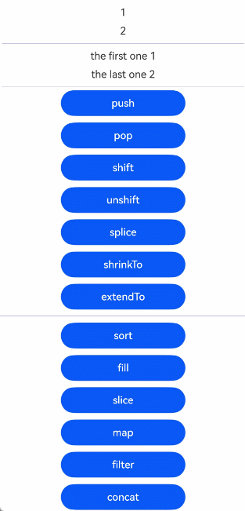
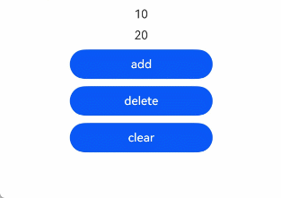
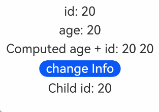

# makeObserved接口：将非观察数据变为可观察数据
<!--Kit: ArkUI-->
<!--Subsystem: ArkUI-->
<!--Owner: @liwenzhen3-->
<!--Designer: @s10021109-->
<!--Tester: @TerryTsao-->
<!--Adviser: @zhang_yixin13-->

为了将普通不可观察数据变为可观察数据，开发者可以使用[makeObserved接口](../../reference/apis-arkui/js-apis-stateManagement.md#makeobserved)。


makeObserved可以在\@Trace无法标记的情况下使用。在阅读本文档前，建议提前阅读：[\@Trace](./arkts-new-observedV2-and-trace.md)。

>**说明：**
>
>从API version 12开始，开发者可以使用UIUtils中的makeObserved接口将普通不可观察数据变为可观察数据。

## 概述

- 状态管理框架已提供[@ObservedV2/@Trace](./arkts-new-observedV2-and-trace.md)用于观察类属性变化，makeObserved接口提供主要应用于@ObservedV2/@Trace无法涵盖的场景：

  - class的定义在三方包中：开发者无法手动对class中需要观察的属性加上@Trace标签，可以使用makeObserved使得当前对象可以被观察。

  - 当前类的成员属性不能被修改：因为@Trace观察类属性会动态修改类的属性，这个行为在[@Sendable](../../arkts-utils/arkts-sendable.md#sendable装饰器)装饰的class中是不被允许的，此时可以使用makeObserved。

  - interface或者JSON.parse返回的匿名对象：这类场景往往没有明确的class声明，开发者无法使用@Trace标记当前属性可以被观察，此时可以使用makeObserved。


- 使用makeObserved接口需要导入UIUtils。
  ```ts
  import { UIUtils } from '@kit.ArkUI';
  ```

## 限制条件

- makeObserved仅支持非空的对象类型传参。
  - 不支持undefined和null：返回自身，不做任何处理。
  - 非Object类型：编译拦截报错。

  ```ts
  import { UIUtils } from '@kit.ArkUI';
  let res1 = UIUtils.makeObserved(2); // 非法类型入参，错误用法，编译报错
  let res2 = UIUtils.makeObserved(undefined); // 非法类型入参，错误用法，返回自身，res2 === undefined
  let res3 = UIUtils.makeObserved(null); // 非法类型入参，错误用法，返回自身，res3 === null

  class Info {
    id: number = 0;
  }
  let rawInfo: Info = UIUtils.makeObserved(new Info()); // 正确用法
  ```

- makeObserved不支持传入被[@ObservedV2](./arkts-new-observedV2-and-trace.md)、[@Observed](./arkts-observed-and-objectlink.md)装饰的类的实例和被makeObserved封装过的代理数据。为了防止数据被双重代理，makeObserved发现入参为上述情况时则直接返回，不做处理。
  ```ts
  import { UIUtils } from '@kit.ArkUI';
  @ObservedV2
  class Info {
    @Trace id: number = 0;
  }
  // 错误用法：makeObserved发现传入的实例是@ObservedV2装饰的类的实例，则返回传入对象自身
  let observedInfo: Info = UIUtils.makeObserved(new Info());

  class Info2 {
    id: number = 0;
  }
  // 正确用法：传入对象既不是@ObservedV2/@Observed装饰的类的实例，也不是makeObserved封装过的代理数据
  // 返回可观察数据
  let observedInfo1: Info2 = UIUtils.makeObserved(new Info2());
  // 错误用法：传入对象为makeObserved封装过的代理数据，此次makeObserved不做处理
  let observedInfo2: Info2 = UIUtils.makeObserved(observedInfo1);
  ```
- makeObserved可以用在[@Component](./arkts-create-custom-components.md#component)装饰的自定义组件中，但不能和状态管理V1的状态变量装饰器配合使用，如果一起使用，则会抛出运行时异常。
  ```ts
  // 错误写法，运行时异常
  @State message: Info = UIUtils.makeObserved(new Info(20));
  ```
  注意：下面`message2`的写法不会抛异常。原因是：
  - this.message是[@State](./arkts-state.md)装饰的，其实现等同于@Observed。
  - UIUtils.makeObserved的入参如果是@Observed装饰的class的实例，会直接返回自身。
  
  因此`message2`的初始值不是makeObserved返回的代理对象，而是@State装饰的`this.message`。
  <!-- @[UI_will_not_refresh](https://gitcode.com/openharmony/applications_app_samples/blob/master/code/DocsSample/ArkUISample/MakeObserved/entry/src/main/ets/View/Page1.ets) -->
  
  ``` TypeScript
  import { UIUtils } from '@kit.ArkUI';
  class Person {
    public age: number = 10;
  }
  class Info {
    public id: number = 0;
    public person: Person = new Person();
  }
  @Entry
  @Component
  struct Page1 {
    @State message: Info = new Info();
    @State message2: Info = UIUtils.makeObserved(this.message); // 不会抛异常
    build() {
      Column() {
        Text(`${this.message2.person.age}`)
          .onClick(() => {
            // UI不会刷新，因为State只能观察到第一层的变化
            this.message2.person.age++;
          })
      }
    }
  }
  ```

### makeObserved仅对入参对象进行深度观察

 - `message`被[@Local](./arkts-new-local.md)装饰，本身具有观察自身赋值的能力。其初始值为makeObserved的返回值，具有深度观察能力。需要注意，makeObserved仅对`message`进行深度观察，而`message`自身赋值的变化，则是由@Local观察的。
 - 点击`change id`可以触发UI刷新。
 - 点击`change Info`，将`this.message`重新赋值为不可观察数据后，再次点击`change id`，无法触发UI刷新。
 - 再次点击`change Info1`，将`this.message`重新赋值为可观察数据，再次点击`change id`，可以触发UI刷新。
  <!-- @[MakeObserved_only_applies_to_input_parameters](https://gitcode.com/openharmony/applications_app_samples/blob/master/code/DocsSample/ArkUISample/MakeObserved/entry/src/main/ets/View/Page2.ets) -->
  
  ``` TypeScript
  import { UIUtils } from '@kit.ArkUI';
  class Info {
    public id: number = 0;
    constructor(id: number) {
      this.id = id;
    }
  }
  @Entry
  @ComponentV2
  struct Page2 {
    @Local message: Info = UIUtils.makeObserved(new Info(20));
    build() {
      Column() {
        Button(`change id`).onClick(() => {
          this.message.id++;
        })
        Button(`change Info ${this.message.id}`).onClick(() => {
          this.message = new Info(30);
        })
        Button(`change Info1 ${this.message.id}`).onClick(() => {
          this.message = UIUtils.makeObserved(new Info(30));
        })
      }
    }
  }
  ```


## 支持类型和观察变化

### 支持类型

- 支持未被[\@Observed](./arkts-observed-and-objectlink.md)或[\@ObservedV2](./arkts-new-observedV2-and-trace.md)装饰的类。
- 支持Array、Map、Set和Date。
- 支持[collections.Array](../../reference/apis-arkts/arkts-apis-arkts-collections-Array.md), [collections.Set](../../reference/apis-arkts/arkts-apis-arkts-collections-Set.md)和[collections.Map](../../reference/apis-arkts/arkts-apis-arkts-collections-Map.md)。
- JSON.parse返回的Object。
- @Sendable装饰的类。

### 观察变化

- makeObserved传入内置类型或collections类型的实例时，可以观测其API带来的变化：

  | 类型  | 可观测变化的API                                              |
  | ----- | ------------------------------------------------------------ |
  | Array | push、pop、shift、unshift、splice、copyWithin、fill、reverse、sort |
  | collections.Array | push、pop、shift、unshift、splice、fill、reverse、sort、shrinkTo、extendTo |
  | Map/collections.Map   | set、clear、delete                                 |
  | Set/collections.Set   | add、clear、delete                                 |
  | Date  | setFullYear、setMonth、setDate、setHours、setMinutes、setSeconds、setMilliseconds、setTime、setUTCFullYear、setUTCMonth、setUTCDate、setUTCHours、setUTCMinutes、setUTCSeconds、setUTCMilliseconds |

## 使用场景

### makeObserved和@Sendable装饰的class配合使用

[@Sendable](../../arkts-utils/arkts-sendable.md)主要是为了处理应用场景中的并发任务。将makeObserved和@Sendable配合使用，可以满足一般应用开发中，在子线程做大数据处理，在UI线程做ViewModel的显示和观察数据的需求。@Sendable具体内容可参考[并发任务文档](../../arkts-utils/multi-thread-concurrency-overview.md)。

本章节将说明下面的场景：
- makeObserved在传入@Sendable类型的数据后有观察能力，且其变化可以触发UI刷新。
- 从子线程中获取一个整体数据，然后对UI线程的可观察数据做整体替换。
- 从子线程获取的数据重新执行makeObserved，将数据变为可观察数据。
- 将数据从主线程传递回子线程时，仅传递不可观察的数据。makeObserved的返回值不可直接传给子线程。

例子如下：
<!-- @[SendableData](https://gitcode.com/openharmony/applications_app_samples/blob/master/code/DocsSample/ArkUISample/MakeObserved/entry/src/main/ets/Model/modelView.ets) -->

``` TypeScript
@Sendable
export class SendableData  {
  public name: string = 'Tom';
  public age: number = 20;
  public gender: number = 1;
  // ....更多其他属性
  public likes: number = 1;
  public follow: boolean = false;
}
```

<!-- @[function threadGetData](https://gitcode.com/openharmony/applications_app_samples/blob/master/code/DocsSample/ArkUISample/MakeObserved/entry/src/main/ets/View/Page3.ets) -->

``` TypeScript
import { taskpool } from '@kit.ArkTS';
import { SendableData } from '../Model/modelView';
import { UIUtils } from '@kit.ArkUI';
import { hilog } from '@kit.PerformanceAnalysisKit';

@Concurrent
function threadGetData(param: string): SendableData {
  const DOMAIN = 0xF811;
  const TAG = '[Sample_MakeObserved]';
  // 在子线程处理数据
  let ret = new SendableData();
  hilog.info(DOMAIN, TAG, `Concurrent threadGetData, param ${param}`);
  ret.name = param + '-o';
  ret.age = Math.floor(Math.random() * 40);
  ret.likes = Math.floor(Math.random() * 100);
  return ret;
}

@Entry
@ComponentV2
struct Page3 {
  // 通过makeObserved给普通对象或是SendableData对象添加可观察能力
  @Local send: SendableData = UIUtils.makeObserved(new SendableData());

  build() {
    Column() {
      Text(this.send.name)
      Button('change name').onClick(() => {
        // ok 可以观察到属性的改变
        this.send.name += '0';
      })

      Button('task').onClick(() => {
        // 将待执行的函数放入taskpool内部任务队列等待，等待分发到工作线程执行。
        taskpool.execute(threadGetData, this.send.name).then(val => {
          // 和@Local一起使用，可以观察this.send的变化
          this.send = UIUtils.makeObserved(val as SendableData);
        })
      })
    }
  }
}
```

需要注意：数据的构建和处理可以在子线程中完成，但有观察能力的数据不能传给子线程，只有在主线程里才可以操作可观察的数据。所以上述例子中只是将`this.send`的属性`name`传给子线程操作。

### makeObserved和collections.Array/Set/Map配合使用
collections提供ArkTS容器集，可用于并发场景下的高性能数据传递。详情见[@arkts.collections文档](../../reference/apis-arkts/arkts-apis-arkts-collections.md)。

makeObserved可以在ArkUI中导入可观察的collections容器，但makeObserved不能和状态管理V1的状态变量装饰器如@State和[@Prop](./arkts-prop.md)等配合使用，否则会抛出运行时异常。

**collections.Array**

collections.Array可以触发UI刷新的API有：
- 改变数组长度：push、pop、shift、unshift、splice、shrinkTo、extendTo
- 改变数组项本身：sort、fill

其他API不会改变原始数组，所以不会触发UI刷新。
<!-- @[makeObserved_collections_Array_Set_Map](https://gitcode.com/openharmony/applications_app_samples/blob/master/code/DocsSample/ArkUISample/MakeObserved/entry/src/main/ets/View/Page4.ets) --> 

``` TypeScript
import { collections } from '@kit.ArkTS';
import { UIUtils } from '@kit.ArkUI';

@Sendable
class Info {
  public id: number = 0;
  public name: string = 'cc';

  constructor(id: number) {
    this.id = id;
  }
}


@Entry
@ComponentV2
struct Page4 {
  scroller: Scroller = new Scroller();
  @Local arrCollect: collections.Array<Info> =
    UIUtils.makeObserved(new collections.Array<Info>(new Info(1), new Info(2)));

  build() {
    Column() {
      // ForEach接口仅支持Array<any>，不支持collections.Array<any>。
      // 但ForEach的实现用到的Array的API，collections.Array都有提供。所以可以使用as类型断言Array。
      // 需要注意断言并不会改变原本的数据类型。
      ForEach(this.arrCollect as object as Array<Info>, (item: Info) => {
        Text(`${item.id}`)
          .margin(5)
          .onClick(() => {
            item.id++;
          })
      }, (item: Info, index) => item.id.toString() + index.toString())
      Divider()
        .color('blue')
        .margin(5)
      if (this.arrCollect.length > 0) {
        Text(`the first one ${this.arrCollect[0].id}`)
          .margin(5)
        Text(`the last one ${this.arrCollect[this.arrCollect.length - 1].id}`)
          .margin(5)
      }
      Divider()
        .color('blue')
        .margin(5)

      /****************************改变数据长度的api**************************/
      Scroll(this.scroller) {
        Column({ space: 10 }) {
          // Divider()
          //   .color('blue')
          // push: 新增新元素
          Button('push')
            .width('50%')
            .onClick(() => {
              this.arrCollect.push(new Info(30));
            })
          // pop: 删除最后一个
          Button('pop')
            .width('50%')
            .onClick(() => {
              this.arrCollect.pop();
            })
          // shift: 删除第一个
          Button('shift')
            .width('50%')
            .onClick(() => {
              this.arrCollect.shift();
            })
          // unshift: 在数组的开头插入新项
          Button('unshift')
            .width('50%')
            .onClick(() => {
              this.arrCollect.unshift(new Info(50));
            })
          // splice: 从数组的指定位置删除元素
          Button('splice')
            .width('50%')
            .onClick(() => {
              this.arrCollect.splice(1);
            })

          // shrinkTo: 将数组长度缩小到给定的长度
          Button('shrinkTo')
            .width('50%')
            .onClick(() => {
              this.arrCollect.shrinkTo(1);
            })
          // extendTo: 将数组长度扩展到给定的长度
          Button('extendTo')
            .width('50%')
            .onClick(() => {
              this.arrCollect.extendTo(6, new Info(20));
            })

          Divider()
            .color('blue')

          /****************************************改变数组item本身*****************/
          // sort：从大到小排序
          Button('sort')
            .width('50%')
            .onClick(() => {
              this.arrCollect.sort((a: Info, b: Info) => b.id - a.id);
            })
          // fill: 用值填充指定部分
          Button('fill')
            .width('50%')
            .onClick(() => {
              this.arrCollect.fill(new Info(5), 0, 2);
            })

          /*****************************不会改变数组本身API***************************/
          // slice：返回新的数组，根据start end对原数组的拷贝，不会改变原数组，所以直接调用slice不会触发UI刷新
          // 可以构建用例为返回的浅拷贝的数据赋值给this.arrCollect,需要注意这里依然要调用makeObserved，否则this.arrCollect被普通变量赋值后，会丧失观察能力
          Button('slice')
            .width('50%')
            .onClick(() => {
              this.arrCollect = UIUtils.makeObserved(this.arrCollect.slice(0, 1));
            })
          // map：原理同上
          Button('map')
            .width('50%')
            .onClick(() => {
              this.arrCollect = UIUtils.makeObserved(this.arrCollect.map((value) => {
                value.id += 10;
                return value;
              }))
            })
          // filter：原理同上
          Button('filter')
            .width('50%')
            .onClick(() => {
              this.arrCollect = UIUtils.makeObserved(this.arrCollect.filter((value: Info) => value.id % 2 === 0));
            })
          // concat：原理同上
          Button('concat')
            .width('50%')
            .onClick(() => {
              let array1 = new collections.Array(new Info(100))
              this.arrCollect = UIUtils.makeObserved(this.arrCollect.concat(array1));
            })
        }
        .height('200%')
      }
      .height('100%')
    }
    .height('100%')
    .width('100%')
  }
}
```


**collections.Map**

collections.Map可以触发UI刷新的API有：set、clear、delete。
<!-- @[foreach_mapCollect_keys](https://gitcode.com/openharmony/applications_app_samples/blob/master/code/DocsSample/ArkUISample/MakeObserved/entry/src/main/ets/View/Page5.ets) --> 

``` TypeScript
import { collections } from '@kit.ArkTS';
import { UIUtils } from '@kit.ArkUI';

@Sendable
class Info {
  public id: number = 0;

  constructor(id: number) {
    this.id = id;
  }
}


@Entry
@ComponentV2
struct Page5 {
  mapCollect: collections.Map<string, Info> =
    UIUtils.makeObserved(new collections.Map<string, Info>([['a', new Info(10)], ['b', new Info(20)]]));

  build() {
    Column() {
      // this.mapCollect.keys()返回迭代器。Foreach不支持迭代器，所以要Array.from浅拷贝生成数据。
      ForEach(Array.from(this.mapCollect.keys()), (item: string) => {
        Text(`${this.mapCollect.get(item)?.id}`)
          .margin(5)
          .onClick(() => {
            let value: Info | undefined = this.mapCollect.get(item);
            if (value) {
              value.id++;
            }
          })
      }, (item: string, index) => item + index.toString())

      // set c
      Button('set c')
        .width('50%')
        .margin(5)
        .onClick(() => {
          this.mapCollect.set('c', new Info(30));
        })
      // delete c
      Button('delete c')
        .width('50%')
        .margin(5)
        .onClick(() => {
          if (this.mapCollect.has('c')) {
            this.mapCollect.delete('c');
          }
        })
      // clear
      Button('clear')
        .width('50%')
        .margin(5)
        .onClick(() => {
          this.mapCollect.clear();
        })
    }
    .height('100%')
    .width('100%')
  }
}
```


**collections.Set**

collections.Set可以触发UI刷新的API有：add、clear、delete。
<!-- @[Array_rom_shallow_copy](https://gitcode.com/openharmony/applications_app_samples/blob/master/code/DocsSample/ArkUISample/MakeObserved/entry/src/main/ets/View/Page6.ets) --> 

``` TypeScript
import { collections } from '@kit.ArkTS';
import { UIUtils } from '@kit.ArkUI';
import { hilog } from '@kit.PerformanceAnalysisKit';

const DOMAIN = 0xF811;
const TAG = '[Sample_MakeObserved]';

@Sendable
class Info {
  public id: number = 0;

  constructor(id: number) {
    this.id = id;
  }
}


@Entry
@ComponentV2
struct Page6 {
  set: collections.Set<Info> = UIUtils.makeObserved(new collections.Set<Info>([new Info(10), new Info(20)]));

  build() {
    Column() {
      // 因为ForEach不支持迭代器，所以需要使用Array.from浅拷贝生成数组。
      // 但是浅拷贝生成的新的数组没有观察能力，为了ForEach组件在访问item的时候是可观察的数据，所以需要重新调用makeObserved。
      ForEach((UIUtils.makeObserved(Array.from(this.set.values()))), (item: Info) => {
        Text(`${item.id}`)
          .margin(5)
          .onClick(() => {
            item.id++;
          })
      }, (item: Info, index) => item.id + index.toString())

      Button('add')
        .margin(5)
        .width('50%')
        .onClick(() => {
          this.set.add(new Info(30));
          hilog.info(DOMAIN, TAG, ('size:' + this.set.size));
        })
      Button('delete')
        .margin(5)
        .width('50%')
        .onClick(() => {
          let iterator = this.set.keys();
          this.set.delete(iterator.next().value);
        })
      Button('clear')
        .margin(5)
        .width('50%')
        .onClick(() => {
          this.set.clear();
        })
    }
    .height('100%')
    .width('100%')
  }
}
```


### makeObserved的入参为JSON.parse的返回值
JSON.parse返回Object，无法使用@Trace装饰其属性，可以使用makeObserved使其变为可观察数据。
<!-- @[makeObserved_JSON.parse](https://gitcode.com/openharmony/applications_app_samples/blob/master/code/DocsSample/ArkUISample/MakeObserved/entry/src/main/ets/View/Page7.ets) -->

``` TypeScript
import { JSON } from '@kit.ArkTS';
import { UIUtils } from '@kit.ArkUI';

class Info {
  public id: number = 0;

  constructor(id: number) {
    this.id = id;
  }
}

let test: Record<string, number> = { 'a': 123 };
let testJsonStr: string = JSON.stringify(test);
let test2: Record<string, Info> = { 'a': new Info(20) };
let test2JsonStr: string = JSON.stringify(test2);

@Entry
@ComponentV2
struct Page7 {
  message: Record<string, number> = 
        UIUtils.makeObserved<Record<string, number>>(JSON.parse(testJsonStr) as Record<string, number>);
  message2: Record<string, Info> = 
        UIUtils.makeObserved<Record<string, Info>>(JSON.parse(test2JsonStr) as Record<string, Info>);

  build() {
    Column() {
      Text(`${this.message.a}`)
        .id('textId1')
        .fontSize(50)
        .onClick(() => {
          this.message.a++;
        })
      Text(`${this.message2.a.id}`)
        .id('textId2')
        .fontSize(50)
        .onClick(() => {
          this.message2.a.id++;
        })
    }
    .height('100%')
    .width('100%')
  }
}
```


### makeObserved和V2装饰器配合使用
makeObserved可以和V2的装饰器一起使用。对于[@Monitor](./arkts-new-monitor.md)和[@Computed](./arkts-new-computed.md)，因为makeObserved传入@Observed或ObservedV2装饰的类实例会返回其自身，所以@Monitor或者@Computed不能定义在class中，只能定义在自定义组件里。

例子如下：
<!-- @[name_change_from_monitor_value](https://gitcode.com/openharmony/applications_app_samples/blob/master/code/DocsSample/ArkUISample/MakeObserved/entry/src/main/ets/View/Page8.ets) --> 

``` TypeScript
import { UIUtils } from '@kit.ArkUI';
import { hilog } from '@kit.PerformanceAnalysisKit';

const DOMAIN = 0xF811;
const TAG = '[Sample_MakeObserved]';

class Info {
  public id: number = 0;
  public age: number = 20;

  constructor(id: number) {
    this.id = id;
  }
}

@Entry
@ComponentV2
struct Page8 {
  @Local message: Info = UIUtils.makeObserved(new Info(20));

  // 当message.id发生变化时，触发该函数调用
  @Monitor('message.id')
  onStrChange(monitor: IMonitor) {
    hilog.info(DOMAIN, TAG, `name change from ${monitor.value()?.before} to ${monitor.value()?.now}`);
  }

  // 当message.id和message.age发生变化，需要重新计算时，触发该函数调用
  @Computed
  get ageId() {
    hilog.info(DOMAIN, TAG, '---------Computed----------');
    return this.message.id + ' ' + this.message.age;
  }

  build() {
    Column() {
      Text(`id: ${this.message.id}`)
        .id('textIdMessage')
        .fontSize(30)
        .margin(5)
        .onClick(() => {
          this.message.id++;
        })
      Text(`age: ${this.message.age}`)
        .id('textAgeMessageAge')
        .fontSize(30)
        .margin(5)
        .onClick(() => {
          this.message.age++;
        })
      Text(`Computed age + id: ${this.ageId}`)
        .fontSize(30)
        .margin(5)
      Button('change Info')
        .id('buttonChangeInfo')
        .fontSize(30)
        .margin(5)
        .onClick(() => {
          // 返回类实例本身，并赋值给message，触发@Computed和@Monitor
          this.message = UIUtils.makeObserved(new Info(200));
        })
      Child({ message: this.message })
    }
    .height('100%')
    .width('100%')
  }
}

@ComponentV2
struct Child {
  @Param @Require message: Info;

  build() {
    Text(`Child id: ${this.message.id}`)
      .fontSize(30)
      .margin(5)
  }
}
```


### makeObserved在@Component内使用
makeObserved不能和V1的状态变量装饰器一起使用，但可以在@Component装饰的自定义组件里使用。
<!-- @[makeObserved_Component](https://gitcode.com/openharmony/applications_app_samples/blob/master/code/DocsSample/ArkUISample/MakeObserved/entry/src/main/ets/View/Page9.ets) -->

``` TypeScript
import { UIUtils } from '@kit.ArkUI';
class Info {
  public id: number = 0;

  constructor(id: number) {
    this.id = id;
  }
}


@Entry
@Component
struct Page9 {
  // 如果和@State一起使用会抛出运行时异常
  message: Info = UIUtils.makeObserved(new Info(20));

  build() {
    RelativeContainer() {
      Text(`${this.message.id}`)
        .id('textNumber')
        .onClick(() => {
          this.message.id++;
        })
    }
    .height('100%')
    .width('100%')
  }
}
```


## 常见问题
### getTarget后的数据可以正常赋值，但是无法触发UI刷新
[getTarget](./arkts-new-getTarget.md)可以获取状态管理框架代理前的原始对象。

makeObserved封装的观察对象，可以通过getTarget获取到其原始对象，对原始对象的赋值不会触发UI刷新。

如下面例子：
1. 先点击第一个Text组件，通过getTarget获取其原始对象，此时修改原始对象的属性不会触发UI刷新，但数据会正常赋值。
2. 再点击第二个Text组件，此时修改`this.observedObj`的属性会触发UI刷新，Text显示21。
<!-- @[getTarget_observedObj](https://gitcode.com/openharmony/applications_app_samples/blob/master/code/DocsSample/ArkUISample/MakeObserved/entry/src/main/ets/View/Page10.ets) -->

``` TypeScript
import { UIUtils } from '@kit.ArkUI';
class Info {
  public id: number = 0;
}

@Entry
@Component
struct Page10 {
  observedObj: Info = UIUtils.makeObserved(new Info());
  build() {
    Column() {
      Text(`${this.observedObj.id}`)
        .id('textobservedObj1')
        .fontSize(50)
        .onClick(() => {
          // 通过getTarget获取其原始对象，将this.observedObj赋值为不可观察的数据
          let rawObj: Info= UIUtils.getTarget(this.observedObj);
          // 不会触发UI刷新，但数据会正常赋值
          rawObj.id = 20;
        })

      Text(`${this.observedObj.id}`)
        .id('textobservedObj2')
        .fontSize(50)
        .onClick(() => {
          // 触发UI刷新，Text显示21
          this.observedObj.id++;
        })
    }
  }
}
```