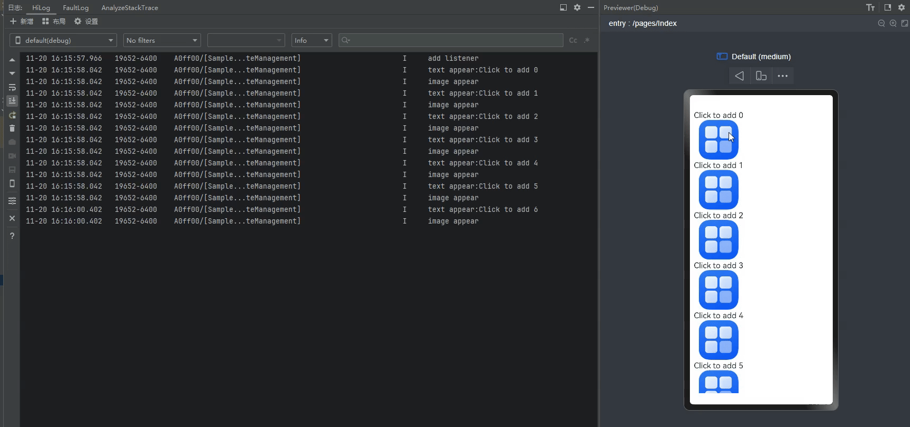
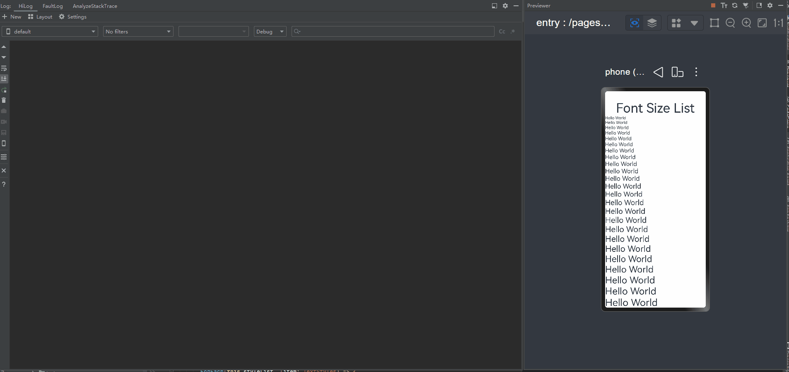
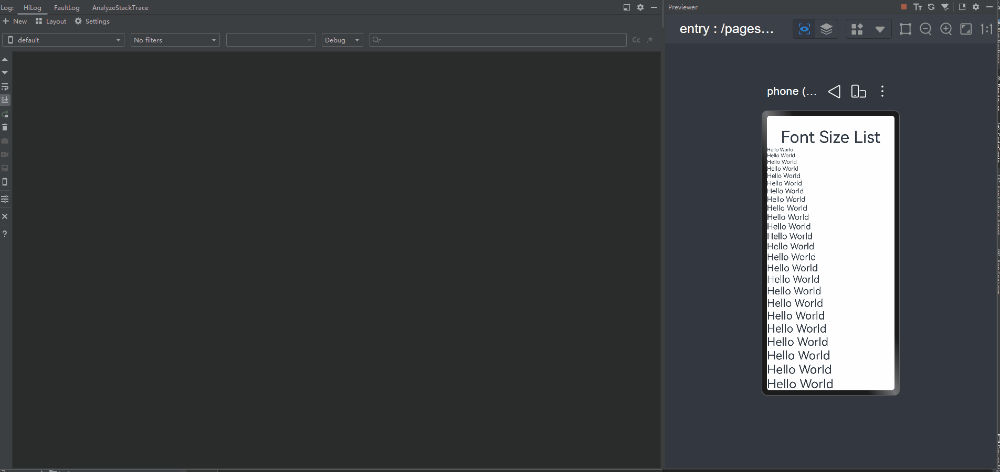

# 组件内状态管理常见问题
<!--Kit: ArkUI-->
<!--Subsystem: ArkUI-->
<!--Owner: @zany_pink-->
<!--Designer: @s10021109-->
<!--Tester: @zhangwenhan12-->
<!--Adviser: @zhang_yixin13-->

在ArkUI应用开发中，组件内状态管理的合理使用直接影响应用的性能和开发效率。然而，开发者在实践中常因更新机制理解不足，导致组件行为异常或渲染效率下降。本文将介绍组件内状态管理的常见问题与解决方案。

## build函数中更改状态变量导致appfreeze

不允许在build里改变状态变量，状态管理框架会在运行时报出Error级别日志。通过事件回调或异步回调更新状态变量，例如在onClick中修改\@State，是允许的。

下面的示例，渲染的流程是：

1. 创建Index自定义组件。

2. 执行Index的build方法：

   - 创建Column组件。
   - 创建Text组件。创建Text组件的过程中，触发this.count++。
   - count的改变再次触发Text组件的刷新。
   - 刷新过程中组件不会再标脏自己。
   - Text最终显示为2。

<!-- @[state_problem_not_update_in_build_error_01](https://gitcode.com/openharmony/applications_app_samples/blob/master/code/DocsSample/ArkUISample/ParadigmStateManagement/entry/src/main/ets/pages/state/StateProblemNotUpdateInBuildError01.ets) --> 

``` TypeScript
@Entry
@Component
struct Index {
  @State count: number = 1;

  build() {
    Column() {
      // 应避免直接在Text组件内改变count的值
      Text(`${this.count++}`)
        .width(50)
        .height(50)
    }
  }
}
```

在首次创建的过程中，Text组件被多渲染了一次，最终显示为2。

框架识别到在build里改变状态变量会打error日志，error日志为：

```ts
FIX THIS APPLICATION ERROR: @Component 'Index': State variable 'count' has changed during render! It's illegal to change @Component state while build (initial render or re-render) is on-going. Application error!
```

在上述示例中，Text组件多渲染了一次。这个错误行为不会造成严重的后果，所以许多开发者忽略了这个日志。

但是，此行为是严重错误的，随着工程的复杂度升级，隐患将逐渐增大。见下一个例子。
<!-- @[state_problem_not_update_in_build_error_02](https://gitcode.com/openharmony/applications_app_samples/blob/master/code/DocsSample/ArkUISample/ParadigmStateManagement/entry/src/main/ets/pages/state/StateProblemNotUpdateInBuildError02.ets) -->  

``` TypeScript
@Entry
@Component
struct Index {
  @State message: number = 20;

  build() {
    Column() {
      Text(`${this.message++}`)
      Text(`${this.message++}`)
    }
    .height('100%')
    .width('100%')
  }
}
```

上面示例的渲染过程为：

1. 创建第一个Text组件，触发this.message改变，[标脏](./arkts-state-management-introduce.md#触发更新)第一个Text组件。
2. 创建第二个Text组件，触发this.message改变，标脏两个Text组件。
3. 下一帧到来时，刷新脏系统组件。
4. 刷新第一个Text组件，触发this.message改变，不会标脏自己，仅标脏第二个Text组件。
5. 刷新第二个Text组件，触发this.message改变，不会标脏自己，仅标脏第一个Text组件。
6. 上述4、5步骤循环。
7. 系统长时间无响应，appfreeze。

因此，在build方法中改变状态变量是完全错误的。当发现“FIX THIS APPLICATION ERROR: @Component ... has changed during render! It's illegal to change @Component state while build (initial render or re-render) is on-going. Application error!”日志时，即使当前没有带来严重后果，也应该警惕并修改错误写法。

## 注册回调中更改状态变量未解注册导致内存泄漏

开发者可以在[aboutToAppear](../../reference/apis-arkui/arkui-ts/ts-custom-component-lifecycle.md#abouttoappear)中注册箭头函数，以此改变组件中的状态变量。

>**注意：**
>
>需要在[aboutToDisappear](../../reference/apis-arkui/arkui-ts/ts-custom-component-lifecycle.md#abouttodisappear)中将注册的函数置空，以避免箭头函数捕获自定义组件的this实例，导致自定义组件无法被释放，从而造成内存泄漏。

<!-- @[state_problem_unregister_state_callback](https://gitcode.com/openharmony/applications_app_samples/blob/master/code/DocsSample/ArkUISample/ParadigmStateManagement/entry/src/main/ets/pages/state/StateProblemUnregisterStateCallback.ets) --> 

``` TypeScript
import { common } from '@kit.AbilityKit';

class Model {
  private callback: (() => void) | undefined = () => {
  };

  add(callback: () => void): void {
    this.callback = callback;
  }

  delete(): void {
    this.callback = undefined;
  }

  call(): void {
    if (this.callback) {
      this.callback();
    }
  }
}

let model: Model = new Model();

@Entry
@Component
struct Test {
  @State count: number = 10;
  private context = this.getUIContext().getHostContext() as common.UIAbilityContext;

  aboutToAppear(): void {
    model.add(() => {
      this.count++;
    })
  }

  build() {
    Column() {
      // 请在resources\base\element\string.json文件中配置name为'state_countvalue_text1' ，value为非空字符串的资源
      Text(this.context.resourceManager.getStringByNameSync('state_countvalue_text1') + `${this.count}`)
      Button('change')
        .onClick(() => {
          model.call();
        })
    }
  }

  aboutToDisappear(): void {
    model.delete();
  }
}
```

此外，也可以使用 LocalStorage在[自定义组件外改变状态变量](./arkts-localstorage.md#自定义组件外改变状态变量)。

## 使用a.b(this.object)形式调用，不会触发UI刷新

在build方法内，当\@State装饰的变量是Object类型，且通过a.b(this.object)形式调用时，b方法内传入的是this.object的原始对象，修改其属性，无法触发UI刷新。如下例中，通过静态方法Balloon.increaseVolume或者this.reduceVolume修改balloon的volume时，UI不会刷新。

【反例】
<!-- @[state_problem_a_b_call_ui_refresh_opposite](https://gitcode.com/openharmony/applications_app_samples/blob/master/code/DocsSample/ArkUISample/ParadigmStateManagement/entry/src/main/ets/pages/state/StateProblemABCallUiRefreshOpposite.ets) --> 

``` TypeScript
class Balloon {
  public volume: number;

  constructor(volume: number) {
    this.volume = volume;
  }

  static increaseVolume(balloon: Balloon) {
    balloon.volume += 2;
  }
}

@Entry
@Component
struct Index {
  @State balloon: Balloon = new Balloon(10);

  reduceVolume(balloon: Balloon) {
    balloon.volume -= 1;
  }

  build() {
    Column({ space: 8 }) {
      Text(`The volume of the balloon is ${this.balloon.volume} cubic centimeters.`)
        .fontSize(30)
      Button(`increaseVolume`)
        .onClick(() => {
          // 通过静态方法调用，无法触发UI刷新
          Balloon.increaseVolume(this.balloon);
        })
      Button(`reduceVolume`)
        .onClick(() => {
          // 使用this通过自定义组件内部方法调用，无法触发UI刷新
          this.reduceVolume(this.balloon);
        })
    }
    .width('100%')
    .height('100%')
  }
}
```

状态变量观察类属性变化是通过代理捕获其变化的，当使用a.b(this.object)调用时，框架会将代理对象转换为原始对象。修改原始对象属性，无法观察，因此UI不会刷新。开发者可以使用如下方法修改：

1. 先将this.balloon赋值给临时变量。
2. 再使用临时变量完成原本的调用逻辑。

   具体见正例。

【正例】
<!-- @[state_problem_a_b_call_ui_refresh_positive](https://gitcode.com/openharmony/applications_app_samples/blob/master/code/DocsSample/ArkUISample/ParadigmStateManagement/entry/src/main/ets/pages/state/StateProblemABCallUiRefreshPositive.ets) --> 

``` TypeScript
class Balloon {
  public volume: number;

  constructor(volume: number) {
    this.volume = volume;
  }

  static increaseVolume(balloon: Balloon) {
    balloon.volume += 2;
  }
}

@Entry
@Component
struct Index {
  @State balloon: Balloon = new Balloon(10);

  reduceVolume(balloon: Balloon) {
    balloon.volume -= 1;
  }

  build() {
    Column({ space: 8 }) {
      Text(`The volume of the balloon is ${this.balloon.volume} cubic centimeters.`)
        .fontSize(30)
      Button(`increaseVolume`)
        .onClick(() => {
          // 通过赋值给临时变量保留Proxy代理
          let balloon1 = this.balloon;
          Balloon.increaseVolume(balloon1);
        })
      Button(`reduceVolume`)
        .onClick(() => {
          // 通过赋值给临时变量保留Proxy代理
          let balloon2 = this.balloon;
          this.reduceVolume(balloon2);
        })
    }
    .width('100%')
    .height('100%')
  }
}
```

## 复杂类型常量重复赋值给状态变量触发不必要的刷新

### 状态管理V1

在状态管理V1中，会给被\@Observed装饰的类对象以及使用状态变量装饰器如@State装饰的Class、Date、Map、Set、Array类型的对象添加一层代理，用于观测一层属性或API调用产生的变化。当复杂类型常量重复赋值给状态变量时，可能会由于加了代理而判断为新旧值不相等，导致不必要的刷新。

<!-- @[state_problem_complex_constant_repeat_refresh](https://gitcode.com/openharmony/applications_app_samples/blob/master/code/DocsSample/ArkUISample/ParadigmStateManagement/entry/src/main/ets/pages/state/StateProblemComplexConstantRepeatRefresh.ets) --> 

``` TypeScript
import { hilog } from '@kit.PerformanceAnalysisKit';

class DataObj {
  public name: string = 'default name';

  constructor(name: string) {
    this.name = name;
  }
}

@Entry
@Component
struct Index {
  list: DataObj[] = [new DataObj('a'), new DataObj('b'), new DataObj('c')];
  @State dataObjFromList: DataObj = this.list[0];

  build() {
    Column() {
      ConsumerChild({ dataObj: this.dataObjFromList })
      Button('change to self').onClick(() => {
        this.dataObjFromList = this.list[0];
      })
    }
  }
}

@Component
struct ConsumerChild {
  @Link @Watch('onDataObjChange') dataObj: DataObj;

  onDataObjChange() {
    hilog.info(0xFF00, 'testTag', '%{public}s', 'dataObj changed');
  }

  getContent() {
    hilog.info(0xFF00, 'testTag', '%{public}s', `this.dataObj.name change: ${this.dataObj.name}`);
    return this.dataObj.name;
  }

  build() {
    Column() {
      Text(this.getContent()).fontSize(30)
    }
  }
}
```

以上示例每次点击Button('change to self')，把相同的类实例赋值给一个Class类型的状态变量，会触发刷新并输出`this.dataObj.name change: a`日志。这是因为当再次赋值`list[0]`时，`dataObjFromList`已经是`Proxy`类型，而`list[0]`是`Object`类型，因此判断两者不相等，会触发赋值和刷新。

为了避免这种不必要的赋值和刷新，可以通过用\@Observed装饰类，或者使用[UIUtils.getTarget()](./arkts-new-getTarget.md)获取原始对象，提前进行新旧值的判断，如果相同则不执行赋值。

方法一：增加\@Observed
<!-- @[state_problem_complex_solution_01](https://gitcode.com/openharmony/applications_app_samples/blob/master/code/DocsSample/ArkUISample/ParadigmStateManagement/entry/src/main/ets/pages/state/StateProblemComplexSolution01.ets) --> 

``` TypeScript
import { hilog } from '@kit.PerformanceAnalysisKit';

@Observed
class DataObj {
  public name: string = 'default name';

  constructor(name: string) {
    this.name = name;
  }
}

@Entry
@Component
struct Index {
  list: DataObj[] = [new DataObj('a'), new DataObj('b'), new DataObj('c')];
  @State dataObjFromList: DataObj = this.list[0];

  build() {
    Column() {
      ConsumerChild({ dataObj: this.dataObjFromList })
      Button('change to self').onClick(() => {
        this.dataObjFromList = this.list[0];
      })
    }
  }
}

@Component
struct ConsumerChild {
  @Link @Watch('onDataObjChange') dataObj: DataObj;

  onDataObjChange() {
    hilog.info(0xFF00, 'testTag', '%{public}s', 'dataObj changed');
  }

  build() {
    Column() {
      Text(this.dataObj.name).fontSize(30)
    }
  }
}
```

以上示例，给对应的类增加了\@Observed装饰器后，list[0]已经是Proxy类型了，这样再次赋值时，相同的对象，就不会触发刷新。

方法二：使用[UIUtils.getTarget()](./arkts-new-getTarget.md)获取原始对象
<!-- @[state_problem_complex_solution_02](https://gitcode.com/openharmony/applications_app_samples/blob/master/code/DocsSample/ArkUISample/ParadigmStateManagement/entry/src/main/ets/pages/state/StateProblemComplexSolution02.ets) -->  

``` TypeScript
import { UIUtils } from '@kit.ArkUI';
import { hilog } from '@kit.PerformanceAnalysisKit';

class DataObj {
  public name: string = 'default name';

  constructor(name: string) {
    this.name = name;
  }
}

@Entry
@Component
struct Index {
  list: DataObj[] = [new DataObj('a'), new DataObj('b'), new DataObj('c')];
  @State dataObjFromList: DataObj = this.list[0];

  build() {
    Column() {
      ConsumerChild({ dataObj: this.dataObjFromList })
      Button('change to self').onClick(() => {
        // 获取原始对象来和新值做对比
        if (UIUtils.getTarget(this.dataObjFromList) !== this.list[0]) {
          this.dataObjFromList = this.list[0];
        }
      })
    }
  }
}

@Component
struct ConsumerChild {
  @Link @Watch('onDataObjChange') dataObj: DataObj;

  onDataObjChange() {
    hilog.info(0xFF00, 'testTag', '%{public}s', 'dataObj changed');
  }

  build() {
    Column() {
      Text(this.dataObj.name).fontSize(30)
    }
  }
}
```

以上示例，在赋值前，使用getTarget获取了对应状态变量的原始对象，经过对比后，如果和当前对象一样，就不赋值，不触发刷新。

### 状态管理V2

在状态管理V2中，会给使用状态变量装饰器如@Trace、@Local装饰的Date、Map、Set、Array添加一层代理用于观测API调用产生的变化。当复杂类型常量重复赋值给状态变量时，可能会由于加了代理而判断为新旧值不相等，导致不必要的刷新。

<!-- @[Local_Question_Spark_Update](https://gitcode.com/openharmony/applications_app_samples/blob/master/code/DocsSample/ArkUISample/ParadigmStateManagement/entry/src/main/ets/pages/local/LocalQuestionSparkUpdate.ets) --> 

``` TypeScript
import { hilog } from '@kit.PerformanceAnalysisKit';

@Entry
@ComponentV2
struct Index {
  list: string[][] = [['a'], ['b'], ['c']];
  @Local dataObjFromList: string[] = this.list[0];

  @Monitor('dataObjFromList')
  onStrChange(monitor: IMonitor) {
    hilog.info(0xFF00, 'testTag', '%{public}s', 'dataObjFromList has changed');
  }

  build() {
    Column() {
      Button('change to self').onClick(() => {
        // 新值和本地初始化的值相同
        this.dataObjFromList = this.list[0];
      })
    }
  }
}
```

以上示例每次点击Button('change to self')，把相同的Array类型常量赋值给一个Array类型的状态变量，都会触发刷新。这是因为当再次赋值`list[0]`时，`dataObjFromList`已经是Proxy类型，而`list[0]`是Array类型。由于类型不相等，会触发赋值和刷新。

为了避免这种不必要的赋值和刷新，可以使用[UIUtils.getTarget()](./arkts-new-getTarget.md)获取原始对象提前进行新旧值的判断，当两者相同时不执行赋值。

使用UIUtils.getTarget()方法示例。

<!-- @[Local_Question_UIUtils](https://gitcode.com/openharmony/applications_app_samples/blob/master/code/DocsSample/ArkUISample/ParadigmStateManagement/entry/src/main/ets/pages/local/LocalQuestionUIUtils.ets) --> 

``` TypeScript
import { UIUtils } from '@kit.ArkUI';
import { hilog } from '@kit.PerformanceAnalysisKit';

const DOMAIN = 0x0000;

@Entry
@ComponentV2
struct Index {
  list: string[][] = [['a'], ['b'], ['c']];
  @Local dataObjFromList: string[] = this.list[0];

  @Monitor('dataObjFromList')
  onStrChange(monitor: IMonitor) {
    hilog.info(DOMAIN, 'testTag', '%{public}s', 'dataObjFromList has changed');
  }

  build() {
    Column() {
      Button('change to self').onClick(() => {
        // 获取原始对象来和新值做对比
        if (UIUtils.getTarget(this.dataObjFromList) !== this.list[0]) {
          this.dataObjFromList = this.list[0];
        }
      })
    }
  }
}
```

## 子组件无需修改状态变量时，使用@Prop导致不必要的深拷贝

在应用开发中，父组件常向子组件传值。如果子组件不需要修改该状态变量，子组件使用[@Prop](./arkts-prop.md)装饰器会增加组件创建时间并影响性能，此时建议改用[@ObjectLink](./arkts-observed-and-objectlink.md)。

【反例】

<!-- @[deep_copy_reverse](https://gitcode.com/openharmony/applications_app_samples/blob/master/code/DocsSample/ArkUISample/StateManagement/entry/src/main/ets/pages/DeepCopyReverse.ets) --> 

``` TypeScript
@Observed
class DeepReMyClass {
  public num: number = 0;

  constructor(num: number) {
    this.num = num;
  }
}

@Component
struct DeepRePropChild {
  @Prop testClass: DeepReMyClass; // @Prop装饰状态变量会深拷贝。

  build() {
    Text(`PropChild testNum ${this.testClass.num}`)
  }
}

@Entry
@Component
struct DeepReParent {
  @State testClass: DeepReMyClass[] = [new DeepReMyClass(1)];

  build() {
    Column() {
      Text(`DeepReParent testNum ${this.testClass[0].num}`)
        .onClick(() => {
          this.testClass[0].num += 1;
        })

      // DeepRePropChild没有改变@Prop testClass: DeepReMyClass的值，所以这时最优的选择是使用@ObjectLink。
      DeepRePropChild({ testClass: this.testClass[0] })
    }
  }
}
```

在以上示例中，DeepRePropChild组件没有改变\@Prop testClass: MyClass的值，因此使用\@ObjectLink更为合适。因为@Prop会深拷贝数据带来性能开销，所以\@ObjectLink是比\@Prop更优的选择。

【正例】

<!-- @[deep_copy_correct](https://gitcode.com/openharmony/applications_app_samples/blob/master/code/DocsSample/ArkUISample/StateManagement/entry/src/main/ets/pages/DeepCopyCorrect.ets) --> 

``` TypeScript
@Observed
class MyClass {
  public num: number = 0;

  constructor(num: number) {
    this.num = num;
  }
}

@Component
struct PropChild {
  @ObjectLink testClass: MyClass; // @ObjectLink装饰状态变量不会深拷贝。

  build() {
    Text(`PropChild testNum ${this.testClass.num}`)
  }
}

@Entry
@Component
struct Parent {
  @State testClass: MyClass[] = [new MyClass(1)];

  build() {
    Column() {
      Text(`Parent testNum ${this.testClass[0].num}`)
        .onClick(() => {
          this.testClass[0].num += 1;
        })

      // 当子组件不需要本地修改状态时，应优先使用@ObjectLink，因为@Prop会执行深拷贝并带来性能开销，此时@ObjectLink是比@Link和@Prop更优的选择。
      PropChild({ testClass: this.testClass[0] })
    }
  }
}
```

## 状态变量关联的组件数过多导致性能下降

建议每个状态变量关联的组件数少于20个。精准控制状态变量关联的组件数量可减少不必要的组件刷新，提升刷新效率。有时开发者会将同一状态变量绑定于多个同级组件属性，状态变化时将导致这些组件同步更新，产生不必要的刷新，当组件复杂度较高时会显著影响整体性能。相反，将该状态变量绑定在这些组件的父组件上，可以减少需要刷新的组件数，提高性能。在应用开发中，可以通过HiDumper查看状态变量关联的组件数。具体可参考[状态变量组件定位工具实践](https://gitcode.com/openharmony/docs/blob/master/zh-cn/application-dev/performance/state_variable_dfx_pratice.md)。

【反例】

<!-- @[precise_control_counterexamples](https://gitcode.com/openharmony/applications_app_samples/blob/master/code/DocsSample/ArkUISample/StateManagement/entry/src/main/ets/pages/PreciseControlCounterexamples.ets) -->  

``` TypeScript
@Observed
class Translate {
  public translateX: number = 20;
}

@Component
struct Title {
  @ObjectLink translateObj: Translate;

  build() {
    Row() {
      // $r('app.media.background')需要替换为开发者所需的资源文件。
      Image($r('app.media.background'))
        .width(50)
        .height(50)
        .translate({
          x: this.translateObj.translateX // this.translateObj.translateX 绑定在Image和Text组件上。
        })
      Text('Title')
        .fontSize(20)
        .translate({
          x: this.translateObj.translateX
        })
    }
  }
}

@Entry
@Component
struct Page {
  @State translateObj: Translate = new Translate();

  build() {
    Column() {
      Title({
        translateObj: this.translateObj
      })
      Stack() {
      }
      .backgroundColor('black')
      .width(200)
      .height(400)
      .translate({
        x: this.translateObj.translateX //this.translateObj.translateX 绑定在Stack和Button组件上。
      })
      Button('move')
        .translate({
          x: this.translateObj.translateX
        })
        .onClick(() => {
          this.getUIContext().animateTo({
            duration: 50
          }, () => {
            this.translateObj.translateX = (this.translateObj.translateX + 50) % 150;
          });
        })
    }
  }
}
```

在上面的示例中，状态变量this.translateObj.translateX被用在多个同级的子组件下，当this.translateObj.translateX变化时，会导致所有关联它的组件一起刷新，但实际上由于这些组件的变化是相同的，因此可以将这个属性绑定到他们共同的父组件上，来实现减少组件的刷新数量。经过分析，所有子组件均位于Page组件的Column下，因此将所有子组件相同的translate属性统一到Column上，来实现精准控制状态变量关联的组件数。

【正例】

<!-- @[precise_control_positive_cases](https://gitcode.com/openharmony/applications_app_samples/blob/master/code/DocsSample/ArkUISample/StateManagement/entry/src/main/ets/pages/PreciseControlPositiveCases.ets) -->  

``` TypeScript
@Observed
class PageTranslate {
  public translateX: number = 20;
}

@Component
struct PageTitle {
  build() {
    Row() {
      // $r('app.media.background')需要替换为开发者所需的图像资源文件。
      Image($r('app.media.background'))
        .width(50)
        .height(50)
      Text('Title')
        .fontSize(20)
    }
  }
}

@Entry
@Component
struct Page1 {
  @State translateObj: PageTranslate = new PageTranslate();

  build() {
    Column() {
      PageTitle()
      Stack() {
      }
      .backgroundColor('black')
      .width(200)
      .height(400)
      Button('move')
        .onClick(() => {
          this.getUIContext().animateTo({
            duration: 50
          }, () => {
            this.translateObj.translateX = (this.translateObj.translateX + 50) % 150;
          });
        })
    }
    .translate({
      // 子组件Stack和Button设置了同一个translate属性，可以统一到Column上设置。
      x: this.translateObj.translateX
    })
  }
}
```

## 在for、while等循环逻辑中频繁读取状态变量导致性能下降

在应用开发中，应避免在循环逻辑中频繁读取状态变量，而是应该放在循环外面读取。

【反例】

<!-- @[loop_state_inefficient](https://gitcode.com/openharmony/applications_app_samples/blob/master/code/DocsSample/ArkUISample/StateManagement/entry/src/main/ets/pages/LoopStateInefficient.ets) --> 

``` TypeScript
import { hilog } from '@kit.PerformanceAnalysisKit';

@Entry
@Component
struct Index {
  @State message: string = '';

  build() {
    Column() {
      Button('Click to print log')
        .onClick(() => {
          for (let i = 0; i < 10; i++) {
            hilog.info(0x0000, 'TAG', '%{public}s', this.message);
          }
        })
        .width('90%')
        .backgroundColor(Color.Blue)
        .fontColor(Color.White)
        .margin({
          top: 10
        })
    }
    .justifyContent(FlexAlign.Start)
    .alignItems(HorizontalAlign.Center)
    .margin({
      top: 15
    })
  }
}
```

【正例】

<!-- @[loop_state_optimized](https://gitcode.com/openharmony/applications_app_samples/blob/master/code/DocsSample/ArkUISample/StateManagement/entry/src/main/ets/pages/LoopStateOptimized.ets) --> 

``` TypeScript
import { hilog } from '@kit.PerformanceAnalysisKit';

@Entry
@Component
struct Index {
  @State message: string = '';

  build() {
    Column() {
      Button('Click to print log')
        .onClick(() => {
          let logMessage: string = this.message;
          for (let i = 0; i < 10; i++) {
            hilog.info(0x0000, 'TAG', '%{public}s', logMessage);
          }
        })
        .width('90%')
        .backgroundColor(Color.Blue)
        .fontColor(Color.White)
        .margin({
          top: 10
        })
    }
    .justifyContent(FlexAlign.Start)
    .alignItems(HorizontalAlign.Center)
    .margin({
      top: 15
    })
  }
}
```

## 频繁修改状态变量导致性能下降

在应用开发中，应尽量减少对状态变量的直接赋值，通过临时变量完成数据计算操作。

状态变量发生变化时，ArkUI会查询依赖该状态变量的组件并执行该组件的更新方法，完成组件渲染。通过使用临时变量的计算代替直接操作状态变量，可以使ArkUI仅在最后一次状态变量变更时查询并渲染组件，减少不必要的操作，从而提高应用性能。状态变量行为可参考[@State装饰器：组件内状态](arkts-state.md)。

【反例】

<!-- @[calculation_directState](https://gitcode.com/openharmony/applications_app_samples/blob/master/code/DocsSample/ArkUISample/StateManagement/entry/src/main/ets/pages/CalculationDirectState.ets) --> 

``` TypeScript
import { hiTraceMeter } from '@kit.PerformanceAnalysisKit';

@Entry
@Component
struct Index {
  @State message: string = '';

  appendMsg(newMsg: string) {
    // 性能打点
    hiTraceMeter.startTrace('StateVariable', 1);
    this.message += newMsg;
    this.message += ';';
    this.message += '<br/>';
    hiTraceMeter.finishTrace('StateVariable', 1);
  }

  build() {
    Column() {
      Button('Click to print log')
        .onClick(() => {
          this.appendMsg('Operating state variable');
        })
        .width('90%')
        .backgroundColor(Color.Blue)
        .fontColor(Color.White)
        .margin({
          top: 10
        })
    }
    .justifyContent(FlexAlign.Start)
    .alignItems(HorizontalAlign.Center)
    .margin({
      top: 15
    })
  }
}
```

直接操作状态变量，三次触发计算函数，运行[耗时](../ui-inspector-profiler.md#trace调试能力)结果如下：


【正例】

<!-- @[calculation_temp_variable](https://gitcode.com/openharmony/applications_app_samples/blob/master/code/DocsSample/ArkUISample/StateManagement/entry/src/main/ets/pages/CalculationTempVariable.ets) --> 

``` TypeScript
import { hiTraceMeter } from '@kit.PerformanceAnalysisKit';

@Entry
@Component
struct Index {
  @State message: string = '';

  appendMsg(newMsg: string) {
    // 性能打点。
    hiTraceMeter.startTrace('TemporaryVariable', 2);
    let message = this.message;
    message += newMsg;
    message += ';';
    message += '<br/>';
    this.message = message;
    hiTraceMeter.finishTrace('TemporaryVariable', 2);
  }

  build() {
    Column() {
      Button('Click to print log')
        .onClick(() => {
          this.appendMsg('Operating temporary variable');
        })
        .width('90%')
        .backgroundColor(Color.Blue)
        .fontColor(Color.White)
        .margin({
          top: 10
        })
    }
    .justifyContent(FlexAlign.Start)
    .alignItems(HorizontalAlign.Center)
    .margin({
      top: 15
    })
  }
}
```

使用临时变量取代状态变量的计算，三次触发计算函数，运行耗时结果如下：


【总结】

| **计算方式**     | **耗时(局限不同设备和场景，数据仅供参考)** | **说明**                                          |
| ---------------- | ------------------------------------------ | ------------------------------------------------- |
| 直接操作状态变量 | 1.01ms                                     | 增加了ArkUI不必要的查询和渲染行为，导致性能劣化。 |
| 使用临时变量计算 | 0.63ms                                     | 减少了ArkUI不必要的行为，优化性能。               |

## 使用LazyForEach的重建机制刷新UI导致性能下降

开发过程中通常会将[LazyForEach](../rendering-control/arkts-rendering-control-lazyforeach.md)和状态变量结合起来使用。

<!-- @[StateArrayLazy_start](https://gitcode.com/openharmony/applications_app_samples/blob/master/code/DocsSample/ArkUISample/statemanagementproject/entry/src/main/ets/pages/statemanagementguide/StateArrayLazy.ets) -->  

``` TypeScript
import { hilog } from '@kit.PerformanceAnalysisKit';

const DOMAIN_NUMBER: number = 0XFF00;
const TAG: string = '[Sample_StateManagement]';

class BasicDataSource implements IDataSource {
  private listeners: DataChangeListener[] = [];
  private originDataArray: StringData[] = [];

  public totalCount(): number {
    return 0;
  }

  public getData(index: number): StringData {
    return this.originDataArray[index];
  }

  registerDataChangeListener(listener: DataChangeListener): void {
    if (this.listeners.indexOf(listener) < 0) {
      hilog.info(DOMAIN_NUMBER, TAG, 'add listener');
      this.listeners.push(listener);
    }
  }

  unregisterDataChangeListener(listener: DataChangeListener): void {
    const pos = this.listeners.indexOf(listener);
    if (pos >= 0) {
      hilog.info(DOMAIN_NUMBER, TAG, 'remove listener');
      this.listeners.splice(pos, 1);
    }
  }

  notifyDataReload(): void {
    this.listeners.forEach(listener => {
      listener.onDataReloaded();
    })
  }

  notifyDataAdd(index: number): void {
    this.listeners.forEach(listener => {
      listener.onDataAdd(index);
    })
  }

  notifyDataChange(index: number): void {
    this.listeners.forEach(listener => {
      listener.onDataChange(index);
    })
  }

  notifyDataDelete(index: number): void {
    this.listeners.forEach(listener => {
      listener.onDataDelete(index);
    })
  }

  notifyDataMove(from: number, to: number): void {
    this.listeners.forEach(listener => {
      listener.onDataMove(from, to);
    })
  }
}

class MyDataSource extends BasicDataSource {
  private dataArray: StringData[] = [];

  public totalCount(): number {
    return this.dataArray.length;
  }

  public getData(index: number): StringData {
    return this.dataArray[index];
  }

  public addData(index: number, data: StringData): void {
    this.dataArray.splice(index, 0, data);
    this.notifyDataAdd(index);
  }

  public pushData(data: StringData): void {
    this.dataArray.push(data);
    this.notifyDataAdd(this.dataArray.length - 1);
  }

  public reloadData(): void {
    this.notifyDataReload();
  }
}

class StringData {
  public message: string;
  public imgSrc: Resource;

  constructor(message: string, imgSrc: Resource) {
    this.message = message;
    this.imgSrc = imgSrc;
  }
}

@Entry
@Component
struct MyComponent {
  private data: MyDataSource = new MyDataSource();

  aboutToAppear() {
    for (let i = 0; i <= 9; i++) {
      // 此处'app.media.icon'仅作示例，请开发者自行替换，否则imageSource创建失败会导致后续无法正常执行。
      this.data.pushData(new StringData(`Click to add ${i}`, $r('app.media.icon')));
    }
  }

  build() {
    List({ space: 3 }) {
      LazyForEach(this.data, (item: StringData, index: number) => {
        ListItem() {
          Column() {
            Text(item.message).fontSize(20)
              .onAppear(() => {
                hilog.info(DOMAIN_NUMBER, TAG, 'text appear:' + item.message);
              })
            Image(item.imgSrc)
              .width(100)
              .height(100)
              .onAppear(() => {
                hilog.info(DOMAIN_NUMBER, TAG, 'image appear');
              })
          }.margin({ left: 10, right: 10 })
        }
        .onClick(() => {
          item.message += '0';
          this.data.reloadData();
        })
      }, (item: StringData, index: number) => JSON.stringify(item))
    }.cachedCount(5)
  }
}
```


上述代码运行效果如下。



可以观察到在点击更改message之后，图片“闪烁”了一下，同时输出了组件的onAppear日志，这说明组件进行了重建。这是因为在更改message之后，导致LazyForEach中这一项的key值发生了变化，使得LazyForEach在reloadData的时候将这一项ListItem进行了重建。Text组件仅仅更改显示的内容却发生了重建，而不是更新。而尽管Image组件没有需要重新绘制的内容，但是因为触发LazyForEach的重建，会使得同样位于ListItem下的Image组件重新创建。

当前LazyForEach与状态变量都能触发UI的刷新，两者的性能开销是不一样的。使用LazyForEach刷新会对组件进行重建，如果包含了多个组件，则会产生比较大的性能开销。使用状态变量刷新会对组件进行刷新，具体到状态变量关联的组件上，相对于LazyForEach的重建来说，范围更小更精确。因此，推荐使用状态变量来触发LazyForEach中的组件刷新，这就需要使用自定义组件。

<!-- @[StateArrayLazy2_start](https://gitcode.com/openharmony/applications_app_samples/blob/master/code/DocsSample/ArkUISample/statemanagementproject/entry/src/main/ets/pages/statemanagementguide/StateArrayLazy2.ets) -->  

``` TypeScript
import { hilog } from '@kit.PerformanceAnalysisKit';

const DOMAIN_NUMBER: number = 0XFF00;
const TAG: string = '[Sample_StateManagement]';

class BasicDataSource implements IDataSource {
  private listeners: DataChangeListener[] = [];
  private originDataArray: StringData[] = [];

  public totalCount(): number {
    return 0;
  }

  public getData(index: number): StringData {
    return this.originDataArray[index];
  }

  registerDataChangeListener(listener: DataChangeListener): void {
    if (this.listeners.indexOf(listener) < 0) {
      hilog.info(DOMAIN_NUMBER, TAG, 'add listener');
      this.listeners.push(listener);
    }
  }

  unregisterDataChangeListener(listener: DataChangeListener): void {
    const pos = this.listeners.indexOf(listener);
    if (pos >= 0) {
      hilog.info(DOMAIN_NUMBER, TAG, 'remove listener');
      this.listeners.splice(pos, 1);
    }
  }

  notifyDataReload(): void {
    this.listeners.forEach(listener => {
      listener.onDataReloaded();
    })
  }

  notifyDataAdd(index: number): void {
    this.listeners.forEach(listener => {
      listener.onDataAdd(index);
    })
  }

  notifyDataChange(index: number): void {
    this.listeners.forEach(listener => {
      listener.onDataChange(index);
    })
  }

  notifyDataDelete(index: number): void {
    this.listeners.forEach(listener => {
      listener.onDataDelete(index);
    })
  }

  notifyDataMove(from: number, to: number): void {
    this.listeners.forEach(listener => {
      listener.onDataMove(from, to);
    })
  }
}

class MyDataSource extends BasicDataSource {
  private dataArray: StringData[] = [];

  public totalCount(): number {
    return this.dataArray.length;
  }

  public getData(index: number): StringData {
    return this.dataArray[index];
  }

  public addData(index: number, data: StringData): void {
    this.dataArray.splice(index, 0, data);
    this.notifyDataAdd(index);
  }

  public pushData(data: StringData): void {
    this.dataArray.push(data);
    this.notifyDataAdd(this.dataArray.length - 1);
  }
}

@Observed
class StringData {
  @Track public message: string;
  @Track public imgSrc: Resource;

  constructor(message: string, imgSrc: Resource) {
    this.message = message;
    this.imgSrc = imgSrc;
  }
}

@Entry
@Component
struct MyComponent {
  @State data: MyDataSource = new MyDataSource();

  aboutToAppear() {
    for (let i = 0; i <= 9; i++) {
      // 此处'app.media.icon'仅作示例，请开发者自行替换，否则imageSource创建失败会导致后续无法正常执行。
      this.data.pushData(new StringData(`Click to add ${i}`, $r('app.media.icon')));
    }
  }

  build() {
    List({ space: 3 }) {
      LazyForEach(this.data, (item: StringData, index: number) => {
        ListItem() {
          ChildComponent({ data: item })
        }
        .onClick(() => {
          item.message += '0';
        })
      }, (item: StringData, index: number) => index.toString())
    }.cachedCount(5)
  }
}

@Component
struct ChildComponent {
  @ObjectLink data: StringData;

  build() {
    Column() {
      Text(this.data.message).fontSize(20)
        .onAppear(() => {
          hilog.info(DOMAIN_NUMBER, TAG, 'text appear:' + this.data.message);
        })
      Image(this.data.imgSrc)
        .width(100)
        .height(100)
    }.margin({ left: 10, right: 10 })
  }
}
```

上述代码运行效果如下。


可以观察到UI能够正常刷新，图片没有“闪烁”，且没有输出日志信息，说明没有对Text组件和Image组件进行重建。

这是因为使用自定义组件之后，可以通过@Observed和@ObjectLink配合去直接更改自定义组件内的状态变量实现刷新，而不需要利用LazyForEach进行重建。使用[@Track装饰器](arkts-track.md)分别装饰StringData类型中的message和imgSrc属性可以使更新范围进一步缩小到指定的Text组件。

## ForEach和对象数组结合使用导致UI不刷新

开发过程中经常会使用对象数组和[ForEach](../rendering-control/arkts-rendering-control-foreach.md)结合起来使用，但是写法不当的话会出现UI不刷新的情况。

<!-- @[StateArrayForeach_start](https://gitcode.com/openharmony/applications_app_samples/blob/master/code/DocsSample/ArkUISample/statemanagementproject/entry/src/main/ets/pages/statemanagementguide/StateArrayForeach.ets) -->  

``` TypeScript
import { hilog } from '@kit.PerformanceAnalysisKit';

const DOMAIN_NUMBER: number = 0XFF00;
const TAG: string = '[Sample_StateManagement]';

@Observed
class StyleList extends Array<TextStyles> {
}

@Observed
class TextStyles {
  public fontSize: number;

  constructor(fontSize: number) {
    this.fontSize = fontSize;
  }
}

@Entry
@Component
struct Page {
  @State styleList: StyleList = new StyleList();

  aboutToAppear() {
    for (let i = 15; i < 50; i++) {
      this.styleList.push(new TextStyles(i));
    }
  }

  build() {
    Column() {
      Text('Font Size List')
        .fontSize(50)
        .onClick(() => {
          for (let i = 0; i < this.styleList.length; i++) {
            this.styleList[i].fontSize++;
          }
          hilog.info(DOMAIN_NUMBER, TAG, 'change font size');
        })
      List() {
        ForEach(this.styleList, (item: TextStyles) => {
          ListItem() {
            Text('Hello World')
              .fontSize(item.fontSize)
          }
        })
      }
    }
  }
}
```


上述代码运行效果如下。



由于ForEach中生成的item是一个常量，因此当点击改变item中的内容时，没有办法观测到UI刷新，尽管日志表明item的值已改变（这体现在打印了“change font size”的日志）。因此，需要使用自定义组件，配合@ObjectLink来实现观测的能力。

<!-- @[TextComponent_start](https://gitcode.com/openharmony/applications_app_samples/blob/master/code/DocsSample/ArkUISample/statemanagementproject/entry/src/main/ets/pages/statemanagementguide/StateArrayForeach2.ets) -->  

``` TypeScript
import { hilog } from '@kit.PerformanceAnalysisKit';

const DOMAIN_NUMBER: number = 0XFF00;
const TAG: string = '[Sample_StateManagement]';

@Observed
class StyleList extends Array<TextStyles> {
}

@Observed
class TextStyles {
  public fontSize: number;

  constructor(fontSize: number) {
    this.fontSize = fontSize;
  }
}

@Component
struct TextComponent {
  @ObjectLink textStyle: TextStyles;

  build() {
    Text('Hello World')
      .fontSize(this.textStyle.fontSize)
  }
}

@Entry
@Component
struct Page {
  @State styleList: StyleList = new StyleList();

  aboutToAppear() {
    for (let i = 15; i < 50; i++) {
      this.styleList.push(new TextStyles(i));
    }
  }

  build() {
    Column() {
      Text('Font Size List')
        .fontSize(50)
        .onClick(() => {
          for (let i = 0; i < this.styleList.length; i++) {
            this.styleList[i].fontSize++;
          }
          hilog.info(DOMAIN_NUMBER, TAG, 'change font size');
        })
      List() {
        ForEach(this.styleList, (item: TextStyles) => {
          ListItem() {
            TextComponent({ textStyle: item })
          }
        })
      }
    }
  }
}
```

上述代码的运行效果如下。



使用@ObjectLink接受传入的item后，使得TextComponent组件内的textStyle变量具有了被观测的能力。在父组件更改styleList中的值时，由于@ObjectLink是引用传递，所以会观测到styleList每一个数据项的地址指向的对应item的fontSize的值被改变，因此触发UI的刷新。

这是一个较为实用的使用状态管理进行刷新的开发方式。
