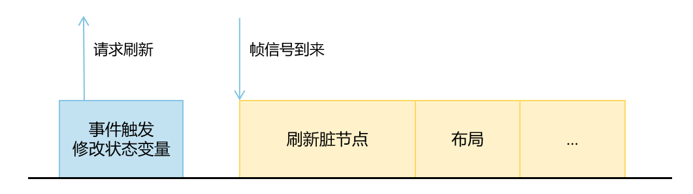
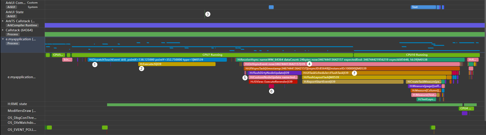
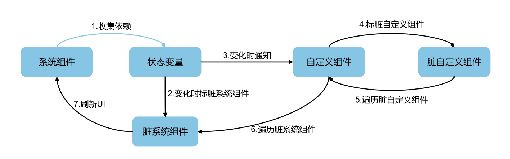

# 状态管理原理介绍
<!--Kit: ArkUI-->
<!--Subsystem: ArkUI-->
<!--Owner: @zany_pink-->
<!--Designer: @s10021109-->
<!--Tester: @zhangwenhan12-->
<!--Adviser: @zhang_yixin13-->

本文将介绍状态管理的基本原理。状态管理的核心逻辑是处理状态变量、自定义组件和系统组件之间的绑定关系。其工作流程可以概括为两个核心阶段：收集依赖和触发更新。

## 收集依赖

收集依赖是指建立状态变量与组件之间的数据绑定关系。在UI渲染时，状态管理框架会“观察”哪些状态变量被读取了，并记录下这个“依赖关系”。一个UI界面上可能使用了多个状态变量，在修改状态变量时，仅与该状态变量相关的组件进行UI刷新，其他不相关的组件不会刷新。因此，UI刷新时需要明确哪些组件使用了被修改的状态变量，以能够实现这些组件的精准刷新。

```ts
@Entry
@Component
struct Index {
  @State name: string = 'Jack';
  @State age: number = 10;
  @State grade: number = 5;

  build() {
    Column() {
      Text(`${this.name}'s age is ${this.age}`) // Text1
      Text(`${this.name}'s grade is ${this.grade}`) // Text2
      Button('change age') // Button1
        .onClick(() => {
          this.age++;
        })
      Button('change grade') // Button2
        .onClick(() => {
          this.grade++;
        })
    }
  }
}
```

上述示例代码中，自定义组件`Index`中定义了三个状态变量`name`，`age`和`grade`，在`build`函数中创建了两个`Text`系统组件和两个`Button`系统组件。收集依赖的具体步骤为：

1. 自定义组件`Index`被创建并首次调用`build`方法创建组件。
2. 当框架执行到```Text(`${this.name}'s age is ${this.age}`)```时，为了显示文本内容，需要读取`this.name`和`this.age`的值。
3. `name`和`age`都是被`@State`装饰器装饰的状态变量，状态变量在被读取时会收集当前正在渲染的系统组件的唯一标识`elemtId`，并将其存储到一个`Set`集合中。因此，状态变量`name`和`age`均收集到`Text1`的唯一标识`elemtId1`。
4. 同理，当框架执行到```Text(`${this.name}'s grade is ${this.grade}`)```时，状态变量`name`和`grade`收集到了`Text2`的唯一标识`elemtId2`。 

每个状态变量中维护了一个`Set`集合，保存所有与其绑定的系统组件的标识信息。在上述示例中，状态变量`name`的依赖集合中保存了`Text1`和`Text2`的信息，状态变量`age`的依赖集合中保存了`Text1`的信息，状态变量`grade`中保存了`Text2`的信息。由此，框架完成了收集依赖的过程。

## 触发更新

当状态变量发生改变时，状态管理框架会通知所有依赖于它的UI组件，重新计算并刷新，这个过程称为触发更新。触发更新大致可以分为三个步骤：

- 计算状态变量发生改变后的新值。
- 修改状态变量的值，并将与其绑定的组件标脏。
- 刷新所有的脏节点，更新UI的同时重新收集依赖。

> **说明**
>
> 更新是以自定义组件为单位的。

同样对于上述示例代码，点击`Button`组件修改状态变量，对应的`Text`组件刷新，具体步骤为：

1. 点击`Button1`，触发 `onClick` 事件。
2. 在事件处理函数中执行`this.age++`。由于`age`是状态变量，在改值的过程中会执行状态管理内部的更新操作。
3. 由于在一个UI更新周期中，自定义组件中可能存在多个状态变量发生改变，而更新是以自定义组件为单位的，所以每个自定义组件中维护了一个标脏的系统组件集合（下称脏系统组件集合），用于保存在当前UI更新周期中标脏的系统组件的`elemtId`。在状态变量`age`的更新操作中，将其依赖集合中系统组件的`elemtId`加入到其所属的自定义组件`Index`的脏系统组件集合中。
4. 完成系统组件标脏后，将状态变量`age`所属的自定义组件`Index`标脏，加入到标脏的自定义组件节点列表（下称脏自定义组件列表）中，并请求一个刷新信号。
5. 在下一个UI更新周期中，框架遍历脏自定义组件列表，重新调用它们的`rerender`方法（`rerender`方法是由系统生成的），执行`Index`自定义组件的`rerender`方法时，遍历脏系统组件，刷新`Text1`组件并更新依赖。
6. 同理，点击`Button2`修改状态变量`grade`的值，对应刷新`Text2`组件并更新依赖。

触发更新就是根据状态变量收集到的依赖关系，当状态变量发生改变时，找到所有受影响的组件，标记为“脏”，在一个UI更新周期中，只刷新标脏的组件，实现最小化更新。

## 状态管理在渲染管线中的流程

UI渲染的流程主要有以下几个步骤：



1. 事件触发状态变量发生改变，执行状态变量的`set`方法，将自定义组件和系统组件标脏，并请求一个刷新信号。
2. 刷新脏节点：刷新标脏的自定义组件和系统组件。
3. 布局：根据标脏局部刷新组件树，触发子树上节点的尺寸测量和位置确认。

同样以上述示例代码为例，使用DevEco Studio的[Profiler工具](../ui-inspector-profiler.md)，点击`Button1`，抓取状态变量的变化打点，trace如下图所示：



对上图中的标记点进行逐一介绍：

1. 点击`Button1`按钮，产生手势事件的trace点。
2. 手势事件触发`onClick`回调。
3. 在`onClick`回调中改变状态变量`age`的值。
4. 下一帧信号到来，执行VSync回调。
5. 刷新脏自定义组件`Index`。
6. 遍历自定义组件中的脏系统组件，重新渲染`Text1`组件。
7. 执行后续布局流程。

其中，状态管理的基本流程如图所示：



状态管理循环执行两大步骤：收集依赖和触发更新。收集状态变量与组件之间的依赖关系。当状态变量发生变化时，执行标脏，刷新对应的UI，同时更新依赖关系。