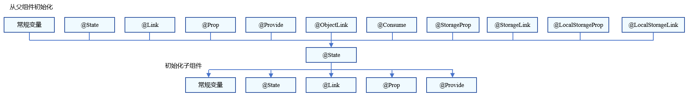
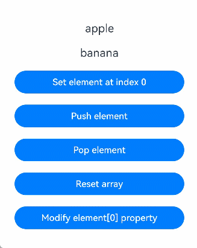
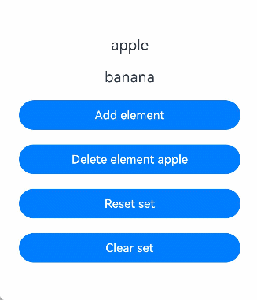
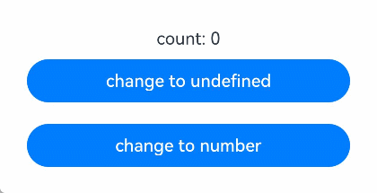

# \@State装饰器：组件内状态
<!--Kit: ArkUI-->
<!--Subsystem: ArkUI-->
<!--Owner: @jiyujia926-->
<!--Designer: @s10021109-->
<!--Tester: @TerryTsao-->
<!--Adviser: @zhang_yixin13-->

被状态变量装饰器装饰的变量称为状态变量，使普通变量具备状态属性。当状态变量改变时，会触发其直接绑定的UI组件渲染更新。

在状态变量相关装饰器中，@State是最基础的装饰器，也是大部分状态变量的数据源。

在阅读\@State文档前，建议开发者对状态管理框架有基本的了解。建议提前阅读：[状态管理概述](./arkts-state-management-overview.md)。最佳实践请参考[状态管理最佳实践](https://developer.huawei.com/consumer/cn/doc/best-practices/bpta-status-management)。常见问题请参考[状态管理常见问题](./arkts-state-management-faq.md)。

> **说明：**
>
> 从API version 9开始，该装饰器支持在ArkTS卡片中使用。
>
> 从API version 11开始，该装饰器支持在原子化服务中使用。

## 概述

\@State装饰的变量与声明式范式中的其他被装饰变量一样，是私有的，只能从组件内部访问，在声明时必须指定其类型并完成本地初始化；若需从父组件初始化，也可选择使用命名参数机制完成赋值。

\@State装饰的变量拥有以下特性：

- \@State装饰的变量生命周期与其所属自定义组件的生命周期相同。

## 装饰器使用规则说明

| \@State变量装饰器  | 说明                                                         |
| ------------------ | ------------------------------------------------------------ |
| 装饰器参数         | 无                                                           |
| 同步类型           | 不与父组件中任何类型的变量同步。                             |
| 允许装饰的变量类型 | object、class、string、number、boolean、enum类型，以及这些类型的数组。<br/>API version 10开始支持[Date类型](#装饰date类型变量)。<br/>API version 11及以上支持[Map](#装饰map类型变量)、[Set](#装饰set类型变量)类型、undefined和null类型、ArkUI框架定义的联合类型[Length](../../reference/apis-arkui/arkui-ts/ts-types.md#length)、[ResourceStr](../../reference/apis-arkui/arkui-ts/ts-types.md#resourcestr)、[ResourceColor](../../reference/apis-arkui/arkui-ts/ts-types.md#resourcecolor)类型以及这些类型的联合类型，示例见[@State支持联合类型实例](#state支持联合类型实例)。<br/>支持类型的场景见[观察变化](#观察变化)。|
| 不允许装饰的变量类型 | 不支持装饰Function类型。      |
| 被装饰变量的初始值 | 必须本地初始化。      |

## 变量的传递/访问规则说明

| 传递/访问          | 说明                                                         |
| ------------------ | ------------------------------------------------------------ |
| 从父组件初始化     | 可以从父组件或本地初始化。<br/>父组件传入非undefined值时覆盖本地初始值，否则使用@State的本地初始值。<br/>支持父组件中的常规变量以及装饰器装饰的状态变量：\@State、[\@Link](arkts-link.md)、[\@Prop](arkts-prop.md)、[\@Provide](arkts-provide-and-consume.md)、[\@Consume](arkts-provide-and-consume.md)、[\@ObjectLink](arkts-observed-and-objectlink.md)、[\@StorageLink](arkts-appstorage.md#storagelink)、[\@StorageProp](arkts-appstorage.md#storageprop)、[\@LocalStorageLink](arkts-localstorage.md#localstoragelink)和[\@LocalStorageProp](arkts-localstorage.md#localstorageprop)，初始化\@State。需要注意：父组件传入的外部变量对\@State初始化时，仅作为初始值，后续变量的变化不会同步至\@State。 |
| 用于初始化子组件   | \@State装饰的变量支持初始化子组件的常规变量、\@State、\@Link、\@Prop、\@Provide。 |
| 是否支持组件外访问 | 不支持，只能在组件内访问。                                   |

  **图1** 初始化规则图示



## 观察变化和行为表现

并不是状态变量的所有更改都会引起UI的刷新，只有可以被框架观察到的修改才会引起UI刷新。本小节将介绍什么样的修改才能被观察到，以及观察到变化后，框架是怎么引起UI刷新的，即框架的行为表现是什么。

### 观察变化

- 当装饰的数据类型为boolean、string、number类型时，可以观察到数值的变化。

  ```ts
  // 简单类型
  @State count: number = 0;
  // 可以观察到值的变化
  this.count = 1;
  ```

- 当装饰的数据类型为class或Object时，可以观察到自身的赋值和属性赋值的变化，即Object.keys(observedObject)返回的所有属性。示例如下：
  
  声明Person和Model类。
  <!-- @[state_change_observation_object](https://gitcode.com/openharmony/applications_app_samples/blob/master/code/DocsSample/ArkUISample/ParadigmStateManagement/entry/src/main/ets/pages/state/StateChangeObservationObject.ets) -->
  
  ``` TypeScript
  class Person {
    public value: string;
  
    constructor(value: string) {
      this.value = value;
    }
  }
  
  class Model {
    public value: string;
    public name: Person;
  
    constructor(value: string, person: Person) {
      this.value = value;
      this.name = person;
    }
  }
  ```

  \@State装饰的类型是Model。
    <!-- @[state_decorate_type_object](https://gitcode.com/openharmony/applications_app_samples/blob/master/code/DocsSample/ArkUISample/ParadigmStateManagement/entry/src/main/ets/pages/state/StateChangeObservationObject.ets) -->
  
    ``` TypeScript
    // class类型
    @State title: Model = new Model('Hello', new Person('World'));
    ```

  对\@State装饰变量的赋值。
    <!-- @[state_decorate_object_change_01](https://gitcode.com/openharmony/applications_app_samples/blob/master/code/DocsSample/ArkUISample/ParadigmStateManagement/entry/src/main/ets/pages/state/StateChangeObservationObject.ets) -->
  
    ``` TypeScript
    // class类型赋值
    this.title = new Model('Hi', new Person('ArkUI'));
    ```

  对\@State装饰变量的属性赋值。
    <!-- @[state_decorate_object_change_02](https://gitcode.com/openharmony/applications_app_samples/blob/master/code/DocsSample/ArkUISample/ParadigmStateManagement/entry/src/main/ets/pages/state/StateChangeObservationObject.ets) -->
  
    ``` TypeScript
    // class属性的赋值
    this.title.value = 'Hi';
    ```

  嵌套属性的赋值观察不到。
    <!-- @[state_decorate_object_change_03](https://gitcode.com/openharmony/applications_app_samples/blob/master/code/DocsSample/ArkUISample/ParadigmStateManagement/entry/src/main/ets/pages/state/StateChangeObservationObject.ets) -->
  
    ``` TypeScript
    // 嵌套的属性赋值观察不到
    this.title.name.value = 'ArkUI';
    ```

- 当装饰的对象是Array时，可以观察到Array整体的赋值及数组元素的赋值，同时可以通过调用Array的接口`push`, `pop`, `shift`, `unshift`, `splice`, `copyWithin`, `fill`, `reverse`, `sort`更新Array中的数据。数组项中嵌套的属性赋值无法观察。详见[装饰Array类型变量](#装饰array类型变量)。

- 当装饰的对象是Date时，可以观察到Date的赋值，以及通过调用Date的接口`setFullYear`, `setMonth`, `setDate`, `setHours`, `setMinutes`, `setSeconds`, `setMilliseconds`, `setTime`, `setUTCFullYear`, `setUTCMonth`, `setUTCDate`, `setUTCHours`, `setUTCMinutes`, `setUTCSeconds`, `setUTCMilliseconds`更新Date的属性，详见[装饰Date类型变量](#装饰date类型变量)。

- 当装饰的变量是Map时，可以观察到Map整体的赋值，以及通过调用Map的接口`set`, `clear`, `delete`更新Map的值。详见[装饰Map类型变量](#装饰map类型变量)。

- 当装饰的变量是Set时，可以观察到Set整体的赋值，以及通过调用Set的接口`add`, `clear`, `delete`更新Set的值。详见[装饰Set类型变量](#装饰set类型变量)。

### 框架行为

- 当状态变量改变时，查询依赖该状态变量的组件。

- 执行依赖该状态变量的组件更新方法，实现组件更新渲染。

## 限制条件

1. \@State装饰的变量必须初始化，否则编译期会报错。

    ```ts
    // 错误写法，编译报错
    @State count: number;
    
    // 正确写法
    @State count: number = 10;
    ```

2. \@State不支持装饰Function类型的变量，API version 23之前，框架会抛出运行时错误。

   从API version 23开始，添加对\@State装饰Function类型变量的校验，编译期会报错。

## 使用场景

### 装饰简单类型的变量

以下示例为\@State装饰的简单类型，count被\@State装饰成为状态变量，count的改变引起Button组件的刷新：

- 当状态变量count改变时，只能查询到Button组件与之关联。

- 执行Button组件的更新方法，实现按需刷新。
    <!-- @[state_scene_simple_type](https://gitcode.com/openharmony/applications_app_samples/blob/master/code/DocsSample/ArkUISample/ParadigmStateManagement/entry/src/main/ets/pages/state/StateSceneSimpleType.ets) -->
    
    ``` TypeScript
    @Entry
    @Component
    struct MyComponent {
      @State count: number = 0; // 使用@State装饰简单类型变量
    
      build() {
        Row() {
          Column() {
            Button(`click times: ${this.count}`)
              .onClick(() => {
                this.count += 1;
              })
              .width(300)
          }
          .width('100%')
        }
        .height('100%')
      }
    }
    ```


### 装饰class对象类型的变量

- 自定义组件MyComponent定义了被\@State装饰的状态变量count和title，其中title的类型为自定义类Model。如果count或title的值发生变化，则查询MyComponent中使用该状态变量的UI组件，并进行重新渲染。

- EntryComponent中有多个MyComponent组件实例，第一个MyComponent内部状态的更改不会影响第二个MyComponent。

    <!-- @[state_scene_type_class](https://gitcode.com/openharmony/applications_app_samples/blob/master/code/DocsSample/ArkUISample/ParadigmStateManagement/entry/src/main/ets/pages/state/StateSceneTypeClass.ets) -->
    
    ``` TypeScript
    class Model {
      public value: string;
    
      constructor(value: string) {
        this.value = value;
      }
    }
    
    @Entry
    @Component
    struct EntryComponent {
      build() {
        Column() {
          // 此处指定的参数都将在初始渲染时覆盖本地定义的默认值，并不是所有的参数都需要从父组件初始化
          MyComponent({ count: 1, increaseBy: 2 })
            .width(300)
          MyComponent({ title: new Model('Hello World 2'), count: 7 })
        }
      }
    }
    
    @Component
    struct MyComponent {
      @State title: Model = new Model('Hello World');
      @State count: number = 0;
      increaseBy: number = 1;
    
      build() {
        Column() {
          Text(`${this.title.value}`)
            .margin(10)
          Button(`Click to change title`)
            .onClick(() => {
              // @State变量的更新将触发上面的Text组件内容更新
              this.title.value = this.title.value === 'Hello ArkUI' ? 'Hello World' : 'Hello ArkUI';
            })
            .width(300)
            .margin(10)
    
          Button(`Click to increase count = ${this.count}`)
            .onClick(() => {
              // @State变量的更新将触发该Button组件的内容更新
              this.count += this.increaseBy;
            })
            .width(300)
            .margin(10)
        }
      }
    }
    ```


从上述示例中，我们可以了解到\@State变量的初始化机制：

1. 上述示例中，在没有外部传入的情况下，使用默认的值进行本地初始化：

    <!-- @[state_scene_type_class_local_init](https://gitcode.com/openharmony/applications_app_samples/blob/master/code/DocsSample/ArkUISample/ParadigmStateManagement/entry/src/main/ets/pages/state/StateSceneTypeClass.ets) -->
    
    ``` TypeScript
    // title没有外部传入，使用本地的值new Model('Hello World')进行初始化
    MyComponent({ count: 1, increaseBy: 2 })
    // increaseBy没有外部传入，使用本地的值1进行初始化
    MyComponent({ title: new Model('Hello World 2'), count: 7 })
    ```

2. 上述示例中，在有外部传入的情况下，使用外部传入的值进行初始化：

    <!-- @[state_scene_type_class_out_value_init](https://gitcode.com/openharmony/applications_app_samples/blob/master/code/DocsSample/ArkUISample/ParadigmStateManagement/entry/src/main/ets/pages/state/StateSceneTypeClass.ets) -->
    
    ``` TypeScript
    // count和increaseBy均有外部传入，分别使用传入的1和2进行初始化
    MyComponent({ count: 1, increaseBy: 2 })
    // title和count均有外部传入，分别使用传入的new Model('Hello World 2')和7进行初始化
    MyComponent({ title: new Model('Hello World 2'), count: 7 })
    ```

### 装饰Array类型变量

在下面的示例中，\@State装饰的变量fruits的类型为Array\<Fruit\>，点击Button改变fruits的值，视图会随之刷新。
<!-- @[state_scene_type_array](https://gitcode.com/openharmony/applications_app_samples/blob/master/code/DocsSample/ArkUISample/ParadigmStateManagement/entry/src/main/ets/pages/state/StateSceneTypeArray.ets) -->

``` TypeScript
class Fruit {
  public name: string;

  constructor(name: string) {
    this.name = name;
  }
}

@Entry
@Component
struct ArraySample {
  @State fruits: Fruit[] = [new Fruit('apple'), new Fruit('banana')]; // 使用@State装饰Array类型变量

  build() {
    Row() {
      Column() {
        ForEach(this.fruits, (item: Fruit) => {
          Text(`${item.name}`)
            .fontSize(20)
            .margin(10)
        })
        // 对数组元素重新赋值，触发UI刷新
        Button('Set element at index 0')
          .onClick(() => {
            this.fruits[0] = new Fruit('orange');
          })
          .width(300)
          .margin(10)
        // 新增数组元素，触发UI刷新
        Button('Push element')
          .onClick(() => {
            this.fruits.push(new Fruit('cherry'));
          })
          .width(300)
          .margin(10)
        // 删除数组元素，触发UI刷新
        Button('Pop element')
          .onClick(() => {
            this.fruits.pop();
          })
          .width(300)
          .margin(10)
        // 对数组整体重新赋值，触发UI刷新
        Button('Reset array')
          .onClick(() => {
            this.fruits = [new Fruit('strawberry'), new Fruit('blueberry')];
          })
          .width(300)
          .margin(10)
        // 修改嵌套的属性，无法触发UI刷新
        Button('Modify element[0] property')
          .onClick(() => {
            this.fruits[0].name = 'pineapple';
          })
          .width(300)
          .margin(10)
      }
      .width('100%')
    }
    .height('100%')
  }
}
```



### 装饰Map类型变量

> **说明：**
>
> 从API version 11开始，\@State支持Map类型。

在下面的示例中，\@State装饰的变量fruits的类型为Map\<string, number\>，点击Button改变fruits的值，视图会随之刷新。
<!-- @[state_scene_type_map](https://gitcode.com/openharmony/applications_app_samples/blob/master/code/DocsSample/ArkUISample/ParadigmStateManagement/entry/src/main/ets/pages/state/StateSceneTypeMap.ets) -->

``` TypeScript
@Entry
@Component
struct MapSample {
  @State fruits: Map<string, number> = new Map([['apple', 1], ['banana', 2]]); // 使用@State装饰Map类型变量

  build() {
    Row() {
      Column() {
        ForEach(Array.from(this.fruits.entries()), (item: [string, number]) => {
          Text(`key: ${item[0]}, value: ${item[1]}`)
            .fontSize(20)
            .margin(10)
        })
        // 新增键值对，触发UI刷新
        Button('Set entry cherry')
          .onClick(() => {
            this.fruits.set('cherry', 3);
          })
          .width(300)
          .margin(10)
        // 更新键值对，触发UI刷新
        Button('Update entry apple')
          .onClick(() => {
            this.fruits.set('apple', 4);
          })
          .width(300)
          .margin(10)
        // 删除键值对，触发UI刷新
        Button('Delete entry apple')
          .onClick(() => {
            this.fruits.delete('apple');
          })
          .width(300)
          .margin(10)
        // 对Map整体重新赋值，触发UI刷新
        Button('Reset map')
          .onClick(() => {
            this.fruits = new Map([['strawberry', 9], ['blueberry', 8]]);
          })
          .width(300)
          .margin(10)
        // 清空Map，触发UI刷新
        Button('Clear map')
          .onClick(() => {
            this.fruits.clear();
          })
          .width(300)
          .margin(10)
      }
      .width('100%')
    }
    .height('100%')
  }
}
```


### 装饰Set类型变量

> **说明：**
>
> 从API version 11开始，\@State支持Set类型。

在下面的示例中，\@State装饰的变量fruits的类型为Set\<string\>，点击Button改变fruits的值，视图会随之刷新。
<!-- @[state_scene_type_set](https://gitcode.com/openharmony/applications_app_samples/blob/master/code/DocsSample/ArkUISample/ParadigmStateManagement/entry/src/main/ets/pages/state/StateSceneTypeSet.ets) -->

``` TypeScript
@Entry
@Component
struct SetSample {
  @State fruits: Set<string> = new Set(['apple', 'banana']); // 使用@State装饰Set类型变量

  build() {
    Row() {
      Column() {
        ForEach(Array.from(this.fruits.entries()), (item: [number, number]) => {
          Text(`${item[0]}`)
            .fontSize(20)
            .margin(10)
        })
        // 新增元素，触发UI刷新
        Button('Add element')
          .onClick(() => {
            this.fruits.add('cherry');
          })
          .width(300)
          .margin(10)
        // 删除元素，触发UI刷新
        Button('Delete element apple')
          .onClick(() => {
            this.fruits.delete('apple');
          })
          .width(300)
          .margin(10)
        // 对Set整体重新赋值，触发UI刷新
        Button('Reset set')
          .onClick(() => {
            this.fruits = new Set(['strawberry', 'blueberry']);
          })
          .width(300)
          .margin(10)
        // 清空Set，触发UI刷新
        Button('Clear set')
          .onClick(() => {
            this.fruits.clear();
          })
          .width(300)
          .margin(10)
      }
      .width('100%')
    }
    .height('100%')
  }
}
```



### 装饰Date类型变量

在下面的示例中，\@State装饰的变量selectedDate的类型为Date，点击Button改变selectedDate的值，视图会随之刷新。
<!-- @[state_scene_type_date](https://gitcode.com/openharmony/applications_app_samples/blob/master/code/DocsSample/ArkUISample/ParadigmStateManagement/entry/src/main/ets/pages/state/StateSceneTypeDate.ets) -->

``` TypeScript
@Entry
@Component
struct DatePickerExample {
  @State selectedDate: Date = new Date('2021-08-08'); // 使用@State装饰Date类型变量

  build() {
    Row() {
      Column() {
        // 通过给selectedDate重新赋值新的Date实例，触发UI刷新
        Button('set selectedDate to 2023-07-08')
          .onClick(() => {
            this.selectedDate = new Date('2023-07-08');
          })
          .margin(10)
          .width(300)
        // 调用Date的setFullYear接口修改年份，触发UI刷新
        Button('increase the year by 1')
          .onClick(() => {
            this.selectedDate.setFullYear(this.selectedDate.getFullYear() + 1);
          })
          .margin(10)
          .width(300)
        // 调用Date的setMonth接口修改月份，触发UI刷新
        Button('increase the month by 1')
          .onClick(() => {
            this.selectedDate.setMonth(this.selectedDate.getMonth() + 1);
          })
          .margin(10)
          .width(300)
        // 调用Date的setDate接口修改日期，触发UI刷新
        Button('increase the day by 1')
          .onClick(() => {
            this.selectedDate.setDate(this.selectedDate.getDate() + 1);
          })
          .margin(10)
          .width(300)
        DatePicker({
          start: new Date('1970-1-1'),
          end: new Date('2100-1-1'),
          selected: this.selectedDate
        }).margin(20)
      }
      .width('100%')
    }
    .height('100%')
  }
}
```


### State支持联合类型实例

\@State支持联合类型和undefined和null，在下面的示例中，count类型为number | undefined，点击Button改变count的属性或者类型，视图会随之刷新。
<!-- @[state_scene_joint_type_instance](https://gitcode.com/openharmony/applications_app_samples/blob/master/code/DocsSample/ArkUISample/ParadigmStateManagement/entry/src/main/ets/pages/state/StateSceneJointTypeInstance.ets) -->

``` TypeScript
@Entry
@Component
struct UnionTypeSample {
  @State count: number | undefined = 0; // 使用@State装饰联合类型变量

  build() {
    Row() {
      Column() {
        Text(`count: ${this.count}`)
        // 将联合类型变量从number切换为undefined，触发UI刷新
        Button('change to undefined')
          .onClick(() => {
            this.count = undefined;
          })
          .width(300)
          .margin(10)
        // 将联合类型变量从undefined切换为number，触发UI刷新
        Button('change to number')
          .onClick(() => {
            this.count = 10;
          })
          .width(300)
          .margin(10)
      }
      .width('100%')
    }
    .height('100%')
  }
}
```
