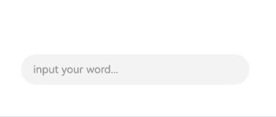

# $$语法：系统组件双向同步
<!--Kit: ArkUI--> 
<!--Subsystem: ArkUI--> 
<!--Owner: @Cuecuexiaoyu--> 
<!--Designer: @lixingchi1--> 
<!--Tester: @TerryTsao-->
<!--Adviser: @zhang_yixin13-->

`$$`运算符为系统组件提供TS变量的引用，使得TS变量和系统组件的内部状态保持同步。


内部状态的具体含义取决于组件。例如，[TextInput/apis-arkui/arkui-ts/ts-basic-components-textinput.md)组件的text参数。


## 使用规则

- 当前`$$`支持基础类型变量，当该变量使用[\@State](arkts-state.md)、[\@Link](arkts-link.md)、[\@Prop](arkts-prop.md)、[\@Provide](arkts-provide-and-consume.md)等状态管理V1装饰器装饰，或者[\@Local](arkts-new-local.md)等状态管理V2装饰器装饰时，变量值的变化会触发UI刷新。

- 当前`$$`支持的组件：

  | 组件                                                         | 支持的参数/属性 | 起始API版本 |
  | ------------------------------------------------------------ | --------------- | ----------- |
  | [Checkbox/apis-arkui/arkui-ts/ts-basic-components-checkbox.md) | select          | 10          |
  | [CheckboxGroup/apis-arkui/arkui-ts/ts-basic-components-checkboxgroup.md) | selectAll       | 10          |
  | [DatePicker/apis-arkui/arkui-ts/ts-basic-components-datepicker.md) | selected        | 10          |
  | [TimePicker/apis-arkui/arkui-ts/ts-basic-components-timepicker.md) | selected        | 10          |
  | [MenuItem/apis-arkui/arkui-ts/ts-basic-components-menuitem.md) | selected        | 10          |
  | [Panel/apis-arkui/arkui-ts/ts-container-panel.md)         | mode            | 10          |
  | [Radio/apis-arkui/arkui-ts/ts-basic-components-radio.md)  | checked         | 10          |
  | [Rating/apis-arkui/arkui-ts/ts-basic-components-rating.md) | rating          | 10          |
  | [Search/apis-arkui/arkui-ts/ts-basic-components-search.md) | value           | 10          |
  | [SideBarContainer/apis-arkui/arkui-ts/ts-container-sidebarcontainer.md) | showSideBar     | 10          |
  | [Slider/apis-arkui/arkui-ts/ts-basic-components-slider.md) | value           | 10          |
  | [Stepper/apis-arkui/arkui-ts/ts-basic-components-stepper.md) | index           | 10          |
  | [Swiper/apis-arkui/arkui-ts/ts-container-swiper.md)       | index       | 10          |
  | [Tabs/apis-arkui/arkui-ts/ts-container-tabs.md)           | index           | 10          |
  | [TextArea/apis-arkui/arkui-ts/ts-basic-components-textarea.md) | text            | 10          |
  | [TextInput/apis-arkui/arkui-ts/ts-basic-components-textinput.md) | text            | 10          |
  | [TextPicker/apis-arkui/arkui-ts/ts-basic-components-textpicker.md) | selected、value | 10          |
  | [Toggle/apis-arkui/arkui-ts/ts-basic-components-toggle.md) | isOn            | 10          |
  | [AlphabetIndexer/apis-arkui/arkui-ts/ts-container-alphabet-indexer.md) | selected        | 10          |
  | [Select/apis-arkui/arkui-ts/ts-basic-components-select.md) | selected、value | 10          |
  | [BindSheet/apis-arkui/arkui-ts/ts-universal-attributes-sheet-transition.md#bindsheet) | isShow | 10          |
  | [BindContentCover/apis-arkui/arkui-ts/ts-universal-attributes-modal-transition.md#bindcontentcover) | isShow | 10          |
  | [Refresh/apis-arkui/arkui-ts/ts-container-refresh.md) | refreshing | 8 |
  | [GridItem/apis-arkui/arkui-ts/ts-container-griditem.md) | selected | 10 |
  | [ListItem/apis-arkui/arkui-ts/ts-container-listitem.md) | selected | 10 |


## 使用示例

以[TextInput/apis-arkui/arkui-ts/ts-basic-components-textinput.md)方法的text参数为例：
<!-- @[sync_state_manager_$$](https://gitcode.com/openharmony/applications_app_samples/blob/master/code/DocsSample/ArkUISample/ParadigmStateManagement/entry/src/main/ets/pages/syncStateManager/SyncUsageExample.ets) -->

``` TypeScript
// xxx.ets
@Entry
@Component
struct TextInputExample {
  @State text: string = '';
  controller: TextInputController = new TextInputController();

  build() {
    Column({ space: 20 }) {
      Text(this.text)
      TextInput({ text: $$this.text, placeholder: 'input your word...', controller: this.controller })
        .placeholderColor(Color.Grey)
        .placeholderFont({ size: 14, weight: 400 })
        .caretColor(Color.Blue)
        .width(300)
    }
    .width('100%')
    .height('100%')
    .justifyContent(FlexAlign.Center)
  }
}
```


