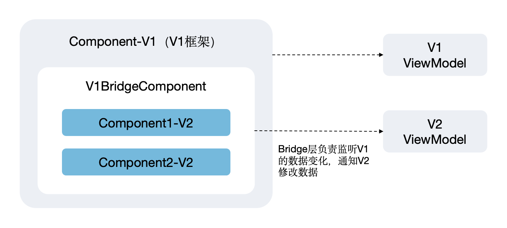

# 状态管理V1和V2混用指导（API version 19前）
<!--Kit: ArkUI--> 
<!--Subsystem: ArkUI--> 
<!--Owner: @zzq212050299--> 
<!--Designer: @s10021109--> 
<!--Tester: @TerryTsao--> 
<!--Adviser: @zhang_yixin13-->

## 概述

> **说明：**
> 
> 本文档中使用“->”表示变量的传递，比如“V1->V2”，表示V1状态变量向V2状态变量传递。

在API version 19之前，混用场景有相对严格的校验，状态管理V1与V2的混用规则如下：

**1. V1->V2规则总结**

- V1的自定义组件中不可以使用V2的装饰器，否则编译报错。

- 当组件间不传递变量时，V1的自定义组件中可以使用V2的自定义组件，包括导入第三方的\@ComponentV2装饰的自定义组件。

- 组件间存在变量传递时，V1的变量传递给V2的自定义组件，有以下限制：
  - V1中未被装饰器装饰的变量（后称普通变量）：V2只能使用\@Param接收。
  - V1中被装饰器装饰的变量（后称状态变量）：V2只能通过\@Param装饰器接收，且仅限于boolean、number、enum、string、undefined、null这些简单类型数据。

**2. V2->V1规则总结**

- V2的自定义组件中不可以使用V1的装饰器，否则编译报错。

- 组件间不存在变量传递时，V2自定义组件可以使用V1的自定义组件，包括导入第三方的\@Component装饰的自定义组件。

- 组件间存在变量传递时，V2的变量传递给V1的自定义组件，有以下限制：
  - V2普通变量（未使用状态变量装饰器）传递给V1自定义组件：

     如果V1使用状态变量接收该数据，只能使用[@State](./arkts-state.md)、[@Prop](./arkts-prop.md)、[@Provide](./arkts-provide-and-consume.md)这三种V1的状态变量装饰器。
  - V2状态变量（使用状态变量装饰器）传递给V1自定义组件：

     如果V1使用状态变量装饰器（同样仅限\@State、\@Prop、\@Provide支持）装饰接收的数据，不支持内置类型数据：Array、Set、Map、Date。需要注意V2状态变量支持Function类型，但是V1的状态变量装饰器均不支持Function类型，传递Function类型会导致运行时校验报错。以\@State为例，详情见[@State限制条件](./arkts-state.md#限制条件)。
  - V1中[@Link](./arkts-link.md)遵循其原本初始化规则，只能被V1状态变量初始化，详情见[@Link初始化规则示意图](./arkts-link.md#变量的传递访问规则说明)。


## 限制条件

- V1和V2的装饰器不允许混用。

  V1的组件内装饰器不支持在V2的自定义组件中使用，V2的组件内装饰器也不支持在V1的自定义组件中使用，编译会报错。

- V1装饰器不能和[@ObservedV2](./arkts-new-observedV2-and-trace.md)一起使用，否则编译报错。

- V2装饰器不能和[@Observed](./arkts-observed-and-objectlink.md)一起使用，否则编译报错。

- V1-&gt;V2传递状态变量只支持简单类型，不允许传复杂类型的状态变量。比如传递\@Observed装饰的class、装饰器修饰的built-in类型（Array、Map、Set、Date），编译报错。

- V2-&gt;V1可以传简单类型状态变量和普通class。如果传递\@ObservedV2装饰的class、装饰器修饰的built-in类型（Array、Map、Set、Date），编译报错。

- V1中\@ObjectLink只接受\@Observed装饰的class初始化。

- V1中[@Link](./arkts-link.md)遵循其原本初始化规则，只能被V1状态变量初始化，详情见[@Link初始化规则示意图](./arkts-link.md#变量的传递访问规则说明)。

- 多个装饰器不允许装饰同一个变量（\@Watch、\@Once、\@Require除外）。

  ```ts
  @State @Prop message: string = "";  // 多个V1的装饰器不可以修饰同一个变量，编译器报错
  ```

  ```ts
  @Local @Param message: string = 'Hello World'; // 多个V2的装饰器不允许修饰同一个变量，编译器报错
  ```

  除了\@Watch、\@Once、\@Require这些能力扩展装饰器可以与其他装饰器配合使用外，其他装饰器不允许装饰同一个变量。


## V1中使用V2的自定义组件


### 不传递变量

在V1中使用V2的自定义组件时，如果不存在变量传递，则不会产生影响。以下示例代码中，ChildSix是不接受参数的V2自定义组件，IndexSix可直接使用ChildSix。

<!-- @[v1_use_v2](https://gitcode.com/openharmony/applications_app_samples/blob/master/code/DocsSample/ArkUISample/CustomComponentsMixingUse/entry/src/main/ets/pages/MixingUseofCustomComponents/V2InV1.ets) -->

``` TypeScript
@ComponentV2
struct ChildSix {
  @Local message: string = 'hello';

  build() {
    Column() {
      Text(this.message)
        .fontSize(50)
        .fontWeight(FontWeight.Bold)
        .onClick(() => {
          this.message = 'world';
        })
    }
  }
}

@Entry
@Component
struct IndexSix {
  @State message: string = 'Hello World';

  build() {
    Column() {
      Text(this.message)
        .fontSize(50)
        .fontWeight(FontWeight.Bold)
        .onClick(() => {
          this.message = 'world hello';
        })
      Divider()
        .color(Color.Blue)
      // 可以只是使用无参数的V2组件
      ChildSix()
    }
    .height('100%')
    .width('100%')
  }
}
```


### 传递未被装饰的变量

当变量未被装饰器装饰时，不具备被观测的能力。将该变量传递给V2时，需注意V2组件对数据输入有严格的管理，必须通过[@Param](./arkts-new-param.md)装饰器接收。V2中接收数据的观测能力为\@Param能力，对于接收的Class，需要通过\@ObservedV2和\@Trace才能观察变化。

以下代码示例中，定义了ChildTwo为V2组件，组件接受message、undefinedVal、info等参数。ChildTwo中用\@Param接收的简单类型message和undefinedVal，能观测到变化；Class类型变量info未被\@ObservedV2和\@Trace修饰，无法观测到类属性变化。

<!-- @[v1_to_v2_common_variables](https://gitcode.com/openharmony/applications_app_samples/blob/master/code/DocsSample/ArkUISample/CustomComponentsMixingUse/entry/src/main/ets/pages/MixingUseofCustomComponents/V1CommonVariablesToV2CustomComponent.ets) -->

``` TypeScript
class InfoTwo {
  public myId: number;
  public name: string;

  constructor(myId?: number, name?: string) {
    this.myId = myId || 0;
    this.name = name || 'aaa';
  }
}

@ComponentV2
struct ChildTwo {
  // V2对数据输入有严格的管理，从父组件接受数据时，必须@Param装饰器进行数据接收
  @Param @Once message: string = 'hello'; // 可以观测到变化，同步回父组件依赖@Event，使用了@Once可以修改@Param装饰的变量
  @Param @Once undefinedVal: string | undefined = undefined; // 使用了@Once可以修改@Param装饰的变量
  @Param info: InfoTwo = new InfoTwo(); // 观测不到类属性变化
  @Require @Param set: Set<number>;

  build() {
    Column() {
      Text(`child message:${this.message}`) // 显示message变量
        .fontSize(30)
        .fontWeight(FontWeight.Bold)
        .onClick(() => {
          this.message = 'world'; // 刷新当前组件
        })

      Divider()
        .color(Color.Blue)
      Text(`undefinedVal:${this.undefinedVal}`) // 显示undefinedVal变量
        .fontSize(30)
        .fontWeight(FontWeight.Bold)
        .onClick(() => {
          this.undefinedVal = 'change to define'; // 刷新当前组件
        })
      Divider()
        .color(Color.Blue)
      Text(`info id:${this.info.myId}`) // 显示info.myId变量
        .fontSize(30)
        .fontWeight(FontWeight.Bold)
        .onClick(() => {
          this.info.myId++; // 不刷新
        })
      Divider()
        .color(Color.Blue)
      ForEach(Array.from(this.set.values()), (item: number) => { // 显示set变量
        Text(`${item}`)
          .fontSize(30)
      })
    }
    .margin(5)
  }
}

@Entry
@Component
struct IndexTwo {
  message: string = 'Hello World'; // 简单数据
  undefinedVal: undefined = undefined; // 简单类型，undefined
  info: InfoTwo = new InfoTwo(); // Class类型
  set: Set<number> = new Set([10, 20]); // 内置类型

  build() {
    Column() {
      Text(`message:${this.message}`)
        .fontSize(30)
        .fontWeight(FontWeight.Bold)
        .onClick(() => {
          this.message = 'world hello';
        })
      Divider()
        .color(Color.Blue)
      ChildTwo({
        message: this.message,
        undefinedVal: this.undefinedVal,
        info: this.info,
        set: this.set
      })
    }
    .height('100%')
    .width('100%')
  }
}
```


### 传递简单类型状态变量

在V1中使用V2组件时，V1组件中的装饰器仅支持修饰简单类型数据，包括：boolean、number、string、null、undefined。V2组件使用\@Param接收参数。

若在V1中使用V2组件时，传递了使用\@State装饰的Class类型或内置类型（Array、Map、Set、Date），会造成编译报错。以下示例代码中，info和set变量需删除\@State装饰器。\@Prop、\@Link、\@ObjectLink、\@Provide、\@Consume、\@StorageProp、\@StorageLink、\@LocalStorageProp、\@LocalStorageLink的行为和\@State保持一致。

<!-- @[v1_to_v2_state_variables](https://gitcode.com/openharmony/applications_app_samples/blob/master/code/DocsSample/ArkUISample/CustomComponentsMixingUse/entry/src/main/ets/pages/MixingUseofCustomComponents/V1StateVariablesToV2CustomComponent.ets) -->

``` TypeScript
class InfoFour {
  public myId: number;
  public name: string;

  constructor(myId?: number, name?: string) {
    this.myId = myId || 0;
    this.name = name || 'aaa';
  }
}

@ComponentV2
struct ChildFour {
  // V2对数据输入有严格的管理，从父组件接受数据时，必须@Param装饰器进行数据接收
  @Param @Once message: string = 'hello';
  @Param @Once undefinedVal: string | undefined = undefined; // 使用了@Once可以修改@Param装饰的变量
  @Param info: InfoFour = new InfoFour();
  @Require @Param set: Set<number>;

  build() {
    Column() {
      Text(`child message:${this.message}`) // 显示message变量
        .fontSize(30)
        .fontWeight(FontWeight.Bold)
        .onClick(() => {
          this.message = 'world';
        })
      Divider()
        .color(Color.Blue)
      Text(`undefinedVal:${this.undefinedVal}`) // 显示undefinedVal变量
        .fontSize(30)
        .fontWeight(FontWeight.Bold)
        .onClick(() => {
          this.undefinedVal = 'change to define';
        })
      Divider()
        .color(Color.Blue)
      Text(`info id:${this.info.myId}`) // 显示info.myId变量
        .fontSize(30)
        .fontWeight(FontWeight.Bold)
        .onClick(() => {
          this.info.myId++;
        })
      Divider()
        .color(Color.Blue)
      ForEach(Array.from(this.set.values()), (item: number) => { // 显示set变量
        Text(`${item}`)
          .fontSize(30)
      })
    }
    .margin(5)
  }
}

@Entry
@Component
struct IndexFour {
  @State message: string = 'Hello World'; // 简单类型数据，支持
  @State undefinedVal: undefined = undefined; // 简单类型数据，undefined，支持
  @State info: InfoFour = new InfoFour(); // Class类型，不支持传递，编译器报错；消除编译错误请去掉@State
  @State set: Set<number> = new Set([10, 20]); // 内置类型，不支持传递，编译器报错；消除编译错误请去掉@State

  build() {
    Column() {
      Text(`message:${this.message}`)
        .fontSize(30)
        .fontWeight(FontWeight.Bold)
        .onClick(() => {
          this.message = 'world hello';
        })
      Divider()
        .color(Color.Blue)
      ChildFour({
        message: this.message,
        undefinedVal: this.undefinedVal,
        info: this.info,
        set: this.set
      })
    }
    .height('100%')
    .width('100%')
  }
}
```


### 传递class类型状态变量

由于在V1中使用V2组件传递参数，V1的装饰器仅支持修饰简单类型数据，不支持class类型。以下给出class类型数据传递的场景的迁移方案。

**\@Observed装饰的class**

V2装饰器不能和\@Observed一起使用，V1传递\@Observed装饰的class类给V2自定义组件时，不直接用\@Param接收数据，如下图所示先定义V1BridgeComponent组件作为桥接层。在桥接层监听V1组件的数据，同步到V2定义的单例数据。V1组件直接使用V1BridgeComponent，在V1BridgeComponent中引入V2自定义组件。



具体实现可参考以下示例代码：

1. 用\@ObservedV2装饰class单例ViewModelV2，V2组件V2Comp直接使用单例ViewModelV2实例化进行UI渲染。
2. V1组件V1Comp和V2组件V2Comp之间新增\@Component修饰的桥接组件V1BridgeComponent，用\@Watch监听，将V1中\@Observed修饰的class数据赋值给V2中\@ObservedV2修饰的class数据。
3. V1组件V1Comp中直接引入桥接组件V1BridgeComponent，桥接组件V1BridgeComponent引入V2组件V2Comp。

<!-- @[v1_to_v2_observed_class](https://gitcode.com/openharmony/applications_app_samples/blob/master/code/DocsSample/ArkUISample/CustomComponentsMixingUse/entry/src/main/ets/pages/MixingUseofCustomComponents/V1ToV2_ObservedClass.ets) -->

``` TypeScript
@Observed
class ViewModelV1 {
  @Track public fontSize: number;

  constructor(fontSize: number) {
    this.fontSize = fontSize;
  }

  updateFontSize(fontSize: number) {
    this.fontSize = fontSize;
  }
}

// 存量的V1组件
@Entry
@Component
struct V1Comp {
  build() {
    Column() {
      // ------------ V1桥接组件 ------------
      V1BridgeComponent()

      // ....

    }
  }
}

// V1桥接组件
@Component
struct V1BridgeComponent {
  @State @Watch('onDirectionChange') viewModel: ViewModelV1 = new ViewModelV1(20);

  onDirectionChange() {
    // 将V1的数据转成V2的数据
    ViewModelV2.instance().fontSize = this.viewModel.fontSize;
  }

  build() {
    Column() {
      Text(`V1组件原始数据fontSize-${this.viewModel.fontSize}`)
        .fontSize(this.viewModel.fontSize)

      Button('V1组件修改字体大小').onClick(() => {
        this.viewModel.updateFontSize(10); // V1 V2组件刷新
      })

      // ------------ V2业务组件 ------------
      V2Comp()
    }
  }
}

@ObservedV2
class ViewModelV2 {
  // 单例实例
  private static singleton_: ViewModelV2;
  @Trace public fontSize: number = 40;

  // 私有构造函数（禁止外部new）
  private constructor() {
  }

  static instance(): ViewModelV2 {
    if (!ViewModelV2.singleton_) {
      ViewModelV2.singleton_ = new ViewModelV2();
    }
    return ViewModelV2.singleton_;
  }
}

// 新增V2业务组件
@ComponentV2
struct V2Comp {
  // 获取V2单例实例（组件内可直接访问）
  private v2Model = ViewModelV2.instance();

  build() {
    Column() {
      Text(`V2组件fontSize-${this.v2Model.fontSize}`)
        .fontSize(this.v2Model.fontSize)

      Button('V2组件修改字体大小')
        .onClick(() => {
          this.v2Model.fontSize = 60; // V2组件刷新
        })
    }
  }
}
```

**\@ObservedV2装饰的class**

\@ObservedV2+\@Trace的观测能力在V1和V2版本中均受支持，但在V1中不支持将V1装饰器与\@ObservedV2装饰的实例对象共同使用。以下示例代码中，若info对象被\@State修饰，则会导致编译错误，需移除V1的装饰器。

<!-- @[v1_to_v2_observedV2_trace](https://gitcode.com/openharmony/applications_app_samples/blob/master/code/DocsSample/ArkUISample/CustomComponentsMixingUse/entry/src/main/ets/pages/MixingUseofCustomComponents/V1ToV2_ObservedV2AndTrace.ets) -->


### 传递嵌套对象

V1装饰器的观测能力是对数据本身做代理，因此当数据存在嵌套时，V1只能通过\@Observed+\@ObjectLink的方式拆分子组件，观测深层次数据。但V2无法接收\@Observed装饰的对象，\@ObjectLink也无法在V2中使用。\@Observed并没有\@ObservedV2+\@Trace那样强大的深层次观测能力，这里不再对\@Observed的深层次嵌套进行讨论，只讨论\@ObservedV2在V1的使用场景。

**\@Observed装饰的class嵌套\@ObservedV2装饰的class**

\@ObservedV2和\@Observed嵌套使用时，类对象能否被V1的装饰器装饰取决于最外层class使用的装饰器。如果最外层是\@Observed修饰的类，可以和V2装饰器一起使用，比如\@State。\@State仅能观察第一层的变化，如果要深度观察，需要传递给\@ObjectLink。

以下示例代码中：

- 最外层MessageInfoNested1类被\@Observed修饰，在V1组件IndexOne中可以被\@State修饰。数据源\@State的第二层的改变（info和messageId属性），虽不能触发本层的刷新，但会被\@ObjectLink和\@Param观察到，并触发它们关联组件的刷新。
- messageInfo属性传递给V1组件，V1组件ChildOne要用\@ObjectLink接收，而传递给V2组件GrandSon1的info属性的class类用\@ObservedV2修饰。
- \@Track防止MessageInfo1类中的info因messageId改变而连带刷新，开发者去掉\@Track可观测到，当messageId改变时，info的连带刷新，但这并非\@ObjectLink的观测能力。

<!-- @[observed_object_link](https://gitcode.com/openharmony/applications_app_samples/blob/master/code/DocsSample/ArkUISample/CustomComponentsMixingUse/entry/src/main/ets/pages/MixingUseofCustomComponents/ObserveNestedClasses_ObservedAndObjectLink.ets) -->


**\@ObservedV2+\@Trace观察class嵌套类**

\@ObservedV2+\@Trace将观测能力实现在类属性上，所以当类属性被\@Trace标记时，无论嵌套多少层，均能观测到变化。以下示例代码中，MessageInfoNested对象及其属性均被\@ObservedV2修饰，在V1组件Index中使用时，不能和V1装饰器一起使用。将messageInfo属性从V1组件传递给V2组件，V2组件Child通过\@Param接收，且修改能被观测。

<!-- @[observed_trace](https://gitcode.com/openharmony/applications_app_samples/blob/master/code/DocsSample/ArkUISample/CustomComponentsMixingUse/entry/src/main/ets/pages/MixingUseofCustomComponents/ObserveNestedClasses_ObsevedV2AndTrace.ets) -->

``` TypeScript
@ObservedV2
class Info {
  @Trace public myId: number;
  public name: string;

  constructor(myId?: number, name?: string) {
    this.myId = myId || 0;
    this.name = name || 'aaa';
  }
}

@ObservedV2
class MessageInfo { // 一层嵌套
  @Trace public info: Info; // 防止messageId改变导致info的连带刷新
  @Trace public messageId: number; // 防止info改变导致messageId的连带刷新

  constructor(info?: Info, messageId?: number) {
    this.info = info || new Info(); // 使用传入的info或创建一个新的Info
    this.messageId = messageId || 0;
  }
}

@ObservedV2
class MessageInfoNested { // 二层嵌套，MessageInfoNested如果是被@ObservedV2装饰，则不可以被V1的状态变量更新相关的装饰器装饰，如@State
  public messageInfo: MessageInfo;

  constructor(messageInfo?: MessageInfo) {
    this.messageInfo = messageInfo || new MessageInfo();
  }
}

@ComponentV2
struct Child {
  @Param messageInfo: MessageInfo =  new MessageInfo();

  build() {
    Column() {
      Text(`Child MessageInfo messageId:${this.messageInfo.messageId}`)
        .fontSize(30)
        .onClick(() => {
          this.messageInfo.messageId++; // 刷新
        })
    }
  }
}

@Entry
@Component
struct Index {
  messageInfoNested: MessageInfoNested = new MessageInfoNested(); // 三层嵌套的数据，如何观测内部。

  build() {
    Column() {
      Text(`messageInfoNested messageId:${this.messageInfoNested.messageInfo.messageId}`)
        .fontSize(30)
        .onClick(() => {
          this.messageInfoNested.messageInfo.messageId++;
        })
      Divider()
        .color(Color.Blue)
      Text(`messageInfoNested name:${this.messageInfoNested.messageInfo.info.name}`) // 未被@Trace修饰，无法观测
        .fontSize(30)
        .onClick(() => {
          this.messageInfoNested.messageInfo.info.name += 'a';
        })
      Divider()
        .color(Color.Blue)
      Text(`messageInfoNested myId:${this.messageInfoNested.messageInfo.info.myId}`) // 被@Trace修饰，无论嵌套多少层都能观测
        .fontSize(30)
        .onClick(() => {
          this.messageInfoNested.messageInfo.info.myId++;
        })
      Divider()
        .color(Color.Blue)
      // 通过@ObservedV2和@Trace观察messageInfo
      Child({messageInfo: this.messageInfoNested.messageInfo})
    }
    .height('100%')
    .width('100%')
    .margin(10)
  }
}
```


## V2组件使用V1组件

V2的状态变量传递给V1的自定义组件，存在以下限制：

- V1可以不使用装饰器接收数据。V1自定义组件中，不使用装饰器接收的变量被视为普通变量。

- V1使用装饰器接收数据时，仅可通过\@State、\@Prop、\@Provide接收。

- V1使用装饰器接收数据时，不支持内置类型的数据，否则编译报错。


### 传递简单类型状态变量

V2向V1自定义组件传递简单类型状态变量时，V1仅能通过\@State、\@Prop、\@Provide装饰器接收数据。以下示例代码中，ThirdPartyComp组件模拟第三方库，接收来自V2组件的布尔值。

<!-- @[v2_to_v1_simpleData](https://gitcode.com/openharmony/applications_app_samples/blob/master/code/DocsSample/ArkUISample/CustomComponentsMixingUse/entry/src/main/ets/pages/MixingUseofCustomComponents/V2ToV1_SimpleData.ets) -->

``` TypeScript
// 模拟三方库导入的V1组件
@Component
struct ThirdPartyComp {
  // V1从V2接收的状态变量，仅可使用@State、@Prop、@Provide接收
  @State prop: boolean = true; // 可以观测到变化

  build() {
    Column() {
      Text(`ThirdPartyComp：${this.prop}`)
    }
  }
}

@Entry
@ComponentV2
struct V2Comp2 {
  @Local param: boolean = false;

  build() {
    Column() {
      Text(`V2Comp2：${this.param}`)

      // V2组件向V1的三方库传递简单状态变量
      ThirdPartyComp({ prop: this.param })
    }
  }
}
```


### 传递class类型

**定义普通class**

V2向V1自定义组件传递数据时，支持普通class类。在以下示例代码中，InfoFive类未被\@ObservedV2修饰，传递给V1组件ChildFive时，可以使用\@State接收。修改V1组件中的info变量，依赖\@State的观测能力刷新UI。

<!-- @[v2_to_v1_common_variables](https://gitcode.com/openharmony/applications_app_samples/blob/master/code/DocsSample/ArkUISample/CustomComponentsMixingUse/entry/src/main/ets/pages/MixingUseofCustomComponents/V2CommonVariablesToV1CustomComponent.ets) -->


**定义\@ObserveV2修饰的class**

V1装饰器不能和\@ObservedV2一起使用。在以下示例代码中，Info类被\@observedV2装饰，V1组件接收变量时，info变量不能被V1装饰器修饰，但通过修改可以刷新UI，依赖的是\@ObservedV2+\@Trace的观测能力。

<!-- @[v2_to_v1_observedV2_trace](https://gitcode.com/openharmony/applications_app_samples/blob/master/code/DocsSample/ArkUISample/CustomComponentsMixingUse/entry/src/main/ets/pages/MixingUseofCustomComponents/V2ToV1_ObservedV2AndTrace.ets) -->


### 传递普通内置类型

V2->V1传递内置类型，V2定义内置类型的装饰器和V1接收内置类型的装饰器是互斥的。

- V1使用装饰器接收数据时，内置类型不支持在V2中用装饰器修饰。
- V1可以不使用装饰器接收数据，接收过来的变量在V1定义组件内也会是普通变量，在V2中可以用装饰器修饰。

在以下示例代码中，V2向V1自定义组件传递set变量，V1组件使用\@Provide接收。因此，在V2组件IndexEight中定义set变量时，为避免编译错误，set变量不能用\@Local修饰。

<!-- @[v2_to_v1_common_buildIn_class](https://gitcode.com/openharmony/applications_app_samples/blob/master/code/DocsSample/ArkUISample/CustomComponentsMixingUse/entry/src/main/ets/pages/MixingUseofCustomComponents/V2ToV1_CommonBuildInClass.ets) -->


## 混用场景总结

对V1和V2混用场景进行梳理后，可以总结出：

- 当V1中混用V2自定义组件时（即V1的组件或者类数据向V2传递），大部分V1的能力在V2都是被禁止的。

- 当V2中混用V1自定义组件时（即V2的组件或者类数据向V1传递），做了部分功能开放。例如：\@ObservedV2和\@Trace，这也是对V1嵌套类数据的观测能提供的最大的帮助。

所以在代码开发过程中，不建议开发者混用V1和V2版本。然而，在代码迁移方面，V1的开发者可以逐步将代码迁移到V2，以稳步替换V1的功能代码。同时，不建议在V2的代码架构中混用V1的代码。
