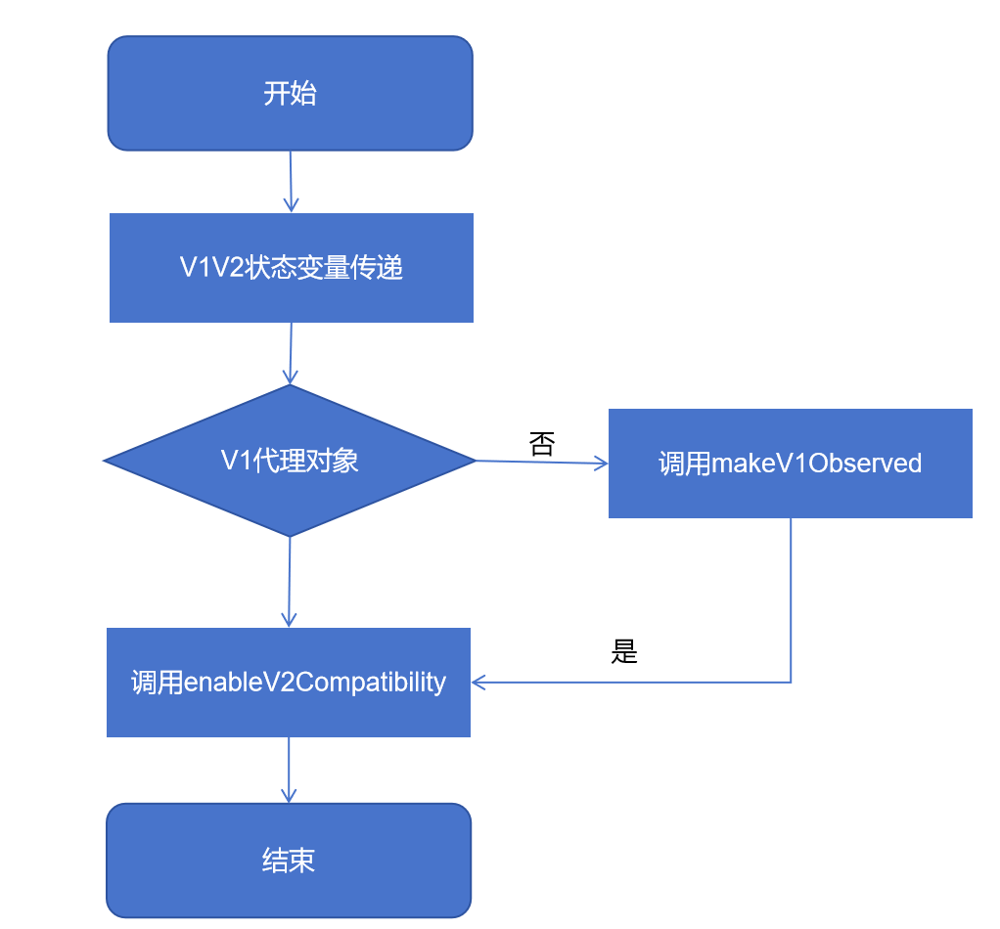

# 状态管理V1和V2混用指导（API version 19及之后）
<!--Kit: ArkUI--> 
<!--Subsystem: ArkUI--> 
<!--Owner: @liwenzhen3--> 
<!--Designer: @s10021109--> 
<!--Tester: @TerryTsao--> 
<!--Adviser: @zhang_yixin13-->

## 概述

为了帮助开发者顺利地向状态管理V2迁移，从API version 19开始，减少了对状态管理V1和V2混用场景的约束。具体变更可参考[限制条件](#限制条件)。同时提供新的方法[enableV2Compatibility](../../reference/apis-arkui/js-apis-stateManagement.md#enablev2compatibility19)和[makeV1Observed](../../reference/apis-arkui/js-apis-stateManagement.md#makev1observed19)来帮助开发者解决在迁移过程中遇到的混用问题。

> **说明：**
> 
> 本文档中使用“->”表示变量的传递，比如“V1->V2”，表示V1状态变量向V2状态变量传递。


## 限制条件

1. V1装饰器不能和[@ObservedV2](./arkts-new-observedV2-and-trace.md)一起使用。因为\@ObservedV2/\@Trace有自己独立的观察能力，不仅可以在[@ComponentV2](./arkts-create-custom-components.md#componentv2)中使用，也可以独立在[@Component](./arkts-create-custom-components.md#component)中使用，状态管理框架不希望其观察能力和V1的观察能力混合使用，所以依旧维持禁止现状。

2. V2->V1，V1不支持用装饰器接收\@ObservedV2装饰的class，否则编译报错。

3. V1中[@Link](./arkts-link.md)遵循其原本初始化规则，只能被V1状态变量初始化，详情见[@Link初始化规则示意图](./arkts-link.md#变量的传递访问规则说明)。因为V1中[@Link](./arkts-link.md)仅能和V1状态变量建立双向同步关系，而V2中如果想实现双向同步，可以使用\@Param、\@Event，具体例子见[@Link -> @Param/@Event迁移场景](./arkts-v1-v2-migration-inner-component.md#link---paramevent)。


## 新增接口

### makeV1Observed

[makeV1Observed](../../reference/apis-arkui/js-apis-stateManagement.md#makev1observed19)将不可观察的对象包装成状态管理V1可观察的对象，能力等同于\@Observed，其返回值可初始化\@ObjectLink。

> **说明：**
> 
> 从API version 19开始，开发者可以使用UIUtils中的makeV1Observed接口将不可观察的对象包装成状态管理V1可观察的对象。

**接口说明**
- makeV1Observed主要和enableV2Compatibility搭配使用，实现V2->V1的传递。
- makeV1Observed可将普通class、Array、Map、Set、Date类型转换为V1的状态变量，其能力等同于\@Observed，所以其返回值可以初始化\@ObjectLink。
- 如果makeV1Observed接受的数据已经是V1的状态变量，则返回自身，不做任何改变。
- makeV1Observed不会递归执行，仅会将第一层包装成V1的状态变量。

**限制条件**

<!--PR1-->
- 不支持[collections类型](../../reference/apis-arkts/arkts-apis-arkts-collections.md)和[@Sendable](../../arkts-utils/arkts-sendable.md)装饰的class。
<!--PR1End-->

- 不支持非object类型。

- 不支持undefined、null。

- 不支持\@ObservedV2、[makeObserved](../../reference/apis-arkui/js-apis-stateManagement.md#makeobserved)的返回值和V2装饰器装饰的built-in类型的变量（Array、Map、Set和Date）。


### enableV2Compatibility

[enableV2Compatibility](../../reference/apis-arkui/js-apis-stateManagement.md#enablev2compatibility19)将V1的状态变量使能V2的观察能力，即让V1状态变量可以在\@ComponentV2中观察到变化。

> **说明：**
> 
> 从API version 19开始，开发者可以使用UIUtils中的enableV2Compatibility接口将V1的状态变量兼容V2中使用。

**接口说明**

- 该接口主要应用于V1->V2的场景，V1的状态变量调用该接口后，传递到\@ComponentV2中，则可以在V2中观察到变化，从而实现数据的联动刷新。

- enableV2Compatibility只能作用于V1的状态变量。V1状态变量为V1装饰器装饰的变量，即\@Observed装饰的变量，或[@State](./arkts-state.md)、[@Prop](./arkts-prop.md)、[@Link](./arkts-link.md)、[@Provide](./arkts-provide-and-consume.md)、[@Consume](./arkts-provide-and-consume.md)和[@ObjectLink](./arkts-observed-and-objectlink.md)（\@ObjectLink需是\@Observed装饰的实例或者makeV1Observed的返回值）装饰的变量。否则，将返回入参自身。

- enableV2Compatibility会递归遍历class的所有属性，Array/Set/Map的所有子项，直到遇到非V1状态变量的数据，则停止当前分支的遍历。

**限制条件**

- 不支持非object类型。
- 不支持undefined、null。
- 不支持非V1的状态变量数据。
- 不支持\@ObservedV2、[makeObserved](../../reference/apis-arkui/js-apis-stateManagement.md#makeobserved)的返回值和V2装饰器装饰的built-in类型的变量（Array、Map、Set和Date）。

## 混用规则

- V1->V2传递复杂类型数据，需要调用enableV2Compatibility，否则无法实现V1和V2的数据联动，建议在V2组件的构造处调用，否则当变量被整体赋值时，需要再次手动调用enableV2Compatibility。  

  ```ts
  // 建议用法，this.state = new ObservedClass()时无需再调用UIUtils.enableV2Compatibility，减少代码量
  SubComponentV2({param: UIUtils.enableV2Compatibility(this.state)})
  
  // 不建议用法，state做整体赋值时，需要再次调用UIUtils.enableV2Compatibility
  // 否则传递给SubComponentV2的V1变量是无法在V2中观察的
  // @State state: ObservedClass = UIUtils.enableV2Compatibility(new ObservedClass());
  // this.state = UIUtils.enableV2Compatibility(new ObservedClass());
  SubComponentV2({param: this.state})
  ```

- V2->V1传递复杂类型数据，在V2中优先声明成V1的状态变量数据，并调用UIUtils.enableV2Compatibility。因为在状态管理V1中，状态变量默认有观察第一层的能力，而状态管理V2仅有观察自身的能力，如果希望双方数据联动，则需要调用UIUtils.enableV2Compatibility(UIUtils.makeV1Observed())拉齐双方的观察能力。  

  ```ts
  // 建议用法
  @Local unObservedClass: UnObservedClass = UIUtils.enableV2Compatibility(UIUtils.makeV1Observed(new UnObservedClass()));
  
  // 建议用法，ObservedClass是@Observed装饰的class
  @Local observedClass: ObservedClass = UIUtils.enableV2Compatibility(new ObservedClass());
  ```

- UIUtils.enableV2Compatibility(UIUtils.makeV1Observed())不会改变V1和V2本身观察能力。
  - 在V1中，UIUtils.enableV2Compatibility(UIUtils.makeV1Observed())等于V1的观察能力，观察数据本身的赋值和第一层属性的赋值，无法深度观察，如果需要深度观察，则需要配合\@ObjectLink。
  - 在V2中，UIUtils.enableV2Compatibility(UIUtils.makeV1Observed())可以深度观察，但是需要每一层都是\@Observed装饰的class，或者是makeV1Observed的返回值。
  - 不使用enableV2Compatibility和makeV1Observed会导致双重代理问题，使同一状态对象被V1和V2两套状态管理体系同时生成代理对象，从而引起监听逻辑冲突。

- 当数据已使用V2观察能力，即调用UIUtils.enableV2Compatibility后，会将新的数据默认使用V2观察能力，但需要开发者确保新增数据是\@Observed装饰的class，或者是makeV1Observed的返回值。完整例子可见[传递嵌套类型（V1->V2）](#传递嵌套类型v1-v2)、[传递嵌套类型（V2->V1）](#传递嵌套类型v2-v1)。  
  ```ts
  let arr: Array<ArrayItem> = UIUtils.enableV2Compatibility(UIUtils.makeV1Observed(new ArrayItem()));
  
  arr.push(new ArrayItem()); // 新增数据不是V1状态变量，所以不会具有V2观察能力
  arr.push(UIUtils.makeV1Observed(new ArrayItem())); // 新增数据是V1的状态变量，默认在V2中可观察
  ```

- 对于built-in类型，如Array、Map、Set和Date，V1和V2都可以观察自身赋值和其API的调用所带来的变化。虽然开发者在不调用UIUtils.enableV2Compatibility时，也可以在一些简单场景下实现数据刷新，但是会带来双重代理导致性能较差的问题，所以建议开发者使用UIUtils.enableV2Compatibility(UIUtils.makeV1Observed())，具体例子见[传递内置类型（V1->V2）](#传递内置类型v1-v2)、[传递内置类型（V2->V1）](#传递内置类型v2-v1)。

- 对于有[@Track](./arkts-track.md)装饰属性的类，非\@Track装饰的属性在\@ComponentV2中使用不会崩溃，在\@Component中使用仍会崩溃。具体例子见[传递class类型（V1->V2）](#传递class类型v1-v2)、[传递class类型（V2->V1）](#传递class类型v2-v1)。

开发者在使用这两个接口混用V1V2时，可遵循下图逻辑。




## V1中使用V2的自定义组件


### 传递class类型（V1->V2）

**普通class**

以下代码中，V1的状态变量在传递给V2时，调用enableV2Compatibility接口，使V1的变量observedClass在V2组件中有观察能力。

<!-- @[state_mixed_scene_js_v1_v2_recommend](https://gitcode.com/openharmony/applications_app_samples/blob/master/code/DocsSample/ArkUISample/ParadigmStateRestock/entry/src/main/ets/pages/mixedStateManageV1V2/StateMixedSceneJsV1V2Recommend.ets) -->

``` TypeScript
import { UIUtils } from '@kit.ArkUI';

class ObservedClass {
  public name: string = 'Tom';
}

@Entry
@Component
struct CompV1 {
  @State observedClass: ObservedClass = new ObservedClass();

  build() {
    Column() {
      Text(`@State observedClass: ${this.observedClass.name}`)
        .onClick(() => {
          this.observedClass.name += '!'; // 刷新
        })
      // 调用UIUtils.enableV2Compatibility使V1的状态变量可在@ComponentV2中有观察能力。
      CompV2({ observedClass: UIUtils.enableV2Compatibility(this.observedClass) })
    }
  }
}

@ComponentV2
struct CompV2 {
  @Param observedClass: ObservedClass = new ObservedClass();

  build() {
    // V1状态变量在使能V2观察能力后，可以在V2观察第一层的变化
    Text(`@Param observedClass: ${this.observedClass.name}`)
      .onClick(() => {
        this.observedClass.name += '!'; // 刷新
      })
  }
}
```

**\@Observed+\@Track装饰的class**

class类被\@Observed修饰，从V1向V2传递使用enableV2Compatibility接口装饰的变量。该变量\@Track装饰的属性在V1和V2中均可观察，但非\@Track装饰的属性，在V1的UI中使用会导致运行时错误，而在V2中虽不会报错，但UI不会响应更新。

下面的例子中：

- name是\@Track装饰的属性，其在V1和V2均是可观察的。

- count是非\@Track装饰的属性，其在V1和V2的UI中使用均是非法的。
  - 在V1中，如果将非\@Track装饰的属性使用在UI中，是非法行为，会有运行时报错。
  - 在V2中，非\@Track装饰的属性使用在UI不会有运行时报错，但不会响应更新。


``` TypeScript
import { UIUtils } from '@kit.ArkUI';

@Observed
class ObservedClass {
  @Track public name: string = 'a';
  public count: number = 0;
}

@Entry
@Component
struct CompV1 {
  @State observedClass: ObservedClass = new ObservedClass();

  build() {
    Column() {
      Text(`@State observedClass: ${this.observedClass.name}`)
        .onClick(() => {
          this.observedClass.name += 'a'; // 触发刷新
        })
      // 调用UIUtils.enableV2Compatibility使V1的状态变量可在@ComponentV2中有观察能力。
      CompV2({ observedClass: UIUtils.enableV2Compatibility(this.observedClass) })
    }
  }
}

@ComponentV2
struct CompV2 {
  @Param observedClass: ObservedClass = new ObservedClass();

  build() {
    Column() {
      // V1状态变量在使能V2观察能力后，可以在V2观察第一层的变化
      Text(`@Param observedClass: ${this.observedClass.name}`)
        .onClick(() => {
          this.observedClass.name += '!'; // 刷新
        })

      // 使用非@Track的变量在V2中不会崩溃，但不会响应更新
      Text(`count: ${this.observedClass.count}`).onClick(() => {
        this.observedClass.count++; // 不触发刷新
      })
    }
  }
}
```


### 传递内置类型（V1->V2）

以Array为例。建议调用enableV2Compatibility和makeV1Observed，避免造成V1和V2双重代理的问题。

<!-- @[state_mixed_scene_built_type_v1_v2_recommend](https://gitcode.com/openharmony/applications_app_samples/blob/master/code/DocsSample/ArkUISample/ParadigmStateRestock/entry/src/main/ets/pages/mixedStateManageV1V2/StateMixedSceneBuiltTypeV1V2Recommend.ets) -->

``` TypeScript
import { UIUtils } from '@kit.ArkUI';

@Entry
@Component
struct ArrayCompV1 {
  @State arr: Array<number> = UIUtils.makeV1Observed([1, 2, 3]);

  build() {
    Column() {
      Text(`V1 ${this.arr[0]}`).onClick(() => {
        // 点击触发ArrayCompV1和ArrayCompV2变化
        this.arr[0]++;
      })
      // 传递给V2时，发现当前代理是makeV1Observed包装的，且使能V2观察能力
      // 在ArrayCompV2中Param不会再次包装代理，避免双重代理的问题
      ArrayCompV2({ arr: UIUtils.enableV2Compatibility(this.arr) })
    }
    .height('100%')
    .width('100%')
  }
}

@ComponentV2
struct ArrayCompV2 {
  @Param arr: Array<number> = [1, 2, 3];

  build() {
    Column() {
      Text(`V2 ${this.arr[0]}`).onClick(() => {
        // 点击触发ArrayCompV1和ArrayCompV2变化
        this.arr[0]++;
      })
    }
  }
}
```


### 传递二维数组（V1->V2）

下面的例子中：

- 使用makeV1Observed将二维数组的内层数组变成V1的状态变量。
- 在传递给V2子组件时，调用enableV2Compatibility，使其具有V2的观察能力，也避免V1V2的双重代理。

<!-- @[state_mixed_scene_two_bit_array_v1_v2](https://gitcode.com/openharmony/applications_app_samples/blob/master/code/DocsSample/ArkUISample/ParadigmStateRestock/entry/src/main/ets/pages/mixedStateManageV1V2/StateMixedSceneTwoBitArrayV1V2.ets) --> 

``` TypeScript
import { UIUtils } from '@kit.ArkUI';

@ComponentV2
struct Item {
  @Require @Param itemArr: Array<string>;

  build() {
    Row() {
      ForEach(this.itemArr, (item: string, index: number) => {
        Text(`${index}: ${item}`)
      }, (item: string) => item + Math.random())
      // 新增数组元素
      Button('@Param push')
        .onClick(() => {
          this.itemArr.push('Param');
        })
    }
  }
}

@Entry
@Component
struct IndexPage {
  @State arr: Array<Array<string>> =
    [UIUtils.makeV1Observed(['apple']), UIUtils.makeV1Observed(['banana']), UIUtils.makeV1Observed(['orange'])];

  build() {
    Column() {
      ForEach(this.arr, (itemArr: Array<string>) => {
        Item({ itemArr: UIUtils.enableV2Compatibility(itemArr) })
      }, (itemArr: Array<string>) => JSON.stringify(itemArr) + Math.random())
      Divider()
      // 数组arr[0]新增元素
      Button('@State push two-dimensional array item')
        .onClick(() => {
          this.arr[0].push('strawberry');
        })
      // 数组arr新增元素
      Button('@State push array item')
        .onClick(() => {
          this.arr.push(UIUtils.makeV1Observed(['pear']));
        })
      // 修改数组项arr[0][0]的值
      Button('@State change two-dimensional array first item')
        .onClick(() => {
          this.arr[0][0] = 'APPLE';
        })
      // 修改数组arr的第一个元素
      Button('@State change array first item')
        .onClick(() => {
          this.arr[0] = UIUtils.makeV1Observed(['watermelon']);
        })
    }
  }
}
```


### 传递嵌套类型（V1->V2）

开发者在状态管理V1中基于\@Observed和\@ObjectLink实现深度观测，以下代码示例是嵌套场景：

普通outer类在传递给V2子组件NestedClassV2时，调用enableV2Compatibility，使其具有V2的观察能力。如果开发者在传递给V2时没有调用enableV2Compatibility，则\@Param无法观察对象的属性。

<!-- @[state_mixed_scene_nested_type_v1_v2](https://gitcode.com/openharmony/applications_app_samples/blob/master/code/DocsSample/ArkUISample/ParadigmStateRestock/entry/src/main/ets/pages/mixedStateManageV1V2/StateMixedSceneNestedTypeV1V2.ets) -->

``` TypeScript
import { UIUtils } from '@kit.ArkUI';

class ArrayItem {
  public value: number = 0;

  constructor(value: number) {
    this.value = value;
  }
}

class Inner {
  public innerValue: string = 'inner';
  public arr: Array<ArrayItem>;

  constructor(arr: Array<ArrayItem>) {
    this.arr = arr;
  }
}

class Outer {
  @Track public outerValue: string = 'outer';
  @Track public inner: Inner;

  constructor(inner: Inner) {
    this.inner = inner;
  }
}

@Entry
@Component
struct NestedClassV1 {
  // 需保证每一层都是V1的状态变量
  @State outer: Outer =
    UIUtils.makeV1Observed(new Outer(
      UIUtils.makeV1Observed(new Inner(UIUtils.makeV1Observed([
        UIUtils.makeV1Observed(new ArrayItem(1)),
        UIUtils.makeV1Observed(new ArrayItem(2))
      ])))
    ));

  build() {
    Column() {
      Text(`@State outer.outerValue can update ${this.outer.outerValue}`)
        .fontSize(20)
        .onClick(() => {
          // @State可以观察第一层的变化
          // 变化会通知@ObjectLink和@Param刷新
          this.outer.outerValue += '!';
        })

      Text(`@State outer.inner.innerValue cannot update ${this.outer.inner.innerValue}`)
        .fontSize(20)
        .onClick(() => {
          // @State无法观察第二层的变化
          // 但该变化会被@ObjectLink和@Param观察
          this.outer.inner.innerValue += '!';
        })
      // 将inner传递给@ObjectLink可观察inner属性的变化
      NestedClassV1ObjectLink({ inner: this.outer.inner })
      // 将开启enableV2Compatibility的数据传给V2
      NestedClassV2({ outer: UIUtils.enableV2Compatibility(this.outer) })
    }
    .height('100%')
    .width('100%')
  }
}

@Component
struct NestedClassV1ObjectLink {
  @ObjectLink inner: Inner;

  build() {
    Text(`@ObjectLink inner.innerValue can update ${this.inner.innerValue}`)
      .fontSize(20)
      .onClick(() => {
        // 可以触发刷新，和@Param是同一个对象的引用，@Param也会进行刷新
        this.inner.innerValue += '!';
      })
  }
}

@ComponentV2
struct NestedClassV2 {
  @Require @Param outer: Outer;

  build() {
    Column() {
      Text(`@Param outer.outerValue can update ${this.outer.outerValue}`)
        .fontSize(20)
        .onClick(() => {
          // 可以观察第一层的变化
          this.outer.outerValue += '!';
        })
      Text(`@Param outer.inner.innerValue can update ${this.outer.inner.innerValue}`)
        .fontSize(20)
        .onClick(() => {
          // 可以观察第二层的变化，和@ObjectLink是同一个对象的引用，也会触发刷新
          this.outer.inner.innerValue += '!';
        })

      Repeat(this.outer.inner.arr)
        .each((item: RepeatItem<ArrayItem>) => {
          Text(`@Param outer.inner.arr index: ${item.index} item: ${item.item.value}`)
        })

      Button('@Param push').onClick(() => {
        // outer已经使能了V2观察能力，对于新增加的数据，则默认开启V2观察能力
        this.outer.inner.arr.push(UIUtils.makeV1Observed(new ArrayItem(20)));
      })

      Button('@Param change the last Item').onClick(() => {
        // 可以观察最后一个数组项的属性变化
        this.outer.inner.arr[this.outer.inner.arr.length - 1].value++;
      })
    }
  }
}
```

以上例子刷新行为可总结为：

- \@State仅能观察第一层的变化，如果要深度观察，需要传递给\@ObjectLink。

- \@State的第二层的改变，虽然不能带来本层的刷新，但会被\@ObjectLink和\@Param观察到，并触发它们关联组件的刷新。

- \@ObjectLink和\@Param是同一个对象的引用，其属性改变也会带来其他引用的刷新。


## V2中使用V1的自定义组件


### 传递class类型（V2->V1）

**普通class**

因为V1和V2观察能力不同，如果不调用UIUtils.enableV2Compatibility(UIUtils.makeV1Observed())直接进行数据传递，则会造成不刷新或者刷新行为不一致的问题。

<!-- @[state_mixed_scene_js_v2_v1_recommend](https://gitcode.com/openharmony/applications_app_samples/blob/master/code/DocsSample/ArkUISample/ParadigmStateRestock/entry/src/main/ets/pages/mixedStateManageV1V2/StateMixedSceneJsV2V1Recommend.ets) -->

``` TypeScript
import { UIUtils } from '@kit.ArkUI';

class ObservedClass {
  public name: string = 'Tom';
}

@Entry
@ComponentV2
struct CompV2 {
  @Local observedClass: ObservedClass = UIUtils.enableV2Compatibility(UIUtils.makeV1Observed(new ObservedClass()));

  build() {
    Column() {
      // @Local原本能力仅可观察自身
      // 但是调用了UIUtils.makeV1Observed使其变成V1的状态变量，V1状态变量可观察第一层变化
      // 又调用UIUtils.enableV2Compatibility使其在V2中可观察
      // 所以当前可观察第一层属性的变化
      Text(`@Local observedClass: ${this.observedClass.name}`)
        .onClick(() => {
          this.observedClass.name += '!'; // 刷新
        })
      // @ObjectLink可接收@Observed装饰class的实例或者makeV1Observed的返回值
      CompV1({ observedClass: this.observedClass })
    }
  }
}

@Component
struct CompV1 {
  @ObjectLink observedClass: ObservedClass;

  build() {
    // 在CompV1中可观察第一层的变化
    Text(`@ObjectLink observedClass: ${this.observedClass.name}`)
      .onClick(() => {
        this.observedClass.name += '!'; // 刷新
      })
  }
}
```

**\@Observed+\@Track装饰的class**

下面例子中：

- ObservedClass是\@Observed装饰的class，所以传递给V1调用UIUtils.enableV2Compatibility时，无需再调用UIUtils.makeV1Observed。
- 只有\@Track装饰的变量在V1和V2中可观察。非\@Track的变量在V1中使用在UI上会有运行时报错，在V2中不会报错，但不会响应刷新。

<!-- @[state_mixed_scene_observed_class_v2_v1](https://gitcode.com/openharmony/applications_app_samples/blob/master/code/DocsSample/ArkUISample/ParadigmStateRestock/entry/src/main/ets/pages/mixedStateManageV1V2/StateMixedSceneObservedClassV2V1.ets) -->

``` TypeScript
import { UIUtils } from '@kit.ArkUI';

@Observed
class ObservedClass {
  @Track public name: string = 'a';
  public count: number = 0;
}

@Entry
@ComponentV2
struct CompV1 {
  @Local observedClass: ObservedClass = UIUtils.enableV2Compatibility(new ObservedClass());

  build() {
    Column() {
      Text(`name: ${this.observedClass.name}`).onClick(() => {
        // 触发刷新
        this.observedClass.name += 'a';
      })
      // 使用非@Track的变量在V2中不会崩溃，但不响应更新
      Text(`count: ${this.observedClass.count}`).onClick(() => {
        this.observedClass.count++;
      })

      CompV2({ observedClass: this.observedClass })
    }
  }
}

@Component
struct CompV2 {
  @ObjectLink observedClass: ObservedClass;

  build() {
    Column() {
      Text(`count: ${this.observedClass.name}`).onClick(() => {
        // 触发刷新
        this.observedClass.name += 'a';
      })
    }
  }
}
```


### 传递内置类型（V2->V1）

如果在V2中定义\@Local arr: Array\<number> = UIUtils.enableV2Compatibility(UIUtils.makeV1Observed([1, 2, 3]))，由于用了\@Local装饰器V2可以观察属性的变化。但是没有调用enableV2Compatibility和makeV1Observed，V1无法观察属性的变化。所以正确做法调用UIUtils.enableV2Compatibility(UIUtils.makeV1Observed())，使V1中可以观察属性的变化。

<!-- @[state_mixed_scene_built_type_v2_v1_recommend](https://gitcode.com/openharmony/applications_app_samples/blob/master/code/DocsSample/ArkUISample/ParadigmStateRestock/entry/src/main/ets/pages/mixedStateManageV1V2/StateMixedSceneBuiltTypeV2V1Recommend.ets) -->

``` TypeScript
import { UIUtils } from '@kit.ArkUI';

@Entry
@ComponentV2
struct ArrayCompV2 {
  @Local arr: Array<number> = UIUtils.enableV2Compatibility(UIUtils.makeV1Observed([1, 2, 3]));

  build() {
    Column() {
      Text(`V2 ${this.arr[0]}`).fontSize(20).onClick(() => {
        // 点击触发V2变化，且同步给V1 @ObjectLink
        this.arr[0]++;
      })
      ArrayCompV1({ arr: this.arr })
    }
    .height('100%')
    .width('100%')
  }
}

@Component
struct ArrayCompV1 {
  @ObjectLink arr: Array<number>;

  build() {
    Column() {
      Text(`V1 ${this.arr[0]}`).fontSize(20).onClick(() => {
        // 点击触发V1变化，且双向同步回给V2
        this.arr[0]++;
      })
    }
  }
}
```


### 传递二维数组（V2->V1）

下面的例子中：

- 使用makeV1Observed将二维数组的内层数组变成V1的状态变量。调用enableV2Compatibility，使其具有V2的观察能力，也避免V1和V2的双重代理。
- 在V1中，使用\@ObjectLink接收二维数组的内层数组，因为其为makeV1Observed的返回值，所以点击Button('\@ObjectLink push')，会正常响应刷新。

<!-- @[state_mixed_scene_two_bit_array_v2_v1](https://gitcode.com/openharmony/applications_app_samples/blob/master/code/DocsSample/ArkUISample/ParadigmStateRestock/entry/src/main/ets/pages/mixedStateManageV1V2/StateMixedSceneTwoBitArrayV2V1.ets) --> 

``` TypeScript
import { UIUtils } from '@kit.ArkUI';

@Component
struct Item {
  @ObjectLink itemArr: Array<string>;

  build() {
    Row() {
      ForEach(this.itemArr, (item: string, index: number) => {
        Text(`${index}: ${item}`)
      }, (item: string) => item + Math.random())
      // 新增数组元素
      Button('@ObjectLink push')
        .onClick(() => {
          this.itemArr.push('ObjectLink');
        })
    }
  }
}

@Entry
@ComponentV2
struct IndexPage {
  @Local arr: Array<Array<string>> =
    UIUtils.enableV2Compatibility(UIUtils.makeV1Observed([UIUtils.makeV1Observed(['apple']),
      UIUtils.makeV1Observed(['banana']), UIUtils.makeV1Observed(['orange'])]));

  build() {
    Column() {
      ForEach(this.arr, (itemArr: Array<string>) => {
        Item({ itemArr: itemArr })
      }, (itemArr: Array<string>) => JSON.stringify(itemArr) + Math.random())
      Divider()
      // 数组arr[0]新增元素
      Button('@Local push two-dimensional array item')
        .onClick(() => {
          this.arr[0].push('strawberry');
        })
      // 数组arr新增元素
      Button('@Local push array item')
        .onClick(() => {
          this.arr.push(UIUtils.makeV1Observed(['pear']));
        })
      // 修改数组项arr[0][0]的值
      Button('@Local change two-dimensional array first item')
        .onClick(() => {
          this.arr[0][0] = 'APPLE';
        })
      // 修改数组arr的第一个元素
      Button('@Local change array first item')
        .onClick(() => {
          this.arr[0] = UIUtils.makeV1Observed(['watermelon']);
        })
    }
  }
}
```


### 传递嵌套类型（V2->V1）

下面例子中：

- NestedClassV2中outer调用了UIUtils.enableV2Compatibility，且每一层都是UIUtils.makeV1Observed的返回值，所以outer在V2中有了深度观察的能力。
- V1中仅能观察第一层的变化，所以需要多层自定义组件，且每层都配合使用\@ObjectLink来接收，从而实现深度观察能力。

<!-- @[state_mixed_scene_nested_type_v2_v1](https://gitcode.com/openharmony/applications_app_samples/blob/master/code/DocsSample/ArkUISample/ParadigmStateRestock/entry/src/main/ets/pages/mixedStateManageV1V2/StateMixedSceneNestedTypeV2V1.ets) -->

``` TypeScript
import { UIUtils } from '@kit.ArkUI';

class ArrayItem {
  public value: number = 0;

  constructor(value: number) {
    this.value = value;
  }
}

class Inner {
  public innerValue: string = 'inner';
  public arr: Array<ArrayItem>;

  constructor(arr: Array<ArrayItem>) {
    this.arr = arr;
  }
}

class Outer {
  @Track public outerValue: string = 'out';
  @Track public inner: Inner;

  constructor(inner: Inner) {
    this.inner = inner;
  }
}

@Entry
@ComponentV2
struct NestedClassV2 {
  // 需保证每一层都是V1的状态变量
  @Local outer: Outer = UIUtils.enableV2Compatibility(
    UIUtils.makeV1Observed(new Outer(
      UIUtils.makeV1Observed(new Inner(UIUtils.makeV1Observed([
        UIUtils.makeV1Observed(new ArrayItem(1)),
        UIUtils.makeV1Observed(new ArrayItem(2))
      ])))
    )));

  build() {
    Column() {
      Text(`@Local outer.outerValue can update ${this.outer.outerValue}`)
        .fontSize(20)
        .onClick(() => {
          // 可观察第一层的变化
          this.outer.outerValue += '!';
        })

      Text(`@Local outer.inner.innerValue can update ${this.outer.inner.innerValue}`)
        .fontSize(20)
        .onClick(() => {
          // 可观察第二层的变化
          this.outer.inner.innerValue += '!';
        })
      // 将inner传递给@ObjectLink可观察inner属性的变化
      NestedClassV1ObjectLink({ inner: this.outer.inner })
    }
    .height('100%')
    .width('100%')
  }
}

@Component
struct NestedClassV1ObjectLink {
  @ObjectLink inner: Inner;

  build() {
    Column() {
      Text(`@ObjectLink inner.innerValue can update ${this.inner.innerValue}`)
        .fontSize(20)
        .onClick(() => {
          // 可以触发刷新
          this.inner.innerValue += '!';
        })
      NestedClassV1ObjectLinkArray({ arr: this.inner.arr })
    }
  }
}

@Component
struct NestedClassV1ObjectLinkArray {
  @ObjectLink arr: Array<ArrayItem>;

  build() {
    Column() {
      ForEach(this.arr, (item: ArrayItem) => {
        NestedClassV1ObjectLinkArrayItem({ item: item })
      }, (item: ArrayItem, index: number) => {
        return item.value.toString() + index.toString();
      })

      Button('@ObjectLink push').onClick(() => {
        this.arr.push(UIUtils.makeV1Observed(new ArrayItem(20)));
      })

      Button('@ObjectLink change the last Item').onClick(() => {
        // 在NestedClassV1ObjectLinkArrayItem中可以观察最后一个数组项的属性变化
        this.arr[this.arr.length - 1].value++;
      })
    }
  }
}

@Component
struct NestedClassV1ObjectLinkArrayItem {
  @ObjectLink item: ArrayItem;

  build() {
    Text(`@ObjectLink outer.inner.arr item: ${this.item.value}`)
  }
}
```
