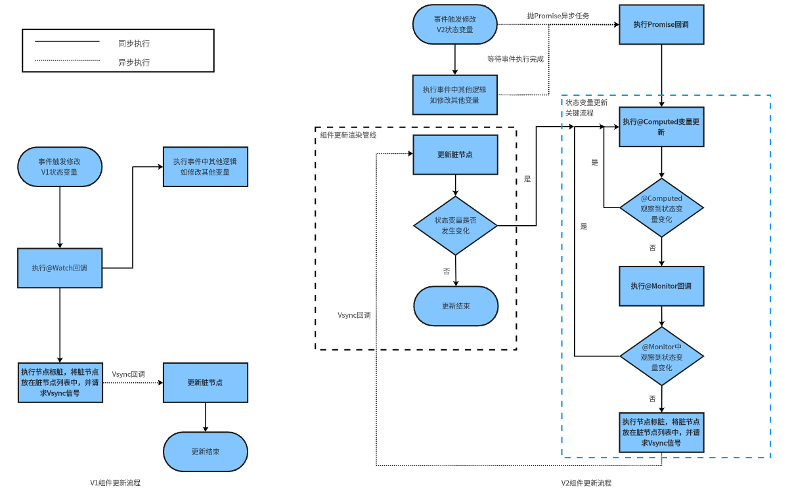

# 状态管理V1和V2更新机制差异
<!--Kit: ArkUI-->
<!--Subsystem: ArkUI-->
<!--Owner: @s10021109-->
<!--Designer: @s10021109-->
<!--Tester: @zhangwenhan12-->
<!--Adviser: @zhang_yixin13-->

## V1状态管理演进到V2状态管理背景

状态管理V1使用代理观察数据，创建状态变量时，会同时创建一个数据代理观察者。该观察者可以感知代理变化，但无法精准观测到实际数据变化，V1状态管理存在以下限制：

- 状态变量不能独立于UI存在，同一个数据被多个视图代理时，其中一个视图的更改不会通知其他视图更新。
- 只能感知对象属性第一层的变化，无法做到深度观测和深度监听。
- 在更改对象中属性场景下存在冗余更新的问题。
- 装饰器间配合使用限制多，不易用。组件中没有明确状态变量的输入与输出，不利于组件化。

基于上述原因，状态管理V2增强了数据的观察能力，使数据本身可观察。更改数据时，会触发相应视图的更新。相较于状态管理V1，状态管理V2有如下优点：

- 状态变量独立于UI，更改数据会触发相应视图的更新。

- 支持对象的深度观测和深度监听，且深度观测机制不影响观测性能。

- 支持对象中属性级精准更新。

- 装饰器易用性高、拓展性强，在组件中明确输入与输出，有利于组件化。

## 状态变量变化自动触发UI更新

状态管理框架检测到状态变化时会触发UI更新， 状态变量变化包含观察的对象属性或观察到的数组（或其他内置类型）项的变化：
- 对于V1，具有一层观察能力，可观察第一层对象属性的变化、第一层数据项的变化；
- 对于V2，具有深度观察能力，能观察到嵌套对象属性或数组项变化；

下面举例说明状态变量在@Component或@ComponentV2中的修改，触发UI刷新时，V1和V2的差异。

```typescript
// 如下示例代码以@ObservedV2为例，如果是V1，则对应的是@Observed和@Track。
@ObservedV2 class ObsObjA {
  @Trace propA: string = 'propA';
  @Trace obsObjB: ObsObjB = new ObsObjB();
  constructor(propA: string) {
    this.propA = propA;
  }
}

@ObservedV2 class ObsObjB {
  @Trace propB: string = 'propB';
}

@ObservedV2 class ObsObjC {
  @Trace propC: string = 'propC';
  constructor(propC: string) {
    this.propC = propC;
  }
}

// 如下代码是写在@Component或@ComponentV2中。
// 其中simple是被V1或V2装饰器装饰的状态变量，obsObjA是被V1或V2装饰器装饰的复杂状态变量，arr是被V1或V2装饰器装饰的数组状态变量。
build() {
  Column() {
    Text(this.simple);  // 第1行使用简单类型状态变量绑定Text组件
    Text(JSON.stringify(this.obsObjA));  // 第2行使用复杂对象类型状态变量绑定Text组件
    Text(this.obsObjA.propA); // 第3行使用复杂对象属性状态变量绑定Text组件
    Text(this.obsObjA.obsObjB.propB); // 第4行使用嵌套复杂对象属性状态变量绑定Text组件
    Text(JSON.stringify(this.arr)); // 第5行使用数组类型的状态变量绑定Text组件
    Text(JSON.stringify(this.arr[0])); // 第6行使用数组第0项的状态变量绑定Text组件
    Text(JSON.stringify(this.arr[0].propC)); // 第7行使用数组第0项元素的状态变量属性绑定Text组件
  }
}
```

V1和V2状态管理框架通过观察状态变量的赋值来触发对应的UI更新，通过如下代码说明V1和V2状态变量更新差异：

```typescript
Button('Change state variable')
  .onClick(() => {
    // this.simple是V1装饰器或V2装饰器装饰的简单变量，给该变量赋值，不论是V1装饰器变量还是V2装饰器变量，都会触发第1行Text的更新。
    this.simple = 'Welcome';
    // this.obsObjA是V1装饰器或V2装饰器装饰的复杂对象变量，给该变量赋值，不论是V1装饰器变量还是V2装饰器变量，都会触发第2、3和4行Text的更新。
    this.obsObjA = new ObsObjA('obsObjA++');
    // this.arr是V1装饰器或V2装饰器装饰的数组类型变量，给该变量赋值，不论是V1装饰器变量还是V2装饰器变量，都会触发第5、6和7行Text的更新。
    this.arr = [new ObsObjC('propC1'), new ObsObjC('propC2')];
    // 对于V1，如果this.obsObjA是V1装饰器装饰的变量（obsObjA中的属性没有被@Track装饰或者this.obsObjA.propA被@Track装饰），
    // 给该变量赋值，则第3行的Text会更新； 对于V2，this.obsObjA.propA必须要被V2装饰器（如@Trace）装饰，给该变量赋值，第3行的Text才会更新。
    this.obsObjA.propA = 'propA3';
    // 对于V1，只能观察一层的变化，即使this.obsObjA.obsObjB.propB被V1装饰器装饰（@Track），第4行Text不更新;
    // 对于V2，只要this.obsObjA.obsObjB.propB被V2装饰器装饰（@Trace），第4行的Text就能更新。
    this.obsObjA.obsObjB.propB = 'propB3';
    // this.arr被V1装饰器或V2装饰器装饰，给该变量赋值，不论是V1装饰器变量还是V2装饰器变量，都会触发第5和6行的Text更新。
    this.arr[0] = new ObsObjC('propC3');
    // 对于V1，this.arr被V1装饰器装饰，由于V1只能观察一层的变化，数组项的属性赋值是第二层的修改，第7行的Text不会更新；
    // 对于V2，this.arr被V2装饰器装饰，且propC被V2装饰器装饰（@Trace），给该变量赋值，第7行的Text会更新。
    this.arr[0].propC = 'propC4';
  })
```

## V1的@Watch和V2的@Monitor差异

V1的@Watch和V2的@Monitor详细差异参考[\@Watch与\@Monitor的对比](./arkts-new-monitor.md#monitor与watch对比)。下面通过例子介绍两者差异。

### @Watch同步执行
V1装饰变量赋值，对象属性或数组（Map、Set）项变化，会触发@Watch的同步执行。如果状态变量被修改多次，则@Watch函数会同步执行多次。

```typescript
@State @Watch('onVarNameChange') obsObjA: ObsObjA = new ObsObjA('propANew');

onVarNameChange() {  // @Watch函数在被监听的V1装饰变量obsObjA发生变化时同步执行。
  console.info('obsObjA.propA change callback'); // 执行顺序3
}

Button('Change state variable')
  .onClick(() => {
    console.info('1'); // 执行顺序1
    this.obsObjA.propA = 'propA3'; // 执行顺序2
    console.info('2'); // 执行顺序4
  })
```
上述代码中，给this.obsObjA.propA赋值，执行顺序是：打印日志'1'，状态变量赋值，打印日志'obsObjA.propA change callback'，最后打印日志'2'。

### @Monitor异步执行
V2装饰变量赋值，对象属性或数组（Map、Set）项变化，会触发@Monitor的异步执行。如果状态变量被修改多次，则@Monitor函数只会执行一次。

```typescript
@Local arr: Array<ObsObjC> = [new ObsObjC('propC1')];

@Monitor('obsObjA.propA') onChange(mon : IMonitor) { // @Monitor函数在被监听的V2装饰变量obsObjA发生变化时异步执行
  console.info(`${mon.dirty[0]}`); // 执行顺序4（onClick相关逻辑执行完后，才执行onChange回调）
}

Button('Change state variable')
  .onClick(() => {
    console.info('1'); // 执行顺序1
    this.obsObjA.propA = 'propA3'; // 执行顺序2
    console.info('2'); // 执行顺序3
  })
```
上述代码中，需要当前事件逻辑执行完成，如onClick执行后，才会执行@Monitor函数。给this.obsObjA.propA赋值，执行顺序是：打印日志'1', 进行状态变量赋值，打印日志'2', 最后执行@Monitor的'onChange'，打印'obsObjA.propA'。


## V1状态变量更新和V2状态变量更新差异

如下图所示，展示V1组件和V2状态变量更新差异的流程图，相比V1状态管理，V2状态管理在状态变量变化时，会异步标脏组件。



### V1组件的更新

步骤1：事件触发修改V1状态变量，观察V1状态变量的变化；

步骤2：执行@Watch回调，执行事件中其他逻辑，如修改其他变量；

步骤3：执行节点标脏，将脏节点放在脏节点列表中，并请求Vsync信号；

步骤4：更新脏节点列表，更新顺序是，先更新父组件，再更新子组件；

步骤5: 如果状态变量再次发生变化，就会执行步骤4，步骤4在一个Vsync周期内的迭代次数不会超过3次，第3次迭代后，标脏的节点会加到脏节点列表中，在下一个Vsync到来时进行脏节点更新。

### V2组件的更新

V2状态管理相比相比V1状态管理，新增异步执行@Computed，@Monitor和节点标脏步骤：

步骤1：事件触发修改V2状态变量， 抛[Promise](../../arkts-utils/async-concurrency-overview.md#promise)异步任务；

步骤2：执行事件中其他剩余逻辑，如修改其他变量。等待事件逻辑执行完成后（如onClick事件），执行Promise回调；

步骤3：执行@Computed变量更新；

步骤4：在@Computed变量更新时，如果@Computed观察到状态变量变化，进入步骤3，否则进入步骤5；

步骤5：执行@Monitor回调函数；

步骤6：@Monitor函数回调中如果有状态变量的变化，则进入步骤3， 否则进入步骤7；

步骤7：执行节点标脏，将脏节点放在脏节点列表中，并请求Vsync信号；

步骤8：更新脏节点列表，更新顺序是，先更新父组件，再更新子组件；

步骤9: 在更新过程中，如果状态变量再次发生变化，就会执行步骤8，步骤8在一个Vsync周期中迭代次数不会超过3次，第3次迭代后，标脏的节点会加到脏节点列表中，在下一个Vsync到来时进行脏节点更新。