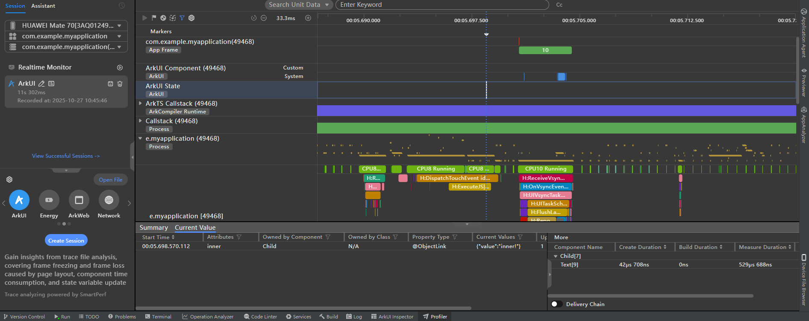
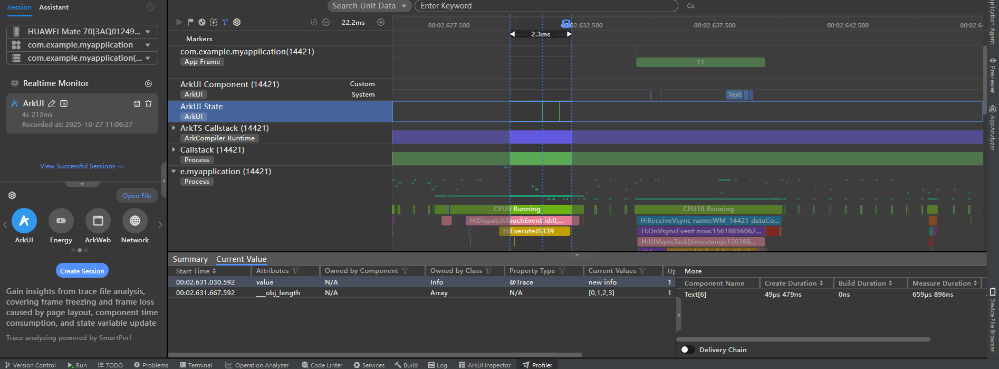

# 状态变量改变不触发组件刷新问题常用定位方法
<!--Kit: ArkUI-->
<!--Subsystem: ArkUI-->
<!--Owner: @liwenzhen3-->
<!--Designer: @s10021109-->
<!--Tester: @zhangwenhan12-->
<!--Adviser: @zhang_yixin13-->

在声明式UI编程框架中，状态管理的主要职责是：当状态变量改变时，触发其关联组件的刷新。所以在使用状态变量的过程中，最常见的问题就是组件不刷新。本文主要针对开发者在使用状态变量时遇到的不刷新问题，阐述以下两个方面。
- 如何定位状态变量不刷新的问题。
- 不刷新问题常见案例。

## 定位状态变量不刷新问题的主要方法
状态变量触发UI刷新主要分为两步：
- 收集依赖：收集状态变量关联组件ID。
- 触发更新：标记需要更新的节点，触发需要更新的节点的更新。

这部分的原理在本篇文档中仅做简要说明，详情见[状态管理原理介绍](./arkts-state-management-introduce.md)。基于上面的状态变量触发UI刷新的流程，在定位不刷新问题时，可以分为以下五步来定位。
### 第一步：状态变量收集依赖
基于状态管理的更新流程，状态变量触发UI组件更新的前提是，当前状态变量已经收集到UI组件的依赖，具体来说也就是在组件初始化的过程，触发了状态变量的“读”操作。

检查状态变量是否收集到组件的ID可通过以下工具：
- 使用DevEco Studio的ArkUI Inspector。具体使用方法见[状态管理Inspector调试能力](../ui-inspector-profiler.md#状态管理inspector调试能力)。
- 使用[hidumper](../../dfx/hidumper.md)工具。具体使用方法见[状态管理hidumper能力](../ui-inspector-profiler.md#状态管理hidumper能力)。

### 第二步：状态变量发生改变
在给状态变量赋值时，状态管理框架会检查当前被赋值的状态变量的值是否有变化，如果没有变化，则会直接返回，不做任何操作。最简单的排查手段是分别打印修改状态变量前后的值，检查是否有变化。如以下示例。
```ts
@Entry
@Component
struct Index {
  @State message: string = 'Hello World';

  build() {
    Column() {
      Text(this.message)
        .onClick(() => {
          console.info(`message set before ${this.message}`);
          this.message = 'Welcome';
          console.info(`message set after ${this.message}`);
        })
    }
  }
}
```
观察日志输出`this.message`前后发生改变，日志输出如下：
```text
message set before Hello World
message set after Welcome
```
### 第三步：状态变量的赋值是否可被观察
**状态管理V1**

在状态管理V1中，若开发者确认赋值前后值已发生变化却未能触发UI刷新，应检查当前赋值操作是否可被观察。示例如下。

在下面的示例中，开发者对`this.inner.value`的赋值无法触发```Text(`Child: inner value: ${this.inner.value}`)```组件的刷新，在遇到这个问题时，应该从以下方面排查当前赋值操作是否是可被观察。
  - [\@Watch](./arkts-watch.md)的监听函数是否执行。
  - 如果状态变量为复杂类型且需要观察其属性的赋值变化，开发者还可以通过[getTarget](./arkts-new-getTarget.md)来判断当前变量是否可观察。
  - 使用DevEco Studio的Profiler工具观察此次赋值是否有状态变量变化的上报，具体使用方法见[状态管理profiler调优能力](../ui-inspector-profiler.md#状态管理profiler调优能力)。
```ts
import { UIUtils } from '@kit.ArkUI';

class Outer {
  value: string = 'outer';
  inner: Inner = new Inner();
}

class Inner {
  value: string = 'inner';
}

@Entry
@Component
struct Index {
  @State outer: Outer = new Outer();

  build() {
    Column() {
      Text(`Index: outer value: ${this.outer.value}`)
      Child({ inner: this.outer.inner })
    }
  }
}

@Component
struct Child {
  // 写法错误：@ObjectLink初始化的变量不是@Observed装饰的类的实例
  // 状态管理会打印error日志提醒开发者：
  // FIX THIS APPLICATION ERROR: @ObjectLink inner owned by @Component Child set/init (method setValueInternal): assigned value is not be decorated by @Observed. Value changes will not be observed and UI will not update.
  @ObjectLink @Watch('onChange') inner: Inner;

  aboutToAppear(): void {
    // 通过getTarget获取状态变量的原始对象，如果两者相等，即原始对象和该对象是同一个对象，则其不是一个可观察的数据
    // 如果两者不相等，则其为可观察的对象
    // 因为Inner缺少@Observed装饰器装饰，所以下面日志输出为：
    // inner is not observed object
    console.info(`inner is ${UIUtils.getTarget(this.inner) === this.inner ? 'not observed object' :
      'observed object'}`);
  }

  onChange() {
    console.info(`inner property has been changed ${this.inner.value}`);
  }

  build() {
    Column() {
      Text(`Child: inner value: ${this.inner.value}`)
        .onClick(() => {
          this.inner.value += '!';
        })
    }
  }
}
```
在上面的示例中，`Inner`没有被[\@Observed](./arkts-observed-and-objectlink.md)装饰，所以其属性`value`的赋值无法被观察：
- `@Watch('onChange')`函数没有执行。
- 日志提示`inner is not observed object`。
- ArkUI State泳道没有状态变量变化的上报信息。

  

需要注意，并非所有的类对象都需要被\@Observed装饰。[\@State](./arkts-state.md)装饰器会默认对复杂对象包装第一层代理，而对嵌套对象，则需要在内层对象的类声明上增加\@Observed装饰。

正确示例：

```ts
import { UIUtils } from '@kit.ArkUI';

class Outer {
  value: string = 'outer';
  inner: Inner = new Inner();
}

@Observed
class Inner {
  value: string = 'inner';
}

@Entry
@Component
struct Index {
  @State outer: Outer = new Outer();

  build() {
    Column() {
      Text(`Index: outer value: ${this.outer.value}`)
      Child({ inner: this.outer.inner })
    }
  }
}

@Component
struct Child {
  @ObjectLink @Watch('onChange') inner: Inner;

  aboutToAppear(): void {
    // 日志输出：inner is observed object
    console.info(`inner is ${UIUtils.getTarget(this.inner) === this.inner ? 'not observed object' :
      'observed object'}`);
  }

  onChange() {
    console.info(`inner property has been changed ${this.inner.value}`)
  }

  build() {
    Column() {
      Text(`Child: inner value: ${this.inner.value}`)
        .onClick(() => {
          this.inner.value += '!';
        })
    }
  }
}
```
在正确的示例中：
- \@Watch监听函数被正常触发。
- 日志提示`inner is observed object`。
- ArkUI State泳道有状态变量变化的上报信息。

  

**状态管理V2**

状态管理V2中，对复杂对象的观察分以下两种情况：
- 普通类：

  与状态管理V1不同，在状态管理V2观察普通类时，框架不会为其实例创建代理对象，因此无法通过getTarget来判断其是否为代理对象。开发者可以通过以下方式判断：
  - 通过检查要观察的属性是否是[\@Trace](./arkts-track.md)装饰。
  - 观察ArkUI State泳道是否有状态变量变化信息上报，具体使用方法见[状态管理profiler调优能力](../ui-inspector-profiler.md#状态管理profiler调优能力)。
- 内置类型（Built-in Types）：

  在状态管理V2中，Array、Map、Set会包装代理对象，开发者可以通过调用getTarget来判断当前类型是否为代理数据。

具体示例如下：
```ts
import { UIUtils } from '@kit.ArkUI';

@ObservedV2
class Info {
  @Trace value: string = 'info';
  @Trace numberArr: number[] = [];
  count: number = 0;

  constructor(val: string) {
    this.value = val;
    this.numberArr = [0, 1, 2];
  }
}

@Entry
@ComponentV2
struct Index {
  info: Info = new Info('info');

  aboutToAppear(): void {
    // 日志输出：this.info.numberArr is observed array
    console.info(`this.info.numberArr is ${UIUtils.getTarget(this.info.numberArr) === this.info.numberArr ?
      'not observed array' :
      'observed array'}`);
  }

  build() {
    Column() {
      Text(`Index: info value: ${this.info.value}`)
      Text(`Index: info numberArr length: ${this.info.numberArr.length}`)
      Text(`Index: info count: ${this.info.count}`)

      Button('change info property').onClick(() => {
        this.info.value = 'new info';
        this.info.numberArr.push(3);
        this.info.count++;
      })
    }
  }
}
```
基于上面的示例，观察ArkUI State泳道，有两次状态变量的变化上报，即`this.info.value`和`this.info.numberArr`。`count`不是\@Trace装饰的，所以不会被观察到变化，也不会在Profiler上报状态变量的变化。



### 第四步：数据源和被同步的对象是否有关联关系
状态管理中，数据源会通过双向或单向机制通知同步对象。如果开发者遇到数据源改变，但其同步对象没有被通知的情况，可以按下面的方式排查。
**状态管理V1**

状态管理V1存在下面两类同步方式：
  - 同步对象(sync peer)：如\@State和[\@Link](./arkts-link.md)、[\@Provide](./arkts-provide-and-consume.md)和[\@Consume](./arkts-provide-and-consume.md)。开发者可以通过DevEco Studio的ArkUI Inspector来查看数据源和同步对象之间是否存在同步关系，具体见[状态管理Inspector调试能力](../ui-inspector-profiler.md#状态管理inspector调试能力)。
  - 依赖其所属组件的更新函数：如\@State通知\@Prop变化、\@State通知\@ObjectLink变化。开发者可以使用断点调试工具，或者[getHash接口](../../reference/apis-arkts/js-apis-util.md#utilgethash12)来判断数据源和同步对象是否为同一个对象的引用(hashcode并不固定，以开发者自己打印的为准)。

**状态管理V2**

状态管理V2没有同步对象(sync peer)的概念。[\@Local](./arkts-new-local.md)和[\@Param](./arkts-new-param.md)的同步方式是依赖\@Param组件所属组件的更新函数。

这类问题中，常见的场景是和[ForEach](../rendering-control/arkts-rendering-control-foreach.md)和[LazyForEach](../rendering-control/arkts-rendering-control-lazyforeach.md)联用导致数据源和其同步对象断链。如以下示例。

```ts
import { UIUtils } from '@kit.ArkUI';
import { util } from '@kit.ArkTS';

@Observed
class Info {
  value: string = 'info';
}

@Entry
@Component
struct Index {
  @State infos: Info[] = [new Info()];

  build() {
    Column() {
      // 第一步：点击该Button
      // 触发ForEach的刷新，ForEach对比前后key值没有改变，没有触发Child的更新，所以@ObjectLink info还是指向之前的Info的实例
      // 出现@State infos和@ObjectLink info断链
      Button('change first item value').onClick(() => {
        this.infos[0] = new Info();
      })

      // 第二步：点击该Button，@ObjectLink info的@Watch的函数没有被触发
      // 日志打印：this.infos[0] hashcode: 993656661
      // this.infos[0]和@ObjectLink info不是同一个对象的引用，@State无法通知@ObjectLink刷新
      Button('change first item value').onClick(() => {
        this.infos[0].value += '1';
        console.info(`this.infos[0] hashcode: ${util.getHash(this.infos[0])}`);
      })
      ForEach(this.infos, (item: Info) => {
        Child({ info: item })
      })
    }
  }
}

@Component
struct Child {
  @ObjectLink @Watch('onChange') info: Info;

  aboutToAppear(): void {
    // 日志输出:
    // info is observed object, hashcode: 1806047025
    // hashcode并不固定，根据开发者自己打印的为准
    console.info(`info is ${UIUtils.getTarget(this.info) === this.info ? 'not observed object' :
      'observed object'}, hashcode: ${util.getHash(this.info)}`);
  }

  onChange() {
    console.info(`info property has been changed ${this.info.value}`);
  }

  build() {
    Column() {
      Text(`Child: info value: ${this.info.value}`)
        .onClick(() => {
          this.info.value += '2';
        })
    }
  }
}
```

正确示例：

```ts
import { UIUtils } from '@kit.ArkUI';
import { util } from '@kit.ArkTS';

@Observed
class Info {
  value: string = 'info';
}

@Entry
@Component
struct Index {
  @State infos: Info[] = [new Info()];

  build() {
    Column() {
      // 第一步：点击该Button
      // 触发ForEach的刷新，ForEach对比前后key值改变，触发Child的重建，@ObjectLink info指向新的Info的实例
      Button('change first item value').onClick(() => {
        this.infos[0] = new Info();
      })

      // 第二步：点击该Button，@ObjectLink info的@Watch的函数被触发
      // 日志打印：this.infos[0] hashcode: 358024053
      Button('change first item value').onClick(() => {
        this.infos[0].value += '1';
        console.info(`this.infos[0] hashcode: ${util.getHash(this.infos[0])}`);
      })

      ForEach(this.infos, (item: Info) => {
        Child({ info: item })
      }, (item: Info) => {
        // 随机数key值
        return item.value + Math.random().toString();
      })
    }
  }
}

@Component
struct Child {
  @ObjectLink @Watch('onChange') info: Info;

  aboutToAppear(): void {
    // 日志输出:
    // 首次创建： info is observed object, hashcode: 2026693567
    // 点击Button('change first item value')，触发Child重建：info is observed object, hashcode: 358024053
    console.info(`info is ${UIUtils.getTarget(this.info) === this.info ? 'not observed object' :
      'observed object'}, hashcode: ${util.getHash(this.info)}`);
  }

  onChange() {
    console.info(`info property has been changed ${this.info.value}`);
  }

  build() {
    Column() {
      Text(`Child: info value: ${this.info.value}`)
        .onClick(() => {
          this.info.value += '2';
        })
    }
  }
}
```

### 第五步：是否执行组件的更新函数
在检查了前四步后，如果发现UI依旧没有刷新，这就要检查最后一步，没有刷新的组件是否执行了更新函数。

这类问题常发生于，开发者在组件的同步回调里改变了状态变量，导致当前正在刷新的组件再次被加入到了待刷新的组件列表里，从而使状态管理框架忽略了这个组件的刷新。以[Image组件](../../reference/apis-arkui/arkui-ts/ts-basic-components-image.md)的[onComplete](../../reference/apis-arkui/arkui-ts/ts-basic-components-image.md#oncomplete)接口为例。

开发者可以通过封装获取组件属性方法来观察当前组件是否发生重新渲染。如下面示例：

```ts
@Entry
@Component
struct Page {
  @State widthValue: number = 100;
  @State flag: boolean = true;

  // 封装getHeightValue方法观察Image是否发生重新渲染
  getHeightValue(): number {
    console.info('Image render');
    return 500;
  }

  build() {
    Column() {
      Image(this.flag ? $r('app.media.startIcon') : $r('app.media.background'))
        .width(this.widthValue)
        .height(this.getHeightValue())
        .backgroundColor(Color.Pink)
        .onComplete((event) => {
          this.widthValue = 200;
          console.info(`Image onComplete ${this.widthValue} load status: ${event?.loadingStatus}`);
        })

      Button('change resource').onClick(() => {
        // 第一步：改变flag，使得两个Resource变量都进入Image组件的缓存
        // 第三步：再次改变Image的Resource，此时onComplete为同步回调
        // onComplete的回调中同步修改widthValue为200
        // 打印状态管理的错误日志：FIX THIS APPLICATION ERROR: @Component 'Page: State variable 'widthValue' has changed during render! It's illegal to change @Component state while build (initial render or re-render) is on-going. Application error!
        // 没有打印Image render日志，Image宽度没有发生改变
        this.flag = !this.flag;
      })

      Button('change widthValue').onClick(() => {
        // 第二步：改变image宽度为100
        this.widthValue = 100;
      })
    }
    .height('100%')
    .width('100%')
  }
}
```

第三步点击`Button('change resource')`后，输出日志如下：

```text
Image render
FIX THIS APPLICATION ERROR: @Component 'Page: State variable 'widthValue' has changed during render! It's illegal to change @Component state while build (initial render or re-render) is on-going. Application error!
Image onComplete 200 load status: 0
Image onComplete 200 load status: 1
```
可以看到在onComplete改变状态变量`widthValue`后，没有触发`Image render`日志，这次状态变量的改变没有触发Image组件的刷新。

正确示例：

可以将组件的同步回调中对状态变量的赋值通过setTimeout转换为异步执行，示例如下。

```ts
@Entry
@Component
struct Page {
  @State widthValue: number = 100;
  @State flag: boolean = true;

  getHeightValue(): number {
    console.info('Image render');
    return 500;
  }

  build() {
    Column() {
      Image(this.flag ? $r('app.media.startIcon') : $r('app.media.background'))
        .width(this.widthValue)
        .height(this.getHeightValue())
        .backgroundColor(Color.Pink)
        .onComplete((event) => {
          setTimeout(() =>{
            this.widthValue = 200;
            console.info(`Image onComplete ${this.widthValue} load status: ${event?.loadingStatus}`);
          });
        })

      Button('change resource').onClick(() => {
        // 第一步：改变flag，使得两个Resource变量都进入Image组件的缓存
        // 第三步：再次改变Image的Resource，此时onComplete为同步回调
        // onComplete的回调中异步修改widthValue为200
        // Image宽度刷新为200
        this.flag = !this.flag;
      })

      Button('change widthValue').onClick(() => {
        // 第二步：改变image宽度为100
        this.widthValue = 100;
      })
    }
    .height('100%')
    .width('100%')
  }
}
```
第三步点击`Button('change resource')`后，输出日志如下：

```text
Image render
Image onComplete 200 load status: 0
Image onComplete 200 load status: 1
Image render
```
可以看到在onComplete内的setTimeout改变状态变量`widthValue`后，触发`Image render`日志，Image宽度刷新为200。

## 总结
基于上述流程与示例，可以总结出定位不刷新问题的核心思路如下。
- 状态变量是否收集到了需要触发刷新组件的ID。
- 状态变量的赋值是否为可观察的变化。
- 需要刷新的组件是否执行了更新函数。

开发者在遇到不刷新的问题的时候，可以依据上面的定位流程，或者带着这三点疑问来排查代码，提高定位问题的效率。