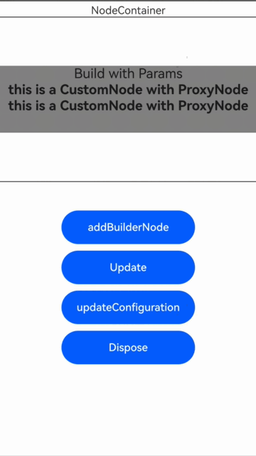
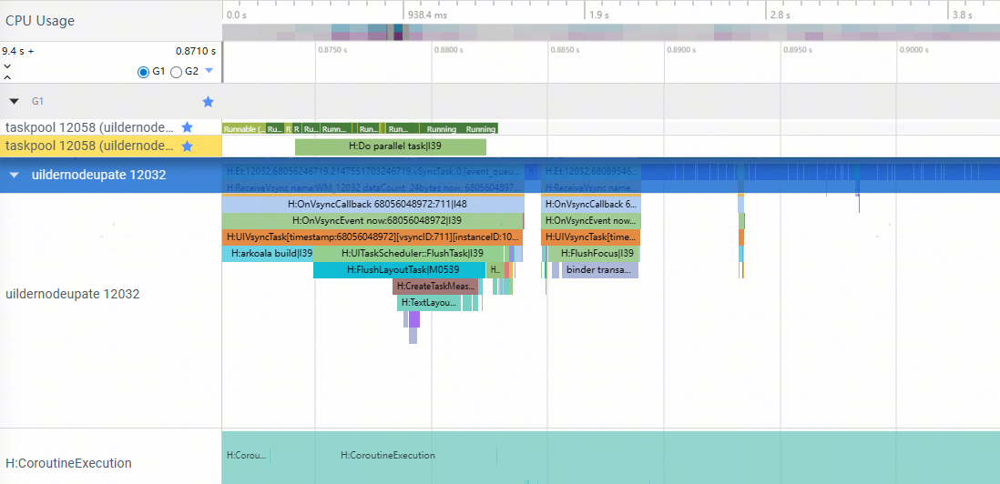
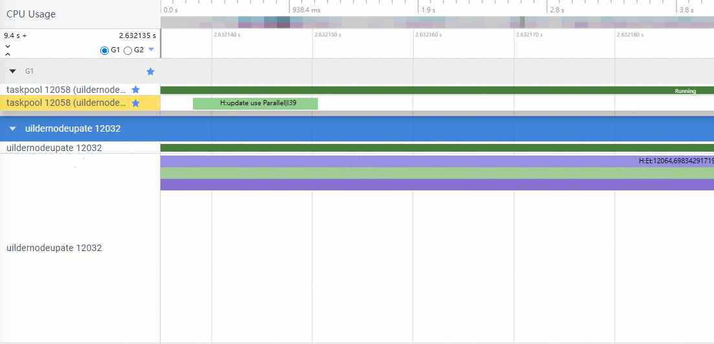

# BuilderNode并行化构建和更新节点树(ArkTS-Sta)
从API version 20开始，通过并行化能力，BuilderNode能够在子线程完成复杂UI的创建与更新，从而显著提升页面渲染性能与交互流畅度。适用场景如下所示：

- 构建/更新节点数量较多的复杂UI。
- 页面切换过程中，希望降低响应时延、提升流畅度。
- 用户输入或数据加载完成较早时，无需等待主线程空闲，直接在子线程开始构建UI，提高并发利用率。

## 概述
[BuilderNode](../reference/apis-arkui/js-apis-arkui-builderNode.md)可以帮助开发者以命令式的方式创建和更新节点。随着页面结构日益复杂，传统的顺序构建方式逐渐成为性能瓶颈。从API version 20开始，[BuilderNode](../reference/apis-arkui/js-apis-arkui-builderNode.md)引入了并行化构建与更新节点树能力，帮助开发者显著提升页面渲染效率。

通过使用[BuilderNode](../reference/apis-arkui/js-apis-arkui-builderNode.md)的并行化创建和更新功能，开发者能够获得以下优势：

- 加快复杂页面的构建速度，减少卡顿。在大规模节点场景下显著缩短渲染时间。

- 降低页面切换响应时延，提升用户体验。与串行模式相比，开发者可在获取数据或接收用户输入时调用并行构建或更新接口，将UI创建任务交由子线程处理。主线程继续执行其他逻辑，最终在适当时机同步显示完整UI，显著提升页面响应速度和流畅度。


## 约束与限制

  * 并行模式下，UI的最终挂载时机由框架控制，开发者无需手动同步。
  * 如果节点已挂载，则`update`操作将按串行方式执行，确保UI一致性。
  * 并行模式适合重计算量大、耗时长的UI构建；对于轻量UI，默认串行模式即可满足需求。
  * 当前[BuilderNode](../reference/apis-arkui/js-apis-arkui-builderNode.md)并行化构建不支持[Component3D](../reference/apis-arkui/arkui-ts/ts-basic-components-component3d.md)、[Web](../reference/apis-arkweb/arkts-basic-components-web.md)、[WithTheme](../reference/apis-arkui/arkui-ts/ts-container-with-theme.md)组件，使用这些组件时将触发运行时错误，导致应用崩溃。

## BuilderNode并行化构建场景示例

如下示例展示了如何使用BuilderNode并行化构建和更新节点树。

- `build`方法（新增`useParallel`参数）

  ```
  builderNode.build(
    wrapBuilder(BuildTextWithParams),
    new Params("Build with Params"),
    { useParallel: true }
  );
  ```

  > useParallel：布尔值，默认false。
  >    - true：开启并行化构建/更新，子节点会分派到后台线程处理，主线程可继续执行其他逻辑，最终在合适时机同步渲染完整UI。
  >    - false：保持原有串行构建方式。

- update方法

  update方法本身不新增useParallel参数。

  如果该[BuilderNode](../reference/apis-arkui/js-apis-arkui-builderNode.md)在创建时使用了并行方式构建，则在调用update时，只要该节点尚未挂载（即未显示到UI上），更新操作会以并行方式执行。


- 以下为使用[BuilderNode](../reference/apis-arkui/js-apis-arkui-builderNode.md)进行并行化创建节点树的示例。

  ```ts
  import { State } from '@ohos.arkui.stateManagement';
  import {
    Builder,
    Button,
    ButtonAttribute,
    ClickEvent,
    Column,
    Component,
    ContentSlot,
    Entry,
    LazyForEach,
    ListItem,
    NodeContainer,
    Position,
    Repeat,
    RepeatItem,
    Row,
    Stack,
    Text,
    TextAttribute,
    UIContext,
    wrapBuilder,
    FontWeight,
    Margin
  } from '@ohos.arkui.component';
  import hilog from '@ohos.hilog';
  import {
    BuilderNode,
    ComponentContent,
    DrawContext,
    FrameNode,
    NodeContent,
    NodeController,
    NodeRenderType,
    RenderOptions,
    Size,
    LayoutConstraint,
  } from '@ohos.arkui.node';

  // 自定义参数
  class Params {
    text1: string;
    constructor(text: string) {
      this.text1 = text;
    }
  }

  function getText(): string {
    hilog.info(0x0000, 'testTag', ' BuildTextWithParams getText start');
    return "this is a CustomNode with ProxyNode";
  }

  // 自定义组件MyStateSample2
  @Component
  struct MyStateSample2 {
    getText(): string {
      hilog.info(0x0000, 'testTag', ' MyStateSample2 getText start');
      return "this is a CustomNode with ProxyNode";
    }

    aboutToDisappear(){
      hilog.info(0x0000, 'testTag', ' MyStateSample2 aboutToDisappear');
    }

    build() {
      Text(this.getText())
        .fontSize(20)
        .fontWeight(FontWeight.Bold)
        .lineHeight(24)
    }
  }
  // builder组件
  @Builder
  function BuildTextWithParams(params: Params) {
    Column() {
      Text(params.text1).fontSize(20)
        .onClick((e: ClickEvent) => {
          hilog.info(0x0000, 'testTag', 'onClick start');
        })
      Text(getText())
        .fontSize(20)
        .fontWeight(FontWeight.Bold)
        .lineHeight(24)
      MyStateSample2()
    }
    .width('100%')
    .height(100)
    .backgroundColor(Color.Gray)
  }

  class MyNodeController extends NodeController {
    private rootNode ?: FrameNode;
    private builderNode ?: BuilderNode<Params>;
    private content?: ComponentContent;
    private uiContext?: UIContext;
    private params: string = "update with Params";

    // 创建节点
    makeNode(uiContext: UIContext): FrameNode | null {
      this.uiContext = uiContext;
      try{
        this.addBuilderNode();
      } catch (e) {
        console.log("WCS " + e)
      }

      return this.builderNode? this.builderNode!.getFrameNode()!:null;
    }

    // 更新节点内容
    updateNode() {
      this.params += "~"
      this.builderNode?.update(new Params(this.params));
    }

    // 销毁节点，释放资源
    dispose() {
      this.builderNode?.dispose();
      this.content?.dispose();
      this.builderNode = undefined;
      this.content = undefined;
    }

    // 更新配置（比如尺寸、渲染选项）
    updateConfiguration() {
      this.builderNode?.updateConfiguration();
    }

    // 添加 BuilderNode 节点
    addBuilderNode(){
      if ( this.builderNode === undefined ) {
        let renderOptions: RenderOptions =
          { selfIdealSize: { width: 100, height: 100 } as Size, type: NodeRenderType.RENDER_TYPE_DISPLAY }
        // 创建新的BuilderNode
        let builderNode: BuilderNode<Params> = new BuilderNode<Params>(this.uiContext!, renderOptions);
        hilog.info(0x0000, 'testTag', 'builderNode');
        // 并行执行build
        builderNode.build(wrapBuilder(BuildTextWithParams), new Params("Build with Params"), {useParallel: true});
        if (builderNode.getFrameNode() == undefined || builderNode.getFrameNode() == null) {
          hilog.info(0x0000, 'testTag', 'builderNode is null');
        }
        this.builderNode = builderNode;
      }
    }
  }

  @Entry
  @Component
  struct MyStateSample {
    @State flag: boolean = true;
    private nodeController: MyNodeController = new MyNodeController();

    build() {
      Column() {
        Column() {
          Text("Test NodeContainer")
          NodeContainer(this.nodeController)
            .borderWidth(1)
            .height("80%")
            .width("100%")
        }
        .height("40%")

        // 添加 BuilderNode 节点
        Button("addBuilderNode")
          .onClick((e: ClickEvent) => {
            hilog.info(0x0000, 'testTag', 'changeValue');
            this.nodeController.addBuilderNode();
          })
          .width(200)
          .height(50)
          .margin({ bottom: 10 } as Margin)

        // 更新 BuilderNode 节点
        Button("Update")
          .onClick((e: ClickEvent) => {
            hilog.info(0x0000, 'testTag', 'On Click');
            this.nodeController?.updateNode();
          })
          .width(200)
          .height(50)
          .margin({ bottom: 10 } as Margin)

        // 更新配置
        Button("updateConfiguration")
          .onClick((e: ClickEvent) => {
            hilog.info(0x0000, 'testTag', 'updateConfiguration');
            this.nodeController?.updateConfiguration();
          })
          .width(200)
          .height(50)
          .margin({ bottom: 10 } as Margin)

        // 销毁节点，释放资源
        Button("Dispose")
          .onClick((e: ClickEvent) => {
            this.flag = false;
            this.nodeController?.dispose();
          })
          .width(200)
          .height(50)
      }
    }
  }
  ```
  


## BuilderNode并行化DFX定位指导与性能调优
参考[使用SmartPerf-Host分析应用性能](../performance/performance-optimization-using-smartperf-host.md)文档，抓取Trace以对比并行创建与非并行创建组件时的性能。同时，也可以通过Trace观察BuilderNode是否在子线程中构建和更新。

- 如何确认并行创建已开启：使用SmartPerf-Host抓取Trace，通过Trace可以观察到BuilderNode在子线程中构建。如图所示，子线程12058中存在`Do parallel task`的trace，这表明BuilderNode的构建是在子线程中进行的。
 

- 如何确认开启并行更新：使用SmartPerf-Host抓取Trace，通过Trace观察BuilderNode在子线程更新。如图所示，子线程12058中存在`update use Parallel`的trace，说明BuilderNode的在子线程中更新。
  