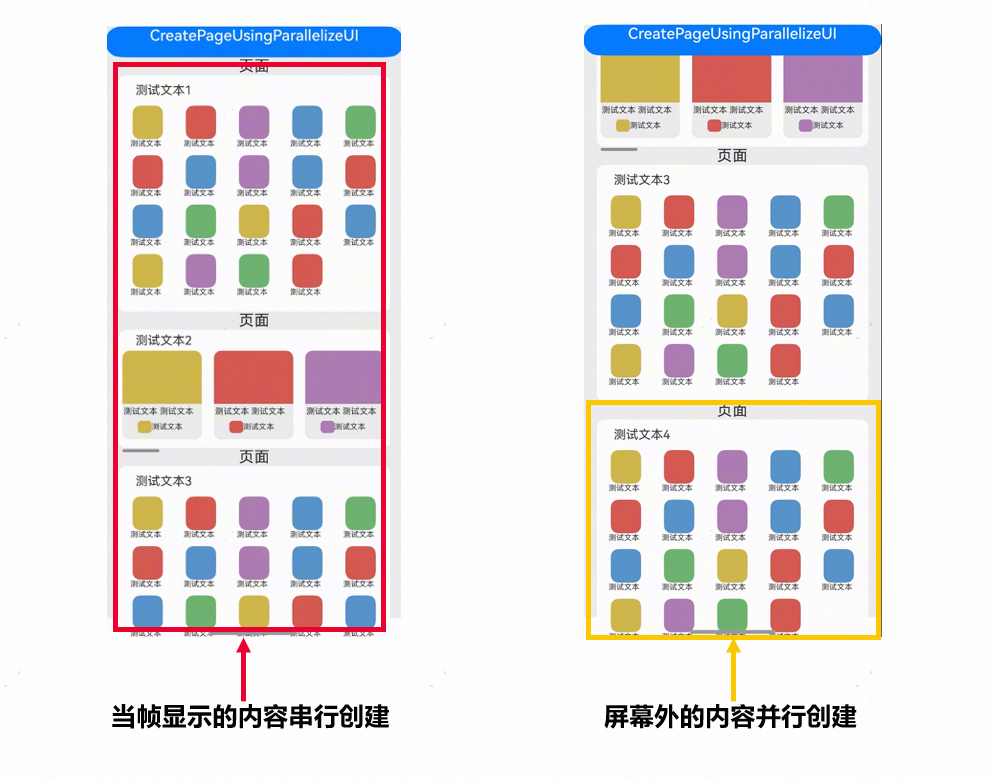
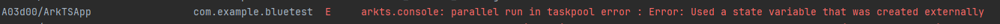
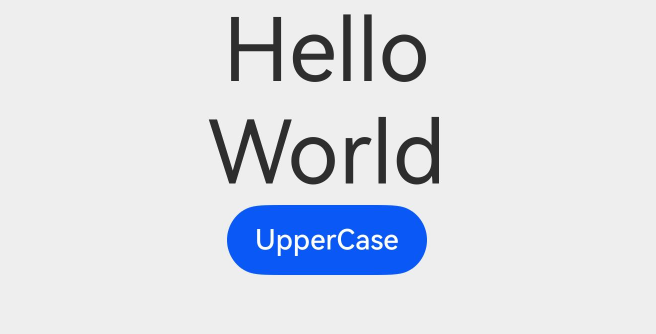
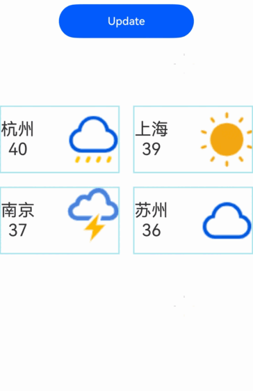
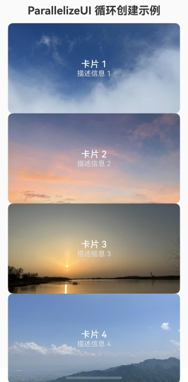
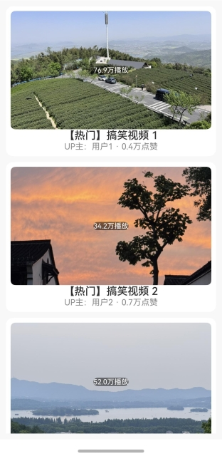
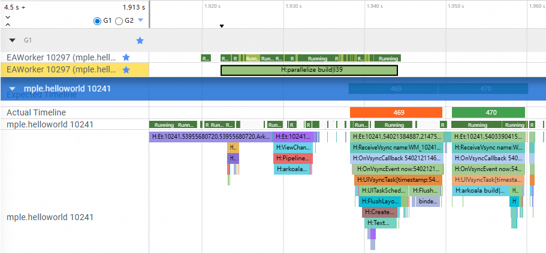

# UI并行化创建组件树
从API version 20开始，UI可以并行创建组件树，从而降低组件创建时延并提升应用的流畅度。适用场景：
* 适用于需要将大型、复杂页面拆分构建的场景。
* 由于并行构建的部分不会在当前帧立即渲染，适用于处理屏幕外内容、可延迟显示的内容或可以先用占位替代需要显示的内容。

## 概述

传统单线程UI渲染方式已无法满足日益复杂UI和数据处理需求，UI卡顿、响应迟缓等问题严重影响用户体验。基于上述问题，ArkUI提出声明式下部分UI并行化创建方案。开发者可指定并行内容，减少组件创建时延，提升用户体验。

下述页面可以将当前帧显示的内容串行创建，屏幕外的内容并行创建。



## 约束与限制
  * 不能在[ParallelizeUI](../reference/apis-arkui/js-apis-arkui-Parallelize.md#parallelizeui)中使用外部定义的状态变量，例如：[@Link](state-management/arkts-link.md)、[@Prop](state-management/arkts-prop.md)、[@Consumer](state-management/arkts-provide-and-consume.md)、类StorageLink、类StorageProp等。需要依赖外部的状态变量更新UI，请使用[ParallelizeUI\<T\>](../reference/apis-arkui/js-apis-arkui-Parallelize.md#parallelizeuit)。
  * 当前[ParallelizeUI](../reference/apis-arkui/js-apis-arkui-Parallelize.md#parallelizeui)不支持[Web](../reference/apis-arkweb/arkts-basic-components-web.md)、[WithTheme](../reference/apis-arkui/arkui-ts/ts-container-with-theme.md)组件，使用这些组件将触发运行时错误，导致应用崩溃。
  * 普通变量可以在多线程中使用，但开发者需要确保变量在多线程中的读写安全。可以使用并发容器或者锁来保证多线程中的读写安全。<!--Del-->具体示例可以参考[UI并行化创建组件树接口ParallelizeUI如何确保多线程读写安全(API 20)](../faqs/faqs-arkui-component.md#ui并行化创建组件树接口parallelizeui如何确保多线程读写安全api-20)。<!--DelEnd-->
  * 当前[ParallelizeUI](../reference/apis-arkui/js-apis-arkui-Parallelize.md#parallelizeui)仅支持并行化创建，创建完成后的更新操作仍在主线程完成。
  * ArkUI对并行任务的数量没有限制，具体数量开发者根据页面中可分帧并行的内容进行划分，由业务逻辑决定。每个并行任务应包含足够多的组件，建议每个任务内的组件数量大于50个，以避免任务调度开销大于并行收益。


## 数据传递

为了保证UI在多线程中运行的安全性与正确性，在[ParallelizeUI](../reference/apis-arkui/js-apis-arkui-Parallelize.md#parallelizeui)中禁止使用外部定义的状态变量。在debug模式下，系统会进行运行时检测并抛出异常。

如下示例演示了在[ParallelizeUI](../reference/apis-arkui/js-apis-arkui-Parallelize.md#parallelizeui)中使用外部定义的状态变量，从系统日志中可以观察到报错异常。

```ts
import { ParallelizeUI } from '@ohos.arkui.Parallelize';

@Entry
@Component
struct Index {
  @State str: string = 'Hello';
  build() {
    Column() {
      ParallelizeUI() {
        Text(this.str) // ParallelizeUI内部不能使用外部定义的状态变量
        .fontSize(50)
      }
      Text('World')
        .fontSize(50)
    }.height('100%')
      .width('100%')
  }
}
```


开发者可以使用[ParallelizeUI\<T\>](../reference/apis-arkui/js-apis-arkui-Parallelize.md#parallelizeuit)通过状态变量或非状态变量来构造用于并行创建UI的参数。

如下示例演示了如何使用[ParallelizeUI\<T\>](../reference/apis-arkui/js-apis-arkui-Parallelize.md#parallelizeuit)进行参数构造。

```ts
import { ParallelizeUI } from '@ohos.arkui.Parallelize';

class Param {
  str: string;
  constructor(str: string) {
    this.str = str;
  }
}

@Entry
@Component
struct Index {
  @State str: string = 'Hello';
  build() {
    Column() {
      // 使用ParallelizeUI<T>传递外部状态变量来构造参数
      ParallelizeUI<Param>(undefined, () => { return new Param(this.str); }, (param: Param) => {
        Text(param.str)
          .fontSize(50)
      })
      Text('World')
        .fontSize(50)
      Button('UpperCase')
        .onClick((event: ClickEvent) => {
          this.str = this.str.toUpperCase()
        })
    }.height('100%')
      .width('100%')
  }
}
```



## 并行化创建组件

并行创建的UI在创建完成后的下一帧才能合并显示，页面需要多帧才能显示全部内容。

该场景示例介绍了如何使用[ParallelizeUI](../reference/apis-arkui/js-apis-arkui-Parallelize.md#parallelizeui)并行创建多个组件。

```ts
import { Entry, Text, Column, Component, Button, ClickEvent, FontWeight, Stack, Position,
  TextAlign, Alignment, Margin, Row, GridItem, Image ,ImageFit, $r, Grid, ForEach } from '@ohos.arkui.component';
import { State } from '@ohos.arkui.stateManagement';
import { ParallelOption, ParallelizeUI } from '@ohos.arkui.Parallelize';

class WeatherInfo {
  city:string = ''
  temperature:number = 0
  weather:int = 0
  constructor(city:string, temperature:number, weather:int) {
    this.city = city
    this.temperature = temperature
    this.weather = weather
  }
  getImg():string {
    switch (this.weather) {
      case 0:
        return 'app.media.cloudy'
      case 1:
        return 'app.media.snow'
      case 2:
        return 'app.media.sunny'
      case 3:
        return 'app.media.rain'
      default:
        break;
    }
    return 'app.media.sunny'
  }
}

let array : Array<WeatherInfo> = new Array<WeatherInfo>();

array!.push(new WeatherInfo('杭州', 40, 3));
array!.push(new WeatherInfo('上海', 39, 2));
array!.push(new WeatherInfo('南京', 37, 1));
array!.push(new WeatherInfo('苏州', 36, 0));
array!.push(new WeatherInfo('湖州', 35, 3));
array!.push(new WeatherInfo('无锡', 34, 2));
array!.push(new WeatherInfo('常州', 32, 1));
array!.push(new WeatherInfo('嘉兴', 31, 1));


@Entry
@Component
struct Page {
  @State infos :Array<WeatherInfo> = new Array<WeatherInfo>();

  aboutToAppear() {
    this.infos.push(array[0])
    this.infos.push(array[1])
    this.infos.push(array[2])
    this.infos.push(array[3])
  }

  build() {
    Column() {
      Button('Update')
        .onClick((e: ClickEvent) => {
          this.infos[0] = new WeatherInfo('北京', 30, 2); // 外层状态变量刷新
        })
        .width(200)
        .height(50)
      Grid() {
        ParallelizeUI<WeatherInfo>(undefined,
          () => { return new WeatherInfo(this.infos[0].city, this.infos[0].temperature, this.infos[0].weather); },
          (param: WeatherInfo) => {
            // 第一个GridItem使用并行创建
            GridItem() {
              Row() {
                Column() {
                  Text(param.city).fontSize('25')
                  Text(param.temperature.toString()).fontSize('25')
                }
                Image($r(param.getImg()))
                  .objectFit(ImageFit.Contain)
              }
              .width('100%')
              .height('100%')
            }
            .width('100%')
            .height(100)
            .borderWidth(2).borderColor(0xAFEEEE)
        })
        // 剩余3个GridItem使用串行创建
        ForEach(this.infos.slice(1), (item: WeatherInfo) => {
          GridItem() {
            Row() {
              Column() {
                Text(item.city).fontSize('25')
                Text(item.temperature.toString()).fontSize('25')
              }
              Image($r(item.getImg()))
                .objectFit(ImageFit.Contain)
            }
            .width('100%')
            .height('100%')
          }
          .width('100%')
          .height(100)
          .borderWidth(2).borderColor(0xAFEEEE)
        })
      }
      .columnsTemplate('1fr 1fr')
      .columnsGap(20)
      .rowsGap(20)
      .width('100%')
      .height('100%')
      .margin({ top: 100 } as Margin)
    }
  }
}

```



## List&Grid并行化创建子组件

从API version 22开始，提供[ParallelizeUI](../reference/apis-arkui/js-apis-arkui-Parallelize.md#parallelizeui)的重载接口[ParallelizeUI<V, T>](../reference/apis-arkui/js-apis-arkui-Parallelize.md#parallelizeuiv-t22)用于UI并行化循环创建。该方法的使用方案和注意事项请参考：[List/Grid并行化创建子组件的方案和注意事项](../faqs/faqs-arkui-component.md#listgrid并行化创建子组件的方案和注意事项api-22)。

如下示例演示了在不同场景中，如何使用[ParallelizeUI<V, T>](../reference/apis-arkui/js-apis-arkui-Parallelize.md#parallelizeuiv-t22)并行创建子节点。

- 在非List和Grid中使用时，[ParallelizeUI<V, T>](../reference/apis-arkui/js-apis-arkui-Parallelize.md#parallelizeuiv-t22)会并行创建arr数组中定义的所有UI节点。适用于批量创建大量静态内容（例如图标、按钮、卡片等）。

  ```ts
  'use static'

  import { Entry, Column, Component, Image, Text, Stack, Row, $r, ImageFit, FontWeight, Margin } from '@ohos.arkui.component';
  import { State } from '@ohos.arkui.stateManagement';
  import { ParallelizeUI } from '@ohos.arkui.Parallelize';

  class CardInfo {
    title: string
    desc: string
    cover: string

    constructor(title: string, desc: string, cover: string) {
      this.title = title
      this.desc = desc
      this.cover = cover
    }
  }

  @Entry
  @Component
  struct ParallelDemo {
    @State arr: Array<Int> = [1]

    aboutToAppear() {
      // 构造并行循环创建的数据源，创建10个Stack组件
      for (let i = 2; i <= 10; i++) {
        this.arr.push(i)
      }
    }

    build() {
      Column() {
        Text('ParallelizeUI 循环创建示例')
          .fontSize(22)
          .fontWeight(FontWeight.Bold)
          .fontColor('#333')
          .margin({ bottom: 12 } as Margin)

        // 循环并行创建
        ParallelizeUI<Int, CardInfo>({ enable: true }, this.arr,
          (item: Int, index: Int) => {
            const coverIndex = ((item - 1) % 5) + 1
            return new CardInfo(
              `卡片 ${item}`,
              `描述信息 ${item}`,
              `app.media.cover${coverIndex}`
            )
          },
          (param: CardInfo) => {
            // 每个卡片UI
            Stack() {
              Image($r(param.cover))
                .width('100%')
                .height(180)
                .borderRadius(10)
                .objectFit(ImageFit.Cover)

              Column() {
                Text(param.title) // 卡片标题
                  .fontSize(18)
                  .fontWeight(FontWeight.Medium)
                  .fontColor('#FFF')

                Text(param.desc) // 卡片描述
                  .fontSize(14)
                  .fontColor('#DDD')
              }
              .padding(10)
            }
            .width('100%')
            .borderRadius(10)
          }
        )
      }
      .width('100%')
      .padding(16)
      .backgroundColor('#FAFAFA')
    }
  }
  ```

  

- 在List和Grid容器中使用时，[ParallelizeUI<V, T>](../reference/apis-arkui/js-apis-arkui-Parallelize.md#parallelizeuiv-t22)仅按需并行创建当前可见区域内的节点，并在节点滑出可见区域后自动释放。
  ```ts
  'use static'

  import { Entry, Text, Column, Component, Button, ClickEvent, List, ListItem, Image, Row, Stack, ToggleType, $r, ImageFit, Alignment,FontWeight, TextOverflow  } from '@ohos.arkui.component';
  import { State } from '@ohos.arkui.stateManagement';
  import { ParallelizeUI } from '@ohos.arkui.Parallelize';

  class Info {
    title: string
    up: string
    views: string
    likes: string
    coverRes: string
    constructor(title: string, up: string, views: string, likes: string, coverRes: string) {
      this.title = title
      this.up = up
      this.views = views
      this.likes = likes
      this.coverRes = coverRes
    }
  }

  @Entry
  @Component
  struct Index {
    @State arr: Array<Int> = [1]
    @State stateVar: string = 'state var';

    aboutToAppear() {
      // 构造并行循环创建的数据源，创建50个ListItem子组件
      for (let i = 2; i <= 50; i++) {
        this.arr.push(i)
      }
    }

    build() {
      Column() {
        List({ space: 10 }) {
          // 循环并行创建
          ParallelizeUI<Int, Info>({ enable:true }, this.arr,
            (item: Int, index: Int) => {
              const coverIndex = ((item - 1) % 5) + 1   // 为每个Item生成Index
              const coverResId = `app.media.cover${coverIndex}`

              return new Info(
                `【热门】搞笑视频 ${item}`,
                `UP主：用户${item}`,
                `${(Math.random() * 100).toFixed(1)}万播放`,
                `${(Math.random() * 1).toFixed(1)}万点赞`,
                coverResId
              )
            },
            (param: Info) => {
              ListItem() {
                Column() {
                  // 封面
                  Stack() {
                    Image($r(param.coverRes))
                      .width('100%')
                      .height(200)
                      .borderRadius(8)
                      .objectFit(ImageFit.Cover)
                      .alt('video cover')

                    // 播放量右下角浮层
                    Row() {
                      Text(param.views)
                        .fontSize(12)
                        .fontColor('#FFFFFF')
                        .backgroundColor('rgba(0,0,0,0.5)')
                        .borderRadius(10)
                    }
                    .align(Alignment.BottomEnd)
                  }

                  // 标题
                  Text(param.title)
                    .fontSize(18)
                    .fontWeight(FontWeight.Medium)
                    .maxLines(2)
                    .textOverflow({ overflow: TextOverflow.Ellipsis })

                  // 底部信息行（up主、点赞量）
                  Row() {
                    Text(param.up)
                      .fontSize(14)
                      .fontColor('#888')

                    Text(` · ${param.likes}`)
                      .fontSize(14)
                      .fontColor('#888')
                  }
                }
                .backgroundColor('#FFFFFF')
                .borderRadius(12)
                .padding(8)
              }
              .width('100%')
            })
        }
        .width('100%')
        .height('100%')
        .padding(10)
        .backgroundColor('#F8F8F8')
      }
    }
  }
  ```

  


## UI并行化创建组件树DFX定位指导与性能调优
参考[使用SmartPerf-Host分析应用性能](https://gitcode.com/openharmony/docs/blob/master/zh-cn/application-dev/performance/performance-optimization-using-smartperf-host.md)文档，抓取Trace以对比并行创建与非并行创建组件时的性能。同时，也可以通过Trace观察BuilderNode是否在子线程中构建和更新。

使用SmartPerf-Host抓取Trace，通过Trace观察UI组件是否在子线程中构建。如图所示，子线程10297中存在`parallelize build`的trace，这表明构建是在子线程中进行的。

  


<!--Del-->
## 相关实例

[使用声明式的并行化方法创建UI组件](https://gitcode.com/openharmony/applications_app_samples/tree/OpenHarmony_feature_20250702/code/ArkTS1.2/ParallelizeUI/README.md)

[List&Grid并行化创建子组件](https://gitcode.com/openharmony/applications_app_samples/blob/OpenHarmony_feature_20250702/code/ArkTS1.2/ListAndGridParallelSample/README.md)

<!--DelEnd-->