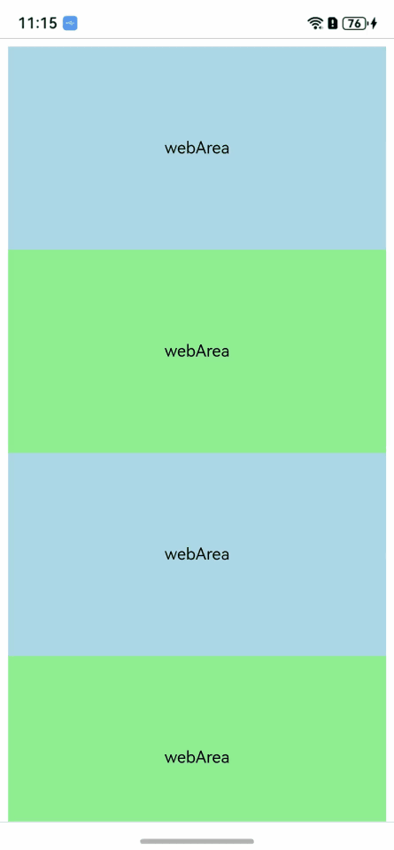

# Web页面显示内容滚动
<!--Kit: ArkWeb-->
<!--Subsystem: Web-->
<!--Owner: @zourongchun-->
<!--Designer: @zhufenghao-->
<!--Tester: @ghiker-->
<!--Adviser: @HelloShuo-->

当Web页面的内容高度或宽度超过可视区域时，页面才能滚动。Web页面滚动有多种方式，包括使用外接设备、ArkTS侧接口调用和js侧接口调用。

## 使用外接设备控制Web页面滚动

可以使用以下方式，通过触屏、触摸板和鼠标滚动控制Web页面滚动。
+ 使用触屏控制Web页面滚动：支持在触摸屏上单指上下左右滑动可以控制页面滚动。
+ 使用触摸板控制Web页面滚动：支持在笔记本触摸板或者外接触摸板双指上下左右滑动，可以控制页面滚动。
+ 使用控制鼠标滚轮控制Web页面滚动：支持用鼠标滚轮上下滑动来控制页面滚动。

## 调用ArkTS侧接口控制Web页面滚动
+ [scrollTo](../reference/apis-arkweb/arkts-apis-webview-WebviewController.md#scrollto)：在指定时间内，将页面滚动到指定的绝对位置。

  返回页面顶部。
  ```ts
  this.controller.scrollTo(0, 0);
  ```
+ [scrollBy](../reference/apis-arkweb/arkts-apis-webview-WebviewController.md#scrollby)：在指定时间内将页面滚动指定的偏移量。

  可以作为Web组件嵌套滚动中，控制Web组件滚动的接口，详见[滚动偏移量由滚动父组件统一派发](web-nested-scrolling.md#滚动偏移量由滚动父组件统一派发)。

+ [pageUp](../reference/apis-arkweb/arkts-apis-webview-WebviewController.md#pageup)：将Webview的内容向上滚动半个视框大小或者跳转到页面最顶部，通过top入参控制。
+ [pageDown](../reference/apis-arkweb/arkts-apis-webview-WebviewController.md#pagedown)：将Webview的内容向下滚动半个视框大小或者跳转到页面最底部，通过bottom入参控制。
## 调用js侧接口控制Web页面滚动
+ scrollBy：相对当前滚动位置滚动一定距离（正数向下/右，负数向上/左）。

  ```javascript
  window.scrollBy(deltaX, deltaY);//deltaX是元素要在横轴上滚动的距离，deltaY是元素要在纵轴上滚动的距离。
  ```
  渐进式滚动（如“阅读更多”按钮）。
  ```javascript
  document.getElementById("read-more").addEventListener("click", ()=>{
    window.scrollBy(0, 300);
  })
  ```
+ scrollTo：将页面滚动到绝对坐标位置。
  ```javascript
  window.scrollTo(x, y);//X是你想要显示在左上角的元素沿水平轴的像素，Y是你想要显示在左上角的元素沿垂直轴的像素。
  ```
  (1) 返回页面顶部。
  ```javascript
  window.scrollTo(0, 0);
  ```
  (2) 跳转到页面特定位置。
  ```javascript
  window.scrollTo(0, 500); //滚动到某个固定像素位置（如：500px)
  ```

## 点击状态栏回顶

当网页处于非顶部状态或向下抛滑时，此时若需返回网页顶部，可以使用[backToTop](../reference/apis-arkweb/arkts-basic-components-web-attributes.md#backtotop22)方法，开启后通过点击状态栏，打断抛滑并将网页滚动到网页顶部。


+ 示例代码：
  ```ts
  // xxx.ets
  import { webview } from '@kit.ArkWeb';

  @Entry
  @Component
  struct WebComponent {
    controller: webview.WebviewController = new webview.WebviewController();

    build() {
      Column() {
        Web({ src: $rawfile("index.html"), controller: this.controller })
          .backToTop(true)
      }
    }
  }
  ```

  加载的html文件：
  ```html
  <!-- index.html -->
  <!DOCTYPE html>
  <html>
  <head>
      <meta name="viewport" id="viewport" content="width=device-width, initial-scale=1.0">
      <style>
          .blue {
            background-color: lightblue;
          }
          .green {
            background-color: lightgreen;
          }
          .blue, .green {
           font-size:16px;
           height:200px;
           text-align: center;       /* 水平居中 */
           line-height: 200px;       /* 垂直居中（值等于容器高度） */
          }
      </style>
  </head>
  <body>
  <div class="blue" >webArea</div>
  <div class="green">webArea</div>
  <div class="blue">webArea</div>
  <div class="green">webArea</div>
  <div class="blue">webArea</div>
  <div class="green">webArea</div>
  <div class="blue">webArea</div>
  <div class="green">webArea</div>
  <div class="blue">webArea</div>
  </body>
  </html>
  ```

+ 效果展示：<br>
