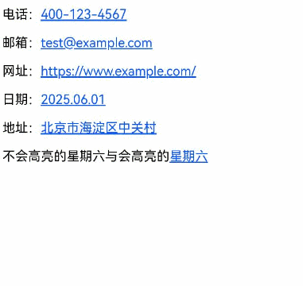
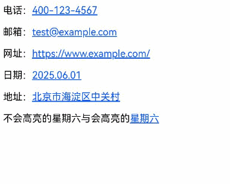

# 使用Web组件的智能分词能力
从API version 20开始，ArkWeb提供了H5页面内的文本分词识别功能，支持文本分词高亮、分词长按预览及文本选择菜单扩展等。这些功能需将[enableDataDetector](../reference/apis-arkweb/arkts-basic-components-web-attributes.md#enabledatadetector20)设置为true，默认为false。

此功能主要用于单页H5页面内容的实体识别，能够自动识别页面中的电话号码、网址等信息，并提供便捷的交互操作。启用此功能后，用户可以直接在页面中与识别的实体交互，如点击电话号码进行呼叫，点击地址在地图中查看，从而提升用户体验。

可识别的实体类型包括电话、链接、邮箱、地址和时间，详见[TextDataDetectorType](../reference/apis-arkui/arkui-ts/ts-text-common.md#textdatadetectortype11枚举说明)。


## 文本分词高亮
Web组件内的H5页面加载完成后，自动识别并高亮标注页面内的特殊实体。页面变化后新出现的实体不会被高亮标注。

特殊实体的高亮过滤规则如下：

- 不处理输入框内、可编辑区域内的文本实体。
- 不处理`<a></a>`标签内的文本实体。
- 不处理跨域iframe内、两层及以上嵌套iframe内的文本实体。
- 跨节点的实体不会被高亮，如`<p>星<span>期六</span></p>`。

页面中文本实体高亮后，将转变为超链接形式。触摸点击或鼠标左键点击实体，会根据实体类型弹出操作菜单。

```ts
// xxx.ets
import { webview } from '@kit.ArkWeb';

@Entry
@Component
struct Index {
  @State message: string = 'Hello World';
  webController: webview.WebviewController = new webview.WebviewController();

  build() {
    Column() {
      Row() {
        Button('Refresh')
          .onClick(() => {
            this.webController.refresh();
          })
      }

      Web({
        src: $rawfile('index.html'),
        controller: this.webController
      })
        .enableDataDetector(true)
        .dataDetectorConfig({
          types: []  // 实体识别类型，为空则识别所有类型
        })
    }
    .height('100%')
    .width('100%')
  }
}
```

加载的html文件。
```html
<!-- index.html -->
<!DOCTYPE html>
<html>
<head>
    <title>Test</title>
    <meta name="viewport" content="width=device-width, initial-scale=1.0">
</head>
<body>
    <p>电话：400-123-4567</p>
    <p>邮箱：test@example.com</p>
    <p>网址：https://www.example.com/</p>
    <p>日期：2025.06.01</p>
    <p>地址：北京市海淀区中关村</p>
    <p>不会高亮的星<span>期六</span>与会高亮的星期六</p>
</body>
</html>
```
点击实体文本，弹出对应的操作菜单，如下图。



鼠标右键点击、鼠标拖拽将触发超链接的默认行为。

接口[dataDetectorConfig](../reference/apis-arkweb/arkts-basic-components-web-attributes.md#datadetectorconfig20)未被使用，或其参数[TextDataDetectorConfig](../reference/apis-arkui/arkui-ts/ts-text-common.md#textdatadetectorconfig11对象说明)的enablePreviewMenu设置为false时，长按、拖拽将触发超链接的默认行为，如下图。


页面文本元素的计算样式存在`user-select:none`时，实体菜单中“选择文本”的选项无效，但在[copyOptions](../reference/apis-arkweb/arkts-basic-components-web-attributes.md#copyoptions11)不为CopyOptions.None时，仍可以复制实体文本。

## 分词长按预览
使用分词长按预览功能时，需要额外配置[dataDetectorConfig](../reference/apis-arkweb/arkts-basic-components-web-attributes.md#datadetectorconfig20)：

<!--code_no_check-->
```ts
Web({
  src: $rawfile('index.html'),
  controller: this.webController
})
  .enableDataDetector(true)
  .dataDetectorConfig({
    enablePreviewMenu: true,  // 配置分词长按预览功能
    types: []
  })
```
在[copyOptions](../reference/apis-arkweb/arkts-basic-components-web-attributes.md#copyoptions11)不为CopyOptions.None时，长按被高亮的实体文本，会弹出预览菜单，如下图。


通过[bindSelectionMenu](../reference/apis-arkweb/arkts-basic-components-web-attributes.md#bindselectionmenu13)绑定的[自定义菜单](web_menu.md#自定义菜单)与分词长按预览菜单互不影响。长按被高亮的分词超链接不会弹出自定义超链接菜单，长按普通超链接也不会弹出分词预览菜单。


## 文本选择菜单扩展
在非编辑区域中，选中的文本满足以下条件时，文本选择菜单将展示对应的AI菜单选项：

- 选中文本经过UTF-8编码转换后，其字节长度不超过255字节。
- 选中文本中仅包含一个匹配识别类型的实体词（可通过[dataDetectorConfig](../reference/apis-arkweb/arkts-basic-components-web-attributes.md#datadetectorconfig20)配置支持的识别类型）。
- 不处于“全选”操作状态下的文本。



AI菜单项的出现与是否选中高亮的实体文本无关，只要满足上述条件，AI菜单项就会显示。