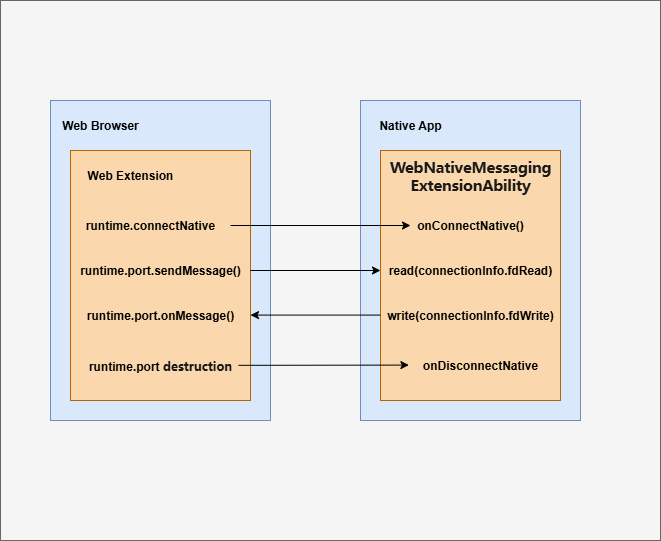
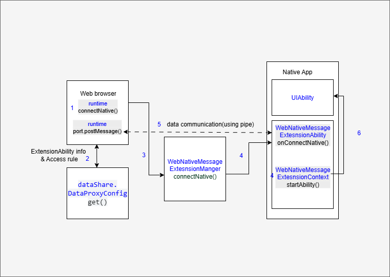

# 使用WebNativeMessagingExtensionAbility组件实现浏览器扩展和应用通信场景
<!--Kit: ArkWeb-->
<!--Subsystem: Web-->
<!--Owner: @libing23232323-->
<!--Designer: @libing23232323-->
<!--Tester: @ghiker-->
<!--Adviser: @HelloShuo-->

## 概述

浏览器的扩展程序（extension）支持与系统上安装的应用交换消息，应用向扩展提供服务，帮助扩展实现一些应用才具备的能力，常见的例子是密码管理器：应用负责存储和加密你的密码信息，以便浏览器扩展程序自动填充网页中的表单字段。

从API version 21开始，支持开发者在应用中使用[WebNativeMessagingExtensionAbility](../reference/apis-arkweb/arkts-apis-web-webNativeMessagingExtensionAbility.md)组件，为浏览器扩展提供后台服务能力。

浏览器扩展通过[WebExtensions runtime API](https://developer.mozilla.org/zh-CN/docs/Mozilla/Add-ons/WebExtensions/API/runtime)连接WebNativeMessagingExtensionAbility，双方通信是通过共享pipe文件描述符后调用IO接口实现。




> **说明**
>
> 本文将浏览器扩展调用WebExtension接口runtime.connectNative建立的连接称为NativeMessaging连接。
>
> NativeMessaging面向两类开发者：应用开发者和浏览器应用开发者。两者均需要了解WebNativeMessagingExtensionAbility运作机制，但关注的场景和接口不同。应用开发者关注[WebNativeMessagingExtensionAbility](../reference/apis-arkweb/arkts-apis-web-webNativeMessagingExtensionAbility.md)组件的使用，负责相关业务开发；浏览器应用开发者负责建立NativeMessaging连接，关注[WebNativeMessagingExtensionManager](../reference/apis-arkweb/arkts-apis-web-webNativeMessagingExtensionManager.md)相关接口。
>
> 本文会在具体的描述中，特意标注需要哪类开发者关注。

## 约束与限制

### 设备限制

对于API版本21-23，WebNativeMessagingExtensionAbility组件仅支持2in1设备；从API版本24开始，增加支持在平板上使用。

### 规格限制

- WebNativeMessagingExtensionAbility组件无需额外权限，允许任意三方应用集成使用，但拉起方（浏览器）需申请ACL权限（ohos.permission.WEB_NATIVE_MESSAGING）。此权限仅对浏览器类应用开放。

- WebNativeMessagingExtensionAbility组件内不支持调用[Window](../reference/apis-arkui/arkts-apis-window.md)相关API。

- WebNativeMessagingExtensionAbility仅支持拉起本应用的[UIAbility](../reference/apis-ability-kit/js-apis-app-ability-uiAbility.md)，不支持拉起其他应用UIAbility或者其他类型ExtensionAbility。

- WebNativeMessagingExtensionAbility仅用于浏览器扩展与应用通信场景，不支持如后台服务等其他场景使用。

## 运作机制

### 整体流程


- **流程：**
1. **浏览器扩展**调用runtime.connectNative接口传入应用包名，来创建NativeMessaging连接。
2. **浏览器应用**调用[dataShare](../database/share-config.md)获取应用配置信息，包括WebNativeMessagingExtension的名称，和限制访问规则（是否允许某个扩展访问该WebNativeMessagingExtension）。
3. **浏览器应用**创建两组pipe作为收发双向通道，调用[WebNativeMessagingExtensionManager.connectNative](../reference/apis-arkweb/arkts-apis-web-webNativeMessagingExtensionManager.md#webnativemessagingextensionmanagerconnectnative)接口，拉起WebNativeMessagingExtension并创建一条NativeMessaging连接，并将pipe的收发文件描述符作为参数传输过去。
4. **应用**WebNativeMessagingExtensionAbility被拉起，[WebNativeMessagingExtensionAbility.onConnectNative](../reference/apis-arkweb/arkts-apis-web-webNativeMessagingExtensionAbility.md#onconnectnative)生命周期回调触发，获取pipe的文件描述符。
5. **应用**监听读端的文件描述符，获取浏览器扩展发过来的消息指令，并通过写端的文件描述符发送回去。
6. **应用**使用[WebNativeMessagingExtensionContext.startAbility](../reference/apis-arkweb/arkts-apis-web-webNativeMessagingExtensionContext.md#startability)拉起本应用的UIAbility图形界面。

> **说明**
>
> WebNativeMessagingExtensionAbility为单实例独立进程，多次调用connectNative接口仅拉起一个实例，同时触发多次onConnectNative回调，需要**应用**管理多会话场景。
>

### dataShare存放应用extension配置信息
应用集成WebNativeMessagingExtensionAbility时，需要通过dataShare能力向浏览器应用提供extension配置。该配置用于浏览器应用判断允许访问的扩展及指定要拉起的WebNativeMessagingExtensionAbility名称。

extension配置采用json字符串格式
- abilityName属性：字符串，WebNativeMessagingExtensionAbility名称，用于填充want中abilityName字段，一个应用仅有一个WebNativeMessagingExtensionAbility。
- allowed_origins属性：数组，允许访问该WebNativeMessagingExtensionAbility的浏览器扩展url信息，可以配置多条，不同浏览器的扩展有不同的scheme协议，例如华为浏览器使用chrome-extension协议头。

extension配置格式：
```json5
{
  // 应用包名
  "name": "com.example.myapplication",
  // 具体描述
  "description": "Send message to native app.",
  /*
   * WebNativeMessagingExtensionAbility名称，用于元能力want填充abilityName，一个应用应只有一个
   * WebNativeMessagingExtensionAbility
   */
  "abilityName": "webExtensionAbility",
  /*
   * 允许访问该WebNativeMessagingExtensionAbility的浏览器扩展url信息，不同的浏览器的扩展有不同的scheme协议，华为浏览器使用chrome-extension协议头
   */
  "allowed_origins":[
    "chrome-extension://knldjmfmopnpolahpmmgbagdohdnhkik/"
  ]
   }
   ```

5. 在工程Module对应的[module.json5配置文件](../quick-start/module-configuration-file.md)中配置crossAppSharedConfig，定义共享配置项，共享配置文件需放置在工程resources/base/profile目录下，并通过$资源访问方式引用。
   ```json
   {
     "module": {
       "crossAppSharedConfig": "$profile:shared_config"
     }
   }
   ```

6. 在shared_config.json添加[extension配置](#datashare存放应用extension配置信息)。

   ```json5
   {
     "crossAppSharedConfig": [
       // ...
       {
         // uri固定格式，datashareproxy://[包名]/browserNativeMessagingHosts，浏览器应用通过该uri获取的value，即extension配置。
         "uri": "datashareproxy://com.example.app/browserNativeMessagingHosts",
         // extension配置，格式参考extension配置章节的格式，注意转义字符
         "value": "{\"name\": \"com.example.myapplication\",\"description\": \"Send message to native app.\",\"abilityName\": \"MyWebNativeMessageExtAbility\", \"allowed_origins\":[\"chrome-extension://knldjmfmopnpolahpmmgbagdohdnhkik/\"]}",
         "allowList": [
           // 允许访问的应用appIdentifier, 这里加入具体浏览器的appIdentifier
           "1234567890123456789"
         ]
       }
     ]
   }
   ```
### 实现拉起WebNativeMessagingExtensionAbility（浏览器开发者）
浏览器负责实现扩展runtime接口，拉起WebNativeMessagingExtensionAbility，建立和管理NativeMessaging连接。需要申请权限：ohos.permission.WEB_NATIVE_MESSAGING。

1. 当接收到创建NativeMessaging连接时，先通过[应用间配置共享接口](../reference/apis-arkdata/js-apis-data-dataShare.md#get20)获取目标应用的extension配置。然后读取WebNativeMessagingExtensionAbility名称和允许访问的扩展列表。最后校验是否允许访问。
    ArkTS-Dyn示例：
``` TypeScript
   import { dataShare } from '@kit.ArkData';

   interface ExtensionConfig {
     abilityName:string;
     allowed_origins:string[];
   }
 
   async function getManifestData(bundleName:string, connectExtensionOrigin:string) {
     try {
      // 调用dataShare接口获取extension配置
       const dsProxyHelper = await dataShare.createDataProxyHandle();
       const urisToGet = [`datashareproxy://${bundleName}/browserNativeMessagingHosts`];
       const config : dataShare.DataProxyConfig = {
         type: dataShare.DataProxyType.SHARED_CONFIG,
       };
       const results = await dsProxyHelper.get(urisToGet, config);
       let foundValid = false;
       for (let i = 0; i < results.length; i++) {
         try {
           const result = results[i];
           const json = result.value;
           if (typeof json !== "string") {
             continue;
           }
           let jsonStr:string = json as string;
           let info:ExtensionConfig = JSON.parse(jsonStr);
           if (info.abilityName) {
             console.info('Native message json info is ok');
             if (!Array.isArray(info.allowed_origins)) {
               info.allowed_origins = [info.allowed_origins];
             }
             if (!info.allowed_origins.includes(connectExtensionOrigin)) {
               console.error('Origin not allowed, continue searching');
               continue;
             }
             foundValid = true;
             break;
           }
         } catch (error) {
           console.error('NativeMessage JSON parse error:', error);
         }
       }
       if (!foundValid) {
         console.error('NativeMessage JSON no valid manifest found');
       } else {
         console.info('NativeMessage allowed_origins match ok');
       }
     } catch (error) {
       console.error('Error getting config:', error);
     }
   }
   ```

   ArkTS-Sta示例：
``` TypeScript
    import dataShare from '@ohos.data.dataShare';

    class ExtensionConfig {
      abilityName:string = '';
      allowed_origins:string[] = new Array<string>();
    }

    async function getManifestData(bundleName:string, connectExtensionOrigin:string) {
      try {
        // 调用dataShare接口获取extension配置
        const dsProxyHelper = await dataShare.createDataProxyHandle();
        const urisToGet = [`datashareproxy://${bundleName}/browserNativeMessagingHosts`];
        const config : dataShare.DataProxyConfig = {
          type: dataShare.DataProxyType.SHARED_CONFIG,
        };
        const results = await dsProxyHelper.get(urisToGet, config);
        let foundValid = false;
        for (let i = 0; i < results.length; i++) {
          try {
            const result = results[i];
            const json = result.value;
            if (typeof json !== "string") {
              continue;
            }
            let jsonStr:string = json as string;
            let parameters : Record<string, Any> = {
              "abilityName":"",
              'allowed_origins': new Array<string>(),
            }
            let info:ExtensionConfig = new ExtensionConfig();
            info.abilityName = parameters['abilityName'] as string;
            info.allowed_origins = parameters['allowed_origins'] as string[];
            Object.assign(parameters, jsonStr);
            // let info:ExtensionConfig = JSON.parse(jsonStr,  new ExtensionConfig());
            if (info.abilityName) {
              console.info('Native message json info is ok');
              if (!Array.isArray(info.allowed_origins)) {
                info.allowed_origins = [info.allowed_origins[0]];
              }
              if (!info.allowed_origins.includes(connectExtensionOrigin)) {
                console.error('Origin not allowed, continue searching');
                continue;
              }
              foundValid = true;
              break;
            }
          } catch (error) {
            console.error('NativeMessage JSON parse error:', error);
          }
        }
        if (!foundValid) {
          console.error('NativeMessage JSON no valid manifest found');
        } else {
          console.info('NativeMessage allowed_origins match ok');
        }
      } catch (error) {
        console.error('Error getting config:', error);
      }
    }
```

2. 调用[webNativeMessagingExtensionManager.connectNative](../reference/apis-arkweb/arkts-apis-web-webNativeMessagingExtensionManager.md#webnativemessagingextensionmanagerconnectnative)创建NativeMessaging连接，如WebNativeMessagingExtensionAbility尚未运行，该接口则会拉起ExtensionAbility并触发。

    ArkTS-Dyn示例：
``` TypeScript
   import { UIAbility, Want, common } from '@kit.AbilityKit';
   import { webNativeMessagingExtensionManager } from '@kit.ArkWeb'

   class ConnectionCallback implements webNativeMessagingExtensionManager.WebExtensionConnectionCallback {
     onConnect(connection:webNativeMessagingExtensionManager.ConnectionNativeInfo) {
       // connected
       console.error(`onConnect id ${connection.connectionId} is connected`);
     }
     onDisconnect(connection:webNativeMessagingExtensionManager.ConnectionNativeInfo) {
       // disconnect
       console.error(`onDisconnect id ${connection.connectionId} is connected`);
     }
     onFailed(code:webNativeMessagingExtensionManager.NmErrorCode, errMsg:string) {
       console.error(`onFailed error code is ${code}, errMsg is ${errMsg}`);
     }
   }

   function connectNative(abilityContext: common.UIAbilityContext, bundleName: string, abilityName: string,
     connectExtensionOrigin: string, readPipe: number, writePipe: number) : void {
     try {
       let wantInfo:Want = {
         bundleName: bundleName,
         abilityName: abilityName,
         parameters: {
           'ohos.arkweb.messageReadPipe': { 'type': 'FD', 'value': readPipe },
           'ohos.arkweb.messageWritePipe': { 'type': 'FD', 'value': writePipe },
           'ohos.arkweb.extensionOrigin': connectExtensionOrigin
         },
       };

       let options : ConnectionCallback = new ConnectionCallback;
       let connectId = webNativeMessagingExtensionManager.connectNative(abilityContext, wantInfo, options);
       console.info(`innerWebNativeMessageManager  connectionId : ${connectId}` );
     } catch (error) {
       console.info(`inner callback error Message: ${JSON.stringify(error)}`);
     }
   }
   ```
   ArkTS-Sta示例：
``` TypeScript
    import UIAbility from '@ohos.app.ability.UIAbility';
    import Want from '@ohos.app.ability.Want';
    import common from '@ohos.app.ability.common';
    import webNativeMessagingExtensionManager from '@ohos.web.webNativeMessagingExtensionManager';

    class ConnectionCallback implements webNativeMessagingExtensionManager.WebExtensionConnectionCallback {
      onConnect(connection:webNativeMessagingExtensionManager.ConnectionNativeInfo) {
        // connected
        console.error(`onConnect id ${connection.connectionId} is connected`);
      }
      onDisconnect(connection:webNativeMessagingExtensionManager.ConnectionNativeInfo) {
        // disconnect
        console.error(`onDisconnect id ${connection.connectionId} is connected`);
      }
      onFailed(code:webNativeMessagingExtensionManager.NmErrorCode, errMsg:string) {
        console.error(`onFailed error code is ${code}, errMsg is ${errMsg}`);
      }
    }

    function connectNative(abilityContext: common.UIAbilityContext, bundleName: string, abilityName: string,
      connectExtensionOrigin: string, readPipe: number, writePipe: number) : void {
      try {

        let parameters = new Record<string, Object>();
        parameters.set("ohos.arkweb.messageReadPipe", readPipe)
        parameters.set("ohos.arkweb.messageWritePipe", writePipe)
        parameters.set("ohos.arkweb.extensionOrigin", connectExtensionOrigin)
        let wantInfo:Want = {
          bundleName: bundleName,
          abilityName: abilityName,
          parameters: parameters,
        };

        let options : ConnectionCallback = new ConnectionCallback;
        let connectId = webNativeMessagingExtensionManager.connectNative(abilityContext, wantInfo, options);
        console.info(`innerWebNativeMessageManager  connectionId : ${connectId}` );
      } catch (error) {
        console.info(`inner callback error Message: ${JSON.stringify(error)}`);
      }
    }
```

3. 需要销毁NativeMessaging连接时，调用[webNativeMessagingExtensionManager.disconnectNative](../reference/apis-arkweb/arkts-apis-web-webNativeMessagingExtensionManager.md#webnativemessagingextensionmanagerdisconnectnative)。

    ArkTS-Dyn示例：
``` TypeScript
   import { webNativeMessagingExtensionManager } from '@kit.ArkWeb'

   function disconnectNative(connectId: number) : void {
     console.info(`NativeMessageDisconnect start connectionId is ${connectId}`);
     webNativeMessagingExtensionManager.disconnectNative(connectId);
   }
   ```
    ArkTS-Sta示例：
``` TypeScript
    import webNativeMessagingExtensionManager from '@ohos.web.webNativeMessagingExtensionManager';

    function disconnencNative(connectId: int) : void {
      console.info(`NativeMessageDisconnect start connectionId is ${connectId}`);
      webNativeMessagingExtensionManager.disconnectNative(connectId);
    }
```