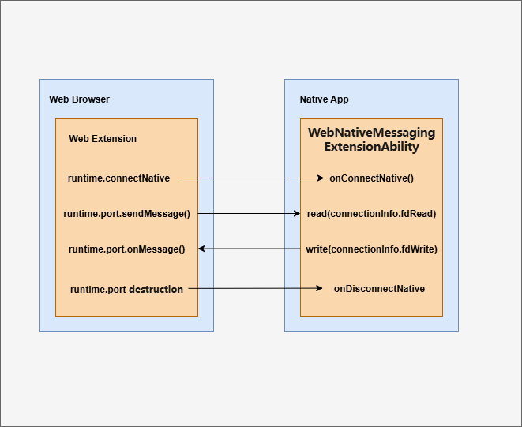
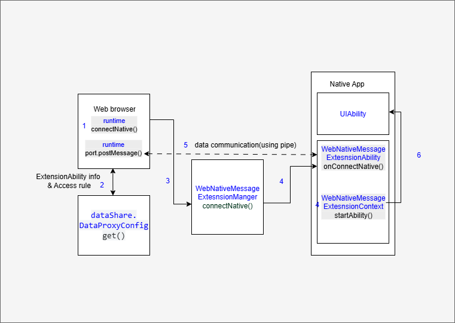

# 使用WebNativeMessagingExtensionAbility组件实现浏览器扩展和原生应用通信场景
<!--Kit: ArkWeb-->
<!--Subsystem: Web-->
<!--Owner: @libing23232323-->
<!--Designer: @libing23232323-->
<!--Tester: @ghiker-->
<!--Adviser: @HelloShuo-->

## 概述

浏览器的扩展程序(extension)支持与系统上安装的原生应用交换消息，原生应用向扩展提供服务，帮助扩展实现一些原生应用才具备的能力，常见的例子是密码管理器：原生应用负责存储和加密你的密码信息，以便浏览器扩展程序自动填充网页中的表单字段。

从API version 21开始，支持开发者在原生应用中使用[WebNativeMessagingExtensionAbility](../reference/apis-arkweb/arkts-apis-web-webNativeMessagingExtensionAbility.md)组件，为浏览器扩展提供后台服务能力。
浏览器扩展通过WebExtensions runtime API连接WebNativeMessagingExtensionAbility，双方通信是通过共享pipe文件描述符后调用IO接口实现。




> **说明**
>
> 本文将浏览器扩展调用WebExtension接口runtime.connectNative建立的连接称为NativeMessaging连接
>
> NativeMessaging面向两类开发者：原生应用开发者和浏览器应用开发者。两者均需要了解WebNativeMessagingExtensionAbility运作机制，但关注的场景和接口不同。原生应用开发者关注[WebNativeMessagingExtensionAbility](../reference/apis-arkweb/arkts-apis-web-webNativeMessagingExtensionAbility.md)组件的使用，负责相关业务开发；浏览器应用开发者负责建立NativeMessaging连接，关注[WebNativeMessagingExtensionManager](../reference/apis-arkweb/arkts-apis-web-webNativeMessagingExtensionManager.md)相关接口。
>
> 本文会在具体的描述中，特意标注需要哪类开发者关注。

## 约束与限制

### 设备限制

WebNativeMessagingExtensionAbility组件当前仅支持2in1设备。

### 规格限制

- WebNativeMessagingExtensionAbility组件无需额外权限，允许任意三方应用集成使用，但拉起方（浏览器）需申请ACL权限（ohos.permission.WEB_NATIVE_MESSAGING）。此权限仅对浏览器类应用开放。

- WebNativeMessagingExtensionAbility组件内不支持调用[window](../reference/apis-arkui/arkts-apis-window.md)相关API。

- WebNativeMessagingExtensionAbility仅支持拉起本应用的UIAbility，不支持拉起其他应用UIAbility或者其他类型ExtensionAbility。

- WebNativeMessagingExtensionAbility仅用于浏览器扩展与原生应用通信场景，不支持如后台服务等其他场景使用。

## 运作机制

### 整体流程


- **流程：**
1. **浏览器扩展**调用runtime.connectNative接口传入原生应用包名，来创建NativeMessaging连接。

2. **浏览器应用**调用[dataShare](../database/share-config.md)获取原生应用配置信息，包括WebNativeMessagingExtension的名称，和限制访问规则（是否允许某个扩展访问该WebNativeMessagingExtension）。

3. **浏览器应用**创建两组pipe作为收发双向通道，调用[WebNativeMessagingExtensionManager.connectNative](../reference/apis-arkweb/arkts-apis-web-webNativeMessagingExtensionManager.md#webnativemessagingextensionmanagerconnectnative)接口，拉起WebNativeMessagingExtension并创建一条NativeMessaging连接，并将pipe的收发文件描述符作为参数传输过去。

4. **原生应用**WebNativeMessagingExtensionAbility被拉起，[WebNativeMessagingExtensionAbility.onConnectNative](../reference/apis-arkweb/arkts-apis-web-webNativeMessagingExtensionAbility.md#onconnectnative)生命周期回调触发，获取pipe的文件描述符。

5. **原生应用**监听读端的文件描述符，获取浏览器扩展发过来的消息指令，并通过写端的文件描述符发送回去。

6. **原生应用**使用[WebNativeMessagingExtensionContext.startAbility](../reference/apis-arkweb/arkts-apis-web-webNativeMessagingExtensionContext.md#startability)拉起本应用的UIAbility图形界面。

> **说明**
>
> WebNativeMessagingExtensionAbility为单实例独立进程，多次调用connectNative接口仅拉起一个实例，同时触发多次onConnectNative回调，需要**原生应用**管理多会话场景。
>

### dataShare存放原生应用extension配置信息
原生应用集成WebNativeMessagingExtensionAbility时，需要通过dataShare能力向浏览器应用提供extension配置。该配置用于浏览器应用判断允许访问的扩展及指定要拉起的WebNativeMessagingExtensionAbility名称。

extension配置采用json字符串格式
- extensionAbility属性：字符串，WebNativeMessagingExtensionAbility名称，用于填充want中abilityName字段，一个原生应用仅有一个WebNativeMessagingExtensionAbility。
- allowed_origins属性：数组，允许访问该WebNativeMessagingExtensionAbility的浏览器扩展url信息，可以配置多条，不同浏览器的扩展有不同的scheme协议，例如华为浏览器使用chrome-extension协议头。

extension配置格式：
```json
{
  /*
   * WebNativeMessagingExtensionAbility名称，用于元能力want填充abilityName，一个应用应只有一个
   * WebNativeMessagingExtensionAbility
   */
  "extensionAbility": "webExtensionAbility",
  /*
   * 允许访问该WebNativeMessagingExtensionAbility的浏览器扩展url信息，不同的浏览器的扩展有不同的scheme协议，华为浏览器使用chrome-extension协议头
   */
  "allowed_origins":[
    "chrome-extension://knldjmfmopnpolahpmmgbagdohdnhkik/"
  ]
}
```
extension配置存放在[dataShare配置项](../database/share-config.md#modulejson5-配置)，uri为固定格式：datashardporxy://[包名]/browserNativeMessagingHosts

### WebNativeMessagingExtensionAbility生命周期管理
- [onConnectNative](../reference/apis-arkweb/arkts-apis-web-webNativeMessagingExtensionAbility.md#onconnectnative)：当浏览器扩展调用一次runtime.connectNative时触发，如果WebNativeMessagingExtensionAbility尚未运行，调用runtime.connectNative会拉起WebNativeMessagingExtensionAbility，并触发该回调。
- [onDisconnectNative](../reference/apis-arkweb/arkts-apis-web-webNativeMessagingExtensionAbility.md#ondisconnectnative)：当浏览器扩展销毁runtime.port时，会触发一次该回调，每条nativeMessaging连接的断开，都会触发一次该回调，当全部连接都断开时，会触发onDestroy的回调后关闭WebNativeMessagingExtensionAbility
- [onDestroy](../reference/apis-arkweb/arkts-apis-web-webNativeMessagingExtensionAbility.md#ondestroy)：当WebNativeMessagingExtensionAbility销毁前触发该回调，全部NativeMessaging连接断开会触发WebNativeMessagingExtensionAbility的销毁。
- [stopNativeConnection](../reference/apis-arkweb/arkts-apis-web-webNativeMessagingExtensionContext.md#stopnativeconnection)：WebNativeMessagingExtensionAbility可以主动断开一条NativeMessaging连接，如果断开的是最后一条连接，则会触发WebNativeMessagingExtensionAbility的销毁。
- [terminateSelf](../reference/apis-arkweb/arkts-apis-web-webNativeMessagingExtensionContext.md#terminateself)：WebNativeMessagingExtensionAbility可以主动退出，触发后会销毁所有NativeMessaging连接。

### 消息格式和限制
NativeMessaging连接使用的具体格式，每个消息都使用 JSON 进行序列化，编码为 UTF-8，并在前面附加 32 位消息长度（采用原生字节顺序）。来自WebNativeMessagingExtensionAbility的单个消息的大小上限为 1 MB，这主要是为了保护浏览器免受行为异常的原生应用影响。发送到WebNativeMessagingExtensionAbility的消息大小上限为 64 MB。

##

### 实现一个connectNative的扩展（原生应用开发者）
> **说明**
>
> 需按w3c标准配置manifest.json和background.js实现通信
>
> 支持使用chrome.runtime.connectNative或chrome.runtime.sendNativeMessage进行连接。

配置插件内容，示例如下发送ping字符串并接收pong响应的插件代码
**实现配置manifest.json**

```json
{
  "name": "com.example.myapplication",
  "version": "1.0.1",
  "description": "Launch APP",
  "manifest_version": 3,
  "permissions": ["nativeMessaging", "tabs", "scripting"], //根据实际场景是否需要进行选择
  "host_permissions": ["http://*/*", "https://*/*", "ftp://*/*", "file://*/*"], //根据实际场景选择
  "background": {
    "service_worker": "background.js" //用于运行插件runtime命令
  },
  "content_scripts": [
    {
      "matches": ["http://*/*", "https://*/*", "ftp://*/*", "file://*/*"], //根据实际场景选择
      "js": ["main.js"] //用于运行插件js命令
    }
  ],
  "action": {
    "default_popup": "index.html" //插件页面展示
  }
}
```

**实现main.js**
```json
// 从html中触发调用
function sendMessageToNative() {
  var message = "ping"; // 发送ping
  chrome.runtime.sendMessage({
    type: "sendMessage",
    message: message
  }, function (response) {});
}
```
**实现配置background.js**

1. 使用chrome.runtime.connectNative链接
``` ts
var port = null;
//监听来自main.js的信息
chrome.runtime.onMessage.addListener(
  function (request, sender, sendResponse) {
    if (request.type == "sendMessage") {
      if (port == null) {
        connectToNativeHost();
      }
      port.postMessage(request.message); //向应用程序发送信息
    }
    return true; //保持消息通道开放
});
function connectToNativeHost() {
  var bundleName = "com.example.app"; //插件对应应用的bundleName
  port = chrome.runtime.connectNative(bundleName); //根据bundleName名得到通信端口port
  port.onMessage.addListener(onNativeMessage); //监听native应用程序是否发来消息
  port.onDisconnect.addListener(onDisconnected); //监听是否断开连接
}
//接收到来自native程序的消息时触发
async function onNativeMessage(message) {
  console.log('接收到从本地应用程序发送来的消息：' + JSON.stringify(message)); //示例中的pong
}
//断开连接时触发
function onDisconnected() {
  port = null;
}
```

2. 使用chrome.runtime.sendNativeMessage链接
``` ts
function sendNativeMessage() {
  var bundleName = "com.example.app"; //插件对应应用的bundleName
  var nativeMessage = "ping"; //插件要发给应用的内容
  chrome.runtime.sendNativeMessage(
    bundleName,
    {message: nativeMessage},
    function(response) {
      // 收到一次应用回复的信息后断开链接
      console.log("sendNativeMessage收到原生应用程序响应:", JSON.stringify(response));
    }
}
```


### 实现一个WebNativeMessagingExtensionAbility（原生应用开发者）
在DevEco Studio工程中手动新建一个WebNativeMessagingExtensionAbility组件，具体步骤如下：
1. 在工程Module对应的ets目录下，右键选择“New &gt; Directory”，新建一个目录并命名为MyWebNativeMessageExtAbility。

2. 在MyWebNativeMessageExtAbility目录，右键选择“New &gt; ArkTS File”，新建一个文件并命名为MyWebNativeMessageExtAbility.ets。

    其目录结构如下所示：

    ```
    ├── ets
    │ ├── MyWebNativeMessageExtAbility
    │ │   ├── MyWebNativeMessageExtAbility.ets
    └
    ```
3. 在MyWebNativeMessageExtAbility.ets文件中，增加导入[WebNativeMessagingExtensionAbility](../reference/apis-arkweb/arkts-apis-web-webNativeMessagingExtensionAbility.md)的依赖包，自定义类继承WebNativeMessagingExtensionAbility组件并实现生命周期回调。
 ```ts
    import { , Want } from '@kit.AbilityKit';
    import { WebNativeMessagingExtensionAbility } from '@kit.ArkWeb';
    import { hilog } from '@kit.PerformanceAnalysisKit';

    const TAG: string = '[MyWebNativeMessageExtAbility]';
    const DOMAIN_NUMBER: number = 0xFF00;

    export default class MyWebNativeMessageExtAbility extends WebNativeMessagingExtensionAbility {
      // 读取扩展发来的消息，并回复
      ReadAsync(fdRead:number, fdWrite:number) : void {
        try {
          let arrayBuffer = new ArrayBuffer(1024);
          let readLen = await fs.read(fdRead, arrayBuffer);
          if (readLen <= 4) {
            hilog.error(DOMAIN_NUMBER, TAG, 'read pipe length failed');
            return;
          }
          hilog.info(DOMAIN_NUMBER, TAG, 'read pipe %{public}s', buffer.from(arrayBuffer, 4, readLen - 4).toString());

          // write back
          let strResponse : string = "pong";
          let bufferLen = strResponse.length;
          const lenBytes = new Uint8Array(4);
          lenBytes[0] = (bufferLen >> 0) & oxFF;
          lenBytes[1] = (bufferLen >> 8) & oxFF;
          lenBytes[2] = (bufferLen >> 16) & oxFF;
          lenBytes[3] = (bufferLen >> 24) & oxFF;
          const writeBuffer = new Uint8Array(4 + bufferLen);
          writeBuffer.set(lenBytes, 4);
          writeBuffer.set(strResponse, 4);
          let writeLen = await fs.write(fdWrite, writeBuffer.buffer);
          hilog.info(DOMAIN_NUMBER, TAG, 'write pipe length %{public}d', writeLen);
        } catch (err) {
          hilog.error(DOMAIN_NUMBER, TAG, 'fs io failed, error code: ' + err.code + " message: " + err.code);
        }
      }

      onConnectNative(info: ConnectionInfo): void {
        hilog.info(DOMAIN_NUMBER, TAG,
            `onConnectNative, connectionId ${info.connectionId} caller bundle: ${info.bundleName}, extension origin: ${info.extensionOrigin}, pipe Read: ${info.fdRead}, pipe write ${info.fdWrite}`);
        ReadAsync(info.fdRead, info.fdWrite)
      }

      onDisconnectNative(info: ConnectionInfo): void {
        hilog.info(DOMAIN_NUMBER, TAG, `onDisconnectNative, connectionId: ${info.abilityName}`);
      }

      onDestroy(): void {
        hilog.info(DOMAIN_NUMBER, TAG, 'onDestroy');
      }
    };
```
4. 在工程Module的[module.json5配置文件](../quick-start/module-configuration-file.md)中注册WebNativeMessagingExtensionAbility组件。设置type标签为“webNativeMessaging”，srcEntry标签指向组件代码路径。

    ```json
    {
      "module": {
        // ...
        "extensionAbilities": [
          {
            "name": "MyWebNativeMessageExtAbility",
            "description": "webNativeMessaging",
            "type": "webNativeMessaging",
            "exported": true,
            "srcEntry": "./ets/MyWebNativeMessageExtAbility/MyWebNativeMessageExtAbility.ets",
            "appIdentifierAllowList": [
              // 此处填写允许启动该后台服务的客户端应用的appIdentifier列表
            ],
          }
        ]
      }
    }
    ```
5. 在工程Module对应的[module.json5配置文件](../quick-start/module-configuration-file.md)中添加[extension配置](#dataShare存放原生应用extension配置信息)

    ```json
    {
      "module": {
        // ...
        "crossAppSharedConfig": [
          // ...
          {
            // uri固定格式，datashardporxy://[包名]/browserNativeMessagingHosts，浏览器应用通过该uri获取的value，即extension配置。
            "uri": "datashareproxy://com.example.app/browserNativeMessagingHosts",
            // extension配置，格式参考extension配置章节的格式，注意转义字符
            "value": "{\"extensionAbility\": \"MyWebNativeMessageExtAbility\", \"allowed_origins\":[\"chrome-extension://knldjmfmopnpolahpmmgbagdohdnhkik/\"]}",
            "allowList": [
              // 允许访问的应用appIdentifier, 这里加入具体浏览器的appIdentifier
              "1234567890123456789"
            ]
          }
        ]
      }
    }
    ```
### 实现拉起WebNativeMessagingExtensionAbility（浏览器开发者）
浏览器负责实现扩展runtime接口，拉起WebNativeMessagingExtensionAbility，建立和管理NativeMessaging连接。

1. 当接收到创建NativeMessaging连接时，先通过[应用间配置共享接口](../reference/apis-arkdata/js-apis-data-dataShare.md#get20)获取目标应用的extension配置。然后读取WebNativeMessagingExtensionAbility名称和允许访问的扩展列表。最后校验是否允许访问。
  ```ts
  async function getManifestData(bundleName, connectExtensionOrigin, callback) {
    try {
      // 调用dataShare接口获取extension配置
      const dsProxyHelper = await dataShare.createDataProxyHandle();
      const urisToGet = [`datashareproxy://${bundleName}/browserNativeMessagingHosts`];
      const config = {
        type: dataShare.DataProxyType.SHARED_CONFIG,
      };
      const results = await dsProxyHelper.get(urisToGet, config);
      let foundValid = false;
      for (let i = 0; i < results.length; i++) {
        try {
          const result = results[i];
          const json = result.value;
          let info = JSON.parse(json);
          if (info.extensionAbility) {
            console.info('Native message json info is ok');
            if (!Array.isArray(info.allowed_origins)) {
              info.allowed_origins = [info.allowed_origins];
            }
            if (!info.allowed_origins.includes(connectExtensionOrigin)) {
              console.error('Origin not allowed, continue searching');
              continue;
            }
            foundValid = true;
            callback(info);
            break;
          }
        } catch (error) {
          console.error('NativeMessage JSON parse error:', error);
        }
      }
      if (!foundValid) {
        console.error('NativeMessage JSON no valid manifest found');
        callback(undefined);
      }
    } catch (error) {
        callback(undefined);
        console.error('Error getting config:', error);
    }
  }
  ```
2. 调用[webNativeMessagingExtensionManager.connectNative](../reference/apis-arkweb/arkts-apis-web-webNativeMessagingExtensionManager.md#webnativemessagingextensionmanagerconnectnative)创建NativeMessage，如WebNativeMessagingExtensionAbility尚未运行，该接口则会拉起ExtensionAbility并触发。
  ```ts
    function connencNative(abilityContext: UIAbilityContext, bundleName: string,  connectExtensionOrigin: string, readPipe: number, writePipe: number) : void {
      try {
      getManifestData(bundleName, connectExtensionOrigin, callback.result, (result) => {
        try {
        if (!result) {
          console.error(`NativeMessage fnd DateShare is no ${bundleName} config`);
          return;
        }
        let wantInfo = {
          bundleName: bundleName,
          abilityName: result.extensionAbility,
          parameters: {
            'ohos.arkweb.messageReadPipe': { 'type': 'FD', 'value': readPipe },
            'ohos.arkweb.messageWritePipe': { 'type': 'FD', 'value': writePipe },
            'ohos.arkweb.extensionOrigin': connectExtensionOrigin
          },
        };
        let options = {
          onConnect(connection) {
            // connected
            console.error(`onConnect id ${connection.connectionId} is connected`);
          },
          onDisconnect(connection) {
            // disconnect
            console.error(`onDisconnect id ${connection.connectionId} is connected`);
          },
          onFailed(code) {
            console.error(`onFailed error code is ${code}`);
          }
        };
        let connectId = webNativeMessagingExtensionManager.connectNative(abilityContext, wantInfo, options);
        console.log(`innerWebNativeMessageManager  connectionId : ${connectId}` );
      } catch (error) {
        console.log(`inner callback error Message: ${JSON.stringify(err)}`);
      }
      });
    } catch (err) {
      console.log(`innerWebNativeMessageManager Message: ${JSON.stringify(err)}`);
    }
  }
  ```

3. 需要销毁NativeMessaging连接时，调用[webNativeMessagingExtensionManager.disconnectNative](../reference/apis-arkweb/arkts-apis-web-webNativeMessagingExtensionManager.md#webnativemessagingextensionmanagerdisconnectnative)。
  ```ts
  function disconnencNative(connectId: number) : void {
    console.log(`NativeMessageDisconnect start connectionId is ${connectId}`);
    webNativeMessagingExtensionManager.disconnectNative(connectId);
  }
  ```
