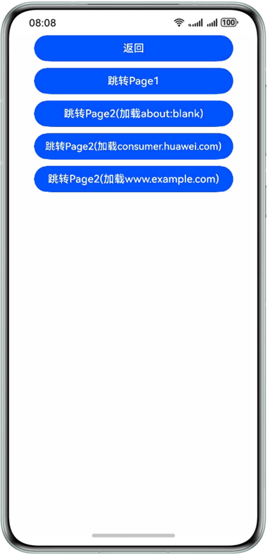
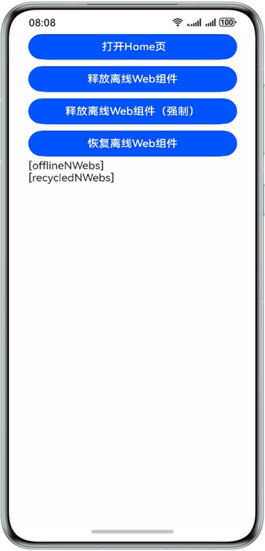

# 使用离线Web组件
<!--Kit: ArkWeb-->
<!--Subsystem: Web-->
<!--Owner: @wang-yanhan-->
<!--Designer: @qianlf-->
<!--Tester: @ghiker-->
<!--Adviser: @HelloShuo-->

Web组件能够实现在不同窗口的组件树上进行挂载或移除操作，这一能力使得开发者可以预先创建Web组件，从而实现性能优化。例如，Tab页为Web组件时，页面预先渲染，便于即时显示。

离线Web组件基于自定义占位组件[NodeContainer](../reference/apis-arkui/arkui-ts/ts-basic-components-nodecontainer.md)实现。基本原理是构建支持命令式创建的Web组件，此类组件创建后不会立即挂载到组件树中，状态为Hidden和Inactive，因此不会立即对用户呈现。开发者可以在后续使用中按需动态挂载这些组件，以实现更灵活的使用方式。

使用离线Web组件可以预启动渲染进程和预渲染Web页面。

- 预启动渲染进程：在未进入Web页面时，提前创建空Web组件，启动Web的渲染进程，为后续使用做好准备。
- 预渲染Web页面：在Web页面启动或跳转的场景下，预先在后台创建Web组件，加载数据并完成渲染，从而在Web页面启动或跳转时实现快速显示。

## 整体架构

如下图所示，在需要离屏创建Web组件时，定义一个自定义组件以封装Web组件，此Web组件在离线状态下被创建，封装于无状态的[NodeContainer](../reference/apis-arkui/arkui-ts/ts-basic-components-nodecontainer.md)节点中，并与相应的[NodeController](../reference/apis-arkui/js-apis-arkui-nodeController.md)组件绑定。Web组件在后台预渲染完毕后，当需要展示时，通过[NodeController](../reference/apis-arkui/js-apis-arkui-nodeController.md)将其挂载到ViewTree的[NodeContainer](../reference/apis-arkui/arkui-ts/ts-basic-components-nodecontainer.md)中，即与对应的[NodeContainer](../reference/apis-arkui/arkui-ts/ts-basic-components-nodecontainer.md)组件绑定，即可挂载上树并显示。


## 创建离线Web组件

本示例展示了如何预先创建离线Web组件，并在需要的时候进行挂载和显示。在后续内容中，预启动渲染进程和预渲染Web页面作为性能优化措施，均利用离线Web组件实现。

> **说明：**
>
> 创建Web组件将占用内存（每个Web组件大约200MB）和计算资源，建议避免一次性创建大量离线Web组件，以减少资源消耗。

<!-- @[entry_ability_window_stage_created_after_specified_page_loaded](https://gitcode.com/openharmony/applications_app_samples/blob/master/code/DocsSample/ArkWeb/UseOfflineWebComp/entry/src/main/ets/entryability/EntryAbility.ets) -->

``` TypeScript
onWindowStageCreate(windowStage: window.WindowStage): void {
  windowStage.loadContent('pages/Index', (err, data) => {
    // 创建Web动态组件（需传入UIContext），loadContent之后的任意时机均可创建
    createNWeb('www.example.com', windowStage.getMainWindowSync().getUIContext());
    if (err.code) {
      return;
    }
  });
}
```
<!--  -->

```ts
// 创建NodeController
// common.ets
import { UIContext, NodeController, BuilderNode, Size, FrameNode } from '@kit.ArkUI';
import { webview } from '@kit.ArkWeb';

// @Builder中为动态组件的具体组件内容
// Data为入参封装类
class Data{
  url: ResourceStr = "https://www.example.com";
  controller: webview.WebviewController = new webview.WebviewController();
}

@Builder
function WebBuilder(data:Data) {
  Column() {
    Web({ src: data.url, controller: data.controller })
      .width("100%")
      .height("100%")
  }
}

let wrap = wrapBuilder<Data[]>(WebBuilder);

// myNodeController需要与NodeContainer一起使用，用于控制和反馈对应的NodeContainer上的节点的行为
export class myNodeController extends NodeController {
  private rootNode: BuilderNode<Data[]> | null = null;
  // 必须要重写的方法，用于构建节点树、返回节点挂载在对应NodeContainer中
  // 在对应NodeContainer创建的时候调用、或者通过rebuild方法调用刷新
  makeNode(uiContext: UIContext): FrameNode | null {
    console.info(" uiContext is undefined : "+ (uiContext === undefined));
    if (this.rootNode != null) {
      // 返回FrameNode节点
      return this.rootNode.getFrameNode();
    }
    // 返回null控制动态组件脱离绑定节点
    return null;
  }
  // 当布局大小发生变化时进行回调
  aboutToResize(size: Size) {
    console.info("aboutToResize width : " + size.width  +  " height : " + size.height );
  }

  // 当controller对应的NodeContainer在Appear的时候进行回调
  aboutToAppear() {
    console.info("aboutToAppear");
  }

  // 当controller对应的NodeContainer在Disappear的时候进行回调
  aboutToDisappear() {
    console.info("aboutToDisappear");
  }

  // 此函数为自定义函数，可作为初始化函数使用
  // 通过UIContext初始化BuilderNode，再通过BuilderNode中的build接口初始化@Builder中的内容
  initWeb(url:ResourceStr, uiContext:UIContext, control:webview.WebviewController) {
    if(this.rootNode != null)
    {
      return;
    }
    // 创建节点，需要uiContext
    this.rootNode = new BuilderNode(uiContext);
    // 创建动态Web组件
    this.rootNode.build(wrap, { url:url, controller:control });
  }
}
// 创建Map保存所需要的NodeController
let NodeMap:Map<ResourceStr, myNodeController | undefined> = new Map();
// 创建Map保存所需要的WebViewController
let controllerMap:Map<ResourceStr, webview.WebviewController | undefined> = new Map();

// 初始化需要UIContext，需在Ability获取
export const createNWeb = (url: ResourceStr, uiContext: UIContext) => {
  // 创建NodeController
  let baseNode = new myNodeController();
  let controller = new webview.WebviewController() ;
  // 初始化自定义Web组件
  baseNode.initWeb(url, uiContext, controller);
  controllerMap.set(url, controller)
  NodeMap.set(url, baseNode);
}
// 自定义获取NodeController接口
export const getNWeb = (url: ResourceStr) : myNodeController | undefined => {
  return NodeMap.get(url);
}
```
<!--  -->
<!-- @[nodeContainer_bind_controller_to_show_dynamic_pages](https://gitcode.com/openharmony/applications_app_samples/blob/master/code/DocsSample/ArkWeb/UseOfflineWebComp/entry/src/main/ets/pages/Index.ets) -->

``` TypeScript
import { getNWeb } from './common'
@Entry
@Component
struct Index {
  build() {
    Row() {
      Column() {
        // NodeContainer用于与NodeController节点绑定，rebuild会触发makeNode
        // Page页通过NodeContainer接口绑定NodeController，实现动态组件页面显示
        NodeContainer(getNWeb('www.example.com'))
          .height('90%')
          .width('100%')
      }
      .width('100%')
    }
    .height('100%')
  }
}
```
<!--  -->

## 预启动渲染进程

在后台预先创建一个Web组件，以启动用于渲染的Web渲染进程，这样可以节省后续Web组件加载时启动Web渲染进程所需的时间。

> **说明：**
>
> 仅在采用单渲染进程模式的应用中，即全局共享一个Web渲染进程时，优化效果显著。Web渲染进程仅在所有Web组件都被销毁后才会终止。因此，建议应用至少保持一个Web组件处于活动状态。
> 创建额外的Web组件会产生内存开销。

示例在onWindowStageCreate时预创建Web组件加载blank页面，提前启动Render进程，从index跳转到index2时，优化了Web渲染进程启动和初始化的耗时。

<!-- @[entry_ability_window_stage_created_after_page_loaded](https://gitcode.com/liveLoad/applications_app_samples/blob/master/code/DocsSample/ArkWeb/UseOfflineWebComp/entry1/src/main/ets/entry1ability/Entry1Ability.ets) -->

``` TypeScript
onWindowStageCreate(windowStage: window.WindowStage): void {
  windowStage.loadContent('pages/Index', (err, data) => {
    // 创建空的Web动态组件（需传入UIContext），loadContent之后的任意时机均可创建
    createNWeb('about：blank', windowStage.getMainWindowSync().getUIContext());
    if (err.code) {
      return;
    }
  });
}
```
<!--  -->

```ts
// 创建NodeController
// common.ets
import { UIContext, NodeController, BuilderNode, Size, FrameNode } from '@kit.ArkUI';
import { webview } from '@kit.ArkWeb';

// @Builder中为动态组件的具体组件内容
// Data为入参封装类
class Data{
  url: ResourceStr = "https://www.example.com";
  controller: webview.WebviewController = new webview.WebviewController();
}

@Builder
function WebBuilder(data:Data) {
  Column() {
    Web({ src: data.url, controller: data.controller })
      .width("100%")
      .height("100%")
  }
}

let wrap = wrapBuilder<Data[]>(WebBuilder);

// myNodeController需要与NodeContainer一起使用，用于控制和反馈对应的NodeContainer上的节点的行为
export class myNodeController extends NodeController {
  private rootNode: BuilderNode<Data[]> | null = null;
  // 必须要重写的方法，用于构建节点树、返回节点挂载在对应NodeContainer中
  // 在对应NodeContainer创建的时候调用、或者通过rebuild方法调用刷新
  makeNode(uiContext: UIContext): FrameNode | null {
    console.info(" uiContext is undefined : "+ (uiContext === undefined));
    if (this.rootNode != null) {
      // 返回FrameNode节点
      return this.rootNode.getFrameNode();
    }
    // 返回null控制动态组件脱离绑定节点
    return null;
  }
  // 当布局大小发生变化时进行回调
  aboutToResize(size: Size) {
    console.info("aboutToResize width : " + size.width  +  " height : " + size.height );
  }

  // 当controller对应的NodeContainer在Appear的时候进行回调
  aboutToAppear() {
    console.info("aboutToAppear");
  }

  // 当controller对应的NodeContainer在Disappear的时候进行回调
  aboutToDisappear() {
    console.info("aboutToDisappear");
  }

  // 此函数为自定义函数，可作为初始化函数使用
  // 通过UIContext初始化BuilderNode，再通过BuilderNode中的build接口初始化@Builder中的内容
  initWeb(url:ResourceStr, uiContext:UIContext, control:webview.WebviewController) {
    if(this.rootNode != null)
    {
      return;
    }
    // 创建节点，需要uiContext 
    this.rootNode = new BuilderNode(uiContext);
    // 创建动态Web组件
    this.rootNode.build(wrap, { url:url, controller:control });
  }
}
// 创建Map保存所需要的NodeController
let NodeMap:Map<ResourceStr, myNodeController | undefined> = new Map();
// 创建Map保存所需要的WebViewController
let controllerMap:Map<ResourceStr, webview.WebviewController | undefined> = new Map();

// 初始化需要UIContext 需在Ability获取
export const createNWeb = (url: ResourceStr, uiContext: UIContext) => {
  // 创建NodeController
  let baseNode = new myNodeController();
  let controller = new webview.WebviewController();
  // 初始化自定义Web组件
  baseNode.initWeb(url, uiContext, controller);
  controllerMap.set(url, controller)
  NodeMap.set(url, baseNode);
}
// 自定义获取NodeController接口
export const getNWeb = (url: ResourceStr) : myNodeController | undefined => {
  return NodeMap.get(url);
}
```
<!--  -->
<!-- @[navigate_to_web_page_pre_start_webview_load](https://gitcode.com/liveLoad/applications_app_samples/blob/master/code/DocsSample/ArkWeb/UseOfflineWebComp/entry1/src/main/ets/pages/Index.ets) -->

``` TypeScript
import router from '@ohos.router';
import { webview } from '@kit.ArkWeb';

@Entry
@Component
struct Index1 {
  WebviewController: webview.WebviewController = new webview.WebviewController();

  build() {
    Column() {
      //已经预启动Render进程 
      Button($r('app.string.Jump_to_Web_Page')).onClick(()=>{
        router.pushUrl({url: 'pages/index2'});
      })
        .width('100%')
        .height('100%')
    }
  }
}
```
<!--  -->

<!-- @[nodeContainer_bind_controller_show_dynamic_pages](https://gitcode.com/liveLoad/applications_app_samples/blob/master/code/DocsSample/ArkWeb/UseOfflineWebComp/entry1/src/main/ets/pages/index2.ets) -->

``` TypeScript
import web_webview from '@ohos.web.webview';

@Entry
@Component
struct index2 {
  webviewController: web_webview.WebviewController = new web_webview.WebviewController();

  build() {
    Row() {
      Column() {
        Web({src: 'www.example.com', controller: this.webviewController})
          .width('100%')
          .height('100%')
      }
      .width('100%')
    }
    .height('100%')
  }
}
```
<!--  -->

## 预渲染Web页面

预渲染Web页面优化方案适用于Web页面启动和跳转场景，例如，进入首页后，跳转到其他子页。建议在高命中率的页面使用该方案。

预渲染Web页面的实现是提前创建离线Web组件，设置Web为Active状态来开启渲染引擎，进行后台渲染。

> **说明：**
>
> 1. 预渲染Web页面时，需要明确加载的资源。
> 2. 由于该方案会将不可见的后台Web设置为Active状态，建议不要预渲染包含自动播放音视频的页面。应用开发者请自行检查和管理页面行为。
> 3. 预渲染的网页会在后台不断进行渲染，建议在预渲染完成后立即停止渲染，以防止发热和功耗问题。可以参考以下示例，使用 [onFirstMeaningfulPaint](../reference/apis-arkweb/arkts-basic-components-web-events.md#onfirstmeaningfulpaint12) 来确定停止时机，该接口适用于http和https网页。

<!-- @[entry_ability_window_stage_created_after_specified_page_loaded](https://gitcode.com/openharmony/applications_app_samples/blob/master/code/DocsSample/ArkWeb/UseOfflineWebComp/entry/src/main/ets/entryability/EntryAbility.ets) -->

``` TypeScript
onWindowStageCreate(windowStage: window.WindowStage): void {
  windowStage.loadContent('pages/Index', (err, data) => {
    // 创建Web动态组件（需传入UIContext），loadContent之后的任意时机均可创建
    createNWeb('www.example.com', windowStage.getMainWindowSync().getUIContext());
    if (err.code) {
      return;
    }
  });
}
```
<!--  -->

```ts
// 创建NodeController
// common.ets
import { UIContext } from '@kit.ArkUI';
import { webview } from '@kit.ArkWeb';
import { NodeController, BuilderNode, Size, FrameNode }  from '@kit.ArkUI';
// @Builder中为动态组件的具体组件内容
// Data为入参封装类
class Data{
  url: string = 'https://www.example.com';
  controller: webview.WebviewController = new webview.WebviewController();
}
// 通过布尔变量shouldInactive控制网页在后台完成预渲染后停止渲染
let shouldInactive: boolean = true;
@Builder
function WebBuilder(data:Data) {
  Column() {
    Web({ src: data.url, controller: data.controller })
      .onPageBegin(() => {
        // 调用onActive，开启渲染
        data.controller.onActive();
      })
      .onFirstMeaningfulPaint(() =>{
        if (!shouldInactive) {
          return;
        }
        // 在预渲染完成时触发，停止渲染
        data.controller.onInactive();
        shouldInactive = false;
      })
      .width("100%")
      .height("100%")
  }
}
let wrap = wrapBuilder<Data[]>(WebBuilder);
// myNodeController需要与NodeContainer一起使用，用于控制和反馈对应的NodeContainer上的节点的行为
export class myNodeController extends NodeController {
  private rootNode: BuilderNode<Data[]> | null = null;
  // 必须要重写的方法，用于构建节点树、返回节点挂载在对应NodeContainer中
  // 在对应NodeContainer创建的时候调用、或者通过rebuild方法调用刷新
  makeNode(uiContext: UIContext): FrameNode | null {
    console.info(" uiContext is undefined : "+ (uiContext === undefined));
    if (this.rootNode != null) {
      // 返回FrameNode节点
      return this.rootNode.getFrameNode();
    }
    // 返回null控制动态组件脱离绑定节点
    return null;
  }
  // 当布局大小发生变化时进行回调
  aboutToResize(size: Size) {
    console.info("aboutToResize width : " + size.width  +  " height : " + size.height )
  }
  // 当controller对应的NodeContainer在Appear的时候进行回调
  aboutToAppear() {
    console.info("aboutToAppear")
    // 切换到前台后，不需要停止渲染
    shouldInactive = false;
  }
  // 当controller对应的NodeContainer在Disappear的时候进行回调
  aboutToDisappear() {
    console.info("aboutToDisappear")
  }
  // 此函数为自定义函数，可作为初始化函数使用
  // 通过UIContext初始化BuilderNode，再通过BuilderNode中的build接口初始化@Builder中的内容
  initWeb(url:string, uiContext:UIContext, control:webview.WebviewController) {
    if(this.rootNode != null)
    {
      return;
    }
    // 创建节点，需要uiContext
    this.rootNode = new BuilderNode(uiContext)
    // 创建动态Web组件
    this.rootNode.build(wrap, { url:url, controller:control })
  }
}
// 创建Map保存所需要的NodeController
let NodeMap:Map<string, myNodeController | undefined> = new Map();
// 创建Map保存所需要的WebViewController
let controllerMap:Map<string, webview.WebviewController | undefined> = new Map();
// 初始化需要UIContext 需在Ability获取
export const createNWeb = (url: string, uiContext: UIContext) => {
  // 创建NodeController
  let baseNode = new myNodeController();
  let controller = new webview.WebviewController() ;
  // 初始化自定义Web组件
  baseNode.initWeb(url, uiContext, controller);
  controllerMap.set(url, controller)
  NodeMap.set(url, baseNode);
}
// 自定义获取NodeController接口
export const getNWeb = (url : string) : myNodeController | undefined => {
  return NodeMap.get(url);
}
```

<!--  -->
<!-- @[nodeContainer_bind_controller_to_show_dynamic_pages](https://gitcode.com/openharmony/applications_app_samples/blob/master/code/DocsSample/ArkWeb/UseOfflineWebComp/entry/src/main/ets/pages/Index.ets) -->

``` TypeScript
import { getNWeb } from './common'
@Entry
@Component
struct Index {
  build() {
    Row() {
      Column() {
        // NodeContainer用于与NodeController节点绑定，rebuild会触发makeNode
        // Page页通过NodeContainer接口绑定NodeController，实现动态组件页面显示
        NodeContainer(getNWeb('www.example.com'))
          .height('90%')
          .width('100%')
      }
      .width('100%')
    }
    .height('100%')
  }
}
```
<!--  -->

## 复用和释放离线Web组件

通过复用和释放离线Web组件，可以优化内存占用，降低应用因内存占用过高被系统查杀的概率。

> **说明：**
> - 每个窗口推荐只使用一个Web组件。
> - 建议复用离线Web组件。
> - 建议释放不需要的离线Web组件。

### 复用离线Web组件

应用有多个UI页面都需要显示Web内容时，建议复用离线Web组件，减少组件创建和销毁的性能消耗以及创建多个Web组件的内存占用。

**复用方法**：
1. 离线Web组件不再被使用时，调用WebController的loadUrl方法加载about:blank空页面，为下次其他UI页面复用这个离线Web组件做准备。
2. 新UI页面复用这个离线Web组件时，再调用WebController的loadUrl方法加载需要的Web页面。

### 释放离线Web组件

应用退至后台，或者明确在特定时间段内不再需要使用离线Web组件时，建议释放该组件以减少应用的内存占用。

> **说明：**
> - 仅当离线Web组件未绑定到UI页面时，才能释放该组件，否则可能导致`NodeContainer`组件显示空白。
> - 可以通过`NodeController`的`onBind`和`onUnbind`回调来跟踪离线Web组件的绑定状态。

**代码实现：**

<!-- @[manage_dynamic_webview_components_core_functions](https://gitcode.com/openharmony/applications_app_samples/blob/master/code/DocsSample/ArkWeb/UseOfflineWebComp/entry3/src/main/ets/pages/Common.ets) -->

``` TypeScript
// 创建Map保存所需要的NodeController
let nodeMap: Map<ResourceStr, MyNodeController | undefined> = new Map();

// 创建保存uiContext的全局变量
let globalUiContext: UIContext | undefined = undefined;

// 创建Set保存已释放的离线组件url信息
let recycledNWebs: Set<ResourceStr> = new Set()

// 初始化需要UIContext 需在Ability获取
export const createNWeb = (url: ResourceStr, uiContext: UIContext) => {
  // 创建NodeController
  console.info('createNWeb, url = ' + url);
  if (!globalUiContext) {
    globalUiContext = uiContext;
  }
  if (getNWeb(url)) {
    console.info('createNWeb, already exit this node, url:' + url);
    return;
  }

  let baseNode = new MyNodeController();
  // 初始化自定义Web组件
  baseNode.initWeb(url, uiContext);
  nodeMap.set(url, baseNode);
  recycledNWebs.delete(url);
}

// 自定义释放/回收离线Web组件的接口，可作为释放离线Web组件函数使用，释放成功返回true
// 当离线组件没有被NodeContainer绑定时，允许安全释放，否则节点在不重绘时会显示空白
export const recycleNWeb = (url: ResourceStr, force: boolean = false): boolean => {
  console.info('recycleNWeb, url = ' + url);
  let baseNode = nodeMap.get(url);
  if (!baseNode) {
    console.info('no such node, url = ' + url);
    return false;
  }
  if (!force && baseNode.isBound()) {
    console.info('the node is in bound and not force, can not delete');
    return false;
  }
  baseNode.rootNode?.dispose();
  baseNode.rebuild();
  nodeMap.delete(url);
  recycledNWebs.add(url);
  return true;
}

// 自定义释放所有离线Web组件的接口
export const recycleNWebs = (force: boolean = false) => {
  nodeMap.forEach((_node: MyNodeController | undefined, url: ResourceStr) => {
    recycleNWeb(url, force);
  });
}

// 自定义恢复之前释放离线Web组件的接口
export const restoreNWebs = (uiContext: UIContext | undefined = undefined) => {
  if (!uiContext) {
    uiContext = globalUiContext;
  }
  for (let url of recycledNWebs) {
    if (uiContext) {
      createNWeb(url, uiContext);
    }
  }
  recycledNWebs.clear()
}
```
<!--  -->

### 复用和释放离线Web组件完整示例

**示例功能说明**

本示例演示了如何复用和释放离线Web组件，以及如何执行预渲染。需要注意的是，示例中使用了多个离线Web组件，这仅用于完整演示相关功能和离线Web组件的使用方法，原则上每个窗口推荐只使用一个Web组件。示例主要演示了以下功能：

1. 对比离线Web组件执行预渲染和不执行预渲染的效果。
2. 在应用退后台时，释放离线Web组件的具体实现步骤。
3. 复用离线Web组件的具体实现步骤。

示例演示了如何让应用退后台释放离线Web组件以及切前台恢复离线Web组件，在UIAbility的onBackground和onForeground回调中分别进行了离线Web组件的释放和恢复。 

<!-- @[entry_ability_on_background_and_foreground_to_recycle_and_restore_NWebs](https://gitcode.com/openharmony/applications_app_samples/blob/master/code/DocsSample/ArkWeb/UseOfflineWebComp/entry3/src/main/ets/entry3ability/Entry3Ability.ets) -->

``` TypeScript
onForeground(): void {
  // Ability has brought to foreground
  hilog.info(0x0000, 'testTag', '%{public}s', 'Ability onForeground');
  restoreNWebs()
}

onBackground(): void {
  // Ability has back to background
  hilog.info(0x0000, 'testTag', '%{public}s', 'Ability onBackground');
  recycleNWebs()
}
```

<!--  -->

**UI页面功能说明**

示例包括Index页面、Home页面、Page1页面和Page2页面4个UI页面，其中每个UI页面的核心功能如下：

* Index页面作为入口页面，演示页面跳转、离线Web组件的回收，恢复及统计信息展示。
  * 用于跳转至Home页面的按钮；
  * 回收离线Web组件按钮（仅回收没有被绑定的离线Web组件）。
  * 强制回收离线Web组件按钮（演示强制回收所有离线Web组件，包括已绑定和未绑定的组件，会导致对应的NodeContainer白屏）。
  * 恢复离线Web组件按钮。
  * 显示离线Web组件的数量、状态及URL等详细信息。
* Home页面为UI主页，演示离线Web组件的创建，预渲染的执行方法和时机：
  * 页面在创建时会创建3个离线组件，其中一个加载指定网页并进行预渲染，另外两个为空白离线Web组件。
  * 页面提供导航按钮用于跳转至Page1或Page2页面。
* Page1页面同时显示了两个Web页面，每个页面使用了一个离线Web组件，加载并显示相同URL的内容。该页面用于演示预渲染与不预渲染的效果对比，以及如何复用离线组件。
  * 第一个离线Web组件执行了预渲染，可以直接显示页面内容，比第二个离线Web组件更快。 
  * 第二个离线Web组件是复用空闲的离线Web组件，其在UI页面的aboutToAppear的生命周期中动态加载这个url。

  

* Page2页面显示单个Web页面，使用复用空闲离线Web组件的方式加载指定url。
  * Page2页面可以通过传入参数加载指定url，并允许用户在加载后跳转到其他url。
  * Page2会在NavDestination的onWillHide回调中，让当前Web组件加载空白页并取消与当前UI的关联，为下次复用做准备。
  * Page2页面支持嵌套，即使有多层UI页面嵌套，由于采用复用离线Web组件的方式，Web组件数量不会增加。



**完整示例**

[复用和释放离线Web组件示例代码](https://gitcode.com/openharmony/applications_app_samples/tree/master/code/DocsSample/ArkWeb/UseOfflineWebComp/entry3)


## 常见白屏问题排查

1.排查应用上网权限配置。

检查是否已在module.json5中添加网络权限，添加方法请参考在[在配置文件中声明权限](../security/AccessToken/declare-permissions.md#在配置文件中声明权限)。

<!-- @[add_network_permission](https://gitcode.com/liveLoad/applications_app_samples/blob/master/code/DocsSample/ArkWeb/UseOfflineWebComp/entry2/src/main/module.json5) -->

``` JSON5
"requestPermissions":[
  {
    "name" : "ohos.permission.INTERNET"
  }
],
```

2.排查[NodeContainer](../reference/apis-arkui/arkui-ts/ts-basic-components-nodecontainer.md)与节点绑定的逻辑。

检查节点是否已上组件树，建议在已有的Web组件上方加上Text（请参考以下例子），如果白屏的时候没有出现Text，建议检查[NodeContainer](../reference/apis-arkui/arkui-ts/ts-basic-components-nodecontainer.md)与节点绑定的情况。

```ts
@Builder
function WebBuilder(data:Data) {
  Column() {
    Text('test')
    Web({ src: data.url, controller: data.controller })
      .width("100%")
      .height("100%")
  }
}
```

3.排查Web可见性状态。

如果整个节点已上树，可通过日志[WebPattern::OnVisibleAreaChange](../reference/apis-arkui/arkui-ts/ts-universal-component-visible-area-change-event.md#onvisibleareachange)查看Web组件可见性状态是否正确，不可见的Web组件可能会造成白屏。