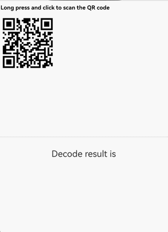

# 使用Web组件菜单处理网页内容
<!--Kit: ArkWeb-->
<!--Subsystem: Web-->
<!--Owner: @zourongchun-->
<!--Designer: @zhufenghao-->
<!--Tester: @ghiker-->
<!--Adviser: @HelloShuo-->
菜单作为用户交互的关键组件，其作用是构建清晰的导航体系，通过结构化布局展示功能入口，使用户能够迅速找到目标内容或执行操作。作为人机交互的重要枢纽，它显著提升了Web组件的可访问性和用户体验，是应用设计中必不可少的部分。Web组件菜单类型包括[文本选中菜单](./web_menu.md#文本选中菜单)、[上下文菜单](./web_menu.md#上下文菜单)和[自定义菜单](./web_menu.md#自定义菜单)，应用可根据具体需求灵活选择。
|菜单类型|目标元素|响应类型|是否支持自定义|
|----|----|----|----|
|[文本选中菜单](./web_menu.md#文本选中菜单)|文本|手势长按|可增减菜单项，菜单样式不可自定义|
|[上下文菜单](./web_menu.md#上下文菜单)|超链接、图片、文字|手势长按、鼠标右键|支持通过菜单组件自定义|
|[自定义菜单](./web_menu.md#自定义菜单)|图片|手势长按|支持通过菜单组件自定义|
## 文本选中菜单
Web组件的文本选中菜单是一种通过自定义元素实现的上下文交互组件，当用户选中文本时会动态显示，提供复制、分享、标注等语义化操作，具备标准化功能与可扩展性，是移动端文本操作的核心功能。文本选中菜单在用户长按选中文本或编辑状态下长按出现单手柄时弹出，菜单项横向排列。系统提供默认的菜单实现。应用可通过[editMenuOptions](../reference/apis-arkweb/arkts-basic-components-web-attributes.md#editmenuoptions12)接口对文本选中菜单进行自定义操作。
1. 通过onCreateMenu方法自定义菜单项，通过操作Array<[TextMenuItem](../reference/apis-arkui/arkui-ts/ts-text-common.md#textmenuitem12对象说明)>数组可对显示菜单项进行增减操作，在[TextMenuItem](../reference/apis-arkui/arkui-ts/ts-text-common.md#textmenuitem12对象说明)中定义菜单项名称、图标、ID等内容。
2. 通过onMenuItemClick方法处理菜单项点击事件，当返回false时会执行系统默认逻辑。
3. 创建一个[EditMenuOptions](../reference/apis-arkui/arkui-ts/ts-text-common.md#editmenuoptions)对象，包含onCreateMenu和onMenuItemClick两个方法，通过Web组件的[editMenuOptions](../reference/apis-arkweb/arkts-basic-components-web-attributes.md#editmenuoptions12)方法与Web组件绑定。

  <!-- @[web_textMenuItem](https://gitcode.com/openharmony/applications_app_samples/blob/master/code/DocsSample/ArkWeb/ArkWebMenu/entry/src/main/ets/pages/WebTextMenuItem.ets) -->


  ```html
  <!--index.html-->
  <!DOCTYPE html>
  <html>
    <head>
        <title>测试网页</title>
    </head>
    <body>
      <h1>editMenuOptions Demo</h1>
      <span>edit menu options</span>
    </body>
  </html>
  ```
  
## 上下文菜单
上下文菜单是用户通过特定操作（如右键点击或长按富文本）触发的快捷菜单，用于提供与当前操作对象或界面元素相关的功能选项。菜单项纵向排列。系统未提供默认实现，若应用未实现，则不显示上下文菜单。应用需要创建一个[Menu](../reference/apis-arkui/arkui-ts/ts-basic-components-menu.md)组件并与Web绑定，在菜单弹出时可通过Web组件的[onContextMenuShow](../reference/apis-arkweb/arkts-basic-components-web-events.md#oncontextmenushow9)回调接口获取上下文菜单的详细信息，包括点击位置的HTML元素信息及点击位置信息。

1. [Menu](../reference/apis-arkui/arkui-ts/ts-basic-components-menu.md)组件作为弹出的菜单，包含所有菜单项行为与样式。
2. 使用bindPopup方法将Menu组件与Web组件绑定。当上下文菜单弹出时，将显示创建的Menu组件。
3. 在onContextMenuShow回调中获取上下文菜单事件信息[onContextMenuShowEvent](../reference/apis-arkweb/arkts-basic-components-web-i.md#oncontextmenushowevent12)。其中param为[WebContextMenuParam](../reference/apis-arkweb/arkts-basic-components-web-WebContextMenuParam.md)类型，包含点击位置对应HTML元素信息和位置信息，result为[WebContextMenuResult](../reference/apis-arkweb/arkts-basic-components-web-WebContextMenuResult.md)类型，提供常见的菜单能力。

  <!-- @[web_ContextMenu](https://gitcode.com/openharmony/applications_app_samples/blob/master/code/DocsSample/ArkWeb/ArkWebMenu/entry/src/main/ets/pages/WebContextMenu.ets) -->

```html
<!-- index.html -->
<!DOCTYPE html>
<html lang="en">
<body>
  <h1>onContextMenuShow</h1>
  <a href="http://www.example.com" style="font-size:27px">超链接www.example.com</a>
  <!--example.png为html同目录下图片-->
  <div></div>
  <p>选中文字鼠标右键弹出菜单</p>
</body>
</html>
```

## 自定义菜单
自定义菜单赋予开发者调整菜单触发时机与视觉展现的能力，使应用能够依据用户操作场景动态匹配功能入口，简化开发流程中的界面适配工作，同时使应用交互更符合用户直觉。应用可通过[bindSelectionMenu](../reference/apis-arkweb/arkts-basic-components-web-attributes.md#bindselectionmenu13)接口，实现自定义菜单。目前已额外支持通过长按图片和链接响应自定义菜单。
1. 创建[Menu](../reference/apis-arkui/arkui-ts/ts-basic-components-menu.md)组件作为菜单弹窗。
2. 通过Web组件的[bindSelectionMenu](../reference/apis-arkweb/arkts-basic-components-web-attributes.md#bindselectionmenu13)方法绑定MenuBuilder菜单弹窗。将[WebElementType](../reference/apis-arkweb/arkts-basic-components-web-e.md#webelementtype13)设置为WebElementType.IMAGE，[responseType](../reference/apis-arkweb/arkts-basic-components-web-e.md#webresponsetype13)设置为WebResponseType.LONG_PRESS，表示长按图片时弹出菜单。在[options](../reference/apis-arkweb/arkts-basic-components-web-i.md#selectionmenuoptionsext13)中定义菜单显示回调onAppear、菜单消失回调onDisappear、预览窗口preview和菜单类型menuType。
  <!-- @[web_BindSelectionMenu](https://gitcode.com/openharmony/applications_app_samples/blob/master/code/DocsSample/ArkWeb/ArkWebMenu/entry/src/main/ets/pages/WebBindSelectionMenu.ets) -->

```html
<!--index.html-->
<!DOCTYPE html>
<html>
  <head>
      <title>测试网页</title>
  </head>
  <body>
    <h1>bindSelectionMenu Demo</h1>
    <!--img.png为html同目录下图片-->
    
  </body>
</html>
```


自API version 20起，支持绑定长按超链接菜单。可以为图片和链接绑定不同的自定义菜单。

以下示例中，PreviewBuilder定义了超链接对应菜单的弹出内容，用Web组件加载了超链接内容，使用[Progress组件](../ui/arkts-common-components-progress-indicator.md)展示了加载进度。

  <!-- @[web_PreviewBuilder](https://gitcode.com/openharmony/applications_app_samples/blob/master/code/DocsSample/ArkWeb/ArkWebMenu/entry/src/main/ets/pages/WebPreviewBuilder.ets) -->

html示例
```html
<html lang="zh-CN"><head>
    <meta charset="UTF-8">
    <meta name="viewport" content="width=device-width, initial-scale=1.0">
    <title>综合信息页面</title>
</head>
<body>
<div>
    <h1>综合信息与联系详情</h1>
    <section>
        <a href="https://www.example.com">EXAMPLE</a>
        <br>
        <a href="https://www.example1.com/">EXAMPLE1</a>
    </section>
</div>
<footer>
    <p>请注意，以上提供的所有网址仅供演示之用。</p>
</footer>
</body>
</html>
```


## Web菜单保存图片
1. 创建MenuBuilder组件作为菜单弹窗，使用[SaveButton](../reference/apis-arkui/arkui-ts/ts-security-components-savebutton.md)组件实现图片保存，通过bindContextMenu将MenuBuilder与Web绑定。
2. 在onContextMenuShow中获取图片url，通过copyLocalPicToDir或copyUrlPicToDir将图片保存至应用沙箱。
3. 通过photoAccessHelper将应用沙箱中的图片保存至图库。

  <!-- @[web_Save_Image](https://gitcode.com/openharmony/applications_app_samples/blob/master/code/DocsSample/ArkWeb/ArkWebMenu/entry/src/main/ets/pages/WebSaveImage.ets) -->

  ```html
<!--index.html-->
<!DOCTYPE html>
<html>
<head>
    <title>SavePicture</title>
</head>
<body>
<h1>SavePicture</h1>
<br>
<br>
<br>
<br>
<br>
<!--startIcon.png为html同目录下图片-->

</body>
</html>
  ```


## Web菜单获取选中文本
Web组件的[editMenuOptions](../reference/apis-arkweb/arkts-basic-components-web-attributes.md#editmenuoptions12)接口中没有提供获取选中文本的方式。开发者可通过[javaScriptProxy](../reference/apis-arkweb/arkts-basic-components-web-attributes.md#javascriptproxy)获取到JavaScript的选中文本，实现自定义菜单的逻辑。
1. 创建SelectClass类，通过[javaScriptProxy](../reference/apis-arkweb/arkts-basic-components-web-attributes.md#javascriptproxy)将SelectClass对象注册到Web组件中。
2. 在Html侧注册选区变更监听器，在选区变更时通过SelectClass对象将选区设置到ArkTS侧。
  
<!-- @[web_EditMenuOptions](https://gitcode.com/openharmony/applications_app_samples/blob/master/code/DocsSample/ArkWeb/ArkWebMenu/entry/src/main/ets/pages/WebEditMenuOptions.ets) -->
 

  ```html
<!DOCTYPE html>
<html>
<head>
    <title>Test Get Select</title>
    <style>
        body {
          margin: 40px;
          background-color: #f4f4f4;
        }
        .edit-container {
          padding: 20px;
          background-color: #fff;
          border-radius: 8px;
          box-shadow: 0 0 10px rgba(0,0,0,0.1);
          margin: auto;
        }
        textarea {
          width: 100%;
          height: 400px;
          font-size: 16px;
          padding: 10px;
          border: 1px solid #ccc;
          border-radius: 4px;
        }
    </style>
</head>
<body>
<div class="edit-container">
    <textarea placeholder="Enter the text here and select it by long pressing."></textarea>
</div>
<script>
    document.addEventListener('selectionchange', () => {
      var selection = window.getSelection();
      if(selection.rangeCount > 0) {
        var selectedText = selection.toString();
        selectObjName.setSelectText(selectedText);
      }
    })
</script>
</body>
</html>
  ```


## Web菜单识别图片二维码
在二维码跳转页面或者付款场景中，开发者可通过实现上下文菜单，获取到[onContextMenuShow](../reference/apis-arkweb/arkts-basic-components-web-events.md#oncontextmenushow9)接口中的二维码图片信息进行处理，提供给用户扫描二维码入口。
1. 创建MenuBuilder组件作为菜单弹窗，通过bindContextMenu将MenuBuilder与Web绑定。
2. 在onContextMenuShow中获取图片url，通过copyLocalPicToDir或copyUrlPicToDir将图片保存至应用沙箱。
3. 通过detectBarcode.decode解析保存在沙箱中的图片，获取到结果。
<!-- @[web_Scan_QR_code](https://gitcode.com/openharmony/applications_app_samples/blob/master/code/DocsSample/ArkWeb/ArkWebMenu/entry/src/main/ets/pages/WebScanQRCode.ets) -->

  ```html
<!--index.html-->
<!DOCTYPE html>
<html>
<head>
    <title>test QR code</title>
</head>
<body>
<h1>Long press and click to scan the QR code</h1>
<!--img.png为二维码图片-->

</body>
</html>
  ```


## 常见问题
### 如何禁用长按选择时弹出菜单
可通过[editMenuOptions](../reference/apis-arkweb/arkts-basic-components-web-attributes.md#editmenuoptions12)接口将系统默认菜单全部过滤，此时无菜单项，则不会显示菜单。

<!-- @[web_Disable_long_press](https://gitcode.com/openharmony/applications_app_samples/blob/master/code/DocsSample/ArkWeb/ArkWebMenu/entry/src/main/ets/pages/WebDisableLongPress.ets) -->

  ```html
<!--index.html-->
<!DOCTYPE html>
<html>
  <head>
      <title>测试网页</title>
  </head>
  <body>
    <h1>editMenuOptions Demo</h1>
    <span>edit menu options</span>
  </body>
</html>
  ```


### 出现选区时手柄菜单不显示
可排查是否通过JS的[selection-api](https://www.w3.org/TR/selection-api/)对选区进行了操作，目前通过这种方式改变选区会导致手柄菜单不显示。

### 如何修改文本选中菜单的样式
目前暂不支持修改文本选中菜单的具体样式。