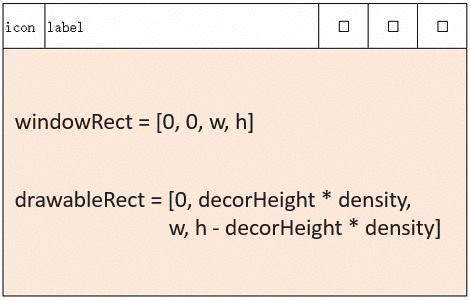
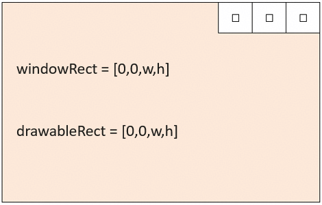

# 应用适配自由窗口

<!--Kit: ArkUI-->
<!--Subsystem: Window-->
<!--Owner: @hanxuebing1-->
<!--Designer: @chengyiyi-->
<!--Tester: @qinliwen0417-->
<!--Adviser: @ge-yafang-->

## 场景介绍

[自由窗口](./freeform-window-overview.md#自由窗口)状态下默认支持窗口大小缩放，且主窗口默认存在标题栏，与非自由窗口存在差异，为避免应用在自由窗口状态下出现界面截断、遮挡或控件叠加等问题，需要应用进行适配。

本章将列举应用可能出现的布局问题，并提供相应的解决方案。

- 应用在自由窗口状态和非自由窗口状态下，如果需要做差异化布局，可通过接口[查询当前窗口是否处于自由窗口状态](#查询当前窗口是否处于自由窗口状态)。

- 窗口被缩小到极致时，应用布局错乱或内容截断，可通过[限制自由窗口尺寸](#限制自由窗口尺寸)，避免过度缩放。

- 窗口尺寸包含了标题栏区域和窗口内的可绘制区域，如果应用是通过获取窗口尺寸进行内容布局，则需要考虑标题栏的尺寸，避免应用布局被标题栏向下挤压，发生内容截断。

- 视频类应用无法全屏播放视频，需要调用接口[自由窗口状态下窗口进入全屏显示](#自由窗口状态下窗口进入全屏显示)。

## 查询当前窗口是否处于自由窗口状态

应用在自由窗口状态和非自由窗口状态下，如果需要做差异化布局，可通过接口查询当前窗口是否处于自由窗口状态。

| 接口 | 功能 | 使用场景 |
| -------- | -------- | -------- |
| [isInFreeWindowMode()](../reference/apis-arkui/arkts-apis-window-Window.md#isinfreewindowmode22) | 查询当前窗口是否处于自由窗口状态 | 检测窗口是否处于自由窗口状态，以便根据实际情况调整布局或功能。 |
| [on('freeWindowModeChange')](../reference/apis-arkui/arkts-apis-window-Window.md#onfreewindowmodechange22) | 开启自由窗口状态变化事件的监听 | 自由窗口状态发生变化时，通知应用，以便根据实际情况调整布局或功能。 |
| [off('freeWindowModeChange')](../reference/apis-arkui/arkts-apis-window-Window.md#offfreewindowmodechange22) | 关闭自由窗口状态变化事件的监听 | 应用退出前关闭状态变化事件的监听。 |

## 限制自由窗口尺寸

自适应布局可以保证窗口尺寸在一定范围内变化时，页面的显示是正常的。当窗口尺寸变化较大时，就需要额外借助响应式布局能力（如断点等）调整页面结构以保证显示正常。通常每个断点都需要开发者精心适配，以获得最佳的显示效果，考虑到设计及开发成本等实际因素的限制，应用不可能适配从零到正无穷的所有窗口宽度。

不同设备或不同设备状态下，系统默认的自由窗口尺寸的调节范围可能不同。开发者可通过以下三种方式限制自由窗口的最大和最小尺寸。

- 通过[setWindowLimits(windowLimits: WindowLimits)](../reference/apis-arkui/arkts-apis-window-Window.md#setwindowlimits11)接口或[setWindowLimits(windowLimits: WindowLimits, isForcible: boolean)](../reference/apis-arkui/arkts-apis-window-Window.md#setwindowlimits15)设置当前应用窗口的尺寸限制。  

  maxWidth：窗口的最大宽度，默认单位为px。

  maxHeight：窗口的最大高度，默认单位为px。

  minWidth：窗口的最小宽度，默认单位为px。

  minHeight：窗口的最小高度，默认单位为px。

  ```ts
  import { UIAbility } from '@kit.AbilityKit';
  import { window } from '@kit.ArkUI';
  export default class EntryAbility extends UIAbility {
    onWindowStageCreate(windowStage: window.WindowStage): void {
      windowStage.loadContent('pages/Index', (err) => {
        let windowClass = windowStage.getMainWindowSync();
        try {
          let windowLimits: window.WindowLimits = {
            maxWidth: 1500,
            maxHeight: 1000,
            minWidth: 600,
            minHeight: 500
          };
          let promise = windowClass.setWindowLimits(windowLimits);
          promise.then((data) => {
            console.info('Succeeded in changing the window limits. Cause:' + JSON.stringify(data));
          }).catch((err: BusinessError) => {
            console.error(`Failed to change the window limits. Cause code: ${err.code}, message: ${err.message}`);
          });
        } catch (exception) {
          console.error(`Failed to change the window limits. Cause code: ${exception.code}, message: ${exception.message}`);
        }
      });
    }
  }
  ```

- 应用在使用[startAbility()](../reference/apis-ability-kit/js-apis-inner-application-uiAbilityContext.md#startability-2)接口拉起主窗口时可通过[StartOptions](../reference/apis-ability-kit/js-apis-app-ability-startOptions.md#startoptions)指定主窗口尺寸限制。  

  minWindowWidth：窗口最小的宽度，单位为vp。

  minWindowHeight：窗口最小的高度，单位为vp。

  maxWindowWidth：窗口最大的宽度，单位为vp。

  maxWindowHeight：窗口最大的高度，单位为vp。

  ```ts
  // ets/entryability/EntryAbility.ets
  import { UIAbility } from '@kit.AbilityKit';
  import { window } from '@kit.ArkUI';
  export default class EntryAbility extends UIAbility {
    onWindowStageCreate(windowStage: window.WindowStage): void {
      windowStage.loadContent('pages/Index', (err) => {});
    }
  }

  // ets/pages/Index.ets
  import { common, StartOptions } from '@kit.AbilityKit';
  @Entry
  @Component
  struct Index {
    private context = this.getUIContext().getHostContext() as common.UIAbilityContext
    build() {
      Row() {
        Row() {
          Button('启动测试窗口')
            .onClick(() => {
              // 定义目标Ability的want参数
              let want: Want = {
                deviceId: '',
                bundleName: 'com.example.myapplication',
                moduleName: 'entry',
                abilityName: 'WindowTestAbility',
              }
              let options: StartOptions = {
                displayId: 0,
                minWindowWidth: 600,
                minWindowHeight: 500,
                maxWindowWidth: 1500,
                maxWindowHeight: 1000,
              };
              try {
                // 启动目标Ability
                this.context.startAbility(want, options, (err: BusinessError) => {
                  if (err.code) {
                    // 处理业务逻辑错误
                    console.error(`startAbility failed, code is ${err.code}, message is ${err.message}`);
                    return;
                  }
                  // 执行正常业务
                  console.info('startAbility succeed');
                });
              } catch (err) {
                // 处理入参错误异常
                let code = (err as BusinessError).code;
                let message = (err as BusinessError).message;
                console.error(`startAbility failed, code is ${code}, message is ${message}`);
              }
            })
        }
      }
      .width('100%')
      .height('100%')
    }
  }

  // ets/windowtestability/WindowTestAbility.ets
  import { window } from '@kit.ArkUI';
  import { UIAbility } from '@kit.AbilityKit';

  export default class WindowTestAbility extends UIAbility {
    onWindowStageCreate(windowStage: window.WindowStage): void {
      // Main window is created, set main page for this ability
      windowStage.loadContent('pages/Index', (err) => {
        if (err.code) {
          console.info(`Failed to load the content. Cause: ${JSON.stringify(err)}`);
          return;
        }
        console.info('Succeeded in loading the content.');
      });
    }
  }

  // ets/module.json5
  {
    "module": {
      "name": "entry",
      "type": "entry",
      "description": "$string:module_desc",
      "mainElement": "EntryAbility",
      "deviceTypes": [
        "phone",
        "tablet",
        "2in1"
      ],
      "deliveryWithInstall": true,
      "installationFree": false,
      "pages": "$profile:main_pages",
      "abilities": [
        {
          "name": "EntryAbility",
          "srcEntry": "./ets/entryability/EntryAbility.ets",
          "description": "$string:EntryAbility_desc",
          "icon": "$media:layered_image",
          "label": "$string:EntryAbility_label",
          "startWindowIcon": "$media:startIcon",
          "startWindowBackground": "$color:start_window_background",
          "exported": true,
          "skills": [
            {
              "entities": [
                "entity.system.home"
              ],
              "actions": [
                "ohos.want.action.home"
              ]
            }
          ]
        },
        {
          "name": "WindowTestAbility",
          "srcEntry": "./ets/windowtestability/WindowTestAbility.ets",
          "icon": "$media:layered_image",
          "startWindowIcon": "$media:startIcon",
          "startWindowBackground": "$color:start_window_background"
        }
      ],
      "extensionAbilities": [
        {
          "name": "EntryBackupAbility",
          "srcEntry": "./ets/entrybackupability/EntryBackupAbility.ets",
          "type": "backup",
          "exported": false,
          "metadata": [
            {
              "name": "ohos.extension.backup",
              "resource": "$profile:backup_config"
            }
          ],
        }
      ]
    }
  }
  ```

- 可通过[module.json5配置文件](../quick-start/module-configuration-file.md#配置文件标签)中的[abilities标签](../quick-start/module-configuration-file.md#abilities标签)限制主窗口处于自由窗口状态下的最大和最小尺寸。

  maxWindowWidth：当前UIAbility组件支持的最大的窗口宽度，单位为vp。

  minWindowWidth：当前UIAbility组件支持的最小的窗口宽度，单位为vp。

  maxWindowHeight：当前UIAbility组件支持的最大的窗口高度，单位为vp。

  minWindowHeight：当前UIAbility组件支持的最小的窗口高度，单位为vp。

  ```json5
  {
    // ...
      "abilities": [
        {
          "name": "EntryAbility",
          "srcEntry": "./ets/entryability/EntryAbility.ets",
          "launchType": "singleton",
          "description": "$string:description_main_ability",
          "icon": "$media:layered_image",
          "label": "$string:EntryAbility_label",
          "permissions": [],
          "metadata": [],
          "exported": true,
          "continuable": true,
          "skills": [
            {
              "actions": [
                "ohos.want.action.home"
              ],
              "entities": [
                "entity.system.home"
              ],
              "uris": []
            }
          ],
          "backgroundModes": [
            "dataTransfer"
          ],
          "startWindowIcon": "$media:icon",
          "startWindowBackground": "$color:red",
          "removeMissionAfterTerminate": true,
          "allowSelfRedirect": true,  // 从API version 23开始，支持该标签
          "orientation": "$string:orientation",
          "supportWindowMode": [
            "fullscreen",
            "split",
            "floating"
          ],
          "maxWindowRatio": 3.5,
          "minWindowRatio": 0.5,
          "maxWindowWidth": 2560,
          "minWindowWidth": 1400,
          "maxWindowHeight": 300,
          "minWindowHeight": 200,
          "excludeFromMissions": false,
          "preferMultiWindowOrientation": "default",
          "isolationProcess": false,
          "continueType": [
            "continueType1",
            "continueType2"
          ],
          "continueBundleName": [
            "com.example.myapplication1",
            "com.example.myapplication2"
          ],
          "process": ":processTag"
        }
      ],
      // ...
  }
  ```

> **说明：**
> 
> - 如果开发者希望针对不同设备类型配置不同的最小值，可通过[多HAP工程](https://developer.huawei.com/consumer/cn/doc/best-practices/bpta-modular-design#section1260019161216)实现。
> 
> - 窗口尺寸限制的最终生效结果由默认系统限制、应用配置和运行时设置的数据取交集得到，优先级从高到低依次为：
>
>   1. 应用通过[setWindowLimits()](../reference/apis-arkui/arkts-apis-window-Window.md#setwindowlimits11)设置自由窗口尺寸限制。
>
>   2. 应用使用[startAbility()](../reference/apis-ability-kit/js-apis-inner-application-uiAbilityContext.md#startability-2)接口拉起主窗口时通过[StartOptions](../reference/apis-ability-kit/js-apis-app-ability-startOptions.md#startoptions)指定自由窗口尺寸限制。
>
>   3. 使用[module.json5配置文件](../quick-start/module-configuration-file.md#配置文件标签)中的[abilities标签](../quick-start/module-configuration-file.md#abilities标签)限制自由窗口的最大和最小尺寸。
>
>   4. 默认系统限制（对于不同产品和窗口类型，windowLimits系统默认限制存在差异）。
> 
> - 自由窗口状态下，主窗口可通过[setAspectRatio(ratio: number)](../reference/apis-arkui/arkts-apis-window-Window.md#setaspectratio10)设置窗口内容布局的比例，如果先设置了[WindowLimits](../reference/apis-arkui/arkts-apis-window-i.md#windowlimits11)，后设置的ratio与其冲突，会返回错误码401；如果先设置了ratio，后设置的[WindowLimits](../reference/apis-arkui/arkts-apis-window-i.md#windowlimits11)与其冲突，窗口的宽高比可能会不跟随设置的宽高比（ratio）。

## 调整布局避让标题栏和窗口三键

自由窗口状态下，应用根据窗口尺寸动态布局时，如果适配得当，可让页面元素合理显示，还能解决不同设备上的兼容性问题。

但需注意，自由窗口状态下窗口尺寸包含了标题栏区域和窗口内的可绘制区域，当需要计算页面元素相对于窗口的位置时，需要考虑避让标题栏。

**标题栏**是指窗口左上角的应用图标、标题以及与窗口等宽的顶部区域，标题栏默认的高度为37 vp。

示意图中，windowRect为窗口尺寸，drawableRect为可绘制区域尺寸，decorHeight为标题栏高度，单位为vp，density为本窗口所处屏幕的系统显示大小缩放系数。



典型场景及对应方案如下：

如果应用页面底部是固定高度的功能按钮，在计算底部功能按钮位置时，若只用窗口高度减去底部功能按钮高度，则会导致底部功能按钮向下偏移一个标题栏高度的位置，从而出现显示不全的情况。

有以下三种方式解决以上问题：
- 当应用按照窗口尺寸进行布局时，页面元素的Y轴坐标需额外减去标题栏高度，标题栏高度可通过接口[getWindowDecorHeight()](../reference/apis-arkui/arkts-apis-window-Window.md#setwindowdecorheight11)获取，单位为vp。

- 通过接口[getWindowProperties()](../reference/apis-arkui/arkts-apis-window-Window.md#getwindowproperties9)获取窗口内的可绘制区域尺寸进行布局。

- 通过接口[setWindowDecorVisible()](../reference/apis-arkui/arkts-apis-window-Window.md#setwindowdecorvisible11)隐藏标题栏，实现[自由窗口的沉浸式布局](../windowmanager/window-terminology.md#沉浸式布局)。

**窗口三键**是指窗口右上角的窗口最大化/还原、窗口最小化和关闭窗口三个按钮。

如果应用希望在窗口内有更大的可绘制区域，可以通过隐藏标题栏，并适配窗口三键的位置和尺寸。



典型场景及对应方案如下：

应用在页面顶部绘制与窗口三键并排的自定义工具栏或者是页签栏，可以按以下步骤进行适配。

1. 通过[setWindowDecorVisible()](../reference/apis-arkui/arkts-apis-window-Window.md#setwindowdecorvisible11)接口隐藏标题栏。

2. 通过[getTitleButtonRect()](../reference/apis-arkui/arkts-apis-window-Window.md#gettitlebuttonrect11)接口或[on('windowTitleButtonRectChange')](../reference/apis-arkui/arkts-apis-window-Window.md#onwindowtitlebuttonrectchange11)接口获取到窗口三键的位置和尺寸，在页面顶部元素布局时，去除窗口三键的区域。

   ```ts
   // EntryAbility.ets
   import { UIAbility } from '@kit.AbilityKit';
   import { window } from '@kit.ArkUI';
   export default class EntryAbility extends UIAbility {
     onWindowStageCreate(windowStage: window.WindowStage): void {
       windowStage.loadContent('pages/Index', (err) => {
         if (err.code) {
           console.info('Failed to load the content. Cause: %{public}s', JSON.stringify(err));
           return;
         }
         AppStorage.setOrCreate<window.WindowStage>('windowStage', windowStage);
       });
     }
   }
   ```

   ```ts
   // Index.ets
   import { window } from '@kit.ArkUI';
   @Entry
   @Component
   struct Index {
     @State message: string = '顶部布局区域,不隐藏标题栏，不避让窗口三键';
     private mainWindow: window.Window | null = null;
     @State private topAreaHeight: number = 50;
     @State private topAreaWidth: number | string = '100%';
     @State private titleButtonRect: window.TitleButtonRect = {
       right: 0,
       top: 0,
       width: 0,
       height: 0
     };
     @State private windowSize: window.Size = { width: 0, height: 0 }
     aboutToAppear(): void {
       let windowStage = AppStorage.get<window.WindowStage>('windowStage');
       if (!windowStage) {
         return;
       }
       this.mainWindow = windowStage.getMainWindowSync();
       this.mainWindow.on("windowSizeChange", (data) => {
         this.windowSize = data;
         this.topAreaWidth = px2vp(this.windowSize.width) - this.titleButtonRect.width;
       })
     }
     private updateTitleButtonRect(): void {
       if (!this.mainWindow) {
         return;
       }
       try {
         let WindowProperties = this.mainWindow.getWindowProperties();
         this.windowSize.width = WindowProperties.drawableRect.width;
         this.titleButtonRect = this.mainWindow.getTitleButtonRect();
         this.topAreaHeight = this.titleButtonRect.height;
         this.topAreaWidth = px2vp(this.windowSize.width) - this.titleButtonRect.width;
       } catch (exception) {
         console.error(`Failed to get the area of title buttons. Cause code: ${exception.code}, message: ${exception.message}`);
       }
     }
     build() {
       RelativeContainer() {
         Row() {
           Row() {
             Stack() {
               Row() {
                 Text(this.message)
               }.width('100%').height('100%')
               .justifyContent(FlexAlign.Center)
               .backgroundColor(Color.Pink)
             }.position({ x: 0, y: 0 })
             .width(this.topAreaWidth)
           }
           .position({ x: 0, y: 0 })
           .height(this.topAreaHeight)
           .width('100%')
           Row() {
             Button('计算顶部布局区域，隐藏标题栏，避让窗口三键')
               .onClick(() => {
                 if (!this.mainWindow) {
                   return;
                 }
                 this.message = '顶部布局区域，隐藏标题栏，避让窗口三键';
                 this.mainWindow.setWindowDecorVisible(false);
                 this.updateTitleButtonRect();
               })
             Button('顶部布局区域,不隐藏标题栏，不避让窗口三键')
               .onClick(() => {
                 if (!this.mainWindow) {
                   return;
                 }
                 this.message = '顶部布局区域，不隐藏标题栏，不避让窗口三键';
                 this.mainWindow.setWindowDecorVisible(true);
                 this.topAreaHeight = 50;
                 this.topAreaWidth = '100%';
               })
           }.height('50%')
           .width('100%')
           .alignItems(VerticalAlign.Center)
           .justifyContent(FlexAlign.Center)
         }
         .height('100%')
         .width('100%')
       }
       .height('100%')
       .width('100%')
     }
   }
   ```

## 自由窗口状态下窗口进入全屏显示

在2in1设备或Tablet设备的电脑模式下，点击窗口最大化按钮，窗口默认以最大化显示，且不会自动隐藏标题栏、Dock栏。如果应用需要进入沉浸式全屏显示，隐藏标题栏、Dock栏，则需要进行适配。

典型场景及对应方案如下：

- 对于视频类应用，在自由窗口状态下，部分页面可能需要隐藏Dock栏、标题栏，实现全屏播放视频的效果。

  可以在应用界面增加视频全屏按钮，在按钮的[onClick](../reference/apis-arkui/arkui-ts/ts-universal-events-click.md#onclick12)事件中调用[maximize()](../reference/apis-arkui/arkts-apis-window-Window.md#maximize12)接口进入全屏显示。

- 播放PPT时，页面需要隐藏并禁止hover Dock栏、标题栏，以免影响PPT演示效果。  

  可以在应用界面增加PPT播放按钮，在按钮的[onClick](../reference/apis-arkui/arkui-ts/ts-universal-events-click.md#onclick12)事件中调用[maximize()](../reference/apis-arkui/arkts-apis-window-Window.md#maximize12)接口，传参[ENTER_IMMERSIVE_DISABLE_TITLE_AND_DOCK_HOVER](../reference/apis-arkui/arkts-apis-window-e.md#maximizepresentation12)进入全屏显示，并禁止hover Dock栏、标题栏。

> **说明：**
> 
> 在进入全屏播放后，如果需要退出全屏播放，有以下两种方式：
> 
> - 调用[recover()](../reference/apis-arkui/arkts-apis-window-Window.md#recover11)接口将窗口从全屏模式下还原为自由悬浮窗口模式（即窗口模式为window.WindowStatusType.FLOATING），并恢复到进入该模式之前的大小和位置。
> 
> - 调用[maximize()](../reference/apis-arkui/arkts-apis-window-Window.md#maximize12)接口，传参[EXIT_IMMERSIVE](../reference/apis-arkui/arkts-apis-window-e.md#maximizepresentation12)，将窗口从全屏改变为最大化状态。
