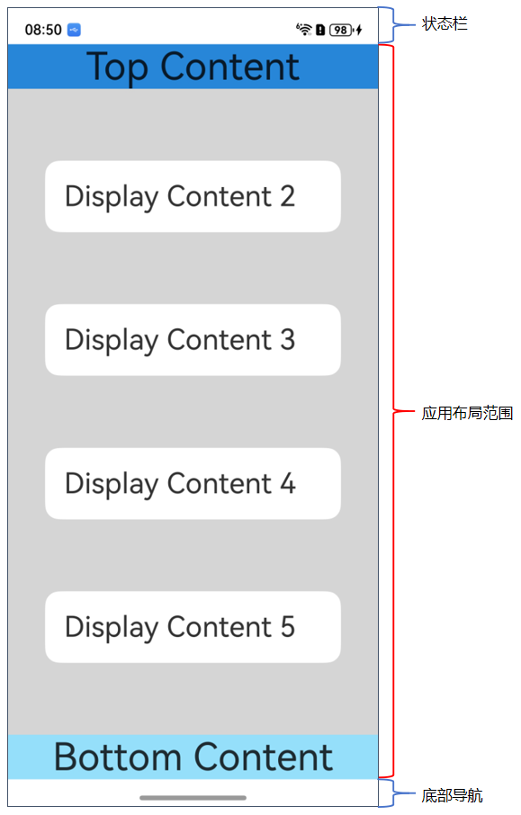
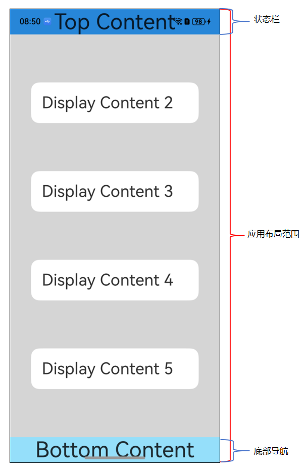
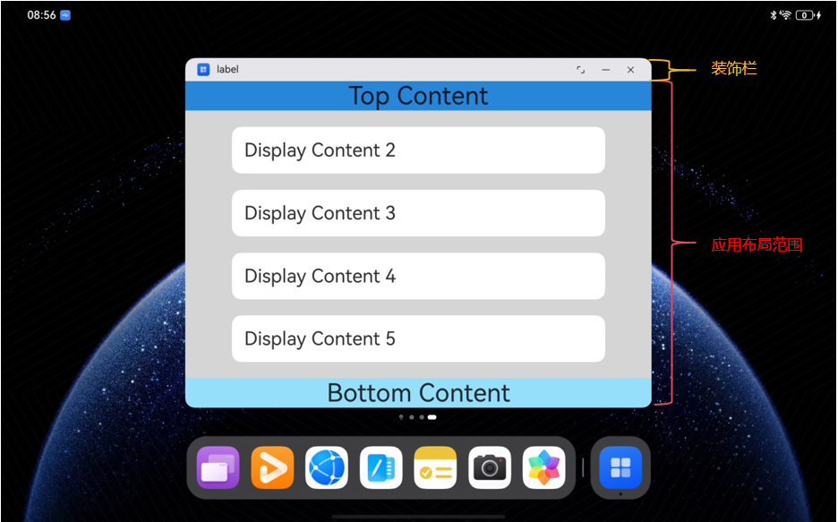
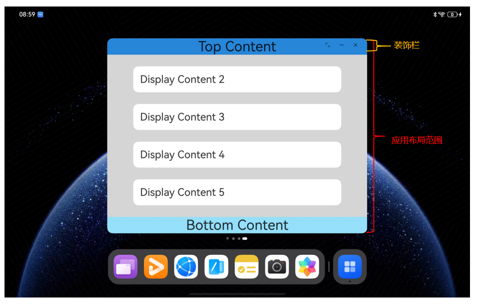

# 窗口沉浸式

<!--Kit: ArkUI-->
<!--Subsystem: Window-->
<!--Owner: @waterwin qianjiaxing@huawei.com-->
<!--Designer: @nyankomiya wanghaofan@huawei.com-->
<!--Tester: @qinliwen0417-->
<!--Adviser: @ge-yafang-->

## 场景介绍

窗口沉浸式指通过优化应用界面，使内容成为视觉焦点，以最大限度排除无关元素的干扰，实现沉浸式效果。其实现需针对不同设备的屏幕特性、交互逻辑及系统规范进行差异化适配。

## 沉浸式效果

通常情况下，影音类、游戏类、办公类等应用为了尽可能全屏显示，减少其他无关界面元素的干扰，会主动调整系统界面元素的显隐状态或样式来聚焦更多应用界面内容。

开发应用沉浸式效果主要通过调整状态栏、应用界面和底部导航区域的显示效果来减少状态栏和导航区域等系统界面的突兀感，从而使用户获得最佳的UI体验。

开发者可以通过三种方式实现应用界面内的沉浸式效果：

- [隐藏系统界面元素](#隐藏系统界面元素实现沉浸式效果)，使应用内容布满整个窗口显示区域。

- 设置窗口[沉浸式布局](#沉浸式布局)，将应用内容拓展到整个窗口显示区域，通过[布局避让](#布局避让)避免重要组件与系统界面元素重叠。

- 使用组件[安全区域](../reference/apis-arkui/arkui-ts/ts-universal-attributes-expand-safe-area.md)能力，将部分组件拓展到安全区外部。

### 界面元素构成

典型全屏应用窗口包括系统界面元素和应用界面。其中系统界面元素包含状态栏和导航区域（根据用户设置可表现为导航条或三键导航），通常在[沉浸式布局](#沉浸式布局)下称为避让区，避让区之外的区域称为安全区。


### 沉浸式布局

沉浸式布局是一种让应用可布局区域拓展至整个窗口显示区域的状态。

- 非沉浸式布局下，应用界面内容默认会避开系统UI的显示区域，包括状态栏、导航区域等系统界面元素。

- 沉浸式布局下，应用内的可用布局区域延伸到整个窗口大小，此时应用界面的布局内容可与系统UI界面重叠显示，但系统界面元素层级始终高于应用界面内容。  

  可以通过[isImmersiveLayout()](../reference/apis-arkui/arkts-apis-window-Window.md#isimmersivelayout20)接口判断当前窗口是否为沉浸式布局。

多设备场景下不同窗口形态的沉浸式开发与实现可以参考[窗口沉浸式](https://developer.huawei.com/consumer/cn/doc/best-practices/bpta-multi-device-window-immersive)最佳实践。

> **说明：**
> 
> 沉浸式布局是窗口内元素的布局方式，进入或退出沉浸式布局不会改变窗口尺寸和位置，仅会影响应用界面内元素的布局。

[自由窗口](window-terminology.md#自由窗口)状态和非[自由窗口](window-terminology.md#自由窗口)状态下实现沉浸式布局的方式不同。

- 非自由窗口状态下，可通过使用[setWindowLayoutFullScreen()](../reference/apis-arkui/arkts-apis-window-Window.md#setwindowlayoutfullscreen9)接口设置当前窗口进入/退出窗口沉浸式布局。 

  > **说明：**
  > 
  > 非自由窗口状态下，除应用子窗外的其他类型窗口在创建时默认为非沉浸式布局，子窗口创建后默认为沉浸式布局。

  ```ts
  // EntryAbility.ets
  import { window } from '@kit.ArkUI';
  import { UIAbility } from '@kit.AbilityKit';
  
  export default class EntryAbility extends UIAbility {
    // ..
  
    onWindowStageCreate(windowStage: window.WindowStage): void {
      windowStage.loadContent('pages/Index', async (err) => {
        if (err.code) {
          return;
        }
  
        try {
          const mainWindow: window.Window = windowStage.getMainWindowSync(); // 获取应用主窗口
          await mainWindow.setWindowLayoutFullScreen(true); // 进入窗口沉浸式布局
        } catch (e) {
          console.error(`Failed to set status bar to invisible`);
        }
      });
    }
  }
  ```
  
  | 非自由窗口的非沉浸式布局示意 | 非自由窗口的沉浸式布局示意 |
  | -------- | -------- |
  |   |  |

- 自由窗口状态下，可通过[setWindowDecorVisible()](../reference/apis-arkui/arkts-apis-window-Window.md#setwindowdecorvisible11)接口控制窗口标题栏显隐，当标题栏隐藏时，窗口处于沉浸式布局。  

  ```ts
  // EntryAbility.ets
  import { window } from '@kit.ArkUI';
  import { UIAbility } from '@kit.AbilityKit';
  
  export default class EntryAbility extends UIAbility {
    // ...
  
    onWindowStageCreate(windowStage: window.WindowStage): void {
      windowStage.loadContent('pages/Index', async (err) => {
        if (err.code) {
          return;
        }
  
        try {
          const mainWindow: window.Window = windowStage.getMainWindowSync(); // 获取应用主窗口
          await mainWindow.setWindowDecorVisible(false); // 隐藏窗口标题栏，进入窗口沉浸式布局
        } catch (e) {
          console.error(`Failed to set status bar to invisible`);
        }
      });
    }
  }
  ```

  | 自由窗口的非沉浸式布局示意 | 自由窗口的沉浸式布局示意 |
  | -------- | -------- |
  |  |   |

### 布局避让

沉浸式布局状态下，窗口可布局区域与系统界面元素的显示区域可以重叠，此时为了避免状态栏、导航区域等系统界面元素交叉导致应用界面显示被遮挡，需要在组件布局时做额外的布局避让。

窗口与系统界面元素显示的交叉区域称为**避让区域**，应用内通过布局避让，将关键显示组件避开避让区域显示，从而达到沉浸式效果。

系统支持的避让区域类型通过枚举[AvoidAreaType](../reference/apis-arkui/arkts-apis-window-e.md#avoidareatype7)表示，当前支持的类型如下表：

| 名称 | 说明 |
| -------- | -------- |
| TYPE_SYSTEM | 表示系统默认区域。<!--RP1-->包含状态栏和三键导航栏区域。<!--RP1End--> |
| TYPE_CUTOUT | 表示挖孔区域。 |
| TYPE_SYSTEM_GESTURE | 表示侧边返回手势区域。当前所有设备均无此类型避让区域。 |
| TYPE_KEYBOARD | 表示固定态软键盘区域。 |
| TYPE_NAVIGATION_INDICATOR | 表示底部导航区域。<!--Del-->OpenHarmony各设备不支持此能力。<!--DelEnd--> |
| TYPE_FLOAT_NAVIGATION | 表示三键导航区域。<!--Del-->OpenHarmony各设备不支持此能力。<!--DelEnd--> |

### 避让区AvoidArea的计算方式

避让区[AvoidArea](../reference/apis-arkui/arkts-apis-window-i.md#avoidarea7)的数据结构如下所示：

```txt
interface AvoidArea {
  visible: boolean;
  leftRect: Rect;
  topRect: Rect;
  rightRect: Rect;
  bottomRect: Rect;
}

interface Rect {
  left: number;
  top: number;
  width: number;
  height: number;
}
```

- 其中包含四组Rect信息，表示此类型的避让区域在相对于窗口中心点的方向和具体矩形区域位置。

- visible属性不代表任何系统UI的可见性，没有实际含义，**请避免使用此属性**。

在避让区域的计算中，将窗口按照对角线分为四个三角形区域，当对应系统界面元素的位置（矩形中心点）落于某个方向上的三角形区域时，提供的避让区域将在对应的Rect中。如下图所示整个矩形为窗口区域，以窗口左上角为原点，水平向右为X轴正方向，垂直向下为Y轴正方向，窗口矩形的两条对角线将整个矩形划分为四个方向上的Rect区域，用以表示避让区域相对窗口的几何位置。


其中每个Rect为(X, Y, Width, Height)构成的四元组，表示以**窗口左上角为原点**的唯一矩形区域。

如下图，挖孔区域表示为 **[topRect, (x1, y1, w1, h1)]** ，底部导航区域表示为 **[bottomRect, (0, H-h2, W, h2)]** 。


## 隐藏系统界面元素实现沉浸式效果

可通过隐藏系统界面元素实现沉浸式效果，适用于游戏、电影等应用场景。例如，在相机大图页面隐藏状态栏以获得沉浸式的图片查看效果。

> **说明：**
> 
> [setSpecificSystemBarEnabled()](../reference/apis-arkui/arkts-apis-window-Window.md#setspecificsystembarenabled11)、[setWindowSystemBarEnable()](../reference/apis-arkui/arkts-apis-window-Window.md#setwindowsystembarenable9)等控制系统界面元素显示的接口仅非[自由窗口](window-terminology.md#自由窗口)状态下的主窗口支持调用，在辅助窗口中调用或[自由窗口](window-terminology.md#自由窗口)状态下调用不生效。在主窗口非全屏/最大化模式时调用不会立即生效，应用非全屏/最大化模式后配置生效。


1. 调用[setWindowLayoutFullScreen()](../reference/apis-arkui/arkts-apis-window-Window.md#setwindowlayoutfullscreen9)接口设置窗口进入沉浸式布局。  

   ```ts
   // EntryAbility.ets
   import { window } from '@kit.ArkUI';
   import { UIAbility } from '@kit.AbilityKit';
   
   export default class EntryAbility extends UIAbility {
     // ...
    
     onWindowStageCreate(windowStage: window.WindowStage): void {
       windowStage.loadContent('pages/Index', (err) => {
         if (err.code) {
           return;
         }
   
         try {
           // 获取应用主窗口
           const mainWindow: window.Window = windowStage.getMainWindowSync(); 
           //设置窗口进入沉浸式布局
           await mainWindow.setWindowLayoutFullScreen(true);
         } catch (e) {
           console.error(`Failed to set window layout fullscreen`);
         }
       });
     }
   }
   ```

2. 调用[setSpecificSystemBarEnabled()](../reference/apis-arkui/arkts-apis-window-Window.md#setspecificsystembarenabled11)隐藏状态栏。  

   ```ts
   // EntryAbility.ets
   import { window } from '@kit.ArkUI';
   import { UIAbility } from '@kit.AbilityKit';
   
   export default class EntryAbility extends UIAbility {
     // ...
    
     onWindowStageCreate(windowStage: window.WindowStage): void {
       windowStage.loadContent('pages/Index', (err) => {
         if (err.code) {
           return;
         }
   
         try {
           // 获取应用主窗口
           const mainWindow: window.Window = windowStage.getMainWindowSync(); 
           // 设置状态栏隐藏
           mainWindow.setSpecificSystemBarEnabled('status', false); 
         } catch (e) {
           console.error(`Failed to set status bar to invisible`);
         }
       });
     }
   }
   ```


## 适配沉浸式布局实现沉浸式效果

> **说明：**
> 
> 全局悬浮窗、模态窗口和系统窗口本身不具备获取避让区域的能力，如果需要在这些窗口中适配布局避让，需要使用[setSystemAvoidAreaEnabled()](../reference/apis-arkui/arkts-apis-window-Window.md#setsystemavoidareaenabled18)接口使能避让区域能力后再进行布局避让。

1. 调用[setWindowLayoutFullScreen()](../reference/apis-arkui/arkts-apis-window-Window.md#setwindowlayoutfullscreen9)接口设置窗口进入沉浸式布局。 

   ```ts
   private async initializeMainWindow(windowStage: window.WindowStage): Promise<void> {
     try {
       this.mainWindow = windowStage.getMainWindowSync();
       AppStorage.setOrCreate('mainWindow', this.mainWindow);
       await this.mainWindow.setWindowLayoutFullScreen(true);
       this.initSafeArea(this.mainWindow);
       this.mainWindow.on('avoidAreaChange', (option) => {
         switch (option.type) {
           case window.AvoidAreaType.TYPE_SYSTEM: {
             const topHeight = Math.max(option.area.topRect.height, AppStorage.get<number>('topAvoidHeight') ?? 0);
             AppStorage.setOrCreate('topAvoidHeight', topHeight);
             break;
           }
           case window.AvoidAreaType.TYPE_CUTOUT: {
             this.handleCutoutAvoidArea(option.area);
             break;
           }
           case window.AvoidAreaType.TYPE_NAVIGATION_INDICATOR: {
             const bottomHeight = Math.max(option.area.bottomRect.height, AppStorage.get<number>('bottomAvoidHeight') ?? 0);
             AppStorage.setOrCreate('bottomAvoidHeight', bottomHeight);
             break;
           }
           default: {
             break;
           }
         }
       });
     } catch (err) {
       hilog.error(DOMAIN, 'testTag', 'Failed to initialize avoid area listener. Cause: %{public}s', JSON.stringify(err));
     }
   }
   ```

2. 使用[getWindowAvoidArea()](../reference/apis-arkui/arkts-apis-window-Window.md#getwindowavoidarea9)接口获取当前窗口避让区域（此处以状态栏、底部导航区域为例）。  

   ```ts
   private initSafeArea(win: window.Window): void {
     try {
       const systemAvoidArea = win.getWindowAvoidArea(window.AvoidAreaType.TYPE_SYSTEM);
       const navigationAvoidArea = win.getWindowAvoidArea(window.AvoidAreaType.TYPE_NAVIGATION_INDICATOR);
       const cutoutAvoidArea = win.getWindowAvoidArea(window.AvoidAreaType.TYPE_CUTOUT);
   
       AppStorage.setOrCreate('topAvoidHeight', systemAvoidArea.topRect.height);
       AppStorage.setOrCreate('bottomAvoidHeight', navigationAvoidArea.bottomRect.height);
       AppStorage.setOrCreate('leftAvoidWidth', 0);
       AppStorage.setOrCreate('rightAvoidWidth', 0);
       this.handleCutoutAvoidArea(cutoutAvoidArea);
     } catch (err) {
       hilog.error(DOMAIN, 'testTag', 'Failed to init safe area. Cause: %{public}s', JSON.stringify(err));
     }
   }
   ```

3. 使用[on('avoidAreaChange')](../reference/apis-arkui/arkts-apis-window-Window.md#onavoidareachange9)接口监听避让区域的动态变化，在避让区域更新时同时更新应用内布局。 

   常见的触发避让区回调的场景如下：应用窗口在全屏模式、悬浮模式、分屏模式之间的切换；应用窗口旋转；多折叠设备在屏幕折叠态和展开态之间的切换；应用窗口在多设备之间的流转。

   ```ts
   this.mainWindow.on('avoidAreaChange', (option) => {
     switch (option.type) {
       case window.AvoidAreaType.TYPE_SYSTEM: {
         const topHeight = Math.max(option.area.topRect.height, AppStorage.get<number>('topAvoidHeight') ?? 0);
         AppStorage.setOrCreate('topAvoidHeight', topHeight);
         break;
       }
       case window.AvoidAreaType.TYPE_CUTOUT: {
         this.handleCutoutAvoidArea(option.area);
         break;
       }
       case window.AvoidAreaType.TYPE_NAVIGATION_INDICATOR: {
         const bottomHeight = Math.max(option.area.bottomRect.height, AppStorage.get<number>('bottomAvoidHeight') ?? 0);
         AppStorage.setOrCreate('bottomAvoidHeight', bottomHeight);
         break;
       }
       default: {
         break;
       }
     }
   });
   ```

4. 布局中的系统界面元素需要避让状态栏和导航区域，否则可能产生UI元素重叠等情况。  

   > **说明：**
   > 
   > 避让区域存在大小为0的情况，当获取到的避让区域为0时，开发者需注意针对性处理适配此时的页面区域和布局，避免贴边、内容裁剪等问题，以确保应用界面正常显示且具有良好的美观性。

   开发者可以通过添加padding或添加占位组件的方式避让系统界面元素，此处以添加padding为例（具体数值为避让高度+10vp，防止在系统界面元素隐藏时布局内容贴边，开发者可以根据实际需求更改）。对控件顶部设置padding，实现对状态栏的避让；对底部设置padding，实现对底部导航区域的避让。

   ```ts
   // Index.ets
   //顶部避让区
   Row() {
     Text('Top Container')
       .fontSize(40)
       .textAlign(TextAlign.Center)
       .width('100%')
   }
   .backgroundColor('#2786d9')
   .padding({
     top: this.getUIContext().px2vp(this.topAvoidHeight) + 10,
     bottom: 10,
     left: this.getUIContext().px2vp(this.leftAvoidWidth),
     right: this.getUIContext().px2vp(this.rightAvoidWidth)
   })
   //底部避让区
     Row() {
       Text('Bottom Container')
         .fontSize(40)
         .textAlign(TextAlign.Center)
         .width('100%')
     }
     .backgroundColor('#96dffa')
     .padding({
       top: 10,
       bottom: this.getUIContext().px2vp(this.bottomAvoidHeight) + 10,
       left: this.getUIContext().px2vp(this.leftAvoidWidth),
       right: this.getUIContext().px2vp(this.rightAvoidWidth)
     })
   }
   ```

   另外，开发者可以根据需要对挖孔区域进行避让，示例代码如下：

   ```ts
     private handleCutoutAvoidArea(cutoutAvoidArea: window.AvoidArea): void {
       if (cutoutAvoidArea.topRect.height > 0) {
         const topHeight = Math.max(AppStorage.get<number>('topAvoidHeight') ?? 0, cutoutAvoidArea.topRect.height);
         AppStorage.setOrCreate('topAvoidHeight', topHeight);
       }
       if (cutoutAvoidArea.bottomRect.height > 0) {
         const bottomHeight = Math.max(AppStorage.get<number>('bottomAvoidHeight') ?? 0, cutoutAvoidArea.bottomRect.height);
         AppStorage.setOrCreate('bottomAvoidHeight', bottomHeight);
       }
       if (cutoutAvoidArea.leftRect.width > 0) {
         AppStorage.setOrCreate('leftAvoidWidth', cutoutAvoidArea.leftRect.width);
       }
       if (cutoutAvoidArea.rightRect.width > 0) {
         AppStorage.setOrCreate('rightAvoidWidth', cutoutAvoidArea.rightRect.width);
       }
     }
   }
   ```

5. 根据实际的UI界面显示或相关UI元素背景颜色等，还可以按需设置状态栏的文字颜色、背景色或设置导航区域的显示或隐藏，以使UI界面效果呈现和谐。状态栏和导航区域默认是透明的，透传的是应用界面的背景色。  

   此例中UI颜色主要有两种，比较简单，故未对状态栏文字颜色、背景色进行设置，未对导航区域进行隐藏。


