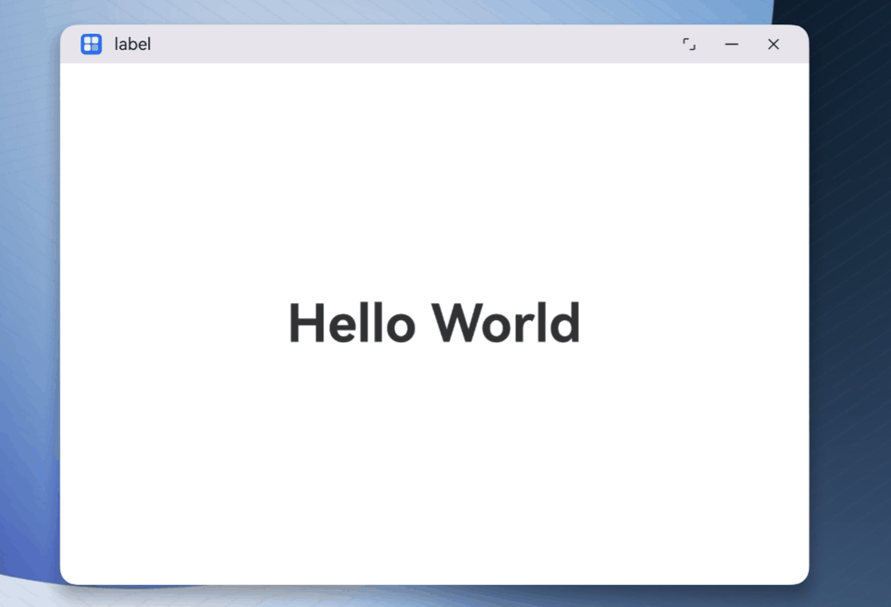

# 设置窗口动效 (ArkTS)

<!--Kit: ArkUI-->
<!--Subsystem: Window-->
<!--Owner: @gcw_bkPrirku-->
<!--Designer: @liaojunhua-->
<!--Tester: @qinliwen0417-->
<!--Adviser: @ge-yafang-->

## 场景介绍

窗口动效是指窗口在显示、隐藏、切换过程中的过渡动画效果。为了让这些过程更加自然流畅，避免界面切换过于突兀，系统提供了过渡动画支持。同时，为满足开发者的自定义需求，系统还提供了自定义设置窗口动效的能力。

以下为支持设置自定义窗口动效的几种典型场景：

<!--Del-->
- [设置窗口显示/隐藏动效](#设置窗口显示隐藏动效)
<!--DelEnd-->

- [设置应用内UIAbility组件启动淡入淡出动效](#设置应用内uiability组件启动淡入淡出动效)

- [设置主窗口销毁时的转场动画](#设置主窗口销毁时的转场动画)

<!--Del-->
## 设置窗口显示/隐藏动效

支持设置窗口的显示/隐藏动效，目前支持的窗口类型如下：

- 全局悬浮窗

- 模态窗

- 系统窗口：包括音量条、壁纸、通知栏、导航栏窗口等。系统窗口类型具体可见[WindowType](../reference/apis-arkui/js-apis-window-sys.md#windowtype7)。

此处以创建“可设置窗口层级的系统窗口”为例，设置其显示/隐藏过程中的组合动画效果。

1. 获取窗口属性转换控制器。

   通过[getTransitionController()](../reference/apis-arkui/js-apis-window-sys.md#gettransitioncontroller9)接口获取控制器。后续的动画操作都由属性控制器来完成。

   <!-- @[window_animation_config](https://gitcode.com/openharmony/applications_app_samples/blob/master/code/DocsSample/ArkUISample/ArkUIWindowSamples/WindowAnimationSample/entry/src/main/ets/pages/AnimationConfig.ts) --> 

2. 配置窗口显示/隐藏时的动画。

   通过动画函数[animateTo()](../reference/apis-arkui/arkts-apis-uicontext-uicontext.md#animateto)配置具体的属性动画，可通过[opacity()](../reference/apis-arkui/js-apis-window-sys.md#opacity9)设置窗口不透明度，通过[scale()](../reference/apis-arkui/js-apis-window-sys.md#scale9)设置缩放参数，通过[rotate()](../reference/apis-arkui/js-apis-window-sys.md#rotate9)设置旋转参数，通过[translate()](../reference/apis-arkui/js-apis-window-sys.md#translate9)设置平移参数。

   <!-- @[window_animation_show](https://gitcode.com/openharmony/applications_app_samples/blob/master/code/DocsSample/ArkUISample/ArkUIWindowSamples/WindowAnimationSample/entry/src/main/ets/pages/WindowAnimationDemo.ets) --> 
   
   ``` TypeScript
   import { window } from '@kit.ArkUI';
   import { common } from '@kit.AbilityKit';
   import { AnimationConfig } from './AnimationConfig';
   
   @Entry
   @Component
   struct WindowAnimationDemo {
     // ...
     showWindow() {
       let systemTypeWindow = window.findWindow('dynamicWindow'); // 此处需要获取一个系统类型窗口。
       let animationConfig = new AnimationConfig();
       try {
         // 设置窗口显示过程动画效果
         animationConfig?.ShowWindowWithCustomAnimation(systemTypeWindow, (context : window.TransitionContext)=>{
           let toWindow = context.toWindow;
           let sysWindowUIContext = systemTypeWindow.getUIContext();
           // 2.配置具体的属性动画
           sysWindowUIContext.animateTo({
             // ...
           }, () => {
             let translateObj : window.TranslateOptions = {
               x : 400.0,
               y : 400.0,
               z : 0.0
             };
             toWindow?.translate(translateObj); // 设置平移参数
             let rotateObj: window.RotateOptions = {
               x: 1.0,
               y: 1.0,
               z: 360.0,
               pivotX: 0.5,
               pivotY: 0.5
             };
             toWindow?.rotate(rotateObj); // 设置旋转参数
             let scaleObj: window.ScaleOptions = {
               x: 2.0,
               y: 2.0,
               pivotX: 0.5,
               pivotY: 0.5
             };
             toWindow?.scale(scaleObj); // 设置缩放参数
             toWindow?.opacity(1); // 设置透明度参数
             console.info('animation end');
           });
           console.info('complete transition end');
         });
       } catch (error) {
         console.error(`ShowWindowWithCustomAnimation error code: ${error.code}, message: ${error.message}` );
       }
     }
     // ...
   }
   ```

3. 设置属性转换完成。

   通过[completeTransition()](../reference/apis-arkui/js-apis-window-sys.md#completetransition9)传入true来设置属性转换的最终完成状态。如果传入false，则表示撤销本次转换。

   <!-- @[window_animation_complete_transition](https://gitcode.com/openharmony/applications_app_samples/blob/master/code/DocsSample/ArkUISample/ArkUIWindowSamples/WindowAnimationSample/entry/src/main/ets/pages/WindowAnimationDemo.ets) --> 
   
   ``` TypeScript
   struct WindowAnimationDemo {
     // ...
     showWindow() {
       // ...
       try {
         // 设置窗口显示过程动画效果
         animationConfig?.ShowWindowWithCustomAnimation(systemTypeWindow, (context : window.TransitionContext)=>{
           let toWindow = context.toWindow;
           let sysWindowUIContext = systemTypeWindow.getUIContext();
           // 2.配置具体的属性动画
           sysWindowUIContext.animateTo({
             // ...
             onFinish: () => {
               console.info('onFinish in animation');
               // 3.设置属性转换的最终完成状态
               context.completeTransition(true);
             }
           }, () => {
             // ...
           });
           console.info('complete transition end');
         });
       } catch (error) {
         console.error(`ShowWindowWithCustomAnimation error code: ${error.code}, message: ${error.message}` );
       }
     }
     // ...
   }
   ```

4. 显示或隐藏当前窗口，过程中播放动画。

   调用[showWithAnimation()](../reference/apis-arkui/js-apis-window-sys.md#showwithanimation9)接口，来显示窗口并播放动画。调用[hideWithAnimation()](../reference/apis-arkui/js-apis-window-sys.md#hidewithanimation9)接口，来隐藏窗口并播放动画。

   <!-- @[window_animation_play](https://gitcode.com/openharmony/applications_app_samples/blob/master/code/DocsSample/ArkUISample/ArkUIWindowSamples/WindowAnimationSample/entry/src/main/ets/pages/AnimationConfig.ts) --> 
   
   ``` TypeScript
   import { window } from '@kit.ArkUI';
   
   export class AnimationConfig {
     private animationForShownCallFunc_: ((context : window.TransitionContext) => void) | undefined = undefined;
     private animationForHiddenCallFunc_: ((context : window.TransitionContext) => void) | undefined = undefined;
   
     ShowWindowWithCustomAnimation(windowClass: window.Window, callback: (context : window.TransitionContext) => void) {
       // ...
       // 窗口显示时的自定义动画配置。
       controller.animationForShown = (context : window.TransitionContext)=> {
         this.animationForShownCallFunc_(context);
       };
       // 4.显示窗口并播放动画
       windowClass.showWithAnimation(()=>{
         console.info('Show with animation success');
       });
     }
   
     // ...
   }
   ```


<!--DelEnd-->

## 设置应用内UIAbility组件启动淡入淡出动效

在使用[startAbility()](../reference/apis-ability-kit/js-apis-inner-application-uiAbilityContext.md#startability-2)接口拉起同一应用内其他UIAbility组件时，可以通过[StartOptions](../reference/apis-ability-kit/js-apis-app-ability-startOptions.md)中[WindowCreateParams](../reference/apis-arkui/arkts-apis-window-i.md#windowcreateparams20)配置窗口的启动动画。

目前支持将窗口启动动画配置为淡入淡出动效[FADE_IN_OUT](../reference/apis-arkui/arkts-apis-window-e.md#animationtype20)。

示例代码如下：

<!-- @[window_animation_start_ability](https://gitcode.com/openharmony/applications_app_samples/blob/master/code/DocsSample/ArkUISample/ArkUIWindowSamples/StartAbilityWithFadeinoutSample/entry/src/main/ets/pages/Index.ets) --> 

``` TypeScript
import { Want, StartOptions, common } from '@kit.AbilityKit';
import { window } from '@kit.ArkUI';
import { BusinessError } from '@kit.BasicServicesKit';

@Entry
@Component
struct Index {
  private context = AppStorage.get('context') as common.UIAbilityContext;

  openAbility():void {
    let want: Want = {
      deviceId: '',
      bundleName: 'com.example.startabilitywithfadeinout',
      abilityName: 'FadeInOutAbility',
      moduleName: 'entry'
    };
    let options: StartOptions = {
      // 传入启动动效参数
      windowCreateParams: {
        animationParams : { type: window.AnimationType.FADE_IN_OUT },
      }
    }
    try {
      this.context.startAbility(want, options, (err: BusinessError) => {
        if (err.code) {
          // 处理业务逻辑错误
          console.error(`startAbility failed, code is ${err.code}, message is ${err.message}`);
          return;
        }
        // 执行正常业务
        console.info('startAbility succeed');
      });
    } catch (err) {
      // 处理入参错误异常
      let code = (err as BusinessError).code;
      let message = (err as BusinessError).message;
      console.error(`startAbility failed, code is ${code}, message is ${message}`);
    }
  }
  build() {
    RelativeContainer() {
      Column() {
        Button('startAbility').onClick(() => this.openAbility())
      }
      .height('100%')
      .width('100%')
      .justifyContent(FlexAlign.Center);
    }
    .height('100%')
    .width('100%')
  }
}
```


## 设置主窗口销毁时的转场动画

在[自由窗口](window-terminology.md#freeform-window自由窗口)状态下，应用使用[getWindowTransitionAnimation()](../reference/apis-arkui/arkts-apis-window-Window.md#getwindowtransitionanimation20)获取主窗口转场的动画配置，当前转场动画配置不符合业务诉求时，可以使用[setWindowTransitionAnimation()](../reference/apis-arkui/arkts-apis-window-Window.md#setwindowtransitionanimation20)接口配置窗口转场时的动画，当前仅支持配置窗口销毁时的转场动画。

示例代码如下：

<!-- @[window_destroy_transition_animation](https://gitcode.com/openharmony/applications_app_samples/blob/master/code/DocsSample/ArkUISample/ArkUIWindowSamples/AppTransitionAnimationSample/entry/src/main/ets/entryability/EntryAbility.ets) --> 

``` TypeScript
import { UIAbility } from '@kit.AbilityKit';
import { hilog } from '@kit.PerformanceAnalysisKit';
import { window } from '@kit.ArkUI';

const DOMAIN = 0x0000;

export default class EntryAbility extends UIAbility {
  async onWindowStageCreate(windowStage: window.WindowStage): Promise<void> {
    try {
      // 获取主窗口
      const windowClass = await windowStage.getMainWindow();

      // 配置窗口销毁动画
      this.setupWindowDestroyAnimation(windowClass);

      // 加载页面
      windowStage.loadContent('pages/Index', (err) => {
        if (err.code) {
          hilog.error(DOMAIN, 'testTag', 'Failed to load the content. Cause: %{public}s', JSON.stringify(err));
          return;
        }
        hilog.info(DOMAIN, 'testTag', 'Succeeded in loading the content.');
      });
    } catch (err) {
      console.error(`Failed to obtain the main window. Cause code: ${err.code}, message: ${err.message}`);
    }
  }

  private setupWindowDestroyAnimation(windowClass: window.Window): void {
    try {
      // 检查是否已存在销毁动画配置
      const existingAnimation = windowClass.getWindowTransitionAnimation(
        window.WindowTransitionType.DESTROY
      );

      if (existingAnimation) {
        return;
      }

      // 配置动画
      const animationConfig: window.WindowAnimationConfig = {
        duration: 1000,
        curve: window.WindowAnimationCurve.LINEAR,
      };

      const transitionAnimation: window.TransitionAnimation = {
        opacity: 0.0,
        config: animationConfig
      };

      // 设置动画
      windowClass.setWindowTransitionAnimation(
        window.WindowTransitionType.DESTROY,
        transitionAnimation
      ).then(() => {
        console.info('Succeeded in setting window transition animation');
      }).catch((err: BusinessError) => {
        console.error(`Failed to set window transition animation. Cause: ${err.message}`);
      });
    } catch (exception) {
      console.error(`Failed to setup window animation. Cause: ${exception.message}`);
    }
  }
}
```


