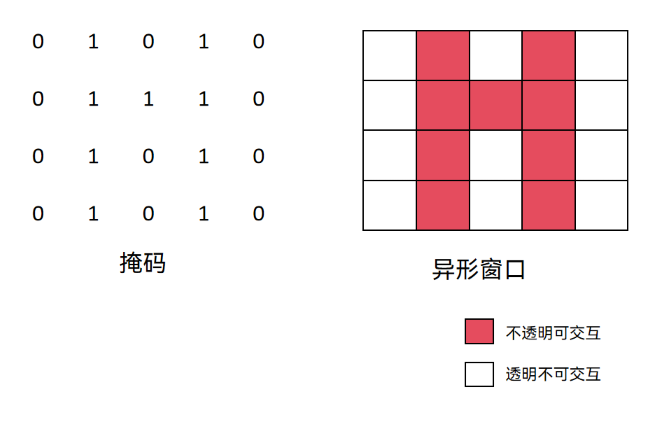
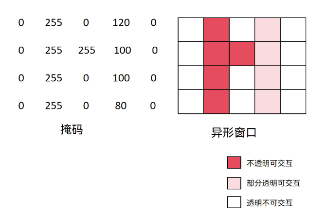
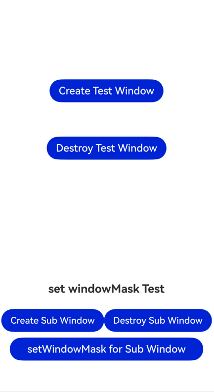
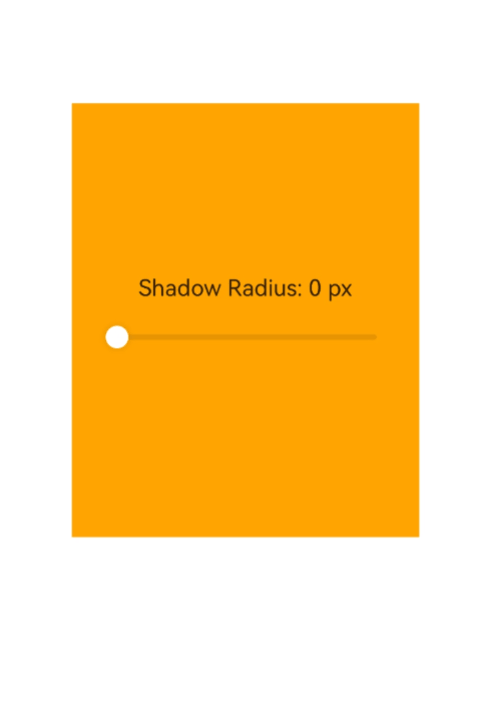
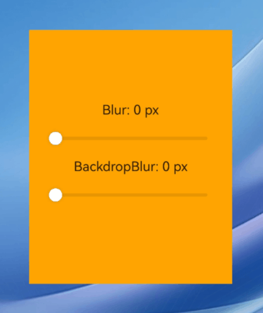
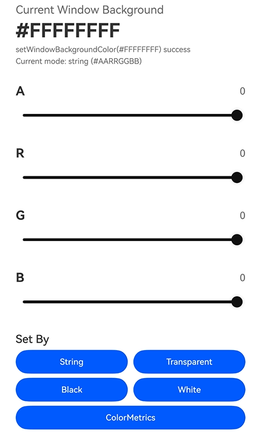

# 控制窗口外观 (ArkTS)

<!--Kit: ArkUI-->
<!--Subsystem: Window-->
<!--Owner: @fei_1007-->
<!--Designer: @gcw_sPCsris4; @qinliwen0417-->
<!--Tester: @qinliwen0417-->
<!--Adviser: @ge-yafang-->

## 场景介绍

窗口外观用于描述窗口在屏幕上的显示形态和视觉效果，目前支持通过设置异形窗口、窗口阴影、窗口圆角<!--Del-->与模糊效果<!--DelEnd-->以及窗口背景色实现窗口外观设置。

开发者可以根据界面设计和交互需求，对窗口外观进行定制。例如：

- 通过设置窗口掩码，将子窗或全局悬浮窗显示为异形窗口。

- 通过设置窗口边缘阴影的模糊半径，调整子窗或全局悬浮窗的阴影效果。<!--Del-->系统应用还可设置窗口边缘阴影的颜色和偏移量。<!--DelEnd-->

- 通过设置窗口圆角，调整子窗或全局悬浮窗的边缘显示效果。<!--Del-->系统应用还可以设置窗口内容的模糊半径和窗口背景的模糊半径。<!--DelEnd-->

- 通过设置窗口背景色，使窗口背景与应用页面或主题样式保持一致。

## 异形窗口

异形窗口为非常规形状的窗口，掩码用于描述异形窗口的形状。仅应用子窗和全局悬浮窗可设置为异形窗口。

可通过[setWindowMask()](../reference/apis-arkui/arkts-apis-window-Window.md#setwindowmask12)或[setWindowMaskWithAlpha()](../reference/apis-arkui/arkts-apis-window-Window.md#setwindowmaskwithalpha)接口设置异形窗口的掩码，以定义窗口的可见区域。

设置掩码后，窗口将按照掩码形状显示，[窗口阴影](#窗口阴影)将被禁用，窗口的圆角半径变为0。

- 使用[setWindowMask()](../reference/apis-arkui/arkts-apis-window-Window.md#setwindowmask12)接口设置异形窗口的掩码。

  掩码仅支持取值为整数0和整数1的二维数组输入，数组行数对应窗口高度，列数对应窗口宽度。整数0代表对应像素透明且不可交互，整数1代表对应像素不透明且可交互。

  

- 从API版本26.0.0开始，支持使用[setWindowMaskWithAlpha()](../reference/apis-arkui/arkts-apis-window-Window.md#setwindowmaskwithalpha)接口设置异形窗口的掩码。

  掩码支持取值在[0, 255]范围的数组输入，数组长度等于窗口宽度乘以窗口高度。整数0代表对应像素透明且不可交互，整数255代表对应像素不透明且可交互，0~255之间代表对应像素部分透明且可交互。此接口性能优于[setWindowMask()](../reference/apis-arkui/arkts-apis-window-Window.md#setwindowmask12)，推荐使用。

  

此处以设置子窗的异形窗口为例。此例主要实现以下效果：

1. 点击“Create Sub Window”按钮可以创建子窗。

2. 创建子窗后，点击“setWindowMask for Sub Window”按钮，可通过[setWindowMaskWithAlpha()](../reference/apis-arkui/arkts-apis-window-Window.md#setwindowmaskwithalpha)接口设置子窗掩码。子窗发生以下变化：

     - 子窗变为三角形。
     - 子窗的阴影和圆角消失。
     - 子窗矩形区域的左上部分变为透明不可交互，通过点击“Create Test Window”按钮，事件透传到该按钮，创建出绿色的测试窗口。

```ts
import { window } from '@kit.ArkUI';
import { BusinessError } from '@kit.BasicServicesKit';

@Entry
@Component
struct Index {
  // ...
  private windowMaskSub: window.Window | undefined = undefined;
  // ...
  private winWidth: number  = 800;
  private winHeight: number  = 800;

  // ...
  // 设置子窗windowMask
  setWindowMask(window: window.Window) {
    let windowMask: Uint8Array = new Uint8Array(this.winWidth * this.winHeight);
    for (let i = 0; i < this.winHeight; i++) {
      for (let k = 0; k < this.winWidth; k++) {
        if ((i + k) < (this.winHeight + this.winWidth) / 2) {
          windowMask[i * this.winWidth + k] = 0;
        } else {
          windowMask[i * this.winWidth + k] = 255;
        }
      }
    }
    window.setWindowMaskWithAlpha(windowMask, this.winWidth, this.winHeight);
  }
  build() {
    // ...
    Button("setWindowMask for Sub Window")
    .width('90%')
    .type(ButtonType.Capsule)
    .margin({
    top: 10
    }).fontSize(18)
    .onClick(() => {
    if(this.windowMaskSub) {
      this.setWindowMask(this.windowMaskSub);
    }
    })
  // ...
  }
}
```




## 窗口阴影

窗口阴影是显示在窗口边缘的投影效果，可以增强窗口与背景之间的层次感，使窗口呈现悬浮于背景之上的视觉效果。

<!--Del-->
- 针对系统应用，可通过[setShadow()](../reference/apis-arkui/js-apis-window-sys.md#setshadow9)接口设置窗口边缘阴影，该接口支持设置窗口边缘阴影的模糊半径、颜色、X轴偏移量和Y轴偏移量。仅支持系统窗口、应用子窗口、全局悬浮窗和模态窗口使用。

  此处以子窗为例，调用setShadow()设置窗口边缘阴影。

  ```ts
  // Index.ets
  import { BusinessError } from '@kit.BasicServicesKit';
  import { window } from '@kit.ArkUI';

  let subWindowClass: window.Window | undefined = undefined;

  @Entry
  @Component
  struct Index {
    // ...

    build() {
    // ...
    }

    private async showShadowSubWindow(): Promise<void> {
      let windowStage = AppStorage.get<window.WindowStage>('windowStage');
      if (!windowStage) {
        this.prompt = 'WindowStage is unavailable.';
        return;
      }

      try {
        if (!subWindowClass) {
          subWindowClass = await windowStage.createSubWindow('shadowSubWindow');
          await subWindowClass.moveWindowTo(220, 240);
          await subWindowClass.resize(800, 600);
          // 设置窗口边缘阴影：模糊半径为48px，半透明黑色，向右下方偏移20px。
          subWindowClass.setShadow(48, '#B0000000', 20, 20);
          await subWindowClass.setUIContent('pages/SubWindow');
        }
        await subWindowClass.showWindow();
        this.prompt = 'The subwindow is displayed with a shadow.';
      } catch (exception) {
        let err = exception as BusinessError;
        this.prompt = `Failed to set shadow: ${err.code}`;
        console.error(`Failed to show shadow subwindow. Cause code: ${err.code}, message: ${err.message}`);
      }
    }
  }
  ```

  
<!--DelEnd-->

- 可通过[setWindowShadowRadius()](../reference/apis-arkui/arkts-apis-window-Window.md#setwindowshadowradius17)接口设置窗口边缘阴影的模糊半径，仅支持子窗和全局悬浮窗使用。

  此处以全局悬浮窗为例，设置其窗口边缘阴影的模糊半径。

  ```ts
  // pages/page1.ets
  import { window } from '@kit.ArkUI';

  @Entry
  @Component
  struct SliderDemo {
    @State shadowRadiusValue: number = 0;

    // 设置窗口边缘阴影的模糊半径
    setShadowRadius(val: number) {
      const floatWindowObj = AppStorage.get<window.Window>('floatWindow');
      floatWindowObj?.setWindowShadowRadius(val);
    }

    build() {
      // ...
    }
  }
  ```

  


## 设置窗口圆角<!--Del-->与模糊效果<!--DelEnd-->

- 可通过[setWindowCornerRadius()](../reference/apis-arkui/arkts-apis-window-Window.md#setwindowcornerradius17)接口设置窗口的圆角半径，仅支持子窗和全局悬浮窗使用。

  此处以全局悬浮窗为例，设置其窗口圆角。

  ```ts
  // pages/page1.ets
  import { window } from '@kit.ArkUI';

  @Entry
  @Component
  struct SliderDemo {
    @State cornerRadiusValue: number = 0;

    // 设置圆角
    setCornerRadius(val: number) {
      const floatWindowObj = AppStorage.get<window.Window>('floatWindow');
      floatWindowObj?.setWindowCornerRadius(val);
    }

    build() {
      // ...
    }
  }
  ```

  

<!--Del-->
- 针对系统应用，可通过[setBlur()](../reference/apis-arkui/js-apis-window-sys.md#setblur9)接口设置窗口内容的模糊半径，仅支持系统窗口、全局悬浮窗和模态窗口使用。

- 针对系统应用，可通过[setBackdropBlur()](../reference/apis-arkui/js-apis-window-sys.md#setbackdropblur9)接口设置窗口背景的模糊半径，仅支持系统窗口、全局悬浮窗和模态窗口使用。


此处以全局悬浮窗为例，设置其窗口模糊效果（窗口内容的模糊半径、窗口背景的模糊半径）。

```ts
// pages/page1.ets
import { window } from '@kit.ArkUI';

@Entry
@Component
struct SliderDemo {
  @State blurValue: number = 0;
  @State backdropBlurValue: number = 0;
  @State columnBg: Color = Color.Orange;

  setColumnBg() {
    this.columnBg = Color.Orange;
  }

  // 设置窗口内容的模糊半径
  setBlur(val: number) {
    this.setColumnBg();
    const floatWindowObj = AppStorage.get<window.Window>('floatWindow');
    floatWindowObj?.setBlur(val);
  }
  // 设置窗口背景的模糊半径
  setBackdropBlur(val: number) {
    this.columnBg = Color.Transparent;
    const floatWindowObj = AppStorage.get<window.Window>('floatWindow');
    floatWindowObj?.setWindowBackgroundColor('#00FFFFFF');
    floatWindowObj?.setBackdropBlur(val);
  }

  build() {
  // ...
  }
}
```



<!--DelEnd-->

## 窗口背景色

窗口背景色用于控制窗口内容区域或窗口容器区域的背景显示效果。

开发者可根据业务场景，选择设置应用内容区域背景色，或设置包含标题栏在内的窗口容器背景色，以实现页面背景透明、窗口整体配色统一等效果。

- 可使用[setWindowBackgroundColor()](../reference/apis-arkui/arkts-apis-window-Window.md#setwindowbackgroundcolor9)接口调整窗口内容区域的背景色，主要影响窗口内承载UI内容的部分。可传入不区分大小写的十六进制RGB或ARGB颜色，调整背景颜色。从API version 18开始，支持传入[ColorMetrics](../reference/apis-arkui/js-apis-arkui-graphics.md#colormetrics12)类型。

- 可使用[setWindowContainerColor()](../reference/apis-arkui/arkts-apis-window-Window.md#setwindowcontainercolor20)接口设置PC/2in1或Tablet设备上的主窗口容器区域的背景色，窗口容器背景色会覆盖整个窗口区域，包括标题栏和内容区域。如果处于非[自由窗口](window-terminology.md#freeform-window自由窗口)状态下，效果等同于[setWindowBackgroundColor()](../reference/apis-arkui/arkts-apis-window-Window.md#setwindowbackgroundcolor9)。该接口不支持将非焦点态下的主窗口背景设置为透明。

- 当同时使用[setWindowContainerColor()](../reference/apis-arkui/arkts-apis-window-Window.md#setwindowcontainercolor20)和[setWindowBackgroundColor()](../reference/apis-arkui/arkts-apis-window-Window.md#setwindowbackgroundcolor9)时，内容区域显示[setWindowBackgroundColor()](../reference/apis-arkui/arkts-apis-window-Window.md#setwindowbackgroundcolor9)设置的颜色，而标题栏则显示[setWindowContainerColor()](../reference/apis-arkui/arkts-apis-window-Window.md#setwindowcontainercolor20)设置的颜色。

- 从API版本26.0.0开始，支持使用[setWindowContainerModalColor()](../reference/apis-arkui/arkts-apis-window-Window.md#setwindowcontainermodalcolor)接口设置PC/2in1设备上的主窗口容器区域的背景色，以适配不同UI设计需求。通过该接口设置的背景色会作用于整个窗口容器区域，包括标题栏和内容区域。该接口支持将非焦点态下的主窗口背景设置为透明。

> **说明：**
>
> - 未调用[setWindowContainerColor()](../reference/apis-arkui/arkts-apis-window-Window.md#setwindowcontainercolor20)或[setWindowContainerModalColor()](../reference/apis-arkui/arkts-apis-window-Window.md#setwindowcontainermodalcolor)接口设置窗口内容区域背景色时，内容区域背景色默认跟随系统颜色模式：浅色模式下为'#FFF0F0F0'，深色模式下为'#FF1A1A1A'。
>
> - 需要在[loadContent()](../reference/apis-arkui/arkts-apis-window-Window.md#loadcontent9-1)或[setUIContent()](../reference/apis-arkui/arkts-apis-window-Window.md#setuicontent9-1)调用生效后才能设置背景色。



示例代码如下：

```ts
// Index.ets
import { ColorMetrics, window } from '@kit.ArkUI';
import { hilog } from '@kit.PerformanceAnalysisKit';

const DOMAIN = 0x0000;

@Entry
@Component
struct Index {
  // ...
  // 将0~255的通道值转换成两位十六进制字符串，用于拼接#AARRGGBB。
  private toHex(value: number): string {
    return Math.round(value).toString(16).padStart(2, '0').toUpperCase();
  }

  // 按ARGB顺序生成当前窗口背景色的十六进制字符串。
  private getColorValue(): string {
    return `#${this.toHex(this.alpha)}${this.toHex(this.red)}${this.toHex(this.green)}${this.toHex(this.blue)}`;
  }

  // 使用string形式设置窗口背景色。
  private applyWindowBackgroundColor(): void {
    if (!this.mainWindow) {
      this.statusText = 'Current window is unavailable.';
      return;
    }
    const color = this.getColorValue();
    this.mainWindow.setWindowBackgroundColor(color);
    this.statusText = `setWindowBackgroundColor(${color}) success`;
    hilog.info(DOMAIN, 'backgroundColor', this.statusText);
  }

  // 使用ColorMetrics.rgba(...)形式设置窗口背景色。
  private applyByColorMetrics(): void {
    const alpha = Math.round(this.alpha) / 255;
    const colorMetrics = ColorMetrics.rgba(Math.round(this.red), Math.round(this.green), Math.round(this.blue), alpha);
    this.mainWindow?.setWindowBackgroundColor(colorMetrics);
    this.applyModeText = 'Current mode: ColorMetrics.rgba(...)';
  }

  // ...

  build() {
    // ...
  }
}
```

```ts
// EntryAbility.ets
import { AbilityConstant, ConfigurationConstant, UIAbility, Want } from '@kit.AbilityKit';
import { BusinessError } from '@kit.BasicServicesKit';
import { hilog } from '@kit.PerformanceAnalysisKit';
import { window } from '@kit.ArkUI';

const DOMAIN = 0x0000;

export default class EntryAbility extends UIAbility {
  // ...

  onWindowStageCreate(windowStage: window.WindowStage): void {
    // ...
    windowStage.getMainWindow((err: BusinessError, data) => {
      if (err.code) {
        hilog.error(DOMAIN, 'testTag', 'Failed to obtain the main window. Cause: %{public}s', JSON.stringify(err));
        return;
      }

      const mainWindow: window.Window = data;
      AppStorage.setOrCreate<window.Window>('mainWindow', mainWindow);
      mainWindow.setWindowBackgroundColor('#00000000');

      // 设置主窗口容器在焦点态和非焦点态时的背景色
      const activeColor: string = '#00000000';
      const inactiveColor: string = '#FF000000';
      try {
        mainWindow.setWindowContainerModalColor(activeColor, inactiveColor);
        hilog.info(DOMAIN, 'testTag', 'Succeeded in setting window container color.');
      } catch (exception) {
        hilog.error(DOMAIN, 'testTag', 'Failed to set the window container color. Cause: %{public}s',
          JSON.stringify(exception));
      }
    });
  }

  // ...
}
```
