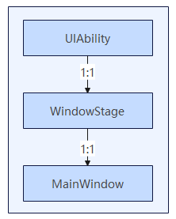

# 窗口生命周期

<!--Kit: ArkUI-->
<!--Subsystem: Window-->
<!--Owner: @fei_1007-->
<!--Designer: @gcw_sPCsris4-->
<!--Tester: @qinliwen0417-->
<!--Adviser: @ge-yafang-->

## 生命周期概述

在OpenHarmony中，主窗口的生命周期与应用UIAbility的生命周期紧密耦合，而辅助窗口（如全局悬浮窗等）则由应用自行管理，开发者可以根据需要灵活控制其显示和隐藏。

Stage模型下，一个UIAbility对应一个WindowStage，一个WindowStage对应一个应用主窗（MainWindow），UIAbility、WindowStage和应用主窗三者之间的关系如下图所示。

每个UIAbility实例都会与一个WindowStage实例绑定。WindowStage是应用进程内的窗口管理器，负责管理主窗口的生命周期和显示逻辑。主窗口是ArkUI的绘制区域，可以加载不同的ArkUI页面，为用户提供交互界面。

UIAbility通过WindowStage管理主窗口，确保窗口状态与应用逻辑同步。WindowStage的生命周期由UIAbility统一管理。

## 管理应用主窗的生命周期

在Stage模型下，应用主窗由UIAbility通过WindowStage管理，并维护其生命周期，开发者可以通过[onWindowStageCreate](../reference/apis-ability-kit/js-apis-app-ability-uiAbility.md#onwindowstagecreate)和[onWindowStageDestroy](../reference/apis-ability-kit/js-apis-app-ability-uiAbility.md#onwindowstagedestroy)接收主窗口创建和销毁的通知。具体请见[UIAbility组件生命周期](../application-models/uiability-lifecycle.md)。

此外，WindowStage和主窗口还提供了以下生命周期状态的监听管理手段：

- 通过WindowStage的[on('windowStageLifecycleEvent')](../reference/apis-arkui/arkts-apis-window-WindowStage.md#onwindowstagelifecycleevent20)接口，监听WindowStage的生命周期变化。

- 通过WindowStage的[getMainWindow()](../reference/apis-arkui/arkts-apis-window-WindowStage.md#getmainwindow9-1)接口获取主窗，然后通过利用[on('windowEvent')](../reference/apis-arkui/arkts-apis-window-Window.md#onwindowevent10)接口监听主窗口的显示、隐藏等事件。

### 应用主窗的生命周期状态

在主窗口进入前台、前后台切换及退出后台时，会触发相应的生命周期状态变化。

Stage模型下主窗口的生命周期状态包括前台状态（SHOWN）、前台可交互状态（RESUMED）、前台不可交互状态（PAUSED）、后台状态（HIDDEN）、获焦状态（ACTIVE）和失焦状态（INACTIVE）。

| 生命周期状态 | 说明 | 触发场景举例 |
| -------- | -------- | -------- |
| SHOWN | 前台状态。应用首次启动或从后台切换至前台时，会触发SHOWN事件。 | 点击应用图标启动。 |
| RESUMED | 前台可交互状态。窗口到前台且可交互后会进入该状态。 | 打开应用后，应用处于前台，且与用户可交互。 |
| PAUSED | 前台不可交互状态。窗口在前台可见但是不可交互时，触发PAUSED事件。窗口会保持这种状态，直到重新恢复或退后台。如果窗口恢复，则会触发RESUMED事件，进入可交互状态。 | 应用在前台时，进入多任务界面，应用依然处于前台但与用户不可交互。 |
| HIDDEN | 后台状态。当应用从前台切换至后台时，会触发HIDDEN事件。 | 应用上划退出、应用窗口关闭。 |
| ACTIVE | 获焦状态，应用窗口处理点击事件后的状态、应用启动后的状态。 | 应用窗口处理点击事件后、应用启动后的状态。 |
| INACTIVE | 失焦状态，打开新应用或点击其他窗口后，原获焦窗口的状态。 | 应用A与应用B在前台形成分屏，用户正在与应用B交互，此时应用A进入INACTIVE状态（失焦状态）。 |

> **说明：**
> 
> RESUMED和PAUSED状态分别在窗口切换至前台和切换至后台时触发。但是在一些场景下，RESUMED和PAUSED状态触发会有差异。
> 
> 例如，当应用启动时，或应用已启动且处于RESUMED状态时，如果应用被管控（例如应用锁），其生命周期会进入PAUSED状态，解除管控后，应用会重新进入RESUMED状态。

应用主窗口生命周期事件流转关系如下图所示：

### 监听应用主窗的生命周期状态变化

开发者可以使用以下接口来监听应用WindowStage的生命周期变化。

- API version 20之前，可通过调用[on('windowStageEvent')](../reference/apis-arkui/arkts-apis-window-WindowStage.md#onwindowstageevent9)注册WindowStage生命周期变化的监听，通过调用[off('windowStageEvent')](../reference/apis-arkui/arkts-apis-window-WindowStage.md#offwindowstageevent9)注销WindowStage生命周期变化的监听。

  - 此时返回的生命周期状态为[WindowStageEventType](../reference/apis-arkui/arkts-apis-window-e.md#windowstageeventtype9)：包含**SHOWN**（前台状态）、**ACTIVE**（获焦状态）、**INACTIVE**（失焦状态）、**HIDDEN**（后台状态）、**RESUMED**（前台可交互状态）、**PAUSED**（前台不可交互状态）6种状态。

  - 本接口无法保证生命周期状态切换间的顺序，对于关注状态间的切换顺序的情况下不建议使用。

- （推荐）从API version 20开始，可通过调用[on('windowStageLifecycleEvent')](../reference/apis-arkui/arkts-apis-window-WindowStage.md#onwindowstagelifecycleevent20)注册WindowStage生命周期变化的监听，通过调用接口[off('windowStageLifecycleEvent')](../reference/apis-arkui/arkts-apis-window-WindowStage.md#offwindowstagelifecycleevent20)注销WindowStage生命周期变化的监听。

  - 此时返回的生命周期状态为[WindowStageLifeCycleEventType](../reference/apis-arkui/arkts-apis-window-e.md#windowstagelifecycleeventtype20)：包含**SHOWN**（前台状态）、**RESUMED**（前台可交互状态）、**PAUSED**（前台不可交互状态）、**HIDDEN**（后台状态）4种状态。

  - 对于WindowStage获焦失焦状态推荐使用[on('windowEvent')](../reference/apis-arkui/arkts-apis-window-Window.md#onwindowevent10)进行监听。

### 不同设备UIAbility生命周期的差异化行为

在Stage模型下，应用主窗口从前台进入后台状态也会驱动UIAbility的生命周期。在该模型下，需要额外关注这个机制在不同类型产品的差异化行为。

- **Phone类型设备上：** 窗口从前台进入后台状态，会驱动UIAbility到后台状态。

- **Tablet类型设备上：**

  - 针对不支持在PC/2in1设备上运行的应用，或可同时支持在phone和PC/2in1上运行的应用，窗口从前台进入后台状态，会驱动UIAbility为后台状态。

  - 针对不支持在phone设备上运行且支持在PC/2in1设备上运行的应用，窗口从前台进入后台状态，不会驱动UIAbility为后台状态。

- **PC/2in1类型设备上：**

  - 针对支持在phone设备运行的应用，窗口从前台进入后台状态，会驱动UIAbility为后台状态。

  - 针对不支持在phone设备运行的应用，窗口从前台进入后台状态，不会驱动UIAbility为后台状态。

## 管理辅助窗口的生命周期

开发者可以按需创建应用子窗口等辅助窗口，用作二级页面、弹窗等场景。

辅助窗口的生命周期由应用自行管理，通常包括：**创建**、**销毁**、**显示**和**隐藏**。开发者可通过下面列举的接口管理和监听辅助窗口的生命周期状态变化。

| 接口名 | 典型场景 |
| -------- | -------- |
| [createWindow()](../reference/apis-arkui/arkts-apis-window-f.md#windowcreatewindow9) | 创建一个全局悬浮窗、模态窗口或系统窗，用作弹窗等场景。 |
| [createSubWindow()](../reference/apis-arkui/arkts-apis-window-WindowStage.md#createsubwindow9) | 创建一个子窗口，用作二级页面等场景。 |
| [createSubWindowWithOptions()](../reference/apis-arkui/arkts-apis-window-WindowStage.md#createsubwindowwithoptions11) | 创建一个子窗口，用作二级页面或弹窗等场景。 |
| [destroyWindow()](../reference/apis-arkui/arkts-apis-window-Window.md#destroywindow9) | 销毁当前窗口，例如关闭弹窗、退出应用等场景。 |
| [showWindow()](../reference/apis-arkui/arkts-apis-window-Window.md#showwindow9-1) | 在窗口创建后显示，或窗口隐藏后恢复显示。 |
| [minimize()](../reference/apis-arkui/arkts-apis-window-Window.md#minimize11) | 最小化当前窗口，仅支持主窗口、子窗口和全局悬浮窗，如点击最小化按钮时隐藏窗口。 |
| [isWindowShowing()](../reference/apis-arkui/arkts-apis-window-Window.md#iswindowshowing9) | 判断当前窗口是否已显示，避免重复显示或执行无效操作等。 |
| [on('windowEvent')](../reference/apis-arkui/arkts-apis-window-Window.md#onwindowevent10) | 监听窗口的生命周期变化，如窗口创建、显示、隐藏、销毁等。 |
| [on('windowWillClose')](../reference/apis-arkui/arkts-apis-window-Window.md#onwindowwillclose15) | 监听窗口关闭事件，在用户通过标题栏关闭窗口时执行特定操作，如保存数据、确认退出、清理资源等。 |

## 辅助窗口生命周期的跟随策略差异

| 窗口类型  | 跟随策略 |
| -------- | -------- |
| 子窗口 | 子窗（除独立子窗）跟随主窗口显示、隐藏、销毁。 非[自由窗口](freeform-window-overview.md#自由窗口)状态下，子窗不能超出主窗口显示。 [自由窗口](freeform-window-overview.md#自由窗口)状态下，子窗可超出主窗口显示。|
| 独立子窗口 | 在[自由窗口](freeform-window-overview.md#自由窗口)状态下，不跟随主窗口显示、隐藏。 非[自由窗口](freeform-window-overview.md#自由窗口)状态下，跟随主窗口显示、隐藏。 跟随主窗口销毁。 |
| 模态窗口 | 跟随主窗口显示、隐藏、销毁。 非[自由窗口](freeform-window-overview.md#自由窗口)状态下，不能超出主窗口显示。 [自由窗口](freeform-window-overview.md#自由窗口)状态下，可超出主窗口显示。 |
| 全局悬浮窗 | 不跟随主窗口显示、隐藏。 跟随主窗口销毁。 |
| 画中画 | 不跟随主窗口显示、隐藏。 跟随主窗口销毁。 |
| 闪控球 | 不跟随主窗口显示、隐藏。 跟随主窗口销毁。 |
