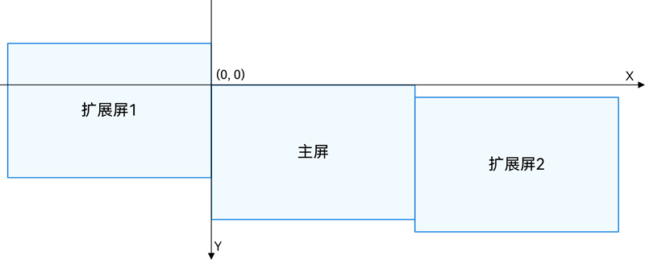

# 窗口开发术语
<!--Kit: ArkUI-->
<!--Subsystem: Window-->
<!--Owner: @waterwin-->
<!--Designer: @nyankomiya-->
<!--Tester: @qinliwen0417-->
<!--Adviser: @ge-yafang-->

## 全局坐标系

全局坐标系是指在设备连接扩展屏（多物理屏幕）的场景下，以主屏幕左上角为原点(0, 0)，屏幕右侧为x轴正方向，屏幕下侧为y轴正方向，对窗口、指针等对象的位置进行统一描述的坐标体系。

在该坐标系中，所有物理屏幕被映射到同一连续的虚拟坐标空间内，各类窗口操作、坐标转换及窗口矩形变化事件均基于该坐标空间进行计算和回调。

使用场景：

- 窗口跨屏移动：调用基于全局坐标系的接口移动窗口，无需传递具体屏幕ID参数，即可实现窗口在多屏之间移动。
- 窗口位置变化监听：基于全局坐标系监听窗口矩形变化事件，统一获取窗口在多屏环境中的位置与尺寸变化信息。