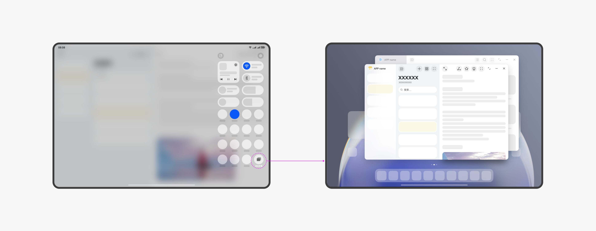
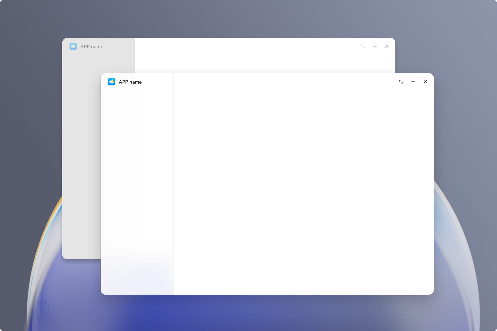

# 窗口开发术语
<!--Kit: ArkUI-->
<!--Subsystem: Window-->
<!--Owner: @fei_1007-->
<!--Designer: @gcw_sPCsris4-->
<!--Tester: @qinliwen0417-->
<!--Adviser: @ge-yafang-->

## F

### Floating Window；悬浮窗

悬浮窗分为智慧多窗悬浮窗、全局悬浮窗和[标准悬浮窗](../reference/apis-arkui/js-apis-floatView.md)。

- 智慧多窗悬浮窗是指设备屏幕上悬浮的、非全屏的应用窗口。

  一般用于在已有全屏任务运行的基础上，临时处理另一个任务，或短时间多任务并行使用。如浏览网页的同时回复消息。

  相关参考：[智慧多窗简介](https://developer.huawei.com/consumer/cn/doc/harmonyos-guides/multi-window-intro)、[智慧多窗最佳实践](https://developer.huawei.com/consumer/cn/doc/best-practices/bpta-multi-window-practice)。

- 全局悬浮窗是指一种特殊的应用辅助窗口，具备在应用主窗口和对应UIAbility退至后台后仍然可以在前台显示的能力。

  全局悬浮窗可以用于应用退至后台后，使用小窗继续显示UI，例如音乐应用用于显示桌面歌词等。

  应用在创建全局悬浮窗前，需要申请对应的权限。
  
  相关参考：[全局悬浮窗开发指导](global-floating-window-guide.md)。

- 标准悬浮窗是指一种由系统管理并统一绘制UI的特殊应用辅助窗口，具备在应用主窗口和对应UIAbility退至后台后仍然可以在前台显示的能力。

  标准悬浮窗由系统统一管理UI和动效，支持与[闪控球](../reference/apis-arkui/js-apis-floatingBall.md)绑定联合使用，用户点击闪控球可展开为标准悬浮窗，点击标准悬浮窗左上角的缩小按钮可收起为闪控球，实现两种窗口形态的相互切换。标准悬浮窗适用于需要在独立小窗口中持续展示应用内容或提供快捷操作的场景，例如股市盯盘应用实时查看股票行情变化，或手机直播应用展示自定义的互动面板和控制界面。

  应用在创建标准悬浮窗前，需要申请对应的权限。

  相关参考：<!--RP1-->[@ohos.window.floatView (标准悬浮窗)](../reference/apis-arkui/js-apis-floatView.md)<!--RP1End-->。

### Free Multi-Window Mode；自由多窗模式

自由多窗模式是一种支持用户在移动设备上进行多任务处理的交互方式。

自由多窗下，允许用户在一块屏幕上同时显示多个应用窗口。此时的应用窗口为[自由窗口](#freeform-window自由窗口)。

部分Tablet设备上，可通过下拉控制中心，点击“自由多窗”按钮开启自由多窗。

部分Phone设备上，可通过下拉控制中心，点击“自由多窗”按钮开启自由多窗。

### Freeform Window；自由窗口

自由窗口是一种允许用户在同一屏幕上以自由大小、位置显示的窗口状态。自由窗口支持拖拽、缩放和分屏组合，从而实现多任务处理。

自由窗口按照打开或者获取焦点的顺序在Z轴层叠排布。当自由窗口被点击或触摸时，将导致其Z轴高度提升，并获取焦点。

启动新的自由窗口时，默认以一定间距在上一个窗口的右下方层叠显示。

每个自由窗口默认会在窗口上方显示窗口标题栏，标题栏左侧显示应用图标，右侧显示三键控制按钮（窗口最大化/还原、窗口最小化和关闭窗口），且窗口标题栏支持额外的[沉浸式配置](https://developer.huawei.com/consumer/cn/doc/best-practices/bpta-multi-device-window-immersive#section359241062916)。

自由窗口可以通过拖动窗口边缘调节窗口大小，可以通过拖动标题栏移动窗口位置。

当前设备支持情况：

-  **2in1设备**：2in1设备上的窗口，默认为[自由窗口](#freeform-window自由窗口)。
-  **Tablet设备**：部分Tablet设备，支持开启[自由多窗模式](#free-multi-window-mode自由多窗模式)（通过下拉控制中心，点击“自由多窗”按钮开启），开启此模式后，应用窗口默认为[自由窗口](#freeform-window自由窗口)。
-  **Phone设备**：部分Phone设备，支持开启[自由多窗模式](#free-multi-window-mode自由多窗模式)（通过下拉控制中心，点击“自由多窗”按钮开启），开启此模式后，应用窗口默认为[自由窗口](#freeform-window自由窗口)。

## G

### Global Coordinate System；全局坐标系

全局坐标系是指在设备连接[扩展屏](../displaymanager/display-terminology.md#扩展屏)（多物理屏幕）的场景下，以主屏幕左上角为原点(0, 0)，屏幕右侧为x轴正方向，屏幕下侧为y轴正方向，对窗口、指针等对象的位置进行统一描述的坐标体系。

在该坐标系中，所有物理屏幕被映射到同一连续的虚拟坐标空间内，各类窗口操作、坐标转换及窗口矩形变化事件均基于该坐标空间进行计算和回调。

使用场景：

- 窗口跨屏移动：调用基于全局坐标系的接口移动窗口，无需传递具体屏幕ID参数，即可实现窗口在多屏之间移动。
- 窗口位置变化监听：基于全局坐标系监听窗口矩形变化事件，统一获取窗口在多屏环境中的位置与尺寸变化信息。

## I

### Immersive Layout；沉浸式布局

让应用可布局区域拓展至整个窗口显示区域的状态。沉浸式布局下，应用内的可用布局区域延伸到整个窗口大小，此时应用界面的布局内容可与系统UI界面重叠显示，但系统界面元素层级始终高于应用界面内容。

## P

### PC Mode；电脑模式

一种支持用户在移动设备上进行多任务处理的交互方式。电脑模式下，允许用户在一块屏幕上同时显示多个应用窗口，此时的应用窗口为[自由窗口](#freeform-window自由窗口)。部分Tablet设备上，可通过下拉控制中心，点击"电脑模式"按钮开启电脑模式。

## S

### Smart Multi-Window；智慧多窗

一个多种窗口模式组合使用的实践范例，它允许用户在同一时间、同一屏幕上以悬浮窗、分屏或全景多窗的方式同时运行多个应用窗口，从而实现多任务处理。智慧多窗包括智慧多窗悬浮窗、分屏和全景多窗等多种显示方式。

### Starting Window；启动页

应用冷启动时显示的首个页面，在应用进程没有运行或者应用内容没有加载完成前都将显示启动页。启动页承载了应用展示品牌特性的功能，应用可以根据自己的设计配置资源，用于展示产品独特的标识。

## W

### Window Privacy Mode；隐私模式

窗口的一种特殊显示模式，设置为隐私模式的窗口称为隐私窗口。隐私窗口的窗口内容将无法被截屏、录屏、投屏，主要用于禁止截屏、录屏、投屏的场景，一般用于带有密码等敏感信息的页面。

