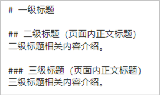
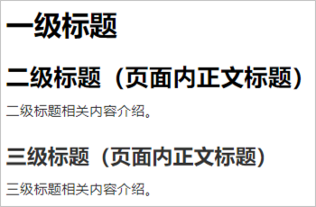

# 文档结构

## 标题

### 标题规则

【规则】标题应概括反映章节的中心内容，体现章节内容的核心关键词。避免使用“概述Overview”、“简介Introduction”等不带有核心关键词的标题，应补充核心关键词如“内核概述”、“OpenHarmony简介”。

【规则】相同级别、相同类型的标题结构保持一致。

| **正例** | **反例** |
| -------- | -------- |
| 内核概述 驱动概述 【点评】同为概念类页面，标题风格保持一致。 | 内核介绍 驱动概述 |
| 音频播放开发指导 音频管理开发指导 【点评】同为操作/指导类页面，标题风格保持一致。 | 音频播放开发指导 音频管理开发 |

【规则】标题中使用的缩略语不必给出全称。标题中出现某一缩略语时，采用以下方式处理：

- 首次出现该缩略语时，需在随后的正文中给出其全称。

- 非首次出现该缩略语时，不需在随后的正文中给出其全称。

- 无法判断是否为首次出现该缩略语时，按首次出现该缩略语处理。

【规则】标题中不能出现特殊字符。

- 这些特殊字符包括：+、-、\*、?、|、^、~、""、'、\、/。由于这些特殊字符带有某些特殊的语义，当这些特殊字符在标题中出现时，会导致标题无法正确显示或无法出现在搜索结果中。

- 当标题中无法避免产品名称、功能或特性连用时，请谨慎使用半角的“/”或“&amp;”。

【规则】标题结尾不允许使用句号、问号、冒号等标点符号。即使是FAQ的标题也不例外。

【规则】标题中不能带上下标。

【规则】标题中存在补充说明文字时，统一使用圆括号标识。补充说明文字区分不同维度时，用中文逗号分隔。如：快速入门（标准系统，安装包方式）。

【建议】中文标题长度不超过15个汉字，英文不超过25个字符（包括空格）。

【建议】概念类/描述类/功能介绍类章节的标题采用名词或名词性词组。

| 建议 | 不建议 |
| -------- | -------- |
| OpenHarmony介绍 | 介绍OpenHarmony |

【建议】任务类章节的标题建议采用动宾结构。

| 建议 | 不建议 |
| -------- | -------- |
| 开发首个Hello&nbsp;World | 首个Hello&nbsp;World开发 |

### 标题样式

【规则】标题包含一级标题、二级标题、三级标题，同一页面内标题层级最大为三级，不允许出现四级标题。

【规则】标题级别必须遵守一级标题 &gt; 二级标题 &gt; 三级标题  的顺序。

【规则】不能混用标题的级别，例如：一级标题下面不能直接使用三级标题。

  **图1** Markdown中标题编辑样式  

  **图2** Markdown中标题预览样式  

## 段落

【规则】一个段落只能有一个主题句或中心句。主题句或中心句置于段首。

【规则】段落之间要有[清晰的逻辑结构](style-guide-language-style.md#清晰)。

【规则】根据内容特点，段落句子使用陈述、肯定或祈使语气，避免使用感叹语气。

【建议】一个段落的长度≤7行，最佳段落长度≤4行。

【建议】对于技术描述类主题，“字不如表、表不如图”，推荐使用文字、图、表相结合的方式，使内容更易理解。

【建议】不出现连续3个以上的纯文字段落。通过图、表等方式避免文字描述的单一性。

【建议】段落内容使用正文样式，不要加粗。

## 句子

【规则】每个句子只有一个主题。

【规则】使用直接陈述，避免双重否定和反问句。

【规则】避免“名词 + 名词 + 名词”修饰方式。

| **正例** | **反例** |
| -------- | -------- |
| 无 | 配置管理模块 【点评】该短句可能存在如下断句：配置“管理模块”，或“配置管理”模块，根据实际语义优化描述。 |

【规则】句子的主语应该明确。省略主语时，要保证用户能迅速并正确的确定主语。同一个句子内，避免主语变化。

| **正例** | **反例** |
| -------- | -------- |
| 无 | 提示出错 【点评】缺少主语，如“工具提示出错”、“编译子系统提示出错”，在描述时尽量具体、明确。 |

【规则】使用主谓结构、主谓宾结构的简单句，而非复合句。把复合句改为列表或分拆成简单句和简单复合句。

【规则】避免使用长连句。同一句子中的逗号数不能超过5个。

【建议】用祈使句表示动作。

| 建议 | 不建议 |
| -------- | -------- |
| 在弹出的对话框中，单击“确定”按钮。 | 在弹出的对话框中，请您单击“确定”按钮。 |

【建议】中文句子长度不超过50个汉字，英文句子长度不超过30个字符。

【建议】句子样式默认采用正文样式，不要加粗或添加背景色。

## 目录

文档目录分为手册级目录、页面内目录，便于用户高效浏览、获取关键内容。

【规则】手册级目录：手册级目录定义以Docs仓库内最小文件夹级别管理。在文件夹内新增页面、修改页面名称、删除页面时，都需同步更新手册级目录。

【规则】页面内目录：页面内目录由页面内标题自动生成，写作时请遵循页面内[标题规范及样式](#标题)。

## 文件夹及文件命名

【规则】文件夹名：使用文档描述对象的主题英文名称，如：ability、ui等，全小写。

【规则】Markdown文件命名规范：

- 由字母、数字、中划线“-”组成。统一使用“.md”（小写）后缀。

- 仅对系统应用开放的文件，其文件名需要以“-sys.md”结尾。示例如下：

  | **分类** | **标题** | **文件名** |
  | ------   | -------- | -------- |
  | 指南  | 任务管理（仅对系统应用开放） | mission-management-sys.md | 
  | API参考  | @ohos.multimedia.image (图片处理)(系统接口) | js-apis-image-sys.md | 

- 除Readme.md外，其他文件名原则上全小写。如果驼峰写法能够使文件名可读性更好，可以酌情使用驼峰写法。

- 语义化，文件名能对文档主题内容进行概括，建议取自该文档的英文标题，如：ability-assistant-guidelines.md。

- 原则上不超过4个英文单词。

- 同一文件夹下，文件名不允许重复。
