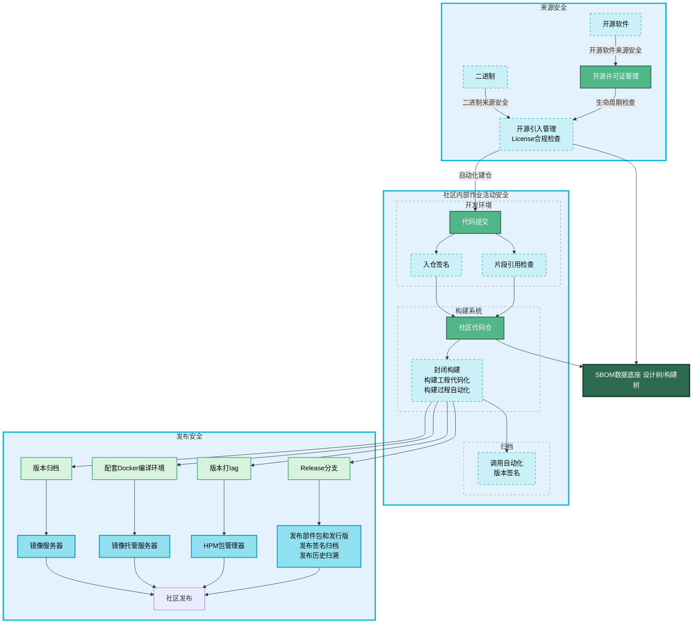

# 社区供应链安全治理

## 概述

为保障 OpenHarmony 开源项目的完整性、安全性与合规性，社区建立了一套贯穿软件全生命周期的供应链安全治理框架。该框架通过对 **来源安全**、**社区内部作业活动安全** 和 **发布安全** 三个核心阶段进行严格管控，并以 **SBOM（软件物料清单）数据底座** 作为统一的技术支撑，实现对软件供应链的端到端安全保障。

### 治理流程图

## 治理流程详解

### 1. 来源安全

来源安全是供应链的第一道防线，旨在确保所有进入社区代码仓的软件组件和代码都是可信且合规的。

-   **第三方开源软件引入**：所有计划引入的第三方组件，都必须经过严格的准入审查，包括漏洞扫描、社区健康度评估以及许可证合规性分析。
-   **社区贡献者代码**：来自社区贡献者的代码提交，需通过自动化的代码审查和安全扫描流程，确保代码质量与安全。
-   **开源许可证管理**：社区设有专门的许可证管理机制，对所有引入的组件进行合规性检查，并将结果记录到 **SBOM** 数据底座，以防范法律风险。

### 2. 社区内部作业活动安全

代码进入社区后，通过自动化的安全工具链和流程，对开发和构建过程进行持续监控，及时发现并修复风险。

-   **社区代码仓**：作为可信代码的存储库，所有代码变更都将被记录和追溯。
-   **自动化安全门禁**：代码在集成过程中会触发一系列自动化扫描，形成安全门禁：
    -   **静态代码扫描**：检查源代码中的潜在安全缺陷。
    -   **软件成分分析 (SCANOSS)**：识别项目中的所有直接和间接依赖，分析其来源、版本和许可证。
    -   **漏洞扫描**：将识别出的开源组件与已知的漏洞数据库进行比对，发现潜在安全漏洞。
-   **风险数据沉淀**：所有扫描结果都将汇集到 **SBOM** 数据底座，用于持续的风险评估和监控。

### 3. 发布安全 (Release Security)

发布安全是交付可信软件给最终用户的最后一道关卡，确保发布的产物是完整、可追溯且未被篡改的。

-   **版本归档**：通过安全审计的构建产物将被安全地归档到制品仓库中。
-   **配套 Docker 编译环境**：为每个正式版本提供配套的 Docker 编译环境，确保构建过程的可复现性，便于安全审计和问题排查。
-   **版本标识与追溯**：通过对发布版本打上明确的 Git Tag 和创建专属的 Release 分支，建立从二进制产物到源代码的精确追溯链。
-   **安全分发**：最终的发行版通过官方、可信的渠道分发给用户。

### 4. SBOM 数据底座

**SBOM** 数据底座是整个供应链安全治理框架的核心，它提供了全面的软件透明度，是实现持续风险监控和快速应急响应的基础。

-   **核心作用**：作为一个动态更新的数据库，它记录了 OpenHarmony 项目中所有软件组件的详细信息，包括其来源、版本、许可证、依赖关系和已知漏洞。
-   **设计树与构建树**：**SBOM** 底座同时管理“设计树”（开发阶段计划引入的组件）和“构建树”（最终构建产物中实际包含的组件），通过比对两者差异，可精确识别供应链中的潜在风险。
-   **数据驱动安全**：通过对 **SBOM** 数据的持续分析，社区能够快速定位受新曝出漏洞影响的组件，并高效地组织修复和版本更新工作。
