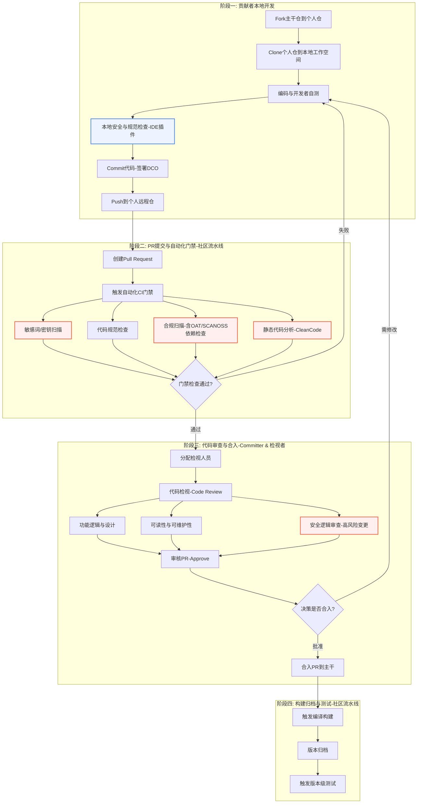

# OpenHarmony 社区贡献流程

本流程旨在指导社区贡献者高效、安全、合规地参与OpenHarmony项目贡献。流程整合了开发、自动化门禁、人工审查和安全保障等关键环节，全流程参考如下流程图。



## 1. 贡献准备 (代码下载)

### 环境配置
-   安装并配置Git，参考码云帮助中心：[Git知识大全](https://gitcode.com/help/categories/43)
-   在gitcode上配置SSH公钥，参考：[公钥管理](https://gitcode.com/help/articles/4191)

### 获取代码
1.  **Fork主干仓**：在OpenHarmony gitcode组织下找到您感兴趣的仓库，点击右上角的 "Fork" 按钮，创建一份个人名下的代码副本（个人仓）。
2.  **Clone到本地**：将您的个人仓克隆（clone）到本地计算机，作为您的本地工作空间。
    ```bash
    git clone git@gitcode.com:{your_gitcode_id}/{repository_name}.git
    cd {repository_name}

3.  **创建开发分支**：基于最新的主干代码创建一个新的本地分支，用于本次贡献。
    
    ```bash
    # 关联上游主仓库（仅首次需要）
    git remote add upstream https://gitcode.com/openharmony/{repository_name}.git
    
    # 同步最新代码并创建新分支
    git fetch upstream
    git checkout -b my-awesome-feature upstream/master
    ```

## 2. 本地开发与自检 (编码)

### 代码开发与测试
-   在您创建的 `my-awesome-feature` 分支上进行代码编写、修改和功能开发。
-   完成必要的开发者自测，确保您的修改没有破坏现有功能，并且新功能符合预期。

### **本地静态检查 (IDE插件)**
-   **强烈建议**在编码过程中使用社区推荐的IDE插件（如代码规范、静态分析插件）。
-   这些插件可以在您提交代码前，实时发现并帮助修复编码规范、潜在缺陷和简单的安全问题，是提升贡献质量的第一道防线。

### 提交本地变更
-   OpenHarmony社区要求所有贡献者签署**开发者原创声明 (DCO)**，通过在 `git commit` 时使用 `-s` 或 `--signoff` 参数完成。
-   提交信息（Commit Message）应遵循社区规范，清晰地描述变更内容。
    ```bash
    git add .
    git commit -sm "feat: your feature description
    
    Detailed description of the changes you made.
    
    issue: #IXXXXX"
    ```
-   将本地分支推送到您的gitcode个人远程仓。
    ```bash
    git push origin my-awesome-feature
    ```

## 3. 提交PR与自动化门禁

### 创建Pull Request (PR)
-   访问您gitcode上的个人仓页面，点击“Pull Request”按钮。
-   选择源分支（您的`my-awesome-feature`分支）和目标分支（通常是`openharmony/master`），填写PR标题和描述后提交。
-   **【安全增补】** 如果您的变更涉及安全敏感领域（如加密、权限、内核），请在PR描述中明确说明，以便安全专家重点关注。

### 自动化CI门禁构建
提交PR后，社区流水线将自动触发一系列门禁检查。**任何一项失败都将阻止PR合入**，您需要根据失败报告修复问题并重新提交。

门禁检查包括但不限于：

-   **编译构建**：确保您的代码可以成功编译。
-   **单元测试/功能测试**：运行自动化测试用例。
-   **【安全增补】静态检查能力构建**:
    1.  **代码规范检查**：检查代码风格是否符合社区规范。
    2.  **敏感词/敏感信息扫描**：自动扫描代码，防止硬编码的密钥、密码、Token等敏感信息泄露。
    3.  **合规扫描**：
        -   **License检查**：确保引入的文件和依赖的License符合社区策略。
        -   **软件成分分析 (SCANOSS)**：扫描第三方开源软件片段引用，检查是否存在已知的安全漏洞(CVE)。
    4.  **静态代码分析 **：使用类似CleanCode的工具深度扫描代码，发现潜在的质量缺陷和安全漏洞。

## 4. 代码审查与合入

### 代码检视 (Code Review)
-   门禁通过后，Committer会**分配检视人员 (Reviewer)** 对您的代码进行人工审查。
-   检视者会从功能逻辑、代码设计、可读性、可维护性等方面提出评审意见。
-   **安全专项审查**：对于高风险或标记为安全敏感的PR，由**安全委员会 (Security SIG)** 成员或指定的安全专家进行额外审查。
-   您需要根据评审意见修改代码，并再次推送更新。此过程可能会有多轮。

### 审核与合入
-   当您的PR获得足够数量的检视者批准（Approve）后，Committer会进行最终审核。
-   审核和测试通过后，CI会将您的PR**合入 (Merge)** 到项目的主干分支。至此，您的贡献就正式成为OpenHarmony项目的一部分。

## 5. 构建归档与测试

PR合入主干后，社区流水线会执行后续任务：
1.  **编译构建**：将包含您代码的最新主干进行全量编译。
2.  **版本归档**：将成功的构建产物进行归档，形成每日构建或候选版本。
3.  **测试**：对归档后的版本进行更全面的集成测试和系统测试，以确保整个系统的稳定性和质量。

