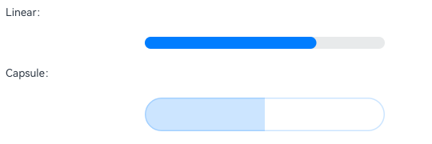
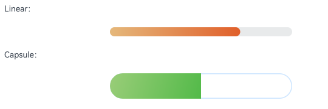

# ArkUI子系统Changelog

## cl.arkui.1 Progress组件color属性设置渐变色规格变更

**访问级别**

公开接口

**变更原因**

Progress的渐变色能力增强，新增支持通过color设置Linear和Capsule进度条前景色为渐变色。

**变更影响**

此变更涉及应用适配。

变更前：Progress进度条的Linear和Capsule样式通过color设置渐变色，设置后仅会显示为默认主题色。<br/>
变更后：Progress进度条的Linear和Capsule样式通过color设置渐变色，设置后会显示为指定的渐变色。

例如使用下面代码，通过color设置Linear和Capsule样式进度条的前景色为渐变色，变更前均显示为默认主题色蓝色，变更后可以显示为实际的设置效果。

```ts
// xxx.ets
@Entry
@Component
struct ProgressExample {
  private gradientColor: LinearGradient = new LinearGradient([{ color: "#E5B87B", offset: 0.5 },
    { color: "#E05F2A", offset: 1.0 }])
  public gradientColor2: LinearGradient = new LinearGradient([{ color: "#99CD78", offset: 0.5 },
    { color: "#53BA49", offset: 1.0 }])

  build() {
    Column({ space: 15 }) {
      Text('Linear：').fontSize(9).width('90%')
      Progress({ value: 70, total: 100, type: ProgressType.Linear })
        .width(200).style({ strokeWidth: 10 })
        .color(this.gradientColor)

      Text('Capsule：').fontSize(9).width('90%')
      Progress({ value: 50, total: 100, type: ProgressType.Capsule })
        .width(200).style({ strokeWidth: 40 })
        .color(this.gradientColor2)
    }.width('100%').padding({ top: 5 })
  }
}
```

| 变更前 | 变更后 |
|------ |--------|
|||

**起始API Level**

7

**变更发生版本**

从OpenHarmony SDK 6.1.0.20开始。

**变更的接口/组件**

Progress组件的[color](../../../application-dev/reference/apis-arkui/arkui-ts/ts-basic-components-progress.md#color)属性。

**适配指导**

开发者需根据实际需求进行适配，如果期望进度条设置为单色，color中value参数的类型需为ResourceColor，参考示例如下。如果期望设置为渐变色，value参数的类型需为LinearGradient。

```ts
// xxx.ets
@Entry
@Component
struct ProgressExample {
  build() {
    Column({ space: 15 }) {
      Text('Linear Progress').fontSize(9).fontColor(0xCCCCCC).width('90%')
      Progress({ value: 20, total: 150, type: ProgressType.Linear }).color(Color.Grey).value(50).width(200)

      Text('Capsule Progress').fontSize(9).fontColor(0xCCCCCC).width('90%')
      Row({ space: 40 }) {
        Progress({ value: 20, total: 150, type: ProgressType.Capsule }).color(Color.Grey).value(50).width(100).height(50)
      }
    }.width('100%').margin({ top: 30 })
  }
}
```