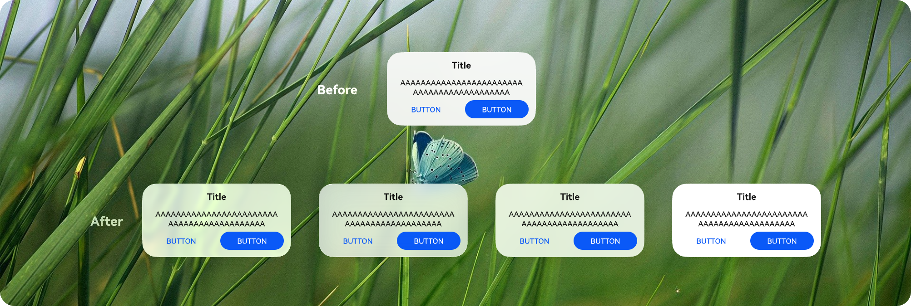
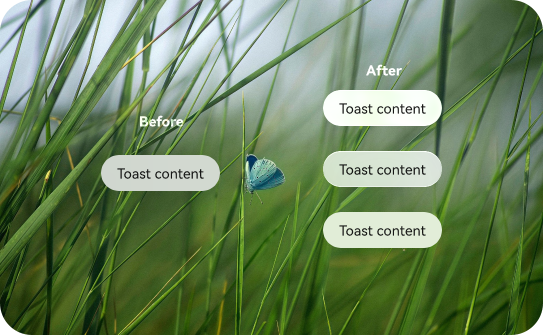
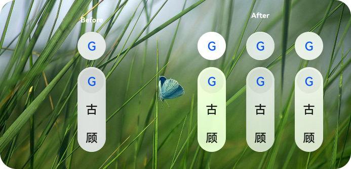
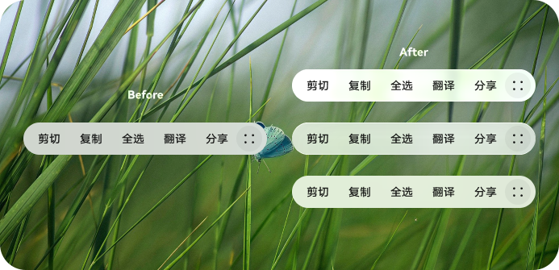

# ArkUI子系统变更说明

## cl.arkui.1 @ReusableV2组件复用的reuse属性支持动态复用标识

**访问级别**

公共能力

**变更原因**

当前[@ReusableV2](../../../application-dev/ui/state-management/arkts-new-reusableV2.md)装饰器装饰的自定义组件的reuse属性不支持使用动态的reuseId，变更后可增强V2组件复用能力，支持动态复用标识。

**变更影响**

此变更为不兼容变更，涉及应用适配。

- 变更前：如果开发者使用了如下所示等非显式返回字符串字面量形式的reuseId，实际的复用标识ID为该可复用自定义组件的名称。

- 变更后：如果开发者使用了下述形式的reuseId，实际的复用标识ID为该回调的返回值。

```ts
const globalReuseId: string = 'globalReuseId';
@Entry
@ComponentV2
struct Index {
  getReuseIdInMethod(idNumber: number): string {
    return `reuseIdInMethod${idNumber}`;
  }
  build() {
    Column() {
      ReusableV2Component()
        // 变更前实际复用标识为自定义组件名称"ReusableV2Component"
        // 变更后实际复用标识为"globalReuseId"
        .reuse({reuseId: () => globalReuseId})
      ReusableV2Component()
        // 变更前实际复用标识为自定义组件名称"ReusableV2Component"
        // 变更后实际复用标识为"reuseIdInMethod1"
        .reuse({reuseId: () => this.getReuseIdInMethod(1)})
    }
  }
}
@ReusableV2
@ComponentV2
struct ReusableV2Component {
  build() {
    Column() {
      Text('ReusableV2Component')
    }
  }
}
```

**起始 API Level**

18

**变更发生版本**

从OpenHarmony SDK 7.0.0.20开始。

**变更的接口/组件**

涉及接口：[ReuseOptions](../../../application-dev/reference/apis-arkui/arkui-ts/ts-universal-attributes-reuse.md#reuseoptions)里的reuseId参数。

变更前后会受到影响的组件为@ReusableV2装饰器装饰的自定义组件。该变更可能导致：

- 原本可以相互复用的自定义组件无法再相互复用：
  ```ts
  @Entry
  @ComponentV2
  struct Index {
    getReuseIdInMethod(idNumber: number): string {
      return `reuseIdInMethod${idNumber}`;
    }
  
    build() {
      Column() {
        // 变更后，在API版本26.0.0及以上，下述两个ReusableComponentOne组件的实际复用标识不一致，无法相互复用。
        ReusableComponentOne()
          // 变更前实际复用标识为自定义组件名称"ReusableComponentOne"
          // 变更后实际复用标识为"reuseIdInMethod1"
          .reuse({reuseId: () => this.getReuseIdInMethod(1)})
        ReusableComponentOne()
          // 变更前实际复用标识为自定义组件名称"ReusableComponentOne"
          // 变更后实际复用标识为"reuseIdInMethod2"
          .reuse({reuseId: () => this.getReuseIdInMethod(2)})
      }
    }
  }
  @ReusableV2
  @ComponentV2
  struct ReusableComponentOne {
    build() {
      Column() {
        Text('ReusableComponentOne')
      }
    }
  }
  ```

- 原本不可以相互复用的自定义组件可以相互复用：
  ```ts
  @Entry
  @ComponentV2
  struct Index {
    getReuseIdInMethod(idNumber: number): string {
      return `reuseIdInMethod${idNumber}`;
    }

    build() {
      Column() {
        // 变更后，在API版本26.0.0及以上ReusableComponentOne和ReusableComponentTwo组件实际复用标识一致，可以相互复用
        ReusableComponentOne()
          // 变更前实际复用标识为自定义组件名称"ReusableComponentOne"
          // 变更后实际复用标识为"reuseIdInMethod1"
          .reuse({reuseId: () => this.getReuseIdInMethod(1)}) 
        ReusableComponentTwo()
          // 变更前实际复用标识为自定义组件名称"ReusableComponentTwo"
          // 变更后实际复用标识为"reuseIdInMethod1"
          .reuse({reuseId: () => this.getReuseIdInMethod(1)})
      }
    }
  }
  @ReusableV2
  @ComponentV2
  struct ReusableComponentOne {
    build() {
      Column() {
        Text('ReusableComponentOne')
      }
    }
  }
  @ReusableV2
  @ComponentV2
  struct ReusableComponentTwo {
    build() {
      Column() {
        Text('ReusableComponentTwo')
      }
    }
  }
  ```

**适配指导**

对于不希望相互复用的V2复用组件，使用不同的复用标识reuseId；对于希望相互复用的组件，使用相同的复用标识reuseId。例如，当希望如下两个组件ComponentA和ComponentB组件可以相互复用时，设置同样的复用标识。点击按钮让两个组件消失，二者进入同一复用池中，可以相互复用。再次点击任一按钮，后进入复用池的组件先显示到页面上：

```ts
const globalReuseId = 'globalReuseId';
@Entry
@ComponentV2
struct Index {
  @Local condition1: boolean = true;
  @Local condition2: boolean = true;
  build() {
    Column({ space: 10 }) {
      // 变更后，在API版本26.0.0及以上ComponentA和ComponentB组件实际复用标识一致，均为'globalReuseId'，可以相互复用。
      Button('change condition1')
        .onClick(() => { this.condition1 = !this.condition1; })
      Button('change condition2')
        .onClick(() => { this.condition2 = !this.condition2; })
      if (this.condition1) {
        ComponentA().reuse({ reuseId: () => globalReuseId })
      }
      if (this.condition2) {
        ComponentB().reuse({ reuseId: () => globalReuseId })
      }
    }
  }
}
@ReusableV2
@ComponentV2
struct ComponentA {
  build() {
    Column() {
      Text('ComponentA')
    }
  }
}
@ReusableV2
@ComponentV2
struct ComponentB {
  build() {
    Column() {
      Text('ComponentB')
    }
  }
}
```

## cl.arkui.2 Dialog、Toast、AlphabetIndexer和文本选择菜单默认开启沉浸式系统材质

**访问级别**

公共能力

**变更原因**

ArkUI组件支持对接沉浸式系统材质功能，为减少应用适配成本，部分高频组件默认开启沉浸式系统材质功能。组件范围为所有的弹出框Dialog、Toast、AlphabetIndexer和文本选择菜单。

**变更影响**

此变更为不兼容变更，涉及应用适配。

- 变更前：所有组件默认均不开启沉浸式系统材质。

- 变更后：Dialog、Toast、AlphabetIndexer和文本选择菜单默认开启沉浸式系统材质。

**起始 API Level**

12

**变更发生版本**

从OpenHarmony SDK 7.0.0.20开始。

**变更的接口/组件**

涉及接口：

- [showAlertDialog](../../../application-dev/reference/apis-arkui/arkts-apis-uicontext-uicontext.md#showalertdialog)
- [showActionSheet](../../../application-dev/reference/apis-arkui/arkts-apis-uicontext-uicontext.md#showactionsheet)
- [showActionMenu](../../../application-dev/reference/apis-arkui/arkts-apis-uicontext-promptaction.md#showactionmenu11)
- [showDialog](../../../application-dev/reference/apis-arkui/arkts-apis-uicontext-promptaction.md#showdialog)
- [openCustomDialog](../../../application-dev/reference/apis-arkui/arkts-apis-uicontext-promptaction.md#opencustomdialog12)
- [自定义弹窗 (CustomDialog)](../../../application-dev/reference/apis-arkui/arkui-ts/ts-methods-custom-dialog-box.md)
- [showToast](../../../application-dev/reference/apis-arkui/arkts-apis-uicontext-promptaction.md#showtoast)
- [openToast](../../../application-dev/reference/apis-arkui/arkts-apis-uicontext-promptaction.md#opentoast18)
- [AlphabetIndexer](../../../application-dev/reference/apis-arkui/arkui-ts/ts-container-alphabet-indexer.md)
- [文本选择菜单](../../../application-dev/reference/apis-arkui/arkui-ts/ts-basic-components-text.md#copyoption9)

沉浸式系统材质效果和设备算力相关，详见[系统材质](../../../application-dev/reference/apis-arkui/arkts-apis-uimaterial.md)。变更前后的效果图如下。

Dialog变更前后的效果图：



Toast变更前后的效果图：



AlphabetIndexer变更前后的效果图：



文本选择菜单变更前后的效果图：




**适配指导**

1. 当开发者主动为上述组件配置了背景色、背景模糊、阴影和边框样式时，沉浸式系统材质不会默认生效，如开发者期望沉浸式系统材质生效，建议删除自定义的背景色、背景模糊、阴影和边框样式设置。

2. 如果开发者不期望开启沉浸式系统材质功能，可通过应用级开关能力，强制禁止应用内所有组件使用沉浸式系统材质。

   在[module.json5](../../../application-dev/quick-start/module-configuration-file.md)文件中配置metadata（仅在entry类型的module中配置生效），将value设置为"disable"即可禁用所有组件的沉浸式系统材质。

   ``` ts
   {
     "module": {
       // ...
       "type": "entry",
       // ...
       "metadata": [{
         "name": "ohos.arkui.UIMaterial.state",
         "value": "disable"
       }]
       // ...
     }
   }
   ```
   更多配置说明参见[MaterialState](../../../application-dev/reference/apis-arkui/arkts-apis-uimaterial.md#materialstate)。

3. 如果开发者仅想关闭部分组件的沉浸式系统材质，可通过组件提供的组件级接口关闭指定组件的沉浸式系统材质功能。

   为需要关闭材质的组件设置[systemMaterial](../../../application-dev/reference/apis-arkui/arkui-ts/ts-universal-attributes-image-effect.md#systemmaterial)为uiMaterial.Material.[empty](../../../application-dev/reference/apis-arkui/arkts-apis-uimaterial.md#empty)。

   ``` ts
   import { uiMaterial } from '@kit.ArkUI';

   this.getUIContext().getPromptAction().showToast({
     message: 'Toast Content',
     // 关闭指定组件的沉浸式系统材质
     systemMaterial: uiMaterial.Material.empty
   });
   ```

## cl.arkui.3 鼠标事件rawDeltaX和rawDeltaY的返回值变更

**访问级别**

公共能力

**变更原因**

鼠标事件rawDeltaX和rawDeltaY的返回值的含义为鼠标设备在二维平面的物理移动偏移量，其数值为鼠标硬件的原始移动数据，使用物理世界中鼠标移动的距离单位进行表示，上报由鼠标硬件本身决定。当前实现返回值并非是原始移动数据，而是原始移动数据缩小了X倍，X为系统的显示大小比例。因此需要变更返回值使其符合本身的含义。

**变更影响**

此变更涉及应用适配。

- 变更前：rawDeltaX和rawDeltaY的返回值并非鼠标硬件的原始移动数据，而是原始数据缩小了X倍，X为系统的显示大小比例。
  
- 变更后：rawDeltaX和rawDeltaY的返回值为鼠标硬件的原始移动数据。

**起始API Level**

15

**变更发生版本**

从OpenHarmony SDK 7.0.0.20开始。

**变更的接口/组件**

[rawDeltaX](../../../application-dev/reference/apis-arkui/arkui-ts/ts-universal-mouse-key.md#mouseevent对象说明)、[rawDeltaY](../../../application-dev/reference/apis-arkui/arkui-ts/ts-universal-mouse-key.md#mouseevent对象说明)、[OH_ArkUI_MouseEvent_GetRawDeltaX](../../../application-dev/reference/apis-arkui/capi-ui-input-event-h.md#oh_arkui_mouseevent_getrawdeltax)和[OH_ArkUI_MouseEvent_GetRawDeltaY](../../../application-dev/reference/apis-arkui/capi-ui-input-event-h.md#oh_arkui_mouseevent_getrawdeltay)。

**适配指导**

开发者如果想要恢复变更前的效果，可以使用[px2vp](../../../application-dev/reference/apis-arkui/arkts-apis-uicontext-uicontext.md#px2vp12)接口获取变更之前的值。

```ts
// xxx.ets
@Entry
@Component
struct MouseEventExample {
  @State mouseText: string = '';

  build() {
    Column({ space: 20 }) {
      Button('onMouse')
        .width(180).height(80)
        .fontSize(24)
        .onMouse((event: MouseEvent): void => {
          if (event) {
            this.mouseText = 'rawDeltaX = ' + this.getUIContext().px2vp(event.rawDeltaX) +
              '\nrawDeltaY = ' + this.getUIContext().px2vp(event.rawDeltaY);
          }
        })
      Text(this.mouseText)
    }.padding({ top: 30 }).width('100%')
  }
}
```