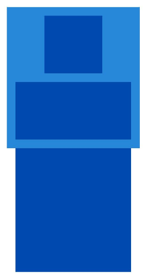

# ArkUI子系统变更说明

## cl.arkui.1 LayoutPolicy.matchParent父组件为Row、Column、Flex组件时，单方向设置matchParent的子组件布局行为变更

**访问级别**

公共能力

**变更原因**

当前Row、Column、Flex组件布局过程中，单方向设置matchParent的子组件不会参与父组件的尺寸计算。变更后，Row、Column、Flex组件会自适应单方向matchParent子组件尺寸，布局效果更符合API语义。

**变更影响**

此变更涉及应用适配。

变更前：当Row、Column、Flex组件主轴尺寸自适应子组件，且子组件A仅交叉轴设置matchParent时，子组件A不参与Row、Column、Flex组件的主轴尺寸测量过程，此时Row、Column、Flex组件主轴方向不自适应子组件A的尺寸。交叉轴方向同理。

变更后：当Row、Column、Flex组件主轴尺寸自适应子组件，且子组件A仅交叉轴设置matchParent时，子组件A会参与Row、Column、Flex组件的主轴尺寸测量过程，此时Row、Column、Flex组件主轴方向会自适应子组件A的尺寸。交叉轴方向同理。

例如：运行以下示例，进入页面后观察父组件Column的大小。变更前Column组件只会被第一个子组件撑大，变更后，Column组件高度自适应第一个和第二个子组件，宽度自适应第一个和第三个子组件。

```ts
@Entry
@Component
struct Demo {
  build() {
    Column() {
      Column({space: "30px"}) {
        Column()
          .width("200px")
          .height("200px")
          .backgroundColor('rgb(0, 74, 175)')

        Column()
          .width(LayoutPolicy.matchParent)
          .height("200px")
          .backgroundColor('rgb(0, 74, 175)')

        Column()
          .width("400px")
          .height(LayoutPolicy.matchParent)
          .backgroundColor('rgb(0, 74, 175)')
      }
      .width(LayoutPolicy.wrapContent)
      .height(LayoutPolicy.wrapContent)
      .backgroundColor('rgb(39, 135, 217)')
      .padding("30px")
    }.width("100%")
  }
}
```

变更前后效果如下：

|变更前|变更后|
|--|--|
|||

**起始 API Level**

15

**变更发生版本**

从 OpenHarmony SDK 7.0.0.21 开始。

**变更的接口/组件**

涉及组件：[Row](../../../application-dev/reference/apis-arkui/arkui-ts/ts-container-row.md)、[Column](../../../application-dev/reference/apis-arkui/arkui-ts/ts-container-column.md)、[Flex](../../../application-dev/reference/apis-arkui/arkui-ts/ts-container-flex.md)。

涉及接口：[LayoutPolicy.matchParent](../../../application-dev/reference/apis-arkui/arkui-ts/ts-universal-attributes-size.md#layoutpolicy15)。

**适配指导**

默认行为变更，但开发者需审视此变更是否对自身相关业务代码逻辑产生影响，若有影响需根据自身业务代码进行适配。如果开发者要用原先的布局效果，可以根据未设置matchParent的子组件手动设置父组件尺寸。

## cl.arkui.2 UIExtensionComponent获焦能力变更

**访问级别**

公共能力

**变更原因**

UIExtensionComponent获焦后，其拉起的UIExtensionAbility窗口内焦点不会停留在容器组件，而是下发到容器内第一个可获焦子节点。当获焦节点为[TextInput](../../../application-dev/reference/apis-arkui/arkui-ts/ts-basic-components-textinput.md)时，会出现软键盘被意外拉起的情况。

**变更影响**

此变更涉及应用适配。

变更前：UIExtensionComponent获焦时，其拉起的UIExtensionAbility窗口内焦点直接下发到第一个可获焦子节点。

变更后：UIExtensionComponent获焦时，
1. 如果外部走焦到UIExtensionAbility，焦点正常下发到第一个可获焦子节点。
2. 如果由于层级页面切换导致焦点转移到UIExtensionAbility，则与UIAbility保持统一规则。两者在拉起一个层级页面且该页面未设置[defaultFocus](../../../application-dev/reference/apis-arkui/arkui-ts/ts-universal-attributes-focus.md#defaultfocus9)、未[主动请求焦点](../../../application-dev/ui/arkts-common-events-focus-event.md#主动获焦失焦)时，焦点均停留在根容器，不下发到子节点。

**起始 API Level**

18

**变更发生版本**

从OpenHarmony SDK 7.0.0.21开始。

**变更的接口/组件**

[UIExtensionComponent](../../../application-dev/ui/arkts-ui-extension-components-sys.md)。

**适配指导**

在由于层级页面切换导致焦点转移到UIExtensionAbility的场景下，如果期望第一个可获焦子组件自动获焦，可以通过如下两种方式显式设置焦点。

- 方式一：在UIExtensionAbility的页面中，通过将[defaultFocus](../../../application-dev/reference/apis-arkui/arkui-ts/ts-universal-attributes-focus.md#defaultfocus9)设置为true，使得第一个可获焦子组件成为层级页面的默认焦点。

```ts
@Entry
@Component
struct UIExtensionPage {
  build() {
    Column({ space: 20 }) {
      TextInput({ placeholder: 'Input something...' })
        .width(300)
        .height(50)
        .defaultFocus(true)

      Button('Submit')
        .width(200)
        .height(50)
    }.width('100%').height('100%').justifyContent(FlexAlign.Center)
  }
}
```

- 方式二：在UIExtensionAbility的页面中，通过[requestFocus](../../../application-dev/ui/arkts-common-events-focus-event.md#主动获焦失焦)主动为第一个可获焦子组件请求焦点。

```ts
@Entry
@Component
struct UIExtensionPage {
  build() {
    Column({ space: 20 }) {
      TextInput({ placeholder: 'Input something...' })
        .width(300)
        .height(50)
        .id('targetInput')

      Button('Submit')
        .width(200)
        .height(50)
    }
    .width('100%')
    .height('100%')
    .justifyContent(FlexAlign.Center)
    .onAppear(() => {
      this.getUIContext().getFocusController().requestFocus('targetInput');
    })
  }
}
```
