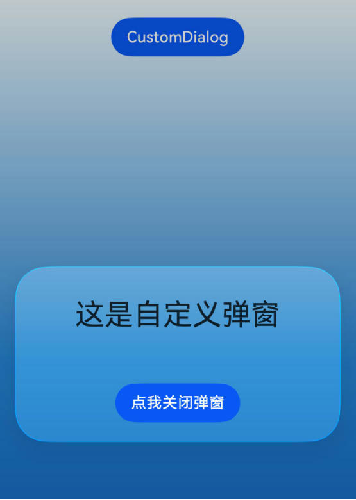

# ArkUI子系统变更说明

## cl.arkui.1 沉浸光感新增生效约束

**访问级别**

公共能力

**变更原因**

为确保性能和功耗体验最优，规范沉浸光感组件使用，沉浸光感对部分组件新增生效范围的约束。

**变更影响**

此变更涉及应用适配。

- 变更前：针对支持开启沉浸光感的所有组件，沉浸光感开启后，沉浸光感效果生效。

- 变更后：
  - 弹窗类组件（AlertDialog、ActionSheet、CustomDialog、CalendarPickerDialog、DatePickerDialog、TimePickerDialog、TextPickerDialog、SelectionMenu、AlphabetIndexer弹窗、Text设置copyOption后长按或双击触发的文本菜单）和弹窗类接口（PromptAction、ArkUI_NativeDialog、@ohos.promptAction (弹窗)、Popup控制、Tips控制、菜单控制、半模态转场）以及按钮与选择类组件（Slider、Toggle、Select）仍可在页面内全部区域生效，与变更前无变化。
  - 其他组件仅在Navigation/NavDestination标题栏或横向Tab中barPosition为BarPosition.End的底部TabBar中生效。在其他区域中设置沉浸光感效果不生效。

以下示例展示了，其他组件（如Column）不在Navigation/NavDestination标题栏或底部TabBar区域中设置沉浸光感，在变更前后的效果变化：

```ts
import { uiMaterial } from '@kit.ArkUI';

@Entry
@Component
struct MaterialScopeExample {
  build() {
    Stack() {
      Column()
        .width('100%')
        .height('100%')
        .linearGradient({
          angle: 0, // 渐变角度，0度是从左到右。
          colors: [
            ['#004AAF', 0.0], // 起始颜色及位置（0.0表示起点）。
            ['#2787D9', 0.5], // 中间颜色及位置。
            ['#F0FAFF', 1.0] // 结束颜色及位置（1.0表示终点）。
          ]
        })
      Column() {
        // 标题栏/底部TabBar范围外的普通组件
        Column() {
          Text('普通组件')
            .fontSize(32)
            .fontWeight(FontWeight.Bold)
        }
        .width(328)
        .height(56)
        .borderRadius(28)
        .justifyContent(FlexAlign.Center)
        .systemMaterial(new uiMaterial.ImmersiveMaterial({
          style: uiMaterial.ImmersiveStyle.THIN,
        }))
      }
    }
  }
}

```

变更前，Column组件通过systemMaterial设置了沉浸光感，沉浸光感效果生效。示例图片如下：


变更后，Column组件通过systemMaterial设置了沉浸光感，由于不处于生效范围内，沉浸光感效果不生效。示例图片如下：


**起始 API Level**

26.0.0

**变更发生版本**

从OpenHarmony SDK 7.0.0.40开始。

**变更的接口/组件**

除以下清单以外的所有ArkUI组件：

- 弹窗类组件（[AlertDialog](../../../application-dev/reference/apis-arkui/arkui-ts/ts-methods-alert-dialog-box.md)、[ActionSheet](../../../application-dev/reference/apis-arkui/arkui-ts/ts-methods-action-sheet.md)、[CustomDialog](../../../application-dev/reference/apis-arkui/arkui-ts/ts-methods-custom-dialog-box.md)、[CalendarPickerDialog](../../../application-dev/reference/apis-arkui/arkui-ts/ts-methods-calendarpicker-dialog.md)、[DatePickerDialog](../../../application-dev/reference/apis-arkui/arkui-ts/ts-methods-datepicker-dialog.md)、[TimePickerDialog](../../../application-dev/reference/apis-arkui/arkui-ts/ts-methods-timepicker-dialog.md)、[TextPickerDialog](../../../application-dev/reference/apis-arkui/arkui-ts/ts-methods-textpicker-dialog.md)、[SelectionMenu](../../../application-dev/reference/apis-arkui/arkui-ts/ohos-arkui-advanced-SelectionMenu.md)、[AlphabetIndexer](../../../application-dev/reference/apis-arkui/arkui-ts/ts-container-alphabet-indexer.md)弹窗、[Text](../../../application-dev/reference/apis-arkui/arkui-ts/ts-basic-components-text.md)设置copyOption后长按或双击触发的文本菜单）。
- 弹窗类接口（[PromptAction](../../../application-dev/reference/apis-arkui/arkts-apis-uicontext-promptaction.md)、[ArkUI_NativeDialog](../../../application-dev/reference/apis-arkui/capi-arkui-nativemodule-arkui-nativedialog.md)、[@ohos.promptAction](../../../application-dev/reference/apis-arkui/js-apis-promptAction.md) (弹窗)、[Popup控制](../../../application-dev/reference/apis-arkui/arkui-ts/ts-universal-attributes-popup.md)、[Tips控制](../../../application-dev/reference/apis-arkui/arkui-ts/ts-universal-attributes-tips.md)、[菜单控制](../../../application-dev/reference/apis-arkui/arkui-ts/ts-universal-attributes-menu.md)、[半模态转场](../../../application-dev/reference/apis-arkui/arkui-ts/ts-universal-attributes-sheet-transition.md)）。
- 按钮与选择类组件（[Slider](../../../application-dev/reference/apis-arkui/arkui-ts/ts-basic-components-slider.md)、[Toggle](../../../application-dev/reference/apis-arkui/arkui-ts/ts-basic-components-toggle.md)、[Select](../../../application-dev/reference/apis-arkui/arkui-ts/ts-basic-components-select.md)）。

**适配指导**

变更后，如果组件需要沉浸光感效果，需要将该组件放置于Navigation/NavDestination标题栏或Tabs的底部TabBar。

下面提供三个示例，分别介绍如何将组件放置于Navigation标题栏、横向Tabs中barPosition为BarPosition.End的底部TabBar中，开启沉浸光感效果，以及弹窗类组件开启沉浸光感的使用示例。

- Navigation标题栏适配指导

  以下示例展示了通过Navigation标题栏，使得通过systemMaterial设置Column组件的沉浸光感效果生效。

  ```ts
  import { CircleShape, uiMaterial } from '@kit.ArkUI';
  
  @Entry
  @Component
  struct MaterialScopeAdaptExample {
    private titleHeight: number = 140
  
    @Builder
    customTitle() {
      Row() {
        Text('标题栏')
          .fontColor('#182431')
          .fontSize(30)
          .lineHeight(41)
          .fontWeight(700)
        Blank()
        Column() {
          SymbolGlyph($r('sys.symbol.a_3d_square_fill'))
            .fontSize(24)
        }
        .width(50)
        .height(50)
        .clipShape(new CircleShape({
          width: 50,
          height: 50
        }))
        .justifyContent(FlexAlign.Center)
        .backgroundColor(Color.Transparent)
        // 在Navigation标题栏区域中设置Column的沉浸光感效果，处于生效范围内，沉浸光感效果生效。
        .systemMaterial(new uiMaterial.ImmersiveMaterial({
          style: uiMaterial.ImmersiveStyle.THIN,
        }))
      }
      .alignItems(VerticalAlign.Center)
      .width('100%')
      .height(this.titleHeight)
      .padding(16)
    }
  
    build() {
      Column() {
        Navigation() {
          Column() {
            // 内容
          }
          .width('100%')
          .height('100%')
          .padding(16)
          .backgroundColor('#FFFFFF')
          .linearGradient({
            angle: 0,
            colors: [
              ['#004AAF', 0.0],
              ['#2787D9', 0.5],
              ['#F0FAFF', 1.0]
            ]
          })
          .justifyContent(FlexAlign.Center)
          .alignItems(HorizontalAlign.Center)
        }
        .title({ builder: this.customTitle, height: this.titleHeight },   { barStyle: BarStyle.STACK })
        .titleMode(NavigationTitleMode.Full)
  
        // 在沉浸光感生效范围外，通过systemMaterial设置Column组件的沉浸光感效果，沉浸光感效果不生效。
        // this.customTitle()
      }.width('100%').height('100%').backgroundColor('#F1F3F5')
    }
  }

  ```

  在自定义组件中，为Column组件设置了沉浸光感，处于生效范围外，沉浸光感效果不生效。示例图片如下：

  

  在Navigation标题栏中，为Column组件设置了沉浸光感，处于生效范围内，沉浸光感效果生效。示例图片如下：

  

- 底部TabBar适配指导

  以下示例展示了使用底部TabBar，使得通过systemMaterial设置Column组件的沉浸光感效果生效。

  ```ts
  import { CircleShape, uiMaterial } from '@kit.ArkUI';

  @Entry
  @Component
  struct TabsCustomTabBarExample {
    @Builder
    tabItem(icon: Resource) {
      Column() {
        Column() {
          SymbolGlyph(icon)
            .fontSize(24)
        }
        .width(48)
        .height(48)
        .clipShape(new CircleShape({
          width: 48,
          height: 48
        }))
        .justifyContent(FlexAlign.Center)
        .backgroundColor(Color.Transparent)
        // 在Tabs的底部TabBar区域中设置Column的沉浸光感，处于生效范围内，沉浸光感效果生效。
        .systemMaterial(new uiMaterial.ImmersiveMaterial({
          style: uiMaterial.ImmersiveStyle.THIN,
        }))
      }
      .justifyContent(FlexAlign.Center)
      .alignItems(HorizontalAlign.Center)
    }
  
    @Builder
    customTabBar() {
      Row() {
        this.tabItem($r('sys.symbol.house_fill'))
        this.tabItem($r('sys.symbol.search_things'))
        this.tabItem($r('sys.symbol.person_fill'))
      }
      .alignItems(VerticalAlign.Center)
      .justifyContent(FlexAlign.SpaceEvenly)
      .height(96)
      .padding({ left: 16, right: 16, bottom: 16 })
    }
  
    build() {
      Column() {
        Tabs({ barPosition: BarPosition.End }) {
          TabContent() {
            Column()
              .width('100%')
              .height('100%')
              .backgroundColor('#FFFFFF')
              .linearGradient({
                angle: 0,
                colors: [
                  ['#004AAF', 0.0],
                  ['#2787D9', 0.5],
                  ['#F0FAFF', 1.0]
                ]
              })
          }
          .tabBar(this.tabItem($r('sys.symbol.house_fill')))
          TabContent() {
            Column()
              .width('100%')
              .height('100%')
              .backgroundColor('#FFFFFF')
          }
          .tabBar(this.tabItem($r('sys.symbol.search_things')))
          TabContent() {
            Column()
              .width('100%')
              .height('100%')
              .backgroundColor('#FFFFFF')
          }
          .tabBar(this.tabItem($r('sys.symbol.person_fill')))
        }
        .barFloatingStyle({
          adaptToHandedness: true,
          systemMaterial: new uiMaterial.ImmersiveMaterial({ style: uiMaterial.ImmersiveStyle.THIN,   colorInvert: false })
        })
        .barOverlap(true)
        .width('100%')
        .height('100%')
  
        // 在沉浸光感生效范围外，通过systemMaterial设置Column组件的沉浸光感效果，沉浸光感效果不生效。
        // this.customTabBar()
      }.width('100%').height('100%').backgroundColor('#F1F3F5')
    }
  }
  
  ```

  在自定义组件中，为Column组件设置了沉浸光感，处于生效范围外，沉浸光感效果不生效。示例图片如下：

  

  在底部TabBar中，为Column组件设置了沉浸光感，处于生效范围内，沉浸光感效果生效。示例图片如下：

  


- 弹窗类组件沉浸光感使用示例

  由于不处于Navigation/NavDestination标题栏或Tabs的底部TabBar的区域内，因此以下两个场景，设置于背板的沉浸光感效果不会生效：

  - 使用Stack组件堆叠的形式配合组件可见性实现的类弹窗效果。

  - 设置于自定义弹窗外层容器组件上的沉浸光感效果。

  上述两种场景，若想生效沉浸光感效果，建议使用弹窗类组件和弹窗类接口配合沉浸光感属性进行改造。以下示例展示了通过[CustomDialog](../../../application-dev/reference/apis-arkui/arkui-ts/ts-methods-custom-dialog-box.md)的systemMaterial属性开启沉浸光感。

  ```ts
  import { uiMaterial } from '@kit.ArkUI';
  
  @CustomDialog
  struct CustomDialogExample {
    controller?: CustomDialogController;
  
    build() {
      Column() {
        Text('这是自定义弹窗')
          .fontSize(30)
          .height(100)
        Button('点我关闭弹窗')
          .onClick(() => {
            if (this.controller != undefined) {
              this.controller.close();
            }
          })
          .margin(20)
      }
      // 在自定义弹窗外层容器上设置沉浸光感效果，不处于沉浸光感的生效区域中，沉浸光感效果不生效
      // .systemMaterial(new uiMaterial.ImmersiveMaterial({
      //   style: uiMaterial.ImmersiveStyle.ULTRA_THIN,
      // }))
    }
  }
  
  @Entry
  @Component
  struct CustomDialogUser {
    dialogController: CustomDialogController | null = new CustomDialogController({
      builder: CustomDialogExample(),
      systemMaterial: new uiMaterial.ImmersiveMaterial({ style: uiMaterial.ImmersiveStyle.ULTRA_THIN })
    })
  
    build() {
      Stack({ alignContent: Alignment.Top }) {
        Column() {
          Button('CustomDialog')
            .margin(20)
            .onClick(() => {
              if (this.dialogController != null) {
                this.dialogController.open();
              }
            })
        }
        .height('100%')
        .width('100%')
        .linearGradient({
          angle: 0,
          colors: [
            ['#004AAF', 0.0],
            ['#2787D9', 0.5],
            ['#F0FAFF', 1.0]
          ]
        })
      }
    }
  }
  ```

  使用CustomDialog的systemMaterial属性开启弹窗的沉浸光感效果，示例图片如下：

  
