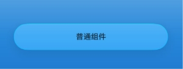
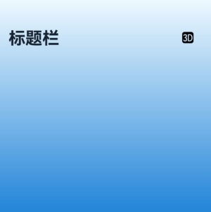
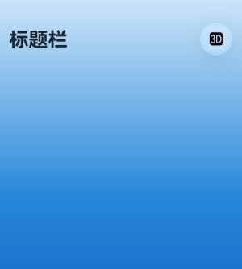
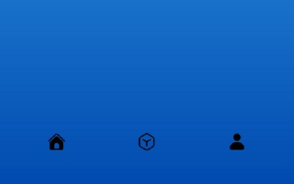
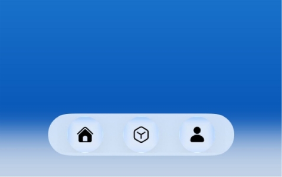

# ArkUI子系统变更说明

## cl.arkui.1 沉浸光感新增生效约束

**访问级别**

公共能力

**变更原因**

为统一用户视觉体验，规范沉浸光感组件使用，沉浸光感对部分组件新增生效范围的约束：仅在Navigation或NavDestination标题栏，或Tabs的底部TabBar中沉浸光感效果生效。

**变更影响**

此变更涉及应用适配。

- 变更前：针对支持开启沉浸光感的所有组件，沉浸光感开启后，沉浸光感效果生效。

- 变更后：支持通过[systemMaterial](../../../application-dev/reference/apis-arkui/arkui-ts/ts-universal-attributes-image-effect.md#systemmaterial)设置沉浸光感的组件（Toggle和Slider组件除外）、[Chip](../../../application-dev/reference/apis-arkui/arkui-ts/ohos-arkui-advanced-Chip.md)、[ChipGroup](../../../application-dev/reference/apis-arkui/arkui-ts/ohos-arkui-advanced-ChipGroup.md)、[ChipGroupV2](../../../application-dev/reference/apis-arkui/arkui-ts/ohos-arkui-advanced-ChipGroupV2.md)、[ChipV2](../../../application-dev/reference/apis-arkui/arkui-ts/ohos-arkui-advanced-ChipV2.md)、[SegmentButton](../../../application-dev/reference/apis-arkui/arkui-ts/ohos-arkui-advanced-SegmentButton.md)、[SegmentButtonV2](../../../application-dev/reference/apis-arkui/arkui-ts/ohos-arkui-advanced-SegmentButtonV2.md)、[SelectionMenu](../../../application-dev/reference/apis-arkui/arkui-ts/ohos-arkui-advanced-SelectionMenu.md)组件，仅在以下区域中生效沉浸光感效果：Navigation/NavDestination标题栏，或横向Tabs中barPosition为BarPosition.End的底部TabBar中。

以下示例展示了通过systemMaterial开启Column组件的沉浸光感，在变更前后的效果变化：

```ts
import { uiMaterial } from '@kit.ArkUI';

@Entry
@Component
struct MaterialScopeExample {
  build() {
    Stack() {
      Column()
        .width('100%')
        .height('100%')
        .linearGradient({
          angle: 0, // 渐变角度，0度是从左到右。
          colors: [
            ['#004AAF', 0.0], // 起始颜色及位置（0.0表示起点）。
            ['#2787D9', 0.5], // 中间颜色及位置。
            ['#F0FAFF', 1.0] // 结束颜色及位置（1.0表示终点）。
          ]
        })
      Column() {
        // 标题栏/底部TabBar范围外的普通组件
        Column() {
          Text('普通组件')
            .fontSize(32)
            .fontWeight(FontWeight.Bold)
        }
        .width(328)
        .height(56)
        .borderRadius(28)
        .justifyContent(FlexAlign.Center)
        .systemMaterial(new uiMaterial.ImmersiveMaterial({
          style: uiMaterial.ImmersiveStyle.THIN,
        }))
      }
    }
  }
}

```

Column组件通过systemMaterial设置了沉浸光感，变更前，沉浸光感效果生效。示例图片如下：



Column组件通过systemMaterial设置了沉浸光感，变更后，由于不处于生效范围内，沉浸光感效果不生效。示例图片如下：


**起始 API Level**

26.0.0

**变更发生版本**

从OpenHarmony SDK 7.0.0.40开始。

**变更的接口/组件**

| 组件 | 开启沉浸光感的属性 |
| ---- | -------- |
| 支持通过systemMaterial设置沉浸光感的组件（Toggle和Slider组件除外） | [systemMaterial](../../../application-dev/reference/apis-arkui/arkui-ts/ts-universal-attributes-image-effect.md#systemmaterial) |
| [Chip](../../../application-dev/reference/apis-arkui/arkui-ts/ohos-arkui-advanced-Chip.md) | backgroundSystemMaterial、activatedBackgroundSystemMaterial |
| [ChipGroup](../../../application-dev/reference/apis-arkui/arkui-ts/ohos-arkui-advanced-ChipGroup.md) | backgroundSystemMaterial、selectedBackgroundSystemMaterial、iconBackgroundSystemMaterial |
| [ChipGroupV2](../../../application-dev/reference/apis-arkui/arkui-ts/ohos-arkui-advanced-ChipGroupV2.md) | backgroundSystemMaterial、selectedBackgroundSystemMaterial、iconBackgroundSystemMaterial |
| [ChipV2](../../../application-dev/reference/apis-arkui/arkui-ts/ohos-arkui-advanced-ChipV2.md) | backgroundSystemMaterial、activatedBackgroundSystemMaterial |
| [SegmentButton](../../../application-dev/reference/apis-arkui/arkui-ts/ohos-arkui-advanced-SegmentButton.md) | backgroundSystemMaterial |
| [SegmentButtonV2](../../../application-dev/reference/apis-arkui/arkui-ts/ohos-arkui-advanced-SegmentButtonV2.md) | backgroundSystemMaterial |
| [SelectionMenu](../../../application-dev/reference/apis-arkui/arkui-ts/ohos-arkui-advanced-SelectionMenu.md) | backgroundSystemMaterial |

**适配指导**

变更后，如果组件需要沉浸光感效果，需要将该组件放置于Navigation/NavDestination标题栏或Tabs的底部TabBar。

下面提供两个示例，分别介绍如何将组件放置于Navigation标题栏、横向Tabs中barPosition为BarPosition.End的底部TabBar中，从而显示沉浸光感效果。

- Navigation标题栏适配指导

  以下示例展示了通过Navigation标题栏，使得通过systemMaterial设置Column组件的沉浸光感效果生效。

  ```ts
  import { CircleShape, TitleBarType, uiMaterial } from '@kit.ArkUI';
  
  @Entry
  @Component
  struct MaterialScopeAdaptExample {
    private arr: number[] = [0, 1, 2, 3, 4, 5, 6, 7, 8, 9];
  
    @Builder
    customTitle() {
      Row() {
        Text('标题栏')
          .fontColor('#182431')
          .fontSize(30)
          .lineHeight(41)
          .fontWeight(700)
        Blank()
        Column() {
          SymbolGlyph($r('sys.symbol.a_3d_square_fill'))
            .fontSize(24)
        }
        .width(50)
        .height(50)
        .clipShape(new CircleShape({
          width: 50,
          height: 50
        }))
        .justifyContent(FlexAlign.Center)
        .backgroundColor(Color.Transparent)
        // 在Navigation标题栏区域中设置Column的沉浸光感效果，处于生效范围内，沉浸光感效果生效。
        .systemMaterial(new uiMaterial.ImmersiveMaterial({
          style: uiMaterial.ImmersiveStyle.THIN,
        }))
      }
      .alignItems(VerticalAlign.Center)
      .width('100%')
      .height(140)
      .padding(16)
    }
  
    build() {
      Column() {
        Navigation() {
          Column() {
            // 内容
          }
          .width('100%')
          .height('100%')
          .padding(16)
          .backgroundColor('#FFFFFF')
          .linearGradient({
            angle: 0,
            colors: [
              ['#004AAF', 0.0],
              ['#2787D9', 0.5],
              ['#F0FAFF', 1.0]
            ]
          })
          .justifyContent(FlexAlign.Center)
          .alignItems(HorizontalAlign.Center)
        }
        .title(this.customTitle, { barStyle: BarStyle.STACK })

        // 在沉浸光感生效范围外，通过systemMaterial设置Column组件的沉浸光感效果，沉浸光感效果不生效。
        // this.customTitle()
      }.width('100%').height('100%').backgroundColor('#F1F3F5')
    }
  }
  ```

  在自定义组件中，为Column组件设置了沉浸光感，处于生效范围外，沉浸光感效果不生效。示例图片如下：

  

  在Navigation标题栏中，为Column组件设置了沉浸光感，处于生效范围内，沉浸光感效果生效。示例图片如下：

  

- 底部TabBar适配指导

  以下示例展示了使用底部TabBar，使得通过systemMaterial设置Column组件的沉浸光感效果生效。

  ```ts
  import { CircleShape, uiMaterial } from '@kit.ArkUI';
  
  @Entry
  @Component
  struct TabsCustomTabBarExample {
    @Builder
    tabItem(icon: Resource) {
      Column() {
        Column() {
          SymbolGlyph(icon)
            .fontSize(24)
        }
        .width(48)
        .height(48)
        .clipShape(new CircleShape({
          width: 48,
          height: 48
        }))
        .justifyContent(FlexAlign.Center)
        .backgroundColor(Color.Transparent)
        // 在Tabs的底部TabBar区域中设置Column的沉浸光感，处于生效范围内，沉浸光感效果生效。
        .systemMaterial(new uiMaterial.ImmersiveMaterial({
          style: uiMaterial.ImmersiveStyle.THIN,
        }))
      }
      .justifyContent(FlexAlign.Center)
      .alignItems(HorizontalAlign.Center)
      .height('100%')
    }

    @Builder
    customTabBar() {
      Row() {
        this.tabItem($r('sys.symbol.house_fill'))
        this.tabItem($r('sys.symbol.search_things'))
        this.tabItem($r('sys.symbol.person_fill'))
      }
      .alignItems(VerticalAlign.Center)
      .justifyContent(FlexAlign.SpaceEvenly)
      .height(96)
      .padding({ left: 16, right: 16, bottom: 16 })
    }
  
    build() {
      Column() {
        Tabs({ barPosition: BarPosition.End }) {
          TabContent() {
            Column()
              .width('100%')
              .height('100%')
              .backgroundColor('#FFFFFF')
              .linearGradient({
                angle: 0,
                colors: [
                  ['#004AAF', 0.0],
                  ['#2787D9', 0.5],
                  ['#F0FAFF', 1.0]
                ]
              })
          }
          .tabBar(this.tabItem($r('sys.symbol.house_fill')))
          TabContent() {
            Column()
              .width('100%')
              .height('100%')
              .backgroundColor('#FFFFFF')
          }
          .tabBar(this.tabItem($r('sys.symbol.search_things')))
          TabContent() {
            Column()
              .width('100%')
              .height('100%')
              .backgroundColor('#FFFFFF')
          }
          .tabBar(this.tabItem($r('sys.symbol.person_fill')))
        }
        .barFloatingStyle({
          adaptToHandedness: true,
        })
        .barOverlap(true)
        .barHeight('auto')
        .width('100%')
        .height('100%')

        // 在沉浸光感生效范围外，通过systemMaterial设置Column组件的沉浸光感效果，沉浸光感效果不生效。
        // this.customTabBar()
      }.width('100%').height('100%').backgroundColor('#F1F3F5')
    }
  }
  
  ```

  在自定义组件中，为Column组件设置了沉浸光感，处于生效范围外，沉浸光感效果不生效。示例图片如下：

  

  在底部TabBar中，为Column组件设置了沉浸光感，处于生效范围内，沉浸光感效果生效。示例图片如下：

  
