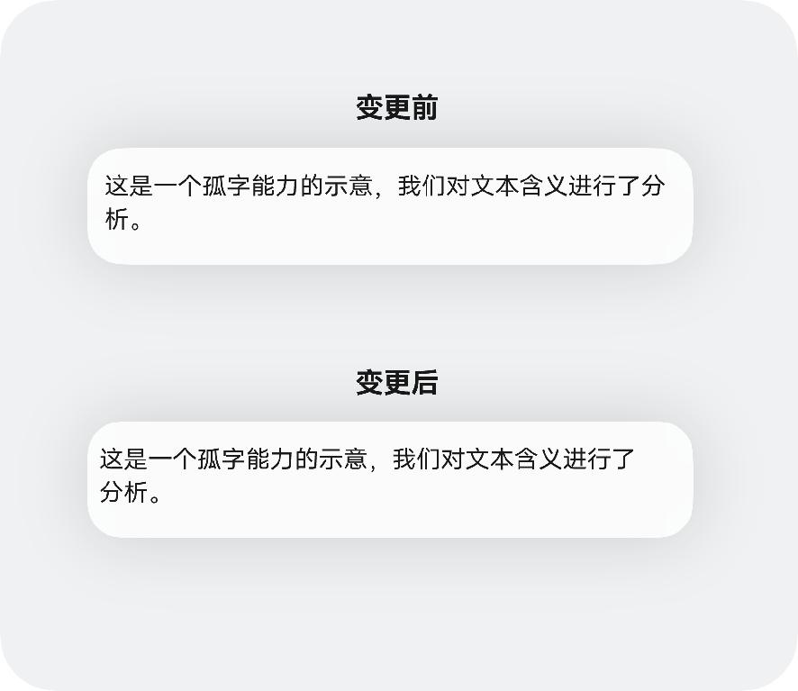
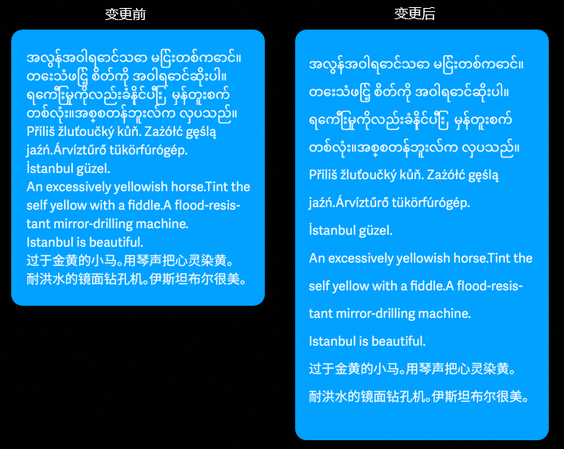
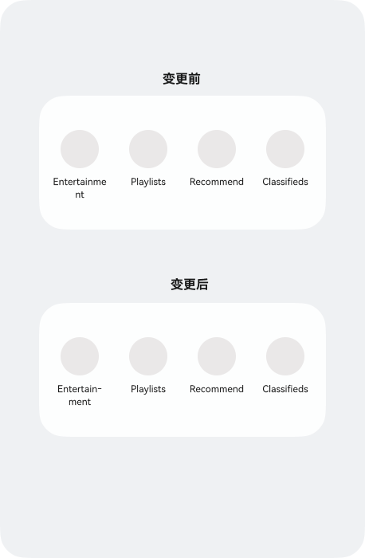
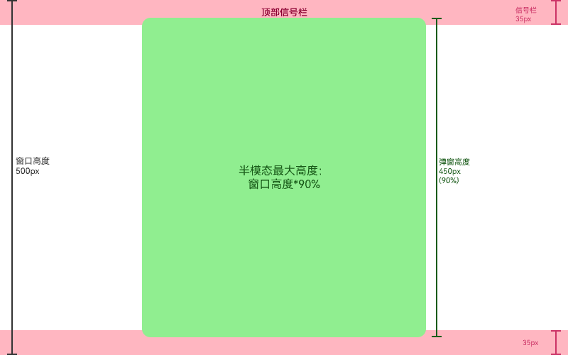
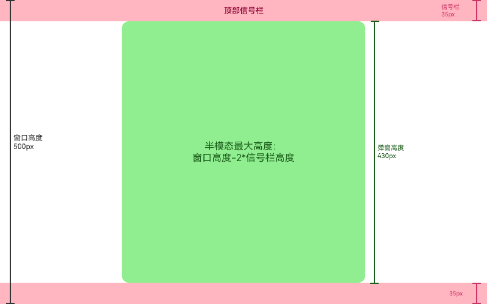

# ArkUI子系统Changelog

## cl.arkui.1 内置文本的组件文本样式优化

**访问级别**

公共能力

**变更原因**

部分ArkUI组件内置了文本功能，文本存在孤字换行、小语种（藏语、缅甸语）行高异常截断、文本按单词换行导致单词截断的问题。为提升组件内文本的可阅读性，针对上述三种场景进行默认优化。

**变更影响**

此变更涉及应用适配。

**场景一：孤字换行优化**

变更前：系统语言为中文时，组件内文本显示换行后存在单独文字，孤字会独立在一行显示。

变更后：系统语言为中文时，组件内文本显示换行后存在单独文字，前一行尾部的文字会跟随显示到第二行，不会出现孤字显示一行的情况。

孤字换行变更前后效果如下图所示：

**场景二：小语种行高优化**

变更前：系统语言为小语种（藏语、缅甸语）时，文本显示存在重叠，截断的问题。

变更后：系统语言为小语种（藏语、缅甸语）时，文本显示时行高会自动调整，不会出现文本重叠和截断的现象。

小语种行高优化变更前后效果如下图所示：

**场景三：单词换行改为音节换行**

变更前：系统语言为英语、意大利语等外语时，组件内文本的单词较长时会按照单词换行的方式进行换行，如果单词长度超过显示宽度，单词会被截断。

变更后：系统语言为英语、意大利语等外语时，组件内文本的单词较长时会按照音节换行的方式进行换行，同一个单词内部换行后会使用连词符连接，不会出现单词截断问题。

文本按单词换行改为按音节换行变更前后效果如下图所示：

**起始 API Level**

12

**变更发生版本**

从OpenHarmony SDK 7.0.0.19开始。

**变更的接口/组件**

[bindPopup](../../../application-dev/reference/apis-arkui/arkui-ts/ts-universal-attributes-popup.md#bindpopup)，[bindTips](../../../application-dev/reference/apis-arkui/arkui-ts/ts-universal-attributes-tips.md#bindtips)，[showToast](../../../application-dev/reference/apis-arkui/arkts-apis-uicontext-promptaction.md#showtoast)，[openToast](../../../application-dev/reference/apis-arkui/arkts-apis-uicontext-promptaction.md#opentoast18)，[Menu](../../../application-dev/reference/apis-arkui/arkui-ts/ts-basic-components-menu.md)，[MenuItem](../../../application-dev/reference/apis-arkui/arkui-ts/ts-basic-components-menuitem.md)，[Slider](../../../application-dev/reference/apis-arkui/arkui-ts/ts-basic-components-slider.md)，[Select](../../../application-dev/reference/apis-arkui/arkui-ts/ts-basic-components-select.md)，[showAlertDialog](../../../application-dev/reference/apis-arkui/arkts-apis-uicontext-uicontext.md#showalertdialog)，[showActionSheet](../../../application-dev/reference/apis-arkui/arkts-apis-uicontext-uicontext.md#showactionsheet)，[showActionMenu](../../../application-dev/reference/apis-arkui/arkts-apis-uicontext-promptaction.md#showactionmenu11)，[showDialog](../../../application-dev/reference/apis-arkui/arkts-apis-uicontext-promptaction.md#showdialog)，[ArcButton](../../../application-dev/reference/apis-arkui/arkui-ts/ohos-arkui-advanced-ArcButton.md)，[Search](../../../application-dev/reference/apis-arkui/arkui-ts/ts-basic-components-search.md)，[Hyperlink](../../../application-dev/reference/apis-arkui/arkui-ts/ts-container-hyperlink.md)，[Marquee](../../../application-dev/reference/apis-arkui/arkui-ts/ts-basic-components-marquee.md)，[TextClock](../../../application-dev/reference/apis-arkui/arkui-ts/ts-basic-components-textclock.md)，[Badge](../../../application-dev/reference/apis-arkui/arkui-ts/ts-container-badge.md)，[Chip](../../../application-dev/reference/apis-arkui/arkui-ts/ohos-arkui-advanced-Chip.md)，[ChipGroup](../../../application-dev/reference/apis-arkui/arkui-ts/ohos-arkui-advanced-ChipGroup.md)，[SegmentButton](../../../application-dev/reference/apis-arkui/arkui-ts/ohos-arkui-advanced-SegmentButton.md)，[SegmentButtonV2](../../../application-dev/reference/apis-arkui/arkui-ts/ohos-arkui-advanced-SegmentButtonV2.md)，[bindSheet](../../../application-dev/reference/apis-arkui/arkui-ts/ts-universal-attributes-sheet-transition.md#bindsheet)，[Dialog](../../../application-dev/reference/apis-arkui/arkui-ts/ohos-arkui-advanced-Dialog.md)，[showDatePickerDialog](../../../application-dev/reference/apis-arkui/arkts-apis-uicontext-uicontext.md#showdatepickerdialog)，[showTimePickerDialog](../../../application-dev/reference/apis-arkui/arkts-apis-uicontext-uicontext.md#showtimepickerdialog)，[showTextPickerDialog](../../../application-dev/reference/apis-arkui/arkts-apis-uicontext-uicontext.md#showtextpickerdialog)，[CalendarPickerDialog](../../../application-dev/reference/apis-arkui/arkui-ts/ts-methods-calendarpicker-dialog.md)

**适配指导**

1. 默认效果变更，组件内置文本的换行策略、行高变化后，组件的布局大小存在变化，应用需根据实际显示效果进行调整适配。

2. 变更针对的是系统设置的语言，而非应用实际使用的语言。比如当前应用并未适配藏语和缅甸语，当用户将系统语言切换为藏语或缅甸语后，应用显示的文本依然为中文，但仍会受到本次文本样式变更的影响，行高会自动撑开，相关组件布局大小会发生改变。

## cl.arkui.2 半模态居中弹窗最大高度变更

**访问级别**

公共能力

**变更原因**

UX规格变更，当前半模态最大高度限制为窗口短边长度的90%，可能导致半模态与信号栏重叠。

**变更影响**

此变更不涉及应用适配。

变更前：

半模态居中弹窗最大高度：取“短边长度*90%”。

变更后：

半模态居中弹窗最大高度：取“短边长度\*90%”、“窗口高度-信号栏高度\*2”两者中的最小值。

**起始 API Level**

12

**变更发生版本**

从OpenHarmony SDK 7.0.0.19开始。

**变更的接口/组件**

[CENTER](../../../../zh-cn/application-dev/reference/apis-arkui/arkui-ts/ts-universal-attributes-sheet-transition.md#sheettype11枚举说明)

**适配指导**

1. UX规格变更，无需适配。

2. 若半模态达到最大高度后，内容布局存在截断，可通过[height](../../../../zh-cn/application-dev/reference/apis-arkui/arkui-ts/ts-universal-attributes-sheet-transition.md#sheetoptions)属性调整半模态高度。