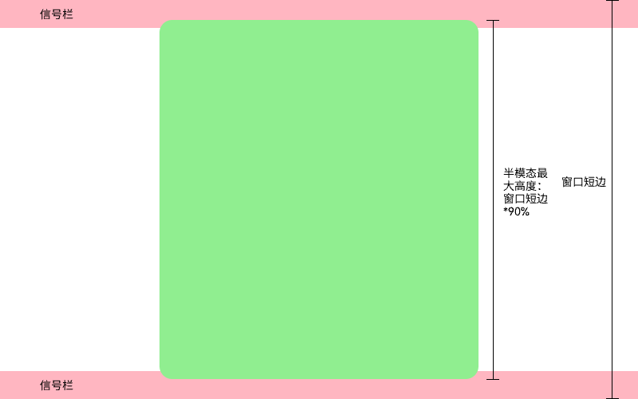
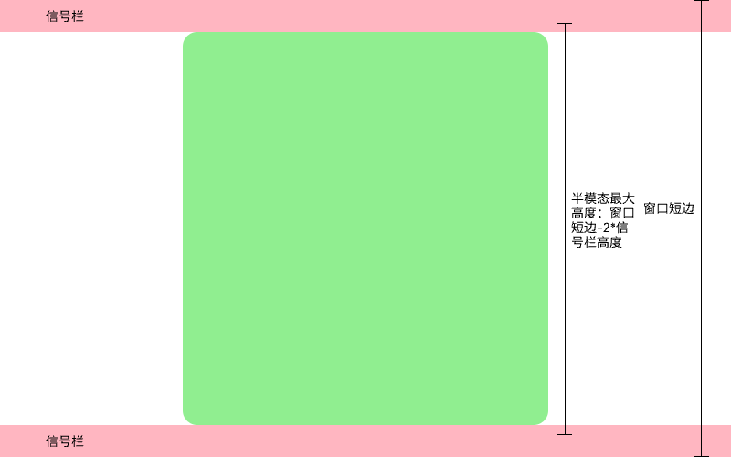

# ArkUI子系统Changelog

## cl.arkui.1 半模态居中弹窗最大高度变更

**访问级别**

公共能力

**变更原因**

UX规格变更，当前半模态最大高度限制为窗口短边长度的90%，可能导致半模态与信号栏重叠。

**变更影响**

此变更不涉及应用适配。

变更前：

半模态居中弹窗最大高度：取“窗口短边长度*90%”，半模态可能与信号栏重叠，如下图。

变更后：

半模态居中弹窗最大高度：取“窗口短边长度\*90%”、“窗口高度-信号栏高度\*2”两者中的最小值。

**起始 API Level**

12

**变更发生版本**

从OpenHarmony SDK 7.0.0.19开始。

**变更的接口/组件**

[半模态](../../../../zh-cn/application-dev/reference/apis-arkui/arkui-ts/ts-universal-attributes-sheet-transition.md#bindsheet)的[CENTER](../../../../zh-cn/application-dev/reference/apis-arkui/arkui-ts/ts-universal-attributes-sheet-transition.md#sheettype11枚举说明)样式。

**适配指导**

1. 若半模态内容无挤压，跟随UX变更，无需适配。

2. 若半模态达到最大高度后，内容布局存在截断，可通过[height](../../../../zh-cn/application-dev/reference/apis-arkui/arkui-ts/ts-universal-attributes-sheet-transition.md#sheetoptions)属性调整半模态高度。