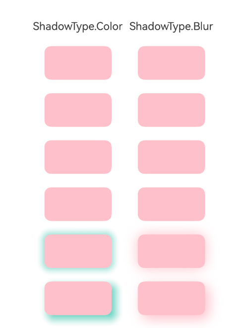
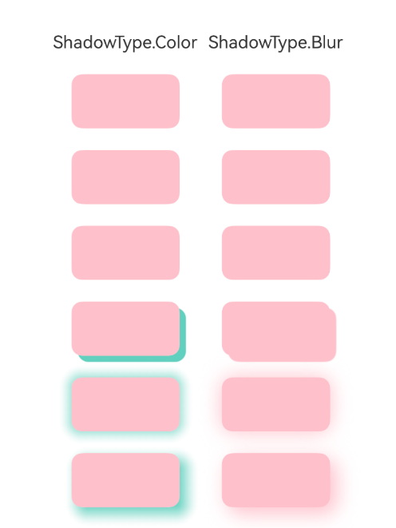

# ArkUI子系统Changelog

## cl.arkui.1 组件的阴影模糊半径规格变更

**访问级别**

公开接口

**变更原因**

修改阴影模糊半径生效范围，使shadow属性中的所有阴影类型新增支持模糊半径为0时的阴影能力。

**变更影响**

此变更涉及应用适配。

变更前：通过shadow属性添加阴影效果，将参数ShadowOptions中的阴影模糊半径radius设置为0时，无阴影；设置为负数时按0处理，无阴影。

变更后：通过shadow属性添加阴影效果，将参数ShadowOptions中的阴影模糊半径radius设置为0时，存在阴影但不存在模糊效果；设置为负数时，无阴影。

例如使用以下代码片段，通过shadow设置Column组件的边框阴影效果，变更前radius设置0和-1效果一致，变更后radius设置0且带有偏移量[OffsetX](../../../application-dev/reference/apis-arkui/arkui-ts/ts-universal-attributes-image-effect.md#shadowoptions对象说明)或[OffsetY](../../../application-dev/reference/apis-arkui/arkui-ts/ts-universal-attributes-image-effect.md#shadowoptions对象说明)时会有无模糊阴影显示。

```ts
// xxx.ets
@Entry
@Component
struct Index {
  private shadowValue: Array<ShadowOptions> = [
    { radius: -1 },
    { radius: -1, offsetX: 20, offsetY: 20 },
    { radius: 0 },
    { radius: 0, offsetX: 20, offsetY: 20 },
    { radius: 50 },
    { radius: 50, offsetX: 20, offsetY: 20 },
  ];

  build() {
    Column() {
      Row({ space: 10 }) {
        Column({ space: 20 }) {
          Text('ShadowType.Color')

          ForEach(this.shadowValue, (shadow: ShadowOptions) => {
            Column()
              .width(100)
              .height(50)
              .borderRadius(10)
              .backgroundColor(Color.Pink)
              .shadow({
                radius: shadow.radius,
                color: Color.Green,
                offsetX: shadow.offsetX,
                offsetY: shadow.offsetY
              })
          })
        }
        
        Column({ space: 20 }) {
          Text('ShadowType.Blur')

          ForEach(this.shadowValue, (shadow: ShadowOptions) => {
            Column()
              .width(100)
              .height(50)
              .borderRadius(10)
              .backgroundColor(Color.Pink)
              .shadow({
                radius: shadow.radius,
                type: ShadowType.BLUR,
                offsetX: shadow.offsetX,
                offsetY: shadow.offsetY
              })
          })
        }
      }
    }
    .width('100%')
    .height('100%')
    .justifyContent(FlexAlign.Center)
    .alignItems(HorizontalAlign.Center)
  }
}
```

| 变更前 | 变更后 |
|------ |--------|
|||

**起始 API Level**

7

**变更发生版本**

从OpenHarmony SDK 7.0.0.20开始。

**变更的接口/组件**

通用属性[shadow](../../../application-dev/reference/apis-arkui/arkui-ts/ts-universal-attributes-image-effect.md#shadow)的[ShadowOptions.radius](../../../application-dev/reference/apis-arkui/arkui-ts/ts-universal-attributes-image-effect.md#shadowoptions对象说明)参数。<br/>
列表选择弹窗组件的[actionsheetoptions.shadow](../../../application-dev/reference/apis-arkui/arkui-ts/ts-methods-action-sheet.md#actionsheetoptions对象说明)。<br/>
警告弹窗组件的[alertdialogparam.shadow](../../../application-dev/reference/apis-arkui/arkui-ts/ts-methods-alert-dialog-box.md#alertdialogparam对象说明)。<br/>
日历选择器弹窗组件的[calendardialogoptions.shadow](../../../application-dev/reference/apis-arkui/arkui-ts/ts-methods-calendarpicker-dialog.md#calendardialogoptions对象说明)。<br/>
自定义弹窗组件的[customdialogcontrolleroptions.shadow](../../../application-dev/reference/apis-arkui/arkui-ts/ts-methods-custom-dialog-box.md#customdialogcontrolleroptions对象说明)。<br/>
日期滑动选择器弹窗组件的[datepickerdialogoptions.shadow](../../../application-dev/reference/apis-arkui/arkui-ts/ts-methods-datepicker-dialog.md#datepickerdialogoptions对象说明)。<br/>
文本滑动选择器弹窗组件的[textpickerdialogoptions.shadow](../../../application-dev/reference/apis-arkui/arkui-ts/ts-methods-textpicker-dialog.md#textpickerdialogoptions对象说明)和[TextPickerDialogOptionsExt.shadow](../../../application-dev/reference/apis-arkui/arkui-ts/ts-methods-textpicker-dialog.md#textpickerdialogoptionsext20对象说明)。<br/>
时间滑动选择器弹窗组件的[timepickerdialogoptions.shadow](../../../application-dev/reference/apis-arkui/arkui-ts/ts-methods-timepicker-dialog.md#timepickerdialogoptions对象说明)。<br/>
半模态转场的[sheetoptions.shadow](../../../application-dev/reference/apis-arkui/arkui-ts/ts-universal-attributes-sheet-transition.md#sheetoptions)。<br/>
Popup控制的[popupoptions.shadow](../../../application-dev/reference/apis-arkui/arkui-ts/ts-universal-attributes-popup.md#popupoptions类型说明)、[custompopupoptions.shadow](../../../application-dev/reference/apis-arkui/arkui-ts/ts-universal-attributes-popup.md#custompopupoptions8类型说明)和[popupcommonoptions.shadow](../../../application-dev/reference/apis-arkui/arkui-ts/ts-universal-attributes-popup.md#popupcommonoptions18类型说明)。<br/>
弹窗的[showtoastoptions.shadow](../../../application-dev/reference/apis-arkui/js-apis-promptAction.md#showtoastoptions)、[showdialogoptions.shadow](../../../application-dev/reference/apis-arkui/js-apis-promptAction.md#showdialogoptions)和[customdialogoptions.shadow](../../../application-dev/reference/apis-arkui/js-apis-promptAction.md#customdialogoptions11)。<br/>
SegmentButtonV2组件的[TabSegmentButtonV2.itemShadow](../../../application-dev/reference/apis-arkui/arkui-ts/ohos-arkui-advanced-SegmentButtonV2.md#tabsegmentbuttonv2)和[CapsuleSegmentButtonV2.itemShadow](../../../application-dev/reference/apis-arkui/arkui-ts/ohos-arkui-advanced-SegmentButtonV2.md#capsulesegmentbuttonv2)。<br/>
SymbolGlyph组件的[symbolShadow](../../../application-dev/reference/apis-arkui/arkui-ts/ts-basic-components-symbolGlyph.md#symbolshadow20)。

**适配指导**

如果应用在API版本26.0.0及之后期望阴影消失，需要将radius的取值从0调整为-1。如果期望保留阴影但不产生模糊效果，应将radius设置为0。<br/>
Text组件的[textShadow](../../../application-dev/reference/apis-arkui/arkui-ts/ts-basic-components-text.md#textshadow10)不发生规格变更，仍然维持原有规格。
